# poster-php 架构设计与业务逻辑图

> 所有图表使用 Mermaid 语法，GitHub / GitLab 原生渲染。

---

## 一、系统架构总览

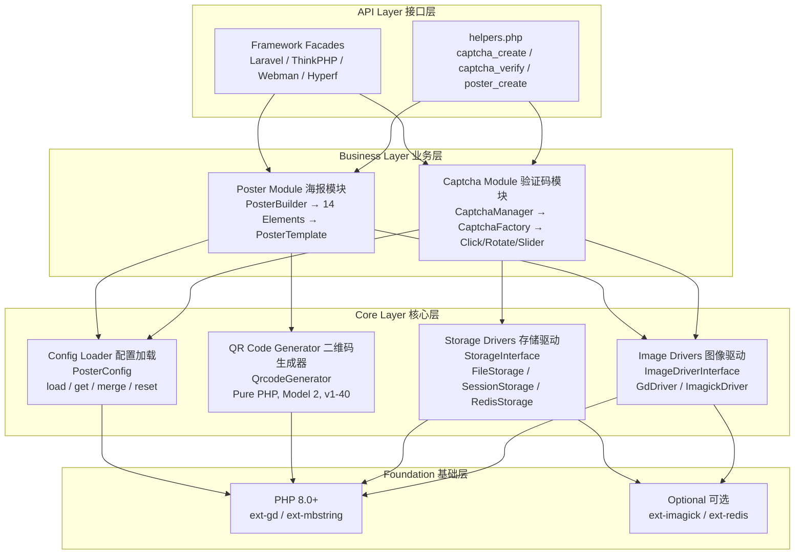

---

## 二、分层依赖关系

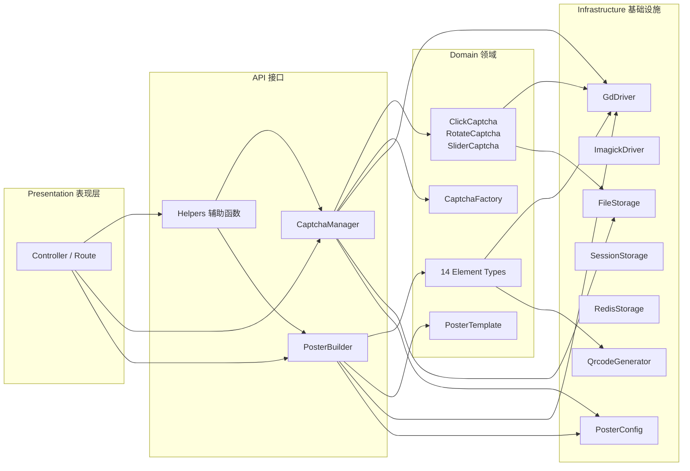

---

## 三、组件关系图

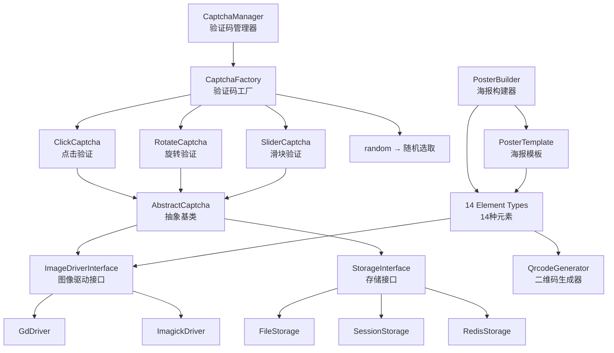

---

## 四、验证码生成流程 (Captcha Generation)

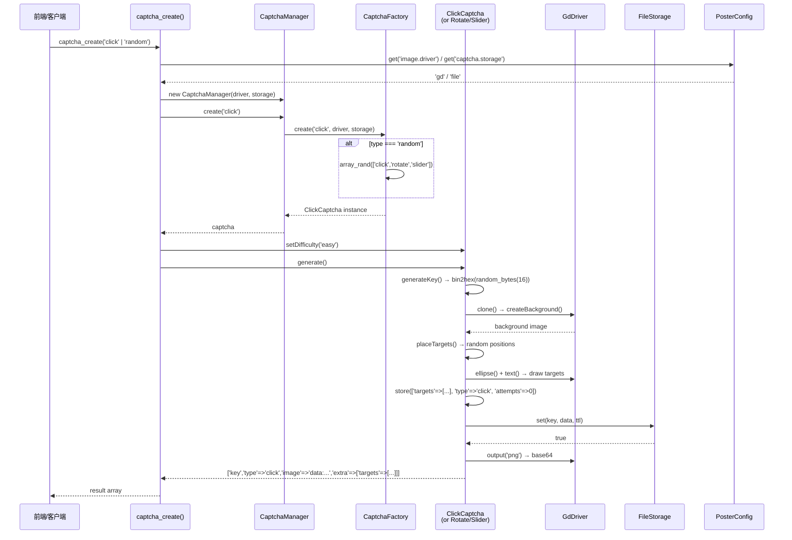

---

## 五、验证码验证流程 (Captcha Verification)

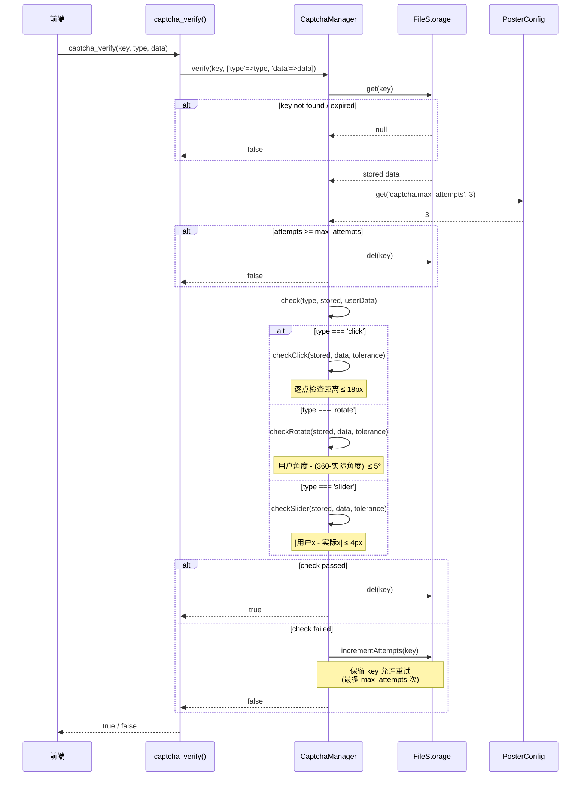

---

## 六、海报生成流程 (Poster Generation)

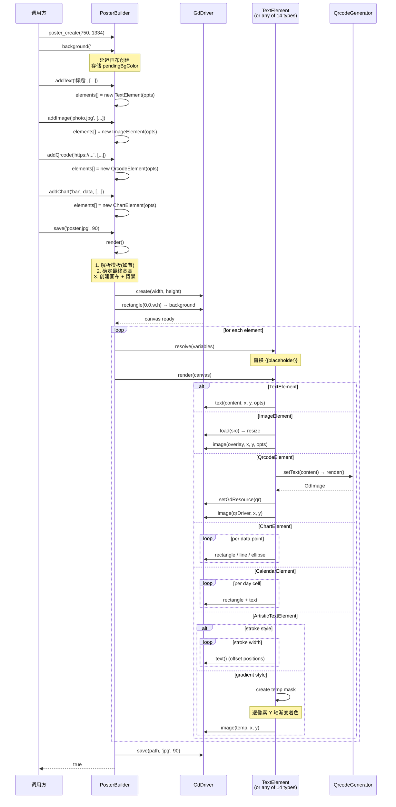

---

## 七、模板系统流程 (Template System)

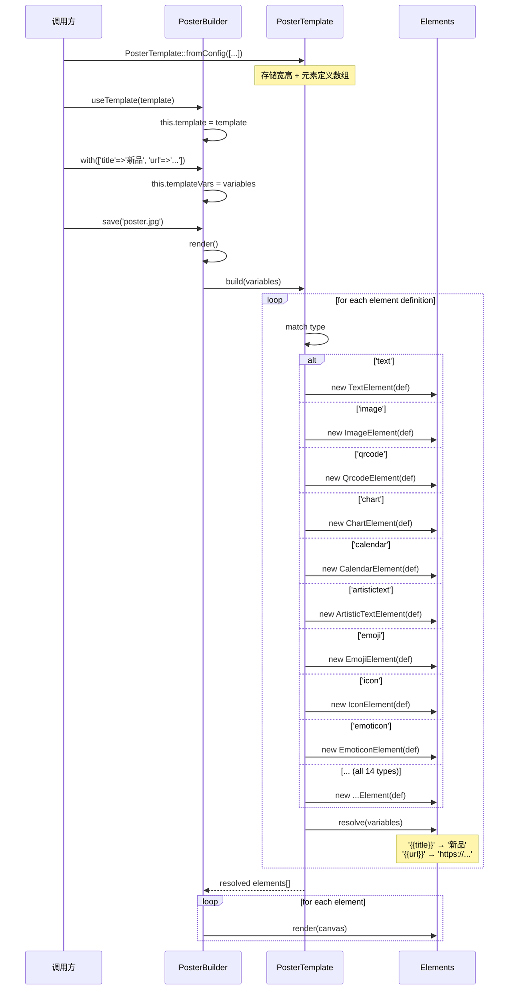

---

## 八、驱动层自动检测

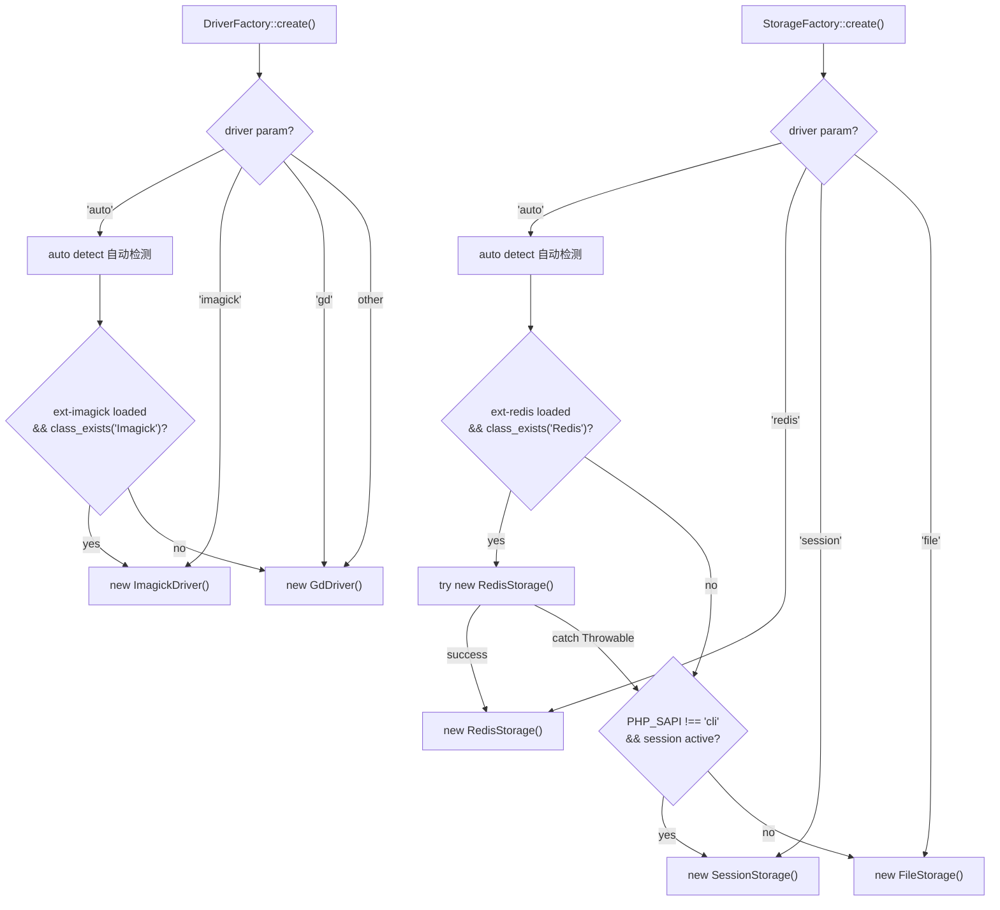

---

## 九、验证码安全模型

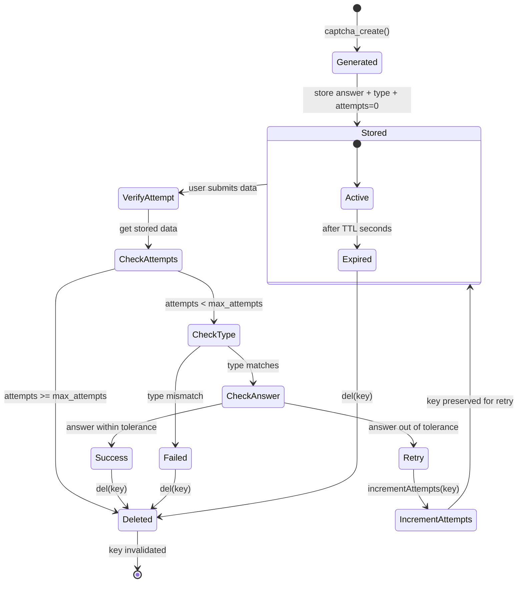

---

## 十、14 种海报元素分类

```mermaid
graph TB
    subgraph "基础元素 Basic"
        TEXT["TextElement<br/>文字"]
        IMAGE["ImageElement<br/>图片"]
        AVATAR["AvatarElement<br/>头像"]
        SHAPE["ShapeElement<br/>形状"]
        LINE["LineElement<br/>分割线"]
    end

    subgraph "复合元素 Composite"
        QRCODE["QrcodeElement<br/>二维码"]
        TABLE["TableElement<br/>表格"]
        WATERMARK["WatermarkElement<br/>水印"]
        CHART["ChartElement<br/>图表"]
        CALENDAR["CalendarElement<br/>日历"]
    end

    subgraph "装饰元素 Decorative"
        ARTISTIC["ArtisticTextElement<br/>艺术字体"]
        EMOJI["EmojiElement<br/>Emoji"]
        ICON["IconElement<br/>字体图标"]
        EMOTICON["EmoticonElement<br/>颜文字"]
    end

    TEXT --> IE["implements"]
    IMAGE --> IE
    AVATAR --> IE
    SHAPE --> IE
    LINE --> IE
    QRCODE --> IE
    TABLE --> IE
    WATERMARK --> IE
    CHART --> IE
    CALENDAR --> IE
    ARTISTIC --> IE
    EMOJI --> IE
    ICON --> IE
    EMOTICON --> IE

    IE["ElementInterface<br/>render() + toArray()"]
```

---

## 十一、目录结构映射

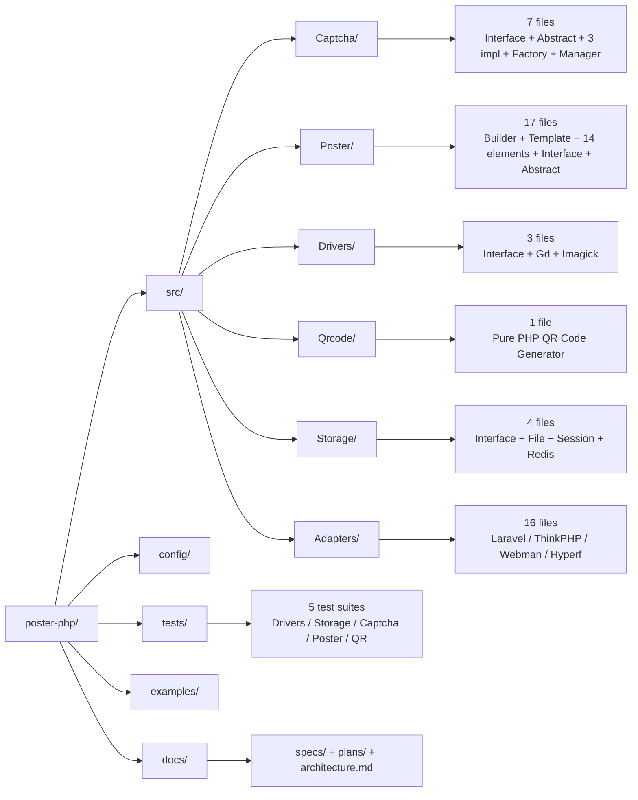

---

> 以上图表可在支持 Mermaid 的 Markdown 渲染器中直接查看（GitHub / GitLab / VS Code / Typora）。
