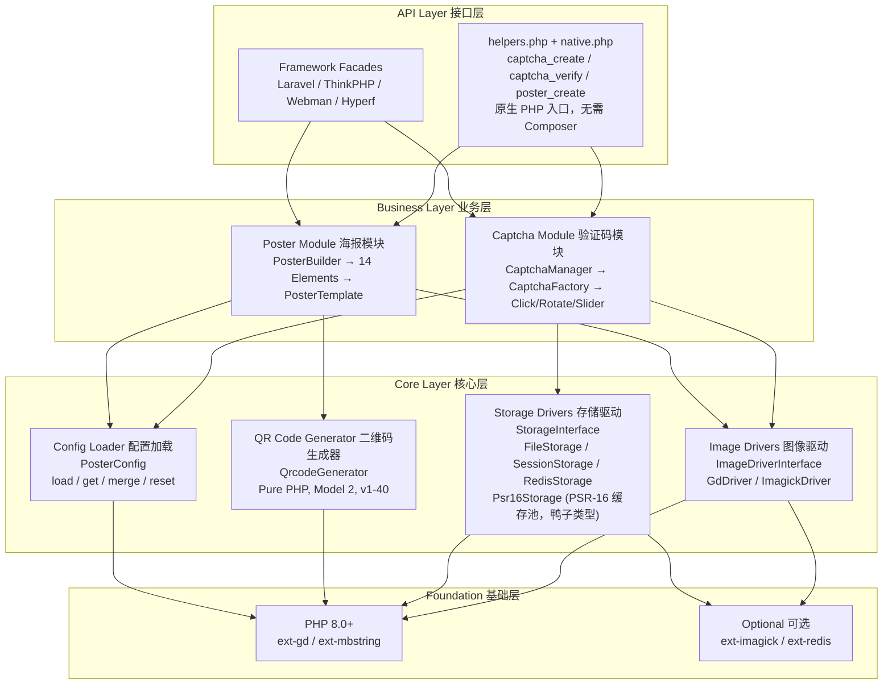
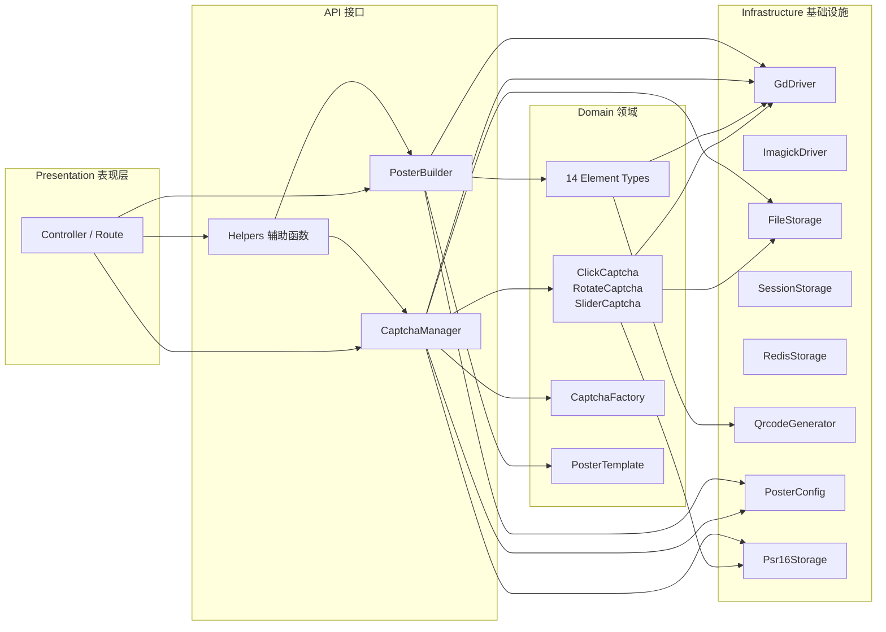
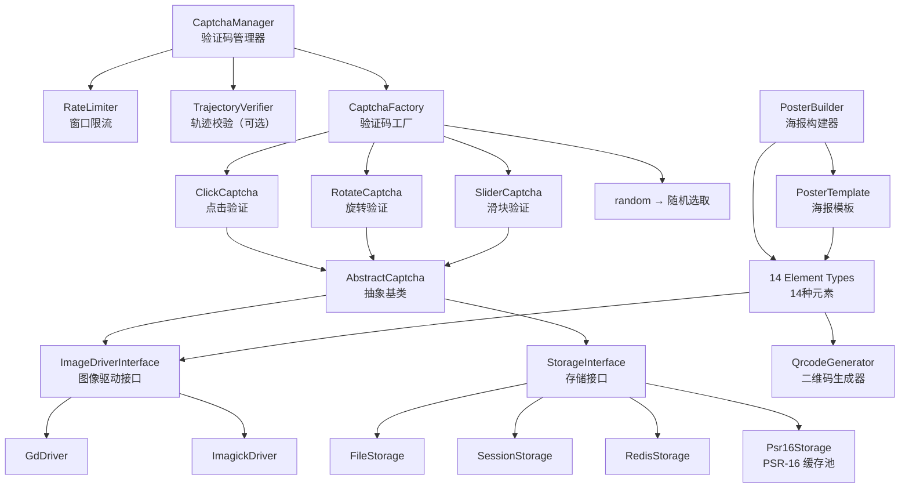
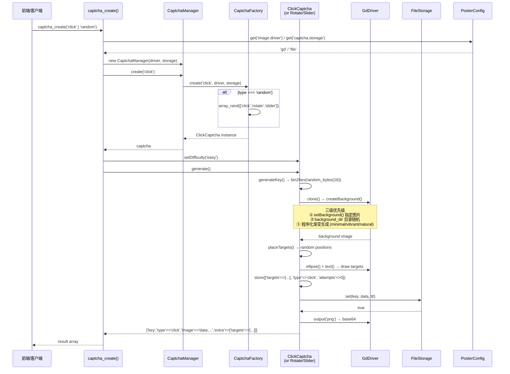
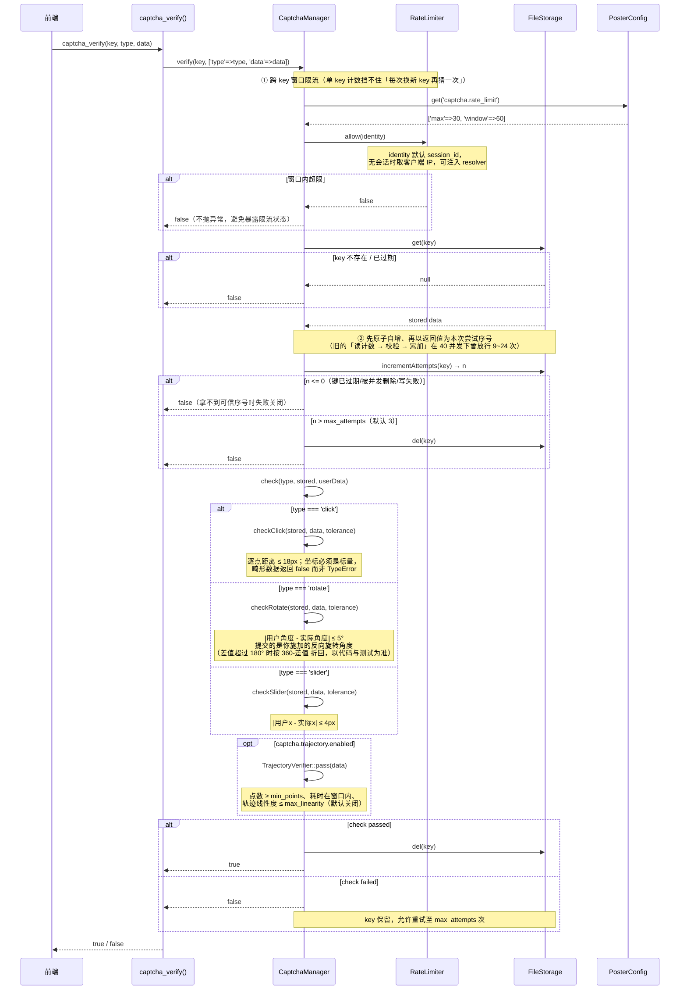
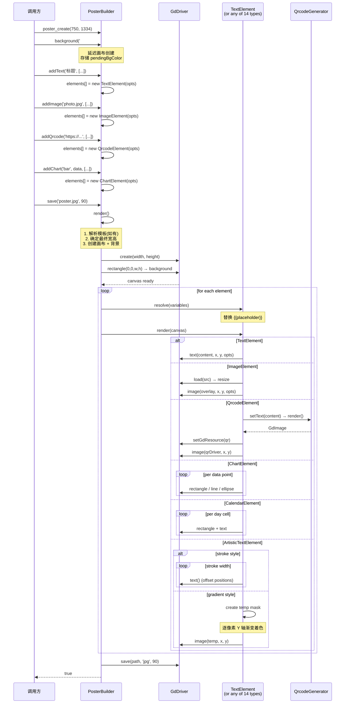
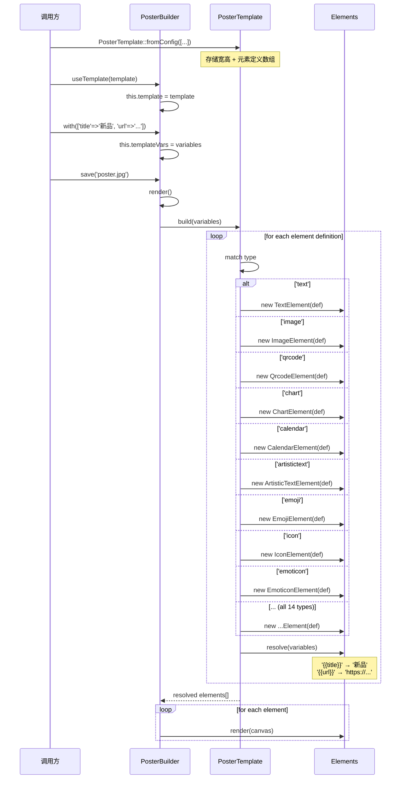
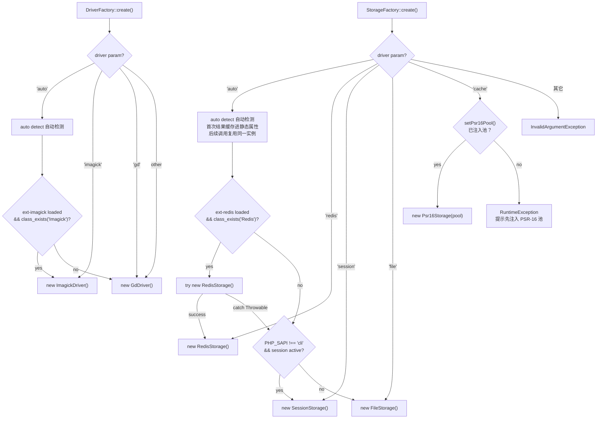
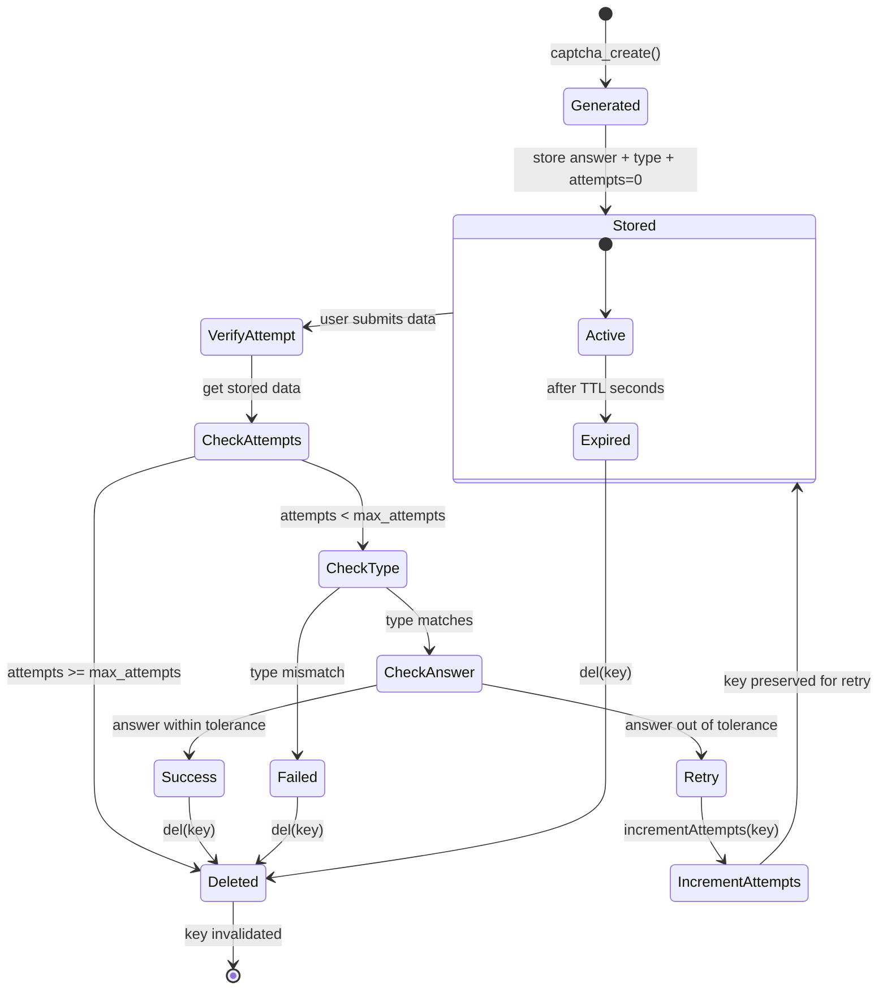
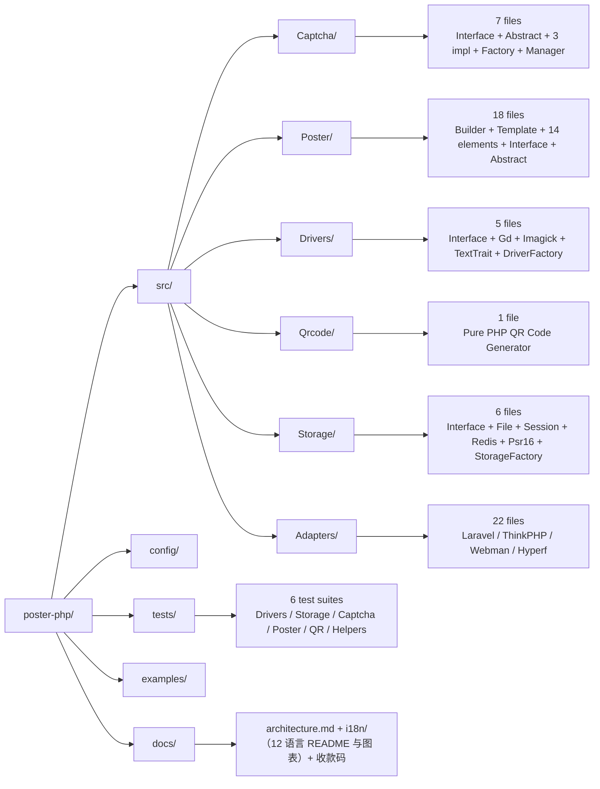

# poster-php 架构设计与业务逻辑图

> 所有图表使用 Mermaid 语法，GitHub / GitLab 原生渲染。

---

## 一、系统架构总览

```mermaid
graph TB
    subgraph "API Layer 接口层"
        HELPERS["helpers.php + native.php<br/>captcha_create / captcha_verify / poster_create<br/>原生 PHP 入口，无需 Composer"]
        FACADES["Framework Facades<br/>Laravel / ThinkPHP / Webman / Hyperf"]
    end

    subgraph "Business Layer 业务层"
        CAPTCHA["Captcha Module 验证码模块<br/>CaptchaManager → CaptchaFactory → Click/Rotate/Slider"]
        POSTER["Poster Module 海报模块<br/>PosterBuilder → 14 Elements → PosterTemplate"]
    end

    subgraph "Core Layer 核心层"
        DRIVERS["Image Drivers 图像驱动<br/>ImageDriverInterface<br/>GdDriver / ImagickDriver"]
        STORAGE["Storage Drivers 存储驱动<br/>StorageInterface<br/>FileStorage / SessionStorage / RedisStorage<br/>Psr16Storage (PSR-16 缓存池，鸭子类型)"]
        QRCODE["QR Code Generator 二维码生成器<br/>QrcodeGenerator<br/>Pure PHP, Model 2, v1-40"]
        CONFIG["Config Loader 配置加载<br/>PosterConfig<br/>load / get / merge / reset"]
    end

    subgraph "Foundation 基础层"
        PHP["PHP 8.0+<br/>ext-gd / ext-mbstring"]
        OPTIONAL["Optional 可选<br/>ext-imagick / ext-redis"]
    end

    HELPERS --> CAPTCHA
    HELPERS --> POSTER
    FACADES --> CAPTCHA
    FACADES --> POSTER

    CAPTCHA --> DRIVERS
    CAPTCHA --> STORAGE
    CAPTCHA --> CONFIG

    POSTER --> DRIVERS
    POSTER --> QRCODE
    POSTER --> CONFIG

    DRIVERS --> PHP
    DRIVERS --> OPTIONAL
    STORAGE --> PHP
    STORAGE --> OPTIONAL
    QRCODE --> PHP
    CONFIG --> PHP
```

---

## 二、分层依赖关系

```mermaid
graph LR
    subgraph "Presentation 表现层"
        A1["Controller / Route"]
    end

    subgraph "API 接口"
        B1["Helpers 辅助函数"]
        B2["CaptchaManager"]
        B3["PosterBuilder"]
    end

    subgraph "Domain 领域"
        C1["ClickCaptcha<br/>RotateCaptcha<br/>SliderCaptcha"]
        C2["14 Element Types"]
        C3["CaptchaFactory"]
        C4["PosterTemplate"]
    end

    subgraph "Infrastructure 基础设施"
        D1["GdDriver"]
        D2["ImagickDriver"]
        D3["FileStorage"]
        D4["SessionStorage"]
        D5["RedisStorage"]
        D6["QrcodeGenerator"]
        D7["PosterConfig"]
        D8["Psr16Storage"]
    end

    A1 --> B1
    A1 --> B2
    A1 --> B3

    B1 --> B2
    B1 --> B3

    B2 --> C1
    B2 --> C3

    B3 --> C2
    B3 --> C4

    C1 --> D1
    C1 --> D3
    C1 --> D8
    C2 --> D1
    C2 --> D6

    B2 --> D1
    B2 --> D3
    B2 --> D7
    B2 --> D8
    B3 --> D1
    B3 --> D7
```

---

## 三、组件关系图

```mermaid
graph TB
    CM["CaptchaManager<br/>验证码管理器"] --> RL["RateLimiter<br/>窗口限流"]
    CM --> TV["TrajectoryVerifier<br/>轨迹校验（可选）"]
    CM["CaptchaManager<br/>验证码管理器"] --> CF["CaptchaFactory<br/>验证码工厂"]
    CF --> CC["ClickCaptcha<br/>点击验证"]
    CF --> RC["RotateCaptcha<br/>旋转验证"]
    CF --> SC["SliderCaptcha<br/>滑块验证"]
    CF --> RANDOM["random → 随机选取"]

    CC --> AC["AbstractCaptcha<br/>抽象基类"]
    RC --> AC
    SC --> AC

    AC --> ID["ImageDriverInterface<br/>图像驱动接口"]
    AC --> SI["StorageInterface<br/>存储接口"]

    ID --> GD["GdDriver"]
    ID --> IM["ImagickDriver"]

    SI --> FS["FileStorage"]
    SI --> SS["SessionStorage"]
    SI --> RS["RedisStorage"]
    SI --> PS["Psr16Storage<br/>PSR-16 缓存池"]

    PB["PosterBuilder<br/>海报构建器"] --> ELEMENTS["14 Element Types<br/>14种元素"]
    PB --> PT["PosterTemplate<br/>海报模板"]

    ELEMENTS --> ID
    ELEMENTS --> QG["QrcodeGenerator<br/>二维码生成器"]

    PT --> ELEMENTS
```

---

## 四、验证码生成流程 (Captcha Generation)

```mermaid
sequenceDiagram
    participant Client as 前端/客户端
    participant Helper as captcha_create()
    participant Manager as CaptchaManager
    participant Factory as CaptchaFactory
    participant Captcha as ClickCaptcha<br/>(or Rotate/Slider)
    participant Driver as GdDriver
    participant Storage as FileStorage
    participant Config as PosterConfig

    Client->>Helper: captcha_create('click' | 'random')
    Helper->>Config: get('image.driver') / get('captcha.storage')
    Config-->>Helper: 'gd' / 'file'
    Helper->>Manager: new CaptchaManager(driver, storage)
    Helper->>Manager: create('click')
    Manager->>Factory: create('click', driver, storage)
    
    alt type === 'random'
        Factory->>Factory: array_rand(['click','rotate','slider'])
    end
    
    Factory-->>Manager: ClickCaptcha instance
    Manager-->>Helper: captcha
    
    Helper->>Captcha: setDifficulty('easy')
    Helper->>Captcha: generate()
    
    Captcha->>Captcha: generateKey() → bin2hex(random_bytes(16))
    Captcha->>Driver: clone() → createBackground()
    Note over Captcha,Driver: 三级优先级<br/>① setBackground() 指定图片<br/>② background_dir 目录随机<br/>③ 程序化渐变生成 (minimal/vibrant/natural)
    Driver-->>Captcha: background image
    
    Captcha->>Captcha: placeTargets() → random positions
    Captcha->>Driver: ellipse() + text() → draw targets
    Captcha->>Captcha: store(['targets'=>[...], 'type'=>'click', 'attempts'=>0])
    Captcha->>Storage: set(key, data, ttl)
    Storage-->>Captcha: true
    
    Captcha->>Driver: output('png') → base64
    Captcha-->>Helper: ['key','type'=>'click','image'=>'data:...','extra'=>['targets'=>[...]]]
    Helper-->>Client: result array
```

### 4.1 背景生成策略 (Background Generation)

`AbstractCaptcha::createBackground()` 实现三级优先级：

1. **自定义图片** — `setBackground('/path/to/bg.jpg')` 指定单张背景图
2. **背景图目录** — 配置 `captcha.background_dir` 指向图片目录，随机选用
3. **程序化生成** — 60 条色带模拟渐变 + 风格化装饰 + 噪点，三种风格随机：

| 风格 | 渐变色系 | 装饰 | 噪点密度 |
|------|---------|------|---------|
| `minimal` 简约 | 浅蓝/浅紫/浅灰 | 大尺寸半透明圆 + 几何线 | 低 |
| `vibrant` 活泼 | 蓝紫/粉红/青绿 | 多彩圆形填充+描边 | 中 |
| `natural` 自然 | 米白/淡黄/浅棕 | 不规则半透明矩形 | 高 |

所有绘制仅使用 `rectangle()`、`ellipse()`、`line()` 驱动原语，不依赖新接口。

---

## 五、验证码验证流程 (Captcha Verification)

```mermaid
sequenceDiagram
    participant Client as 前端
    participant Helper as captcha_verify()
    participant Manager as CaptchaManager
    participant Limiter as RateLimiter
    participant Storage as FileStorage
    participant Config as PosterConfig

    Client->>Helper: captcha_verify(key, type, data)
    Helper->>Manager: verify(key, ['type'=>type, 'data'=>data])

    Note over Manager,Limiter: ① 跨 key 窗口限流（单 key 计数挡不住「每次换新 key 再猜一次」）
    Manager->>Config: get('captcha.rate_limit')
    Config-->>Manager: ['max'=>30, 'window'=>60]
    Manager->>Limiter: allow(identity)
    Note over Limiter: identity 默认 session_id，<br/>无会话时取客户端 IP，可注入 resolver
    alt 窗口内超限
        Limiter-->>Manager: false
        Manager-->>Helper: false（不抛异常，避免暴露限流状态）
    end

    Manager->>Storage: get(key)
    alt key 不存在 / 已过期
        Storage-->>Manager: null
        Manager-->>Helper: false
    end
    Storage-->>Manager: stored data

    Note over Manager,Storage: ② 先原子自增、再以返回值为本次尝试序号<br/>（旧的「读计数 → 校验 → 累加」在 40 并发下曾放行 9~24 次）
    Manager->>Storage: incrementAttempts(key) → n
    alt n <= 0（键已过期/被并发删除/写失败）
        Manager-->>Helper: false（拿不到可信序号时失败关闭）
    else n > max_attempts（默认 3）
        Manager->>Storage: del(key)
        Manager-->>Helper: false
    end

    Manager->>Manager: check(type, stored, userData)

    alt type === 'click'
        Manager->>Manager: checkClick(stored, data, tolerance)
        Note over Manager: 逐点距离 ≤ 18px；坐标必须是标量，<br/>畸形数据返回 false 而非 TypeError
    else type === 'rotate'
        Manager->>Manager: checkRotate(stored, data, tolerance)
        Note over Manager: |用户角度 - 实际角度| ≤ 5°<br/>提交的是你施加的反向旋转角度<br/>（差值超过 180° 时按 360-差值 折回，以代码与测试为准）
    else type === 'slider'
        Manager->>Manager: checkSlider(stored, data, tolerance)
        Note over Manager: |用户x - 实际x| ≤ 4px
    end
    opt captcha.trajectory.enabled
        Manager->>Manager: TrajectoryVerifier::pass(data)
        Note over Manager: 点数 ≥ min_points、耗时在窗口内、<br/>轨迹线性度 ≤ max_linearity（默认关闭）
    end

    alt check passed
        Manager->>Storage: del(key)
        Manager-->>Helper: true
    else check failed
        Manager-->>Helper: false
        Note over Manager,Storage: key 保留，允许重试至 max_attempts 次
    end

    Helper-->>Client: true / false
```

---

## 六、海报生成流程 (Poster Generation)

```mermaid
sequenceDiagram
    participant Client as 调用方
    participant Builder as PosterBuilder
    participant Driver as GdDriver
    participant Element as TextElement<br/>(or any of 14 types)
    participant QR as QrcodeGenerator

    Client->>Builder: poster_create(750, 1334)
    Client->>Builder: background('#FFFFFF')
    Note over Builder: 延迟画布创建<br/>存储 pendingBgColor

    Client->>Builder: addText('标题', [...])
    Builder->>Builder: elements[] = new TextElement(opts)

    Client->>Builder: addImage('photo.jpg', [...])
    Builder->>Builder: elements[] = new ImageElement(opts)

    Client->>Builder: addQrcode('https://...', [...])
    Builder->>Builder: elements[] = new QrcodeElement(opts)

    Client->>Builder: addChart('bar', data, [...])
    Builder->>Builder: elements[] = new ChartElement(opts)

    Client->>Builder: save('poster.jpg', 90)

    Builder->>Builder: render()
    
    Note over Builder: 1. 解析模板(如有)<br/>2. 确定最终宽高<br/>3. 创建画布 + 背景

    Builder->>Driver: create(width, height)
    Builder->>Driver: rectangle(0,0,w,h) → background
    Driver-->>Builder: canvas ready

    loop for each element
        Builder->>Element: resolve(variables)
        Note over Element: 替换 {{placeholder}}
        Builder->>Element: render(canvas)

        alt TextElement
            Element->>Driver: text(content, x, y, opts)
        else ImageElement
            Element->>Driver: load(src) → resize
            Element->>Driver: image(overlay, x, y, opts)
        else QrcodeElement
            Element->>QR: setText(content) → render()
            QR-->>Element: GdImage
            Element->>Driver: setGdResource(qr)
            Element->>Driver: image(qrDriver, x, y)
        else ChartElement
            loop per data point
                Element->>Driver: rectangle / line / ellipse
            end
        else CalendarElement
            loop per day cell
                Element->>Driver: rectangle + text
            end
        else ArtisticTextElement
            alt stroke style
                loop stroke width
                    Element->>Driver: text() (offset positions)
                end
            else gradient style
                Element->>Element: create temp mask
                Note over Element: 逐像素 Y 轴渐变着色
                Element->>Driver: image(temp, x, y)
            end
        end
    end

    Builder->>Driver: save(path, 'jpg', 90)
    Builder-->>Client: true
```

---

## 七、模板系统流程 (Template System)

```mermaid
sequenceDiagram
    participant User as 调用方
    participant Builder as PosterBuilder
    participant Template as PosterTemplate
    participant Element as Elements

    User->>Template: PosterTemplate::fromConfig([...])
    Note over Template: 存储宽高 + 元素定义数组

    User->>Builder: useTemplate(template)
    Builder->>Builder: this.template = template

    User->>Builder: with(['title'=>'新品', 'url'=>'...'])
    Builder->>Builder: this.templateVars = variables

    User->>Builder: save('poster.jpg')

    Builder->>Builder: render()
    Builder->>Template: build(variables)
    
    loop for each element definition
        Template->>Template: match type
        alt 'text'
            Template->>Element: new TextElement(def)
        else 'image'
            Template->>Element: new ImageElement(def)
        else 'qrcode'
            Template->>Element: new QrcodeElement(def)
        else 'chart'
            Template->>Element: new ChartElement(def)
        else 'calendar'
            Template->>Element: new CalendarElement(def)
        else 'artistictext'
            Template->>Element: new ArtisticTextElement(def)
        else 'emoji'
            Template->>Element: new EmojiElement(def)
        else 'icon'
            Template->>Element: new IconElement(def)
        else 'emoticon'
            Template->>Element: new EmoticonElement(def)
        else ... (all 14 types)
            Template->>Element: new ...Element(def)
        end
        Template->>Element: resolve(variables)
        Note over Element: '{{title}}' → '新品'<br/>'{{url}}' → 'https://...'
    end

    Template-->>Builder: resolved elements[]
    
    loop for each element
        Builder->>Element: render(canvas)
    end
```

---

## 八、驱动层自动检测

```mermaid
graph TB
    START["DriverFactory::create()"] --> CHECK_DRIVER{"driver param?"}

    CHECK_DRIVER -->|"'auto'"| AUTO_DETECT
    CHECK_DRIVER -->|"'imagick'"| IM["new ImagickDriver()"]
    CHECK_DRIVER -->|"'gd'"| GD["new GdDriver()"]
    CHECK_DRIVER -->|"other"| GD

    AUTO_DETECT["auto detect 自动检测"] --> IM_CHECK{"ext-imagick loaded<br/>&& class_exists('Imagick')?"}
    IM_CHECK -->|"yes"| IM
    IM_CHECK -->|"no"| GD

    START2["StorageFactory::create()"] --> CHECK_STORAGE{"driver param?"}

    CHECK_STORAGE -->|"'auto'"| S_AUTO
    CHECK_STORAGE -->|"'redis'"| RS["new RedisStorage()"]
    CHECK_STORAGE -->|"'session'"| SS["new SessionStorage()"]
    CHECK_STORAGE -->|"'file'"| FS["new FileStorage()"]
    CHECK_STORAGE -->|"'cache'"| POOL_CHECK{"setPsr16Pool()<br/>已注入池？"}
    CHECK_STORAGE -->|"其它"| THROW["InvalidArgumentException"]

    POOL_CHECK -->|"yes"| PS["new Psr16Storage(pool)"]
    POOL_CHECK -->|"no"| THROW_CACHE["RuntimeException<br/>提示先注入 PSR-16 池"]

    S_AUTO["auto detect 自动检测<br/>首次结果缓存进静态属性<br/>后续调用复用同一实例"] --> REDIS_CHECK{"ext-redis loaded<br/>&& class_exists('Redis')?"}
    REDIS_CHECK -->|"yes"| TRY_REDIS["try new RedisStorage()"]
    TRY_REDIS -->|"success"| RS
    TRY_REDIS -->|"catch Throwable"| SESSION_CHECK
    
    REDIS_CHECK -->|"no"| SESSION_CHECK{"PHP_SAPI !== 'cli'<br/>&& session active?"}
    SESSION_CHECK -->|"yes"| SS
    SESSION_CHECK -->|"no"| FS
```

说明：

- **`auto` 只探测一次**：结果（实例）缓存在 `StorageFactory` 的静态属性里，同一次请求内生成与校验必定落在同一后端；否则 Redis 探测偶发失败会让写入落到 File、校验落到 Redis，用户答对也验不过。长驻进程可用 `StorageFactory::reset()` 重新探测。
- **`session` 驱动要求会话已启动**：`SessionStorage` 在 `session_status() !== PHP_SESSION_ACTIVE` 时抛 `RuntimeException`（会话未启动时 `$_SESSION` 读写会静默失效），无状态场景请改用 `file` / `redis` / `cache`。
- **`cache` 驱动**：需先 `StorageFactory::setPsr16Pool($pool)`（Laravel 里 provider 自动注入 `Cache::store()`）；池只按 `get/set/delete` 鸭子类型使用，`incrementAttempts()` 是读改写、非原子，并发计数可能低估。
- **`file` 驱动并发**：读走 `flock(LOCK_SH)`，写走「同目录临时文件 + `rename()`」原子替换，读方不会读到半截 JSON（旧实现原地 `ftruncate` 重写，40 并发下实测 16 次读到 null → 答对也判失败）；`incrementAttempts()` 的读改写用独立锁文件串行化，锁文件放系统临时目录，不落在存储目录里。

---

## 九、验证码安全模型

```mermaid
stateDiagram-v2
    [*] --> Generated: captcha_create()
    
    Generated --> Stored: store answer + type + attempts=0
    
    state Stored {
        [*] --> Active
        Active --> Expired: after TTL seconds
    }
    
    Stored --> VerifyAttempt: user submits data
    
    VerifyAttempt --> CheckAttempts: get stored data
    CheckAttempts --> Deleted: attempts >= max_attempts
    CheckAttempts --> CheckType: attempts < max_attempts
    
    CheckType --> Failed: type mismatch
    CheckType --> CheckAnswer: type matches
    
    CheckAnswer --> Success: answer within tolerance
    CheckAnswer --> Retry: answer out of tolerance
    
    Retry --> IncrementAttempts: incrementAttempts(key)
    IncrementAttempts --> Stored: key preserved for retry
    
    Success --> Deleted: del(key)
    Failed --> Deleted: del(key)
    Expired --> Deleted: del(key)
    
    Deleted --> [*]: key invalidated
```

---

## 十、14 种海报元素分类

```mermaid
graph TB
    subgraph "基础元素 Basic"
        TEXT["TextElement<br/>文字"]
        IMAGE["ImageElement<br/>图片"]
        AVATAR["AvatarElement<br/>头像"]
        SHAPE["ShapeElement<br/>形状"]
        LINE["LineElement<br/>分割线"]
    end

    subgraph "复合元素 Composite"
        QRCODE["QrcodeElement<br/>二维码"]
        TABLE["TableElement<br/>表格"]
        WATERMARK["WatermarkElement<br/>水印"]
        CHART["ChartElement<br/>图表"]
        CALENDAR["CalendarElement<br/>日历"]
    end

    subgraph "装饰元素 Decorative"
        ARTISTIC["ArtisticTextElement<br/>艺术字体"]
        EMOJI["EmojiElement<br/>Emoji"]
        ICON["IconElement<br/>字体图标"]
        EMOTICON["EmoticonElement<br/>颜文字"]
    end

    TEXT --> IE["implements"]
    IMAGE --> IE
    AVATAR --> IE
    SHAPE --> IE
    LINE --> IE
    QRCODE --> IE
    TABLE --> IE
    WATERMARK --> IE
    CHART --> IE
    CALENDAR --> IE
    ARTISTIC --> IE
    EMOJI --> IE
    ICON --> IE
    EMOTICON --> IE

    IE["ElementInterface<br/>render() + toArray()"]
```

---

## 十一、目录结构映射

```mermaid
graph LR
    ROOT["poster-php/"] --> SRC["src/"]
    ROOT --> CONFIG_DIR["config/"]
    ROOT --> TESTS["tests/"]
    ROOT --> EXAMPLES["examples/"]
    ROOT --> DOCS["docs/"]

    SRC --> CAPTCHA_DIR["Captcha/"]
    SRC --> POSTER_DIR["Poster/"]
    SRC --> DRIVERS_DIR["Drivers/"]
    SRC --> QRCODE_DIR["Qrcode/"]
    SRC --> STORAGE_DIR["Storage/"]
    SRC --> ADAPTERS_DIR["Adapters/"]

    CAPTCHA_DIR --> C_FILES["7 files<br/>Interface + Abstract + 3 impl + Factory + Manager"]
    POSTER_DIR --> P_FILES["18 files<br/>Builder + Template + 14 elements + Interface + Abstract"]
    DRIVERS_DIR --> D_FILES["5 files<br/>Interface + Gd + Imagick + TextTrait + DriverFactory"]
    QRCODE_DIR --> Q_FILES["1 file<br/>Pure PHP QR Code Generator"]
    STORAGE_DIR --> S_FILES["6 files<br/>Interface + File + Session + Redis + Psr16 + StorageFactory"]
    ADAPTERS_DIR --> A_FILES["22 files<br/>Laravel / ThinkPHP / Webman / Hyperf"]

    TESTS --> T_DIRS["6 test suites<br/>Drivers / Storage / Captcha / Poster / QR / Helpers"]
    DOCS --> DOC_FILES["architecture.md + i18n/（12 语言 README 与图表）+ 收款码"]
```

---

> 以上图表可在支持 Mermaid 的 Markdown 渲染器中直接查看（GitHub / GitLab / VS Code / Typora）。
