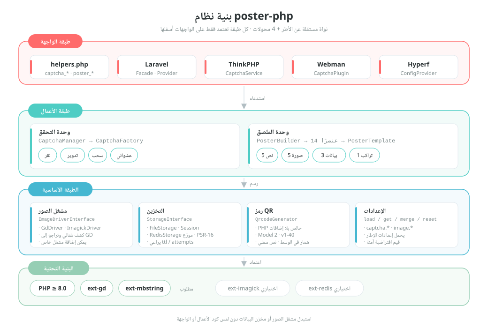
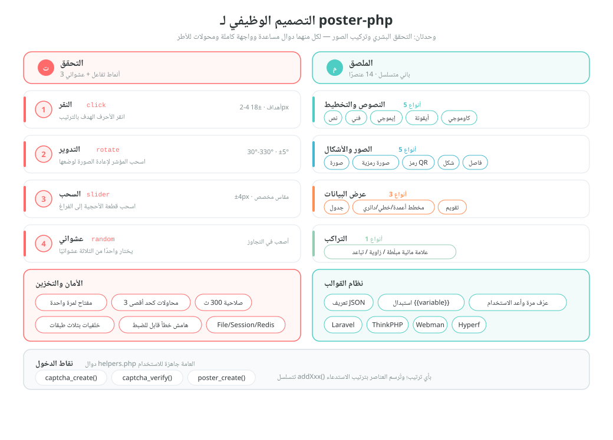
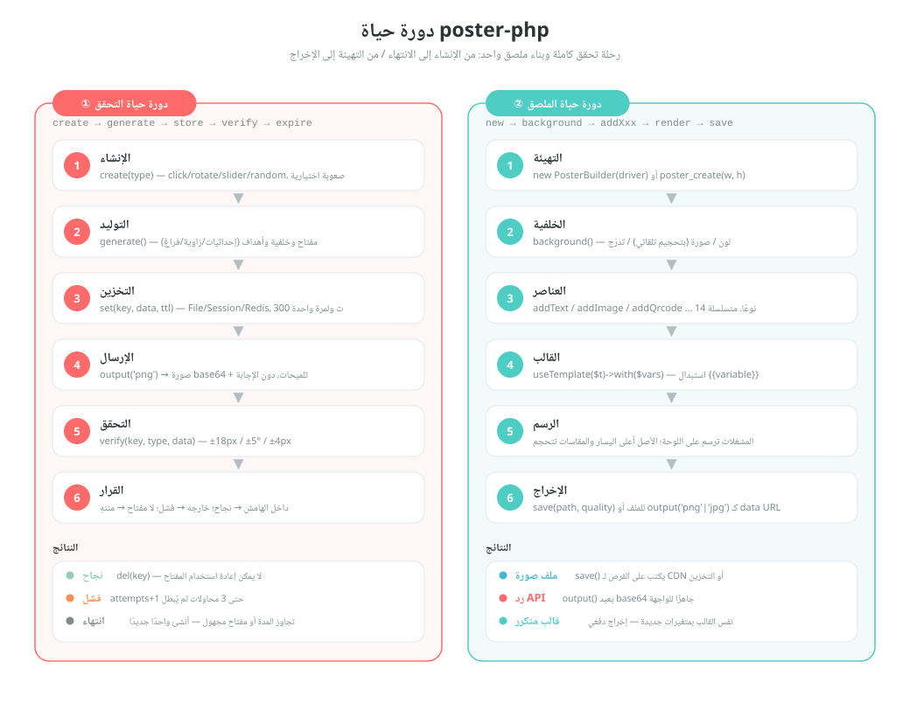

# poster-php

[中文](../../../README.md) | [English](../../../README_EN.md) | [日本語](../ja/README.md) | [한국어](../ko/README.md) | [Русский](../ru/README.md) | [Deutsch](../de/README.md) | [Français](../fr/README.md) | [Español](../es/README.md) | [Português](../pt/README.md) | [हिन्दी](../hi/README.md) | العربية | [বাংলা](../bn/README.md) | [Bahasa Indonesia](../id/README.md)

<p align="center">
  
</p>

مجموعة أدوات PHP لصور التحقق وتوليد الملصقات —— نواة مستقلة عن الأطر + محوّلات Laravel / ThinkPHP / Webman / Hyperf.

[التوثيق الإنجليزي](../../../README_EN.md) | [وثيقة التصميم المعماري](../../../docs/architecture.md) | [جميع اللغات](../README.md)

## نظرة عامة

poster-php مجموعة أدوات PHP للصور تفعل شيئين فقط، وتفعلهما على نحوٍ كافٍ:

| القدرة | الوصف |
|------|------|
| **التحقق** | ثلاث طرق للتحقق البشري (النقر / التدوير / السحب) مع تبديل عشوائي؛ توليد الصور والأجوبة بـ PHP خالص دون خدمات خارجية |
| **توليد الملصقات** | واجهة Builder متسلسلة، و14 نوعًا من العناصر تغطي النصوص والصور ورموز QR والجداول والمخططات والتقويم وغيرها |
| **مستقل عن الأطر** | تعتمد النواة على PHP ≥ 8.0 + GD فقط، وتُستخدم كحزمة Composer عادية بلا أي إطار |
| **جاهز للاستخدام** | 3 دوال مساعدة عامة + 4 محوّلات أطر (Laravel / ThinkPHP / Webman / Hyperf) |
| **قابل للاستبدال** | مشغّل الصور (GD / ImageMagick) ومخزن البيانات (File / Session / Redis) تطبيقاتٌ لواجهات، تُستبدل حسب الحاجة |

> تميمة المشروع **Posty** —— مخلوق مكوّن من الملصق نفسه وبطاقة رمز QR وقطعة أحجية السحب، وهي تجسّد قدرتَي الحزمة: إخراج الصور والتحقق. تُوزَّع مع الحزمة ([`assets/pet.svg`](../../../assets/pet.svg) / `assets/pet.png`)، ويمكن رسمها داخل الملصق عبر `->addPet()` أو ضبطها كصورة بديلة عند فقدان الصور.

## بنية المشروع

```
poster-php/
├── src/                        # الكود الأساسي: 64 ملف PHP / نحو 6093 سطرًا
│   ├── Captcha/                # وحدة التحقق: واجهة + صنف أساسي مجرّد + 3 تطبيقات + مصنع + مدير
│   │                           #   + RateLimiter (تحديد المعدل) / TrajectoryVerifier (التحقق من المسار)
│   ├── Poster/                 # وحدة الملصق (Elements/ElementRegistry.php سجل التسجيل الموحّد للعناصر)
│   │   ├── PosterBuilder.php   # باني متسلسل مع 14 دالة addXxx()
│   │   ├── PosterTemplate.php  # قالب JSON ← استبدال {{variable}}
│   │   └── Elements/           # 14 عارضًا للعناصر + ElementInterface + صنف أساسي مجرّد
│   ├── Drivers/                # مشغّلات الصور: ImageDriverInterface / GdDriver / ImagickDriver
│   ├── Storage/                # تخزين بيانات التحقق: File / Session / Redis / ذاكرة PSR-16
│   ├── Qrcode/                 # مولّد رموز QR بـ PHP خالص (Model 2، v1-40، بلا إضافات)
│   ├── Adapters/               # محوّلات الأطر: Laravel / ThinkPHP / Webman / Hyperf
│   ├── PosterConfig.php        # قراءة الإعدادات (قيم افتراضية + دمج إعدادات الإطار)
│   └── Installer.php           # نسخ ملف الإعدادات تلقائيًا بعد تثبيت composer
├── config/
│   └── poster.php              # الإعدادات الافتراضية (التحقق / مشغّل الصور)
├── assets/
│   ├── backgrounds/            # 6 صور خلفية مدمجة للتحقق (400×250 PNG)
│   ├── pet.svg                 # تميمة المشروع Posty (ملف مصدر متجهي)
│   └── pet.png                 # مُشتق من pet.svg: يُستخدم في addPet() وكصورة بديلة
├── helpers.php                 # دوال عامة: captcha_create / captcha_verify / poster_create
├── native.php                  # مدخل PHP الأصلي — يكفي require بدون Composer
├── tests/                      # اختبارات PHPUnit، 53 ملفًا، وبنية الأدلة تحاكي src/
├── examples/                   # أمثلة قابلة للتشغيل مباشرة
├── docs/                       # وثيقة المعمارية ومخططات التصميم ودورة الحياة (SVG) ورموز التبرع
└── composer.json               # PSR-4: Erikwang2013\Poster\ ← src/
```

## المعمارية والتصميم

### تصميم معمارية النظام

اعتماد طبقي: كل طبقة تستدعي واجهات الطبقة التي تحتها فقط؛ وعند استبدال المشغّل أو مخزن البيانات لا يتغيّر كود الأعمال إطلاقًا.



### التصميم الوظيفي

تفكيك وظائف الوحدتين: أنماط التفاعل الأربعة وخصائص الأمان في التحقق، والعناصر الـ14 ونظام القوالب في الملصق.



### دورة الحياة

المسار الكامل لجولة تحقق واحدة (إنشاء ← توليد ← تخزين ← إرسال ← تحقق ← نجاح / فشل / انتهاء) ولملصق واحد (تهيئة ← خلفية ← عناصر ← قالب ← رسم ← إخراج).



## المزايا

### التحقق (ثلاث طرق + تبديل عشوائي)

| النوع | الوصف |
|------|------|
| التحقق بالنقر `click` | ينقر المستخدم على النصوص الهدف في الصورة بالترتيب |
| التحقق بالتدوير `rotate` | يسحب المستخدم المؤشر لإعادة الصورة إلى زاويتها الصحيحة |
| التحقق بالسحب `slider` | يسحب المستخدم قطعة الأحجية إلى موضع الفراغ |
| التبديل العشوائي `random` | يختار واحدًا من الأنواع الثلاثة عشوائيًا |

### توليد الملصقات

واجهة Builder متسلسلة تدعم 14 نوعًا من العناصر:

| العنصر | الدالة | الوصف |
|------|------|------|
| النص | `addText()` | التفاف تلقائي للأسطر، محاذاة، أسطر متعددة |
| الصورة | `addImage()` | تحجيم وقص، زوايا دائرية، ظل |
| الصورة الرمزية | `addAvatar()` | قص دائري، إطار |
| رمز QR | `addQrcode()` | توليد بـ PHP خالص، شعار مركزي، نص سفلي |
| الأشكال | `addShape()` | مستطيل/دائرة/زوايا دائرية، تعبئة/تحديد |
| الخط الفاصل | `addLine()` | اللون، العرض |
| العلامة المائية | `addWatermark()` | نص مبلّط، زاوية، تباعد |
| الجدول | `addTable()` | ترويسة، تخطيط متناوب، عرض الأعمدة |
| المخطط | `addChart()` | أعمدة / خطي / دائري |
| التقويم | `addCalendar()` | تقويم شهري، تمييز التواريخ، ملاحظات |
| النص الفني | `addArtisticText()` | تحديد / ظل / تدرّج / نيون |
| الإيموجي | `addEmoji()` | عرض رموز إيموجي ملوّنة |
| أيقونات الخط | `addIcon()` | عرض أيقونات FontAwesome |
| الوجوه النصية | `addEmoticon()` | وجوه يابانية / تعبيرات مخصصة |

## التثبيت

```bash
composer require erikwang2013/poster-php
```

متطلبات النظام: PHP >= 8.0، وإضافة GD.

إضافات اختيارية:
- `ext-imagick`: مشغّل صور ImageMagick (أداء أفضل وإمكانات أوسع)
- `ext-redis`: تخزين بيانات التحقق في Redis (للنشر الموزّع)

### بدون Composer (PHP الأصلي)

ضع دليل `poster-php/` كاملًا داخل مشروعك، ثم أدرج `native.php` مباشرة: فهو يسجّل التحميل التلقائي PSR-4 ويحمّل الدوال العامة، دون حاجة إلى Composer أو أي إطار.

```php
require '/path/to/poster-php/native.php';   // تسجيل التحميل التلقائي + الدوال العامة

$result  = captcha_create('click');
$builder = poster_create(750, 1334);
```

يمكن إدراج `native.php` أكثر من مرة، ويتعايش مع Composer أو مع محمّل التلقائي المرفق بمشروعك (وعند التثبيت المكرر، يُفضَّل `vendor/autoload.php`).

## دليل الاستخدام

### أولًا: التحقق

#### 1. التحقق بالنقر (ClickCaptcha)

على المستخدم أن ينقر على النصوص الهدف في الصورة بالترتيب (مثل «شجرة» «طائر» «زهرة») للتأكد من أنه إنسان.

```php
// عبر الدوال المساعدة (مستقلة عن الأطر)
$result = captcha_create('click', [
    'difficulty' => 'medium',    // 'easy'(هدفان) | 'medium'(3 أهداف) | 'hard'(4 أهداف)
    'background' => null,        // مسار صورة خلفية مخصصة، null=خلفية متدرجة برمجية (نمط عشوائي)
]);

// النتيجة المُعادة
// $result = [
//     'key'   => 'abc123...',           // المعرّف الفريد للتحقق، يُرسل إلى الواجهة الأمامية
//     'image' => 'data:image/png;base64,...', // الصورة بصيغة base64
//     'extra' => [
//         'texts' => [
//             ['order' => 1, 'text' => '树'],
//             ['order' => 2, 'text' => '鸟'],
//             ['order' => 3, 'text' => '花'],
//         ],
//     ],
// ];

// الواجهة الأمامية تعرض النصوص حسب ترتيب order، وينقر المستخدم المواضع المقابلة (إحداثيات الهدف لا تُعاد، والتحقق على الخادم فقط)
// الواجهة الأمامية ترسل إحداثيات نقر المستخدم [[x1,y1], [x2,y2], [x3,y3]]
$pass = captcha_verify($result['key'], 'click', [[120, 80], [200, 150], [310, 95]]);
// تعيد true / false، بنصف قطر تفاوت 18px

// عبر CaptchaManager (الواجهة الكاملة)
use Erikwang2013\Poster\Captcha\CaptchaManager;
use Erikwang2013\Poster\Drivers\DriverFactory;
use Erikwang2013\Poster\Storage\FileStorage;

$manager = new CaptchaManager(DriverFactory::create(), new FileStorage());
$captcha = $manager->create('click')
    ->setDifficulty('hard')        // easy=هدفان | medium=3 أهداف | hard=4 أهداف
    ->setTargetType('text')        // 'text' نص | 'icon' أيقونة
    ->setWords(['猫', '狗', '鸟', '鱼']) // مجموعة نصوص مخصصة (اختياري)
    ->setBackground('/path/to/bg.jpg');
$result = $captcha->generate();

$pass = $manager->verify($result['key'], [
    'type' => 'click',
    'data' => [[120, 80], [200, 150], [310, 95], [180, 60]],
]);
```

يستبدل `setTargetType('icon')` النصوص الهدف بأشكال متجهية تُولَّد برمجيًا (11 شكلًا تُرسم بعناصر GD، دون أي ملفات صور):
ويُضاف إلى كل عنصر في `extra['texts']` حقل `thumb` (صورة مصغّرة base64 للشكل) لتعرضه الواجهة الأمامية كتلميح للنقر؛ أما التحقق فيبقى مقارنة إحداثيات.

#### 2. التحقق بالتدوير (RotateCaptcha)

يقوم النظام بتدوير الصورة عشوائيًا بين 30° و330°، وعلى المستخدم سحب المؤشر لإعادة الصورة إلى وضعها الصحيح.

```php
// عبر الدوال المساعدة
$result = captcha_create('rotate');
// $result['extra'] لا يحتوي على الزاوية (وهي الجواب)، والواجهة الأمامية تعرض الصورة المدوّرة فقط

$pass = captcha_verify($result['key'], 'rotate', 185);  // زاوية تدوير المستخدم، بتفاوت ±5°

// عبر CaptchaManager
$captcha = $manager->create('rotate')
    ->setSize(200)                 // قطر الدائرة 60-400 (الافتراضي 200)
    ->setAngleRange(45, 315)       // نطاق زاوية التدوير المخصص
    ->generate();
```

#### 3. التحقق بالسحب (SliderCaptcha)

يقتطع النظام قطعة أحجية من الخلفية ويزيحها، وعلى المستخدم سحبها إلى موضع الفراغ.

```php
// عبر الدوال المساعدة
$result = captcha_create('slider');
// $result = [
//     'image' => '...',              // الخلفية مع الفراغ
//     'extra' => [
//         'puzzle'   => '...',        // صورة قطعة الأحجية
//         'puzzle_w' => 50,           // عرض القطعة
//         'puzzle_h' => 50,           // ارتفاع القطعة
//     ],
// ];

$pass = captcha_verify($result['key'], 'slider', 173);  // البكسل x الذي سحبه المستخدم، بتفاوت ±4px
```

#### 4. التبديل العشوائي (RandomCaptcha)

يختار النظام عشوائيًا أحد الأنواع click / rotate / slider، مما يزيد صعوبة الاختراق.

```php
// عبر الدوال المساعدة — سطر واحد لتوليد نوع عشوائي
$result = captcha_create('random');
// $result['type'] يعيد النوع المختار فعليًا: 'click' | 'rotate' | 'slider'

// الواجهة الأمامية تعرض مكوّن التفاعل المقابل حسب النوع
switch ($result['type']) {
    case 'click':
        // اعرض مكوّن النقر: أظهر الصورة، وينقر المستخدم النصوص في extra.texts بالترتيب
        break;
    case 'rotate':
        // اعرض مكوّن التدوير: أظهر الصورة، ويسحب المستخدم للتدوير
        break;
    case 'slider':
        // اعرض مكوّن السحب: أظهر صورة الفراغ + قطعة الأحجية
        break;
}

// عند التحقق مرّر النوع الفعلي وبيانات عملية المستخدم
$pass = captcha_verify($result['key'], $result['type'], $userData);
// click: $userData = [[x1,y1],[x2,y2],...]
// rotate: $userData = 185 (الزاوية)
// slider: $userData = 173 (بالبكسل)

// عبر CaptchaManager
$captcha = $manager->create('random')->generate();
$pass = $manager->verify($captcha['key'], [
    'type' => $captcha['type'],
    'data' => $userData,
]);
```

#### خصائص أمان التحقق

| الخاصية | الوصف |
|------|------|
| لمرة واحدة | يُحذف المفتاح بعد نجاح التحقق أو تجاوز الحد الأقصى للمحاولات |
| مقاومة التخمين | 3 محاولات كحد أقصى افتراضيًا (قابل للضبط) |
| الصلاحية | 300 ثانية افتراضيًا (قابلة للضبط) |
| العشوائية | لون الخلفية والتشويش ومواضع الأهداف عشوائية عند كل توليد؛ وتُختار صبغة ودوران كل هدف من أهداف النقر على حدة عشوائيًا |
| تحديد المعدل على مستوى الجلسة | تحديد نافذة زمنية يعمل عبر المفاتيح (افتراضيًا 30 محاولة خلال 60 ثانية)، لسدّ التخمين بـ «توليد مفتاح جديد وتجربته» |
| مسار السلوك | اختياري (مغلق افتراضيًا): يتحقق من عدد نقاط مسار السحب ومدته واستقامته، فيُرفض إرسال الجواب مباشرة عبر POST |
| تجميل الخلفية | خلفية متدرجة برمجية بثلاثة أنماط (بسيط/حيوي/طبيعي) تُختار عشوائيًا، مع إمكانية ضبط دليل صور الخلفية الافتراضي |
| الحد الأدنى للوحة | إن كانت الخلفية أصغر من الحد يُرفض الطلب بخطأ بدل التدهور (التحقق بالنقر 120×120 كحد أدنى، والسحب يحتاج مساحة تستوعب قطعة أحجية 4×2) |

#### التحقق من مسار السلوك (اختياري)

مغلق افتراضيًا (لتجنّب الإضرار بالأجهزة اللمسية وأجهزة الوصول). وعند تفعيله يحتاج `slider` / `rotate` إلى إرسال مسار السحب من الواجهة الأمامية، ليتحقق الخادم من عدد النقاط والمدة والاستقامة:

```php
// config/poster.php
'captcha' => [
    'trajectory' => [
        'enabled'      => true,
        'min_points'   => 4,      // أقل عدد نقاط مُقاسة
        'min_duration' => 300,    // أقل مدة (بالمللي ثانية)
        'max_duration' => 5000,   // أقصى مدة (بالمللي ثانية)
        'max_linearity' => 0.99,  // الاستقامة الأعلى من هذه القيمة تُعدّ آلة (سحب السكربت خط مستقيم)
    ],
],

// إرسال الواجهة الأمامية: الصيغة القديمة بقيمة عددية ما زالت مدعومة
captcha_verify($key, 'slider', 173);
// بعد تفعيل التحقق من المسار يجب إرسال المسار مع الطلب
captcha_verify($key, 'slider', ['x' => 173, 'trail' => [[12, 3, 0], [40, 9, 22], /* … */], 'duration' => 1200]);
```

#### إعداد صور الخلفية

تدعم خلفية التحقق ثلاث درجات من الأولوية:

1. **صورة واحدة** — تُحدَّد عبر `setBackground('/path/to/bg.jpg')`
2. **دليل صور** — اضبط `captcha.background_dir` ليشير إلى دليل الصور، والافتراضي `assets/backgrounds/` (6 صور خلفية متدرجة مدمجة)
3. **توليد برمجي** — يُفعَّل عند ضبط `background_dir` على `null`، بثلاثة أنماط تُختار عشوائيًا

```php
// الطريقة الأولى: تحديد صورة واحدة في الكود
$captcha = $manager->create('click')->setBackground('/path/to/bg.jpg');

// الطريقة الثانية: استبدال صورة الخلفية الافتراضية (config/poster.php)
'captcha' => [
    // ضع صورك في هذا الدليل ليُختار منها عشوائيًا
    'background_dir' => '/path/to/my-backgrounds',
    // الضبط على null يستخدم خلفية متدرجة برمجية
    // 'background_dir' => null,
],

// الطريقة الثالثة: لا تفعل شيئًا، فيُستخدم دليل الخلفيات المدمج تلقائيًا (assets/backgrounds/)
```

**الخلفيات الافتراضية**: يحتوي `assets/backgrounds/` على 6 خلفيات PNG متدرجة بمقاس 400×250، بأنماط تشمل الأزرق البنفسجي، والغروب، والأخضر الناعم، والداكن، والباستيل، والأزرق البحري.

ثلاثة أنماط برمجية:

| النمط | الوصف |
|------|------|
| `minimal` بسيط | تدرّج ناعم + دوائر كبيرة بشفافية منخفضة + خطوط هندسية + نقاط دقيقة متباعدة |
| `vibrant` حيوي | تدرّج ساطع + دوائر ملونة بأحجام متنوعة + تشويش بمتوسط كثافة |
| `natural` طبيعي | تدرّج دافئ + كتل لونية غير منتظمة تحاكي ملمس الورق + نقاط دقيقة كثيفة |

### ثانيًا: توليد الملصقات

#### الاستخدام الأساسي

```php
use Erikwang2013\Poster\Poster\PosterBuilder;
use Erikwang2013\Poster\Drivers\DriverFactory;

// عبر الدوال المساعدة
$builder = poster_create(750, 1334);  // العرض×الارتفاع

// أو بالإنشاء المباشر
$builder = new PosterBuilder(DriverFactory::create());
$builder->width(750)->height(1334);

// ضبط الخلفية
$builder->background('#FFFFFF');                            // خلفية بلون واحد
$builder->background('/path/to/bg.jpg');                    // خلفية صورة (بتحجيم تلقائي)
$builder->backgroundGradient('#FF6B6B', '#FF8E53', 'vertical'); // خلفية متدرجة
                                                            // الاتجاه: vertical | horizontal

// الإخراج
$builder->save('/output/poster.jpg', 90);  // الحفظ إلى ملف (المسار، الجودة 0-100)
                                           // الصيغة تُستنتج من الامتداد: jpg/jpeg/png/webp/gif
                                           // عند عدم تمرير الجودة يقرأ JPEG قيمة poster.jpeg_quality ويقرأ PNG قيمة poster.png_compression
$dataUrl = $builder->output('png', 90);    // الحصول على base64 data URL
```

#### النص `addText()`

```php
$builder->addText('新品首发', [
    'x'        => 80,              // الإحداثي الأفقي
    'y'        => 120,             // الإحداثي الرأسي (موضع خط الأساس)
    'size'     => 48,              // حجم الخط
    'color'    => '#333333',       // اللون
    'font'     => '/path/to/font.ttf', // ملف الخط، null=خط GD المدمج
    'align'    => 'center',        // left | center | right
    'maxWidth' => 600,             // أقصى عرض (التفاف تلقائي للأسطر)
    'lineHeight' => 72,            // ارتفاع السطر
    'angle'    => 0,               // زاوية الدوران
]);
```

#### الصورة `addImage()`

```php
$builder->addImage('/path/to/product.jpg', [
    'x'      => 75,
    'y'      => 280,
    'width'  => 600,              // عرض العرض (بتحجيم تلقائي)
    'height' => 600,              // ارتفاع العرض
    'radius' => 12,               // نصف قطر الزوايا الدائرية
    'shadow' => [                 // الظل (اختياري)
        'color'    => '#00000033',
        'offsetX'  => 4,
        'offsetY'  => 4,
        'blur'     => 10,
    ],
]);
```

#### الصورة الرمزية `addAvatar()`

```php
$builder->addAvatar('/path/to/avatar.jpg', [
    'x'      => 80,
    'y'      => 60,
    'size'   => 120,              // مقاس الصورة الرمزية (مربّع)
    'border' => '#FF6B6B',        // لون الإطار (اختياري)
]);
```

#### رمز QR `addQrcode()`

```php
$builder->addQrcode('https://example.com/page/123', [
    'x'     => 275,
    'y'     => 1050,
    'size'  => 200,               // مقاس رمز QR
    'level' => 'H',               // مستوى تصحيح الأخطاء L | M | Q | H
    'logo'  => '/path/to/logo.png', // الشعار المركزي (اختياري)
    'label' => '扫码查看详情',      // النص السفلي (اختياري)
    'label_size'  => 14,
    'label_color' => '#999999',
]);
```

عند تجاوز السعة الحدَّ الأقصى لهذه النسخة (مثلًا ما يزيد على نحو 1273 بايت عند مستوى H) يُطرح `InvalidArgumentException`، بدل إنتاج رمز يتعذّر مسحه بصمت.

#### الأشكال `addShape()`

```php
// مستطيل
$builder->addShape('rect', [
    'x' => 0, 'y' => 0, 'width' => 750, 'height' => 60,
    'color'  => '#FF6B6B',
    'filled' => true,             // true=تعبئة false=تحديد
    'radius' => 8,                // نصف قطر الزوايا الدائرية
    'opacity' => 0.8,             // الشفافية 0-1
]);

// دائرة
$builder->addShape('circle', [
    'x' => 100, 'y' => 100, 'width' => 80, 'height' => 80,
    'color' => '#4ECDC4',
]);
```

#### الخط الفاصل `addLine()`

```php
$builder->addLine([
    'x1' => 75, 'y1' => 800,
    'x2' => 675, 'y2' => 800,
    'color' => '#EEEEEE',
    'width' => 1,
]);
```

#### العلامة المائية `addWatermark()`

```php
$builder->addWatermark('CONFIDENTIAL', [
    'size'    => 24,
    'color'   => '#00000020',     // شبه شفاف
    'font'    => '/font.ttf',
    'angle'   => 30,              // زاوية الميل
    'spacing' => 200,             // التباعد
]);
```

#### الجدول `addTable()`

```php
$builder->addTable([
    'x'      => 50,
    'y'      => 800,
    'width'  => 650,
    'columns' => [150, 350, 150], // عرض الأعمدة
    'header'  => ['序号', '项目', '价格'],
    'rows'    => [
        ['1', '商品A', '¥99'],
        ['2', '商品B', '¥199'],
        ['3', '商品C', '¥299'],
    ],
    'headerBg'     => '#333333',
    'headerColor'  => '#FFFFFF',
    'rowBg'        => ['#FFFFFF', '#F5F5F5'], // تخطيط متناوب
    'rowColor'     => '#333333',
    'fontSize'     => 24,
    'cellPadding'  => 10,
]);
```

#### المخطط `addChart()`

```php
// مخطط أعمدة
$builder->addChart('bar', [
    ['label' => '一月', 'value' => 120],
    ['label' => '二月', 'value' => 200],
    ['label' => '三月', 'value' => 150],
    ['label' => '四月', 'value' => 300],
], [
    'x' => 50, 'y' => 100, 'width' => 650, 'height' => 400,
    'colors' => ['#FF6B6B', '#4ECDC4', '#45B7D1', '#96CEB4'],
]);

// مخطط خطي
$builder->addChart('line', [
    ['label' => '周一', 'value' => 10],
    ['label' => '周二', 'value' => 35],
    ['label' => '周三', 'value' => 25],
    ['label' => '周四', 'value' => 45],
    ['label' => '周五', 'value' => 30],
], [
    'x' => 50, 'y' => 100, 'width' => 650, 'height' => 400,
    'colors' => ['#FF6B6B'],
]);

// مخطط دائري
$builder->addChart('pie', [
    ['label' => '电商', 'value' => 45],
    ['label' => '社交', 'value' => 25],
    ['label' => '搜索', 'value' => 15],
    ['label' => '其他', 'value' => 15],
], [
    'x' => 75, 'y' => 100, 'width' => 600, 'height' => 600,
    'colors' => ['#FF6B6B', '#4ECDC4', '#45B7D1', '#96CEB4'],
]);
```

#### التقويم `addCalendar()`

```php
$builder->addCalendar([
    'x'     => 50,
    'y'     => 200,
    'year'  => 2026,
    'month' => 5,                   // 1-12
    'cellSize'    => 60,            // مقاس الخلية
    'startDay'    => 0,             // 0=الأحد 1=الاثنين
    'title'       => '2026年5月',    // العنوان (يُولَّد تلقائيًا افتراضيًا)
    'highlights'  => [              // التواريخ المميزة
        '2026-05-01' => ['bg' => '#FF6B6B', 'text' => '劳动节'],
        '2026-05-16' => ['bg' => '#FFEAA7', 'text' => '今天'],
    ],
    'headerBg'    => '#333333',     // خلفية شريط العنوان
    'headerColor' => '#FFFFFF',     // لون نص شريط العنوان
    'cellBg'      => '#FFFFFF',     // خلفية الخلية
    'cellBorder'  => '#DDDDDD',     // إطار الخلية
    'todayBg'     => '#FF6B6B',     // لون خلفية اليوم
    'highlightBg' => '#FFF3CD',    // لون خلفية التمييز الافتراضي
    'textColor'   => '#333333',     // لون نص التاريخ
    'dimColor'    => '#CCCCCC',     // لون الشهر الآخر/الفراغ
]);
```

#### النص الفني `addArtisticText()`

```php
// تأثير التحديد
$builder->addArtisticText('SALE', 'stroke', [
    'x' => 80, 'y' => 120, 'size' => 72,
    'color'       => '#FF6B6B',    // لون التعبئة
    'strokeColor' => '#000000',    // لون التحديد
    'strokeWidth' => 3,            // عرض التحديد
]);

// تأثير الظل
$builder->addArtisticText('新品', 'shadow', [
    'x' => 80, 'y' => 120, 'size' => 48,
    'color'         => '#333333',
    'shadowColor'   => '#00000033',
    'shadowOffsetX' => 4,
    'shadowOffsetY' => 4,
]);

// تأثير التدرّج
$builder->addArtisticText('VIP', 'gradient', [
    'x' => 80, 'y' => 120, 'size' => 60,
    'color'  => '#FF6B6B',         // اللون العلوي
    'color2' => '#FF8E53',         // اللون السفلي
]);

// تأثير التوهج النيوني
$builder->addArtisticText('HOT', 'neon', [
    'x' => 80, 'y' => 120, 'size' => 56,
    'color'     => '#FF1493',
    'glowColor' => '#FF1493',
]);
```

#### الإيموجي `addEmoji()`

```php
// استخدام رمز الإيموجي مباشرة
$builder->addEmoji('😀', ['x' => 100, 'y' => 100, 'size' => 64]);
$builder->addEmoji('🎉', ['x' => 180, 'y' => 100, 'size' => 64]);

// استخدام نقطة الترميز unicode
$builder->addEmoji('', [
    'x' => 100, 'y' => 100, 'size' => 64,
    'codepoint' => 'U+1F600',      // يكافئ 😀
]);

// تحديد خط الإيموجي (يتطلب دعم النظام للخطوط الملوّنة)
$builder->addEmoji('😀', [
    'x' => 100, 'y' => 100, 'size' => 64,
    'font' => '/System/Library/Fonts/Apple Color Emoji.ttc',
]);
```

يكتشف النظام تلقائيًا مسارات خطوط الإيموجي على macOS / Linux / Windows.

> ملاحظة: رسم الإيموجي يعتمد على الخط نفسه. الخط الشائع على Linux وهو `NotoColorEmoji.ttf` خط نقطي ملوّن بصيغة CBDT لا تستطيع قناة FreeType في GD تحميله (تفشل `imagettftext()` مباشرة)، ولذلك لن يُرسم الإيموجي؛ استخدم بدلًا منه خط إيموجي يستطيع FreeType تحميله على نظامك.

#### أيقونات الخط `addIcon()`

```php
// استخدام أسماء أيقونات FontAwesome المدمجة (يتطلب توفير ملف خط الأيقونات)
$builder->addIcon('heart', [
    'x' => 20, 'y' => 40, 'size' => 32,
    'color' => '#E74C3C',
    'font'  => '/path/to/fa-solid-900.ttf',  // يجب توفير خط FontAwesome TTF
]);

$builder->addIcon('star',  ['x' => 60, 'y' => 40, 'color' => '#F39C12', 'font' => '/path/to/fa-solid-900.ttf']);
$builder->addIcon('check', ['x' => 100, 'y' => 40, 'color' => '#27AE60', 'font' => '/path/to/fa-solid-900.ttf']);

// استخدام نقطة ترميز unicode مخصصة
$builder->addIcon('', [
    'x' => 20, 'y' => 40, 'size' => 32,
    'codepoint' => '\\u{F3C5}',    // map-marker
    'color' => '#E74C3C',
    'font' => '/path/to/fa-solid-900.ttf',
]);

// قائمة أسماء الأيقونات المدمجة
// heart, star, user, clock, home, cog, check, times, search,
// envelope, phone, camera, play, pause, shopping-cart, tag,
// map-marker, calendar, comment, share, download, upload,
// lock, globe, link, image, music, video, bell, bookmark,
// thumbs-up, eye, trash, edit, plus, minus, arrow-*,
// location-dot, fire, gift, rocket
```

#### الوجوه النصية `addEmoticon()`

```php
// استخدام الوجوه النصية المدمجة
$builder->addEmoticon('happy', ['x' => 20, 'y' => 40, 'size' => 24]);
// الناتج: (｡•̀ᴗ-)✧

$builder->addEmoticon('love',  ['x' => 20, 'y' => 80, 'size' => 24]);
// الناتج: (♡°▽°♡)

$builder->addEmoticon('cry',   ['x' => 20, 'y' => 120, 'size' => 24]);
// الناتج: (╥﹏╥)

// نص تعبيري مخصص
$builder->addEmoticon('', [
    'x' => 20, 'y' => 40, 'size' => 24,
    'text' => '(╯°□°）╯︵ ┻━┻',    // نص مخصص
    'color' => '#333333',
]);

// تعبيرات الوجوه النصية المدمجة
// happy, love, cry, angry, surprised, cool, sleepy,
// wave, think, shrug, tableflip, lenny
```

#### تميمة المشروع `addPet()`

يمكن رسم التميمة المدمجة Posty (`assets/pet.png`، المُشتق من `assets/pet.svg`) مباشرة داخل الملصق، وهي مكافئة لـ `addImage(PosterBuilder::petPath(), $options)`:

```php
$builder->addPet([
    'x'      => 555,
    'y'      => 140,
    'width'  => 150,
    'height' => 130,   // يُحجَّم حسب العرض والارتفاع المعطيين، ويُفضَّل الحفاظ على نسبة 600:520
    'radius' => 0,     // تدعم كل خيارات addImage()
]);

// ويمكن كذلك أخذ المسار واستخدامه بنفسك (مثلًا كشعار مركزي لرمز QR)
$logo = PosterBuilder::petPath();
```

**الصورة البديلة عند الفقدان**: تتجاوز `addImage()` / `addAvatar()` الملفات غير الموجودة ولا ترسمها افتراضيًا. وجّه `poster.placeholder` إلى التميمة، وسيُرسم Posty في موضع الصورة المفقودة لترى بنظرة واحدة أي صورة سقطت:

```php
// config/poster.php
'poster' => [
    'placeholder' => dirname(__DIR__) . '/assets/pet.png',
],
```

### ثالثًا: نظام القوالب

```php
use Erikwang2013\Poster\Poster\PosterTemplate;

// تعريف القالب (قابل للتسلسل بصيغة JSON)
$template = PosterTemplate::fromConfig([
    'width'  => 750,
    'height' => 1334,
    'elements' => [
        ['type' => 'shape', 'color' => '#FF6B6B', 'x' => 0, 'y' => 0, 'width' => 750, 'height' => 300],
        ['type' => 'text', 'text' => '{{title}}', 'x' => 80, 'y' => 100, 'size' => 48, 'color' => '#FFFFFF'],
        ['type' => 'text', 'text' => '{{subtitle}}', 'x' => 80, 'y' => 180, 'size' => 28, 'color' => '#FFE0E0'],
        ['type' => 'image', 'src' => '{{cover}}', 'x' => 75, 'y' => 350, 'width' => 600, 'height' => 600, 'radius' => 12],
        ['type' => 'qrcode', 'content' => '{{url}}', 'x' => 275, 'y' => 1050, 'size' => 200, 'label' => '扫码查看详情'],
    ],
]);

// استخدام القالب مع المتغيرات
$builder->useTemplate($template)->with([
    'title'    => '新品首发',
    'subtitle' => '限时特惠 · 买一送一',
    'cover'    => '/path/to/product.jpg',
    'url'      => 'https://m.example.com/product/123',
])->save('/output/poster.jpg');

// أنواع العناصر التي يدعمها القالب: text, image, qrcode, avatar, shape, line, watermark, table,
//                      chart, calendar, artistic-text, emoji, icon, emoticon
```

تستبدل `useTemplate()` افتراضيًا عناصر `addXxx()` السابقة (مع الحفاظ على الدلالة الأصلية)؛ وللاستفادة من «قالب كأساس + عناصر مكتوبة يدويًا فوقه» استخدم المعامل الثاني:

```php
$builder->replaceElements(false)->useTemplate($template)->with($vars)->addPet(['x' => 20, 'y' => 20, 'width' => 80]);

// التصدير العكسي: حوّل الـ builder الحالي (أو عنصرًا واحدًا) إلى بنية قالب، تُغذّى مرة أخرى إلى fromConfig()
$config = $builder->toArray();          // ['width'=>…, 'height'=>…, 'elements'=>[…]]
$template2 = PosterTemplate::fromConfig($config);   // تصدير ← إعادة استيراد، بنية متطابقة

// يكفي تسجيل نوع عنصر جديد مرة واحدة في ElementRegistry ليعمل في الـ Builder والقالب معًا
$builder->add('text', ['text' => 'hello', 'x' => 10, 'y' => 30, 'size' => 20]);
```

> تنبيه: تُعيد `AbstractElement::toArray()` منذ هذا الإصدار «اسم نوع مختصر + خيارات مسطّحة» (وكانت سابقًا `['type' => اسم الصنف, 'options' => [...]]`)، وذلك لتتوافق بنيتها مع القالب في الاتجاهين.

## التكامل مع الأطر

### Laravel

```php
use Erikwang2013\Poster\Adapters\Laravel\Facades\Captcha;
use Erikwang2013\Poster\Adapters\Laravel\Facades\Poster;

$result = Captcha::create('click')->generate();
Poster::width(750)->height(1334)->background('#FFF')->save('poster.jpg');
```

```php
// بعد ضبط captcha.route.enabled = true في config/poster.php يسجّل المحوّل نقطة نهاية للصورة:
//   GET /captcha/{key} ← يعيد PNG مباشرة (Content-Type: image/png، Cache-Control: no-store)
// تكفي الواجهة الأمامية بالرابط دون تمرير base64 (أصغر بنسبة 33% وقابل للتخزين المؤقت في المتصفح/CDN)
$result = Captcha::create('click')->generate();
// $result['image'] ما زال data URI؛ أما $result['url'] فعنوان يصلح مباشرة في 

// التحقق من النموذج: اسم القاعدة captcha ومعاملها مفتاح الصورة
$request->validate([
    'captcha_key'  => 'required|string',
    'captcha_code' => 'required|captcha:captcha_key',
]);
```

```bash
php artisan vendor:publish --tag=poster-config
```

### ThinkPHP

`config/web.php`:
```php
'services' => [
    Erikwang2013\Poster\Adapters\ThinkPHP\CaptchaService::class,
    Erikwang2013\Poster\Adapters\ThinkPHP\PosterService::class,
],
```

### Webman

`config/bootstrap.php`:
```php
return [
    Erikwang2013\Poster\Adapters\Webman\CaptchaPlugin::class,
    Erikwang2013\Poster\Adapters\Webman\PosterPlugin::class,
];
```

### Hyperf

يُسجَّل تلقائيًا عبر ConfigProvider.

## الإعدادات

بعد `composer require` يُنسخ `config/poster.php` تلقائيًا إلى دليل `config/` في مشروعك (ويُتجاوز إن كان موجودًا). متوافق مع Laravel / ThinkPHP / Webman (`config/poster.php`) وHyperf (`config/autoload/poster.php`).

أهم الإعدادات:

| الإعداد | القيمة الافتراضية | الوصف |
|--------|--------|------|
| `captcha.default_type` | `random` | نوع التحقق الافتراضي: `click` / `rotate` / `slider` / `random` |
| `captcha.default_difficulty` | `medium` | الصعوبة الافتراضية: `easy` / `medium` / `hard` |
| `captcha.click_words` | `[合,家,欢,...]` | مجموعة نصوص تحقق click، قابلة للتخصيص |
| `captcha.background_dir` | `assets/backgrounds/` | دليل صور الخلفية، و`null` يعني التوليد البرمجي |
| `captcha.ttl` | `300` | مدة صلاحية التحقق (بالثواني) |
| `captcha.max_attempts` | `3` | أقصى عدد لمحاولات التحقق |
| `captcha.tolerance` | `{click:18,rotate:5,slider:4}` | التفاوت لكل نوع |
| `image.driver` | `auto` | مشغّل الصور: `auto` / `gd` / `imagick` |
| `poster.placeholder` | `null` | مسار الصورة البديلة للصور المفقودة، و`null` يعني التجاوز دون رسم؛ وجّهه إلى مسار التميمة لرسم Posty في موضع الصورة المفقودة |
| `captcha.rate_limit` | `{max:30,window:60}` | تحديد معدل على مستوى الجلسة/الحساب في نافذة زمنية؛ والهوية تُؤخذ من session_id افتراضيًا، وعند غياب الجلسة من عنوان IP للعميل |
| `captcha.trajectory` | `{enabled:false,…}` | التحقق من مسار السلوك (مغلق افتراضيًا) |
| `captcha.cache.pool` | `null` | كائن مخزن PSR-16 (يُستخدم عند `storage=cache`)، ويمكن ضبطه وقت التشغيل عبر `StorageFactory::setPsr16Pool()` |
| `captcha.route` | `{enabled:false,path:'/captcha'}` | محوّل Laravel: يسجّل نقطة نهاية للصورة `GET {path}/{key}` تعيد PNG مباشرة |

## المصدر المفتوح ليس سهلًا، ودعمكم مرحّب به

| WeChat | Alipay |
|:---:|:---:|
|  |  |

---

## الترخيص

MIT License — Copyright (c) 2026 erik <erik@erik.xyz> — https://erik.xyz
