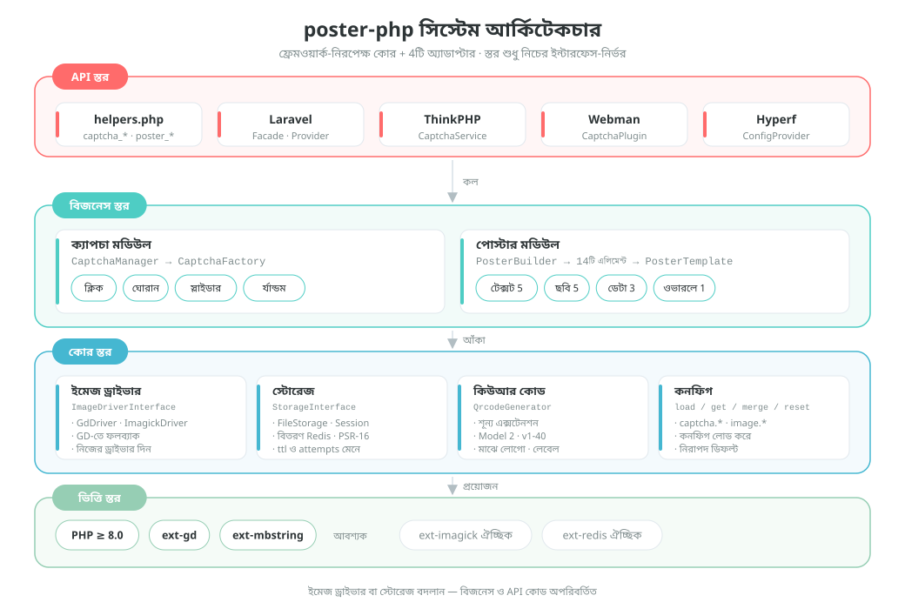
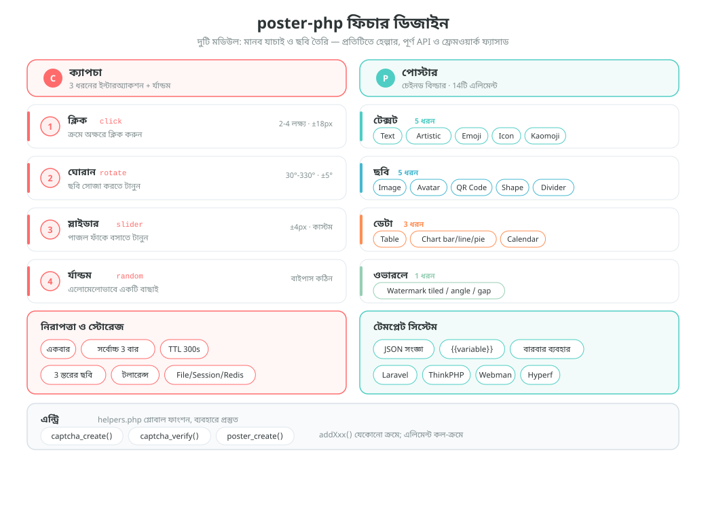
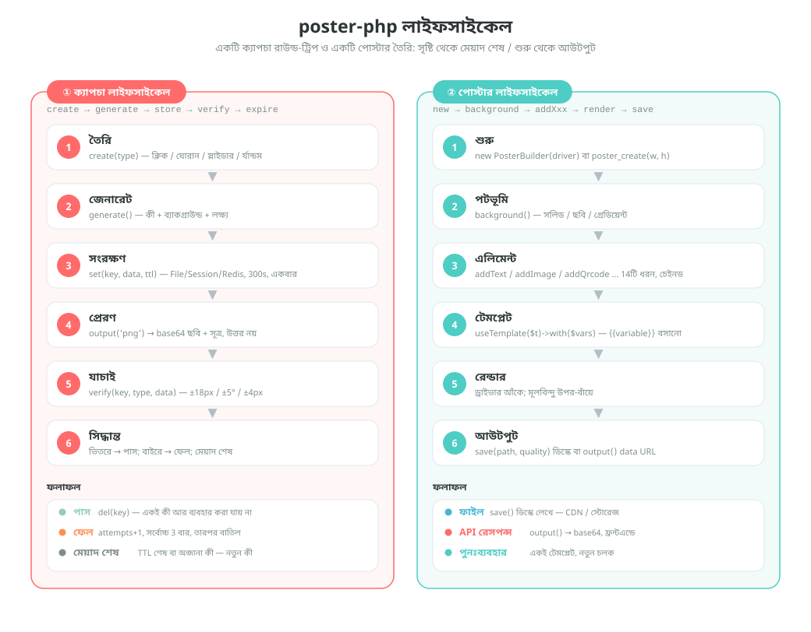

# poster-php

[中文](../../../README.md) | [English](../../../README_EN.md) | [日本語](../ja/README.md) | [한국어](../ko/README.md) | [Русский](../ru/README.md) | [Deutsch](../de/README.md) | [Français](../fr/README.md) | [Español](../es/README.md) | [Português](../pt/README.md) | [हिन्दी](../hi/README.md) | [العربية](../ar/README.md) | বাংলা | [Bahasa Indonesia](../id/README.md)

<p align="center">
  
</p>

PHP ইমেজ ক্যাপচা ও পোস্টার তৈরির টুলকিট —— ফ্রেমওয়ার্ক-নিরপেক্ষ কোর + Laravel / ThinkPHP / Webman / Hyperf অ্যাডাপ্টার।

[English Documentation](../../../README_EN.md) | [আর্কিটেকচার ডকুমেন্ট](../../architecture.md)

## প্রকল্প পরিচিতি

poster-php একটি PHP ইমেজ টুলকিট — মাত্র দুটি কাজ করে, আর তা যথেষ্ট ভালোভাবে করে:

| সামর্থ্য | বিবরণ |
|------|------|
| **ক্যাপচা** | ক্লিক / ঘোরান / স্লাইডার — তিন ধরনের মানব যাচাই + র্যান্ডম সুইচ, খাঁটি PHP-তে ছবি ও উত্তর তৈরি, তৃতীয় পক্ষের সার্ভিস ছাড়াই |
| **পোস্টার তৈরি** | চেইনড Builder API, 14 ধরনের এলিমেন্ট — টেক্সট, ছবি, QR কোড, টেবিল, চার্ট, ক্যালেন্ডারসহ লেআউটের সব চাহিদা মেটায় |
| **ফ্রেমওয়ার্ক-নিরপেক্ষ** | কোর নির্ভর করে শুধু PHP ≥ 8.0 + GD-এর উপর, সাধারণ Composer প্যাকেজ হিসেবে ব্যবহারযোগ্য, ফ্রেমওয়ার্ক ছাড়াই |
| **সরাসরি ব্যবহারযোগ্য** | 3টি গ্লোবাল হেল্পার ফাংশন + 4টি ফ্রেমওয়ার্ক অ্যাডাপ্টার (Laravel / ThinkPHP / Webman / Hyperf) |
| **বদলানোযোগ্য** | ইমেজ ড্রাইভার (GD / ImageMagick) ও স্টোরেজ ব্যাকএন্ড (File / Session / Redis) — সবই ইন্টারফেসের বাস্তবায়ন, দরকারে বদলে নিন |

> প্রকল্পের মাসকট **Posty** —— পোস্টারের বডি, QR কোড কার্ড ও স্লাইডার পাজল দিয়ে গড়া একটি মাসকট; ঠিক এই প্যাকেজের দুই সামর্থ্যের প্রতীক: ছবি তৈরি ও যাচাই। এটি প্যাকেজের সাথে আসে ([`assets/pet.svg`](../../../assets/pet.svg) / `assets/pet.png`), `->addPet()` দিয়ে পোস্টারে আঁকা যায়, আবার ছবি না পাওয়ার প্লেসহোল্ডার হিসেবেও কনফিগ করা যায়।

## প্রকল্প কাঠামো

```
poster-php/
├── src/                        # কোর কোড: 64টি PHP ফাইল / প্রায় 6093 লাইন
│   ├── Captcha/                # ক্যাপচা মডিউল: ইন্টারফেস + অ্যাবস্ট্রাক্ট বেস + 3টি বাস্তবায়ন + ফ্যাক্টরি + ম্যানেজার
│   │                           #   + RateLimiter (রেট লিমিট) / TrajectoryVerifier (ট্রাজেক্টরি যাচাই)
│   ├── Poster/                 # পোস্টার মডিউল (Elements/ElementRegistry.php এলিমেন্ট রেজিস্ট্রির একক জায়গা)
│   │   ├── PosterBuilder.php   # চেইনড Builder, 14টি addXxx() মেথড
│   │   ├── PosterTemplate.php  # JSON টেমপ্লেট → {{variable}} প্রতিস্থাপন
│   │   └── Elements/           # 14 ধরনের এলিমেন্ট রেন্ডারার + ElementInterface + অ্যাবস্ট্রাক্ট বেস
│   ├── Drivers/                # ইমেজ ড্রাইভার: ImageDriverInterface / GdDriver / ImagickDriver
│   ├── Storage/                # যাচাই ডেটার স্টোরেজ: File / Session / Redis / PSR-16 ক্যাশ
│   ├── Qrcode/                 # খাঁটি PHP QR কোড জেনারেটর (Model 2, v1-40, শূন্য এক্সটেনশন নির্ভরতা)
│   ├── Adapters/               # ফ্রেমওয়ার্ক অ্যাডাপ্টার: Laravel / ThinkPHP / Webman / Hyperf
│   ├── PosterConfig.php        # কনফিগ পড়া (ডিফল্ট মান + ফ্রেমওয়ার্ক কনফিগ মার্জ)
│   └── Installer.php           # composer ইনস্টলের পর কনফিগ ফাইল কপি করে
├── config/
│   └── poster.php              # ডিফল্ট কনফিগ (ক্যাপচা / ইমেজ ড্রাইভার)
├── assets/
│   ├── backgrounds/            # 6টি বিল্ট-ইন ক্যাপচা ব্যাকগ্রাউন্ড (400×250 PNG)
│   ├── pet.svg                 # মাসকট Posty (ভেক্টর সোর্স)
│   └── pet.png                 # pet.svg থেকে রাস্টারাইজড: addPet() ও প্লেসহোল্ডারে ব্যবহৃত
├── helpers.php                 # গ্লোবাল ফাংশন: captcha_create / captcha_verify / poster_create
├── native.php                  # নেটিভ PHP এন্ট্রি — শুধু require, Composer লাগবে না
├── tests/                      # PHPUnit টেস্ট, 53টি ফাইল, কাঠামো src/-এর অনুরূপ
├── examples/                   # সরাসরি চালানো যায় এমন উদাহরণ স্ক্রিপ্ট
├── docs/                       # আর্কিটেকচার ডক, ডিজাইন ও লাইফসাইকেল ডায়াগ্রাম (SVG), ডোনেশন QR
└── composer.json               # PSR-4: Erikwang2013\Poster\ → src/
```

## আর্কিটেকচার ও ডিজাইন

### সিস্টেম আর্কিটেকচার ডিজাইন

স্তরে স্তরে নির্ভরতা: উপরের স্তর শুধু নিচের স্তরের ইন্টারফেস ডাকে; ড্রাইভার বা স্টোরেজ বদলালেও বিজনেস কোডে কোনো পরিবর্তন লাগে না।



### ফিচার ডিজাইন

দুটি বড় মডিউলের কার্যকারিতা ভাগ করা: ক্যাপচার চার ধরনের ইন্টারঅ্যাকশন ও নিরাপত্তা বৈশিষ্ট্য, পোস্টারের 14টি এলিমেন্ট ও টেমপ্লেট সিস্টেম।



### লাইফসাইকেল

একটি ক্যাপচা যাচাই (তৈরি → জেনারেট → সংরক্ষণ → প্রেরণ → যাচাই → পাস / ফেল / মেয়াদ শেষ) ও একটি পোস্টার তৈরি (শুরু → পটভূমি → এলিমেন্ট → টেমপ্লেট → রেন্ডার → আউটপুট)-এর সম্পূর্ণ ধারা।



## ফিচার

### ক্যাপচা (তিন ধরনের + র্যান্ডম সুইচ)

| ধরন | বিবরণ |
|------|------|
| ক্লিক যাচাই `click` | ব্যবহারকারী ছবির লক্ষ্য অক্ষরগুলো ক্রম অনুযায়ী ক্লিক করেন |
| রোটেট যাচাই `rotate` | ব্যবহারকারী স্লাইডার টেনে ছবিটি সঠিক কোণে ঘুরিয়ে আনেন |
| স্লাইডার যাচাই `slider` | ব্যবহারকারী পাজল টুকরোটি ফাঁকের জায়গায় টেনে নেন |
| র্যান্ডম সুইচ `random` | উপরের তিনটির যেকোনো একটি এলোমেলোভাবে বেছে নেয় |

### পোস্টার তৈরি

চেইনড Builder API, 14 ধরনের এলিমেন্ট সাপোর্ট করে:

| এলিমেন্ট | মেথড | বিবরণ |
|------|------|------|
| টেক্সট | `addText()` | স্বয়ংক্রিয় র‍্যাপ, অ্যালাইনমেন্ট, একাধিক লাইন |
| ছবি | `addImage()` | স্কেল ও ক্রপ, রাউন্ড কর্নার, শ্যাডো |
| অ্যাভাটার | `addAvatar()` | বৃত্তাকার ক্রপ, বর্ডার |
| QR কোড | `addQrcode()` | খাঁটি PHP-তে তৈরি, কেন্দ্রে লোগো, নিচে লেখা |
| শেপ | `addShape()` | আয়তক্ষেত্র / বৃত্ত / রাউন্ডেড, ফিল / স্ট্রোক |
| ডিভাইডার লাইন | `addLine()` | রং, প্রস্থ |
| ওয়াটারমার্ক | `addWatermark()` | টাইল করা টেক্সট, কোণ, ফাঁক |
| টেবিল | `addTable()` | হেডার, জেব্রা স্ট্রাইপ, কলামের প্রস্থ |
| চার্ট | `addChart()` | বার / লাইন / পাই চার্ট |
| ক্যালেন্ডার | `addCalendar()` | মাসিক ক্যালেন্ডার, হাইলাইট তারিখ, নোট |
| আর্টিস্টিক টেক্সট | `addArtisticText()` | স্ট্রোক / শ্যাডো / গ্রেডিয়েন্ট / নিয়ন |
| Emoji | `addEmoji()` | রঙিন emoji রেন্ডার |
| ফন্ট আইকন | `addIcon()` | FontAwesome আইকন রেন্ডার |
| কাওমোজি | `addEmoticon()` | জাপানি কাওমোজি / কাস্টম ইমোশন |

## ইনস্টলেশন

```bash
composer require erikwang2013/poster-php
```

সিস্টেমের প্রয়োজনীয়তা: PHP >= 8.0, GD এক্সটেনশন।

ঐচ্ছিক এক্সটেনশন:
- `ext-imagick`: ImageMagick ইমেজ ড্রাইভার (দ্রুততর, বেশি ফিচার)
- `ext-redis`: Redis ক্যাপচা স্টোরেজ (ডিস্ট্রিবিউটেড ডিপ্লয়মেন্ট)

### Composer ছাড়া (নেটিভ PHP)

পুরো `poster-php/` ডিরেক্টরিটি প্রজেক্টে রেখে সরাসরি `native.php` ইনক্লুড করলেই হয়: এটি PSR-4 অটোলোড রেজিস্টার করে ও গ্লোবাল ফাংশন লোড করে — Composer লাগে না, কোনো ফ্রেমওয়ার্কও লাগে না।

```php
require '/path/to/poster-php/native.php';   // অটোলোড + গ্লোবাল ফাংশন রেজিস্টার করে

$result  = captcha_create('click');
$builder = poster_create(750, 1334);
```

`native.php` বারবার ইনক্লুড করা যায়, Composer বা প্রজেক্টের নিজস্ব অটোলোডারের সাথেও সহাবস্থান করতে পারে (একাধিক ইনস্টল থাকলে `vendor/autoload.php`-কে প্রায়োরিটি দিলেই হবে)।

## ব্যবহারবিধি

### এক. ক্যাপচা

#### 1. ক্লিক ক্যাপচা (ClickCaptcha)

ব্যবহারকারীকে ছবির লক্ষ্য অক্ষরগুলো ("গাছ" "পাখি" "ফুল") ক্রম অনুযায়ী ক্লিক করে প্রমাণ করতে হয় যে তিনি মানুষ।

```php
// হেল্পার ফাংশন দিয়ে (ফ্রেমওয়ার্ক-নিরপেক্ষ)
$result = captcha_create('click', [
    'difficulty' => 'medium',    // 'easy'(2 লক্ষ্য) | 'medium'(3 লক্ষ্য) | 'hard'(4 লক্ষ্য)
    'background' => null,        // কাস্টম ব্যাকগ্রাউন্ড পাথ, null=প্রোগ্রামেটিক গ্রেডিয়েন্ট ব্যাকগ্রাউন্ড (এলোমেলো স্টাইল)
]);

// রিটার্ন ভ্যালু
// $result = [
//     'key'   => 'abc123...',           // যাচাইয়ের ইউনিক আইডি, ফ্রন্টএন্ডে পাঠাতে হয়
//     'image' => 'data:image/png;base64,...', // ছবির base64
//     'extra' => [
//         'texts' => [
//             ['order' => 1, 'text' => '树'],
//             ['order' => 2, 'text' => '鸟'],
//             ['order' => 3, 'text' => '花'],
//         ],
//     ],
// ];

// ফ্রন্টএন্ড order অনুযায়ী প্রম্পট টেক্সট দেখায়, ব্যবহারকারী ক্রমে সংশ্লিষ্ট জায়গায় ক্লিক করেন (লক্ষ্যের কোঅর্ডিনেট রিটার্ন হয় না, যাচাই শুধু সার্ভারে)
// ফ্রন্টএন্ড ব্যবহারকারীর ক্লিক করা কোঅর্ডিনেট পাঠায় [[x1,y1], [x2,y2], [x3,y3]]
$pass = captcha_verify($result['key'], 'click', [[120, 80], [200, 150], [310, 95]]);
// true / false রিটার্ন করে, সহনসীমা 18px

// CaptchaManager দিয়ে (সম্পূর্ণ API)
use Erikwang2013\Poster\Captcha\CaptchaManager;
use Erikwang2013\Poster\Drivers\DriverFactory;
use Erikwang2013\Poster\Storage\FileStorage;

$manager = new CaptchaManager(DriverFactory::create(), new FileStorage());
$captcha = $manager->create('click')
    ->setDifficulty('hard')        // easy=2 লক্ষ্য | medium=3 লক্ষ্য | hard=4 লক্ষ্য
    ->setTargetType('text')        // 'text' টেক্সট | 'icon' আইকন
    ->setWords(['猫', '狗', '鸟', '鱼']) // কাস্টম শব্দের পুল (ঐচ্ছিক)
    ->setBackground('/path/to/bg.jpg');
$result = $captcha->generate();

$pass = $manager->verify($result['key'], [
    'type' => 'click',
    'data' => [[120, 80], [200, 150], [310, 95], [180, 60]],
]);
```

`setTargetType('icon')` দিয়ে লক্ষ্য টেক্সটের বদলে প্রোগ্রামেটিকভাবে তৈরি ভেক্টর গ্রাফিক্স বসানো যায় (11 ধরনের, GD প্রিমিটিভ দিয়ে আঁকা, কোনো ছবি উপকরণ লাগে না):
`extra['texts']`-এর প্রতিটি আইটেমে বাড়তি একটা `thumb` (ওই গ্রাফিক্সের base64 ছোট ছবি) যোগ হয়, ফ্রন্টএন্ডে ক্লিকের প্রম্পট দেখানোর জন্য; যাচাই আগের মতোই কোঅর্ডিনেট মিলিয়ে হয়।

#### 2. রোটেট ক্যাপচা (RotateCaptcha)

সিস্টেম ছবিটিকে এলোমেলোভাবে 30°~330° ঘুরিয়ে দেয়, ব্যবহারকারী স্লাইডার টেনে ছবিটিকে সোজা করে আনেন।

```php
// হেল্পার ফাংশন দিয়ে
$result = captcha_create('rotate');
// $result['extra']-তে কোণ (যাচাইয়ের উত্তর) থাকে না, ফ্রন্টএন্ড শুধু ঘোরানো ছবিটিই দেখায়

$pass = captcha_verify($result['key'], 'rotate', 185);  // ব্যবহারকারীর ঘোরানোর কোণ, ±5° সহনসীমা

// CaptchaManager দিয়ে
$captcha = $manager->create('rotate')
    ->setSize(200)                 // গোলাকার ব্যাস 60-400 (ডিফল্ট 200)
    ->setAngleRange(45, 315)       // কাস্টম ঘোরানোর কোণের পরিসীমা
    ->generate();
```

#### 3. স্লাইডার ক্যাপচা (SliderCaptcha)

সিস্টেম ব্যাকগ্রাউন্ড থেকে পাজল টুকরো কেটে সরিয়ে রাখে, ব্যবহারকারী পাজলটি ফাঁকের জায়গায় টেনে বসান।

```php
// হেল্পার ফাংশন দিয়ে
$result = captcha_create('slider');
// $result = [
//     'image' => '...',              // ফাঁকসহ ব্যাকগ্রাউন্ড ছবি
//     'extra' => [
//         'puzzle'   => '...',        // পাজল টুকরোর ছবি
//         'puzzle_w' => 50,           // পাজলের প্রস্থ
//         'puzzle_h' => 50,           // পাজলের উচ্চতা
//     ],
// ];

$pass = captcha_verify($result['key'], 'slider', 173);  // ব্যবহারকারীর স্লাইড করা x পিক্সেল, ±4px সহনসীমা
```

#### 4. র্যান্ডম সুইচ (RandomCaptcha)

সিস্টেম click / rotate / slider-এর মধ্যে থেকে এলোমেলোভাবে একটি ক্যাপচা বেছে নেয়, ফলে ক্র্যাক করা আরও কঠিন হয়।

```php
// হেল্পার ফাংশন দিয়ে — এক লাইনেই এলোমেলো তৈরি
$result = captcha_create('random');
// $result['type']-এ আসলে বেছে নেওয়া ধরনটি থাকে: 'click' | 'rotate' | 'slider'

// ফ্রন্টএন্ড type অনুযায়ী সংশ্লিষ্ট ইন্টারঅ্যাকশন কম্পোনেন্ট রেন্ডার করে
switch ($result['type']) {
    case 'click':
        // ক্লিক কম্পোনেন্ট: ছবি দেখান, ব্যবহারকারী ক্রমে extra.texts-এর প্রম্পট টেক্সটে ক্লিক করেন
        break;
    case 'rotate':
        // রোটেট কম্পোনেন্ট: ছবি দেখান, ব্যবহারকারী টেনে ঘোরান
        break;
    case 'slider':
        // স্লাইডার কম্পোনেন্ট: ফাঁকসহ ছবি + পাজল টুকরো দেখান
        break;
}

// যাচাইয়ের সময় আসল ধরন ও ব্যবহারকারীর ডেটা পাঠাতে হয়
$pass = captcha_verify($result['key'], $result['type'], $userData);
// click: $userData = [[x1,y1],[x2,y2],...]
// rotate: $userData = 185 (কোণ)
// slider: $userData = 173 (পিক্সেল)

// CaptchaManager দিয়ে
$captcha = $manager->create('random')->generate();
$pass = $manager->verify($captcha['key'], [
    'type' => $captcha['type'],
    'data' => $userData,
]);
```

#### যাচাইয়ের নিরাপত্তা বৈশিষ্ট্য

| বৈশিষ্ট্য | বিবরণ |
|------|------|
| একবারই | যাচাই সফল হলে বা সর্বোচ্চ সংখ্যা ছাড়ালে key মুছে যায় |
| ব্রুটফোর্স প্রতিরোধ | ডিফল্টভাবে সর্বোচ্চ 3 বার যাচাই (কনফিগারযোগ্য) |
| মেয়াদ | ডিফল্ট 300 সেকেন্ড (কনফিগারযোগ্য) |
| এলোমেলোতা | প্রতিবার তৈরি হওয়া ব্যাকগ্রাউন্ডের রং, নয়েজ ও লক্ষ্যের অবস্থান এলোমেলো; ক্লিকের প্রতিটি লক্ষ্যের হিউ ও ঘোরানোর কোণ আলাদা এলোমেলো |
| সেশন-স্তরের রেট লিমিট | key বদলালেও কাজ করে এমন উইন্ডো লিমিট (ডিফল্ট 60 সেকেন্ডে 30 বার), "নতুন key নিয়ে আবার একবার অনুমান" করার ব্লাইন্ড গেস বন্ধ করে |
| ট্রাজেক্টরি যাচাই | ঐচ্ছিক (ডিফল্টে বন্ধ): ড্র্যাগ ট্রাজেক্টরির পয়েন্ট সংখ্যা / সময় / লিনিয়ারিটি যাচাই করে, স্ক্রিপ্ট সোজা POST করলে প্রত্যাখ্যাত হয় |
| ব্যাকগ্রাউন্ড সৌন্দর্য | প্রোগ্রামেটিক গ্রেডিয়েন্ট ব্যাকগ্রাউন্ড, তিনটি স্টাইল (মিনিমাল / ভাইব্রেন্ট / ন্যাচারাল) এলোমেলোভাবে বদলায়, ডিফল্ট ব্যাকগ্রাউন্ড ডিরেক্টরিও কনফিগ করা যায় |
| ক্যানভাসের ন্যূনতম সীমা | ব্যাকগ্রাউন্ড খুব ছোট হলে নীরবে বিকৃত না হয়ে সরাসরি এরর দেয় (ক্লিক ক্যাপচায় কমপক্ষে 120×120, স্লাইডারে 4×2 পাজল বসার জায়গা লাগে) |

#### ট্রাজেক্টরি যাচাই (ঐচ্ছিক)

ডিফল্টে বন্ধ (টাচস্ক্রিন ও অ্যাক্সেসিবিলিটি ডিভাইসে ভুল ধরার এড়াতে)। চালু করলে `slider` / `rotate`-এ ফ্রন্টএন্ডকে ড্র্যাগ ট্রাজেক্টরি পাঠাতে হয়, সার্ভার পয়েন্ট সংখ্যা, সময় ও ট্রাজেক্টরির লিনিয়ারিটি যাচাই করে:

```php
// config/poster.php
'captcha' => [
    'trajectory' => [
        'enabled'      => true,
        'min_points'   => 4,      // সবচেয়ে কম স্যাম্পল পয়েন্ট
        'min_duration' => 300,    // সর্বনিম্ন সময় (মিলিসেকেন্ড)
        'max_duration' => 5000,   // সর্বোচ্চ সময় (মিলিসেকেন্ড)
        'max_linearity' => 0.99,  // লিনিয়ারিটি এর চেয়ে বেশি হলে মেশিন ধরা হয় (স্ক্রিপ্টের ড্র্যাগ সোজা রেখা)
    ],
],

// ফ্রন্টএন্ড সাবমিশন: পুরনো নিয়মে সংখ্যা পাঠালেও চলবে
captcha_verify($key, 'slider', 173);
// ট্রাজেক্টরি যাচাই চালু থাকলে ট্রাজেক্টরি দিতেই হবে
captcha_verify($key, 'slider', ['x' => 173, 'trail' => [[12, 3, 0], [40, 9, 22], /* … */], 'duration' => 1200]);
```

#### ব্যাকগ্রাউন্ড ছবির কনফিগ

ক্যাপচা ব্যাকগ্রাউন্ডে তিন স্তরের প্রায়োরিটি আছে:

1. **একটি ছবি** — `setBackground('/path/to/bg.jpg')` দিয়ে নির্দিষ্ট করা
2. **ছবির ডিরেক্টরি** — `captcha.background_dir` কনফিগ করে ছবির ডিরেক্টরি দেখানো হয়, ডিফল্ট `assets/backgrounds/` (6টি বিল্ট-ইন সুন্দর গ্রেডিয়েন্ট ব্যাকগ্রাউন্ড)
3. **প্রোগ্রামেটিক জেনারেশন** — `background_dir` `null` করলে চালু হয়, তিনটি স্টাইল এলোমেলোভাবে বদলায়

```php
// প্রথম উপায়: কোডে একটি ছবি নির্দিষ্ট করা
$captcha = $manager->create('click')->setBackground('/path/to/bg.jpg');

// দ্বিতীয় উপায়: ডিফল্ট ব্যাকগ্রাউন্ড বদলানো (config/poster.php)
'captcha' => [
    // নিজের ব্যাকগ্রাউন্ড ছবি এই ডিরেক্টরিতে রাখুন, স্বয়ংক্রিয়ভাবে এলোমেলোভাবে বেছে নেওয়া হবে
    'background_dir' => '/path/to/my-backgrounds',
    // null করলে প্রোগ্রামেটিক গ্রেডিয়েন্ট ব্যাকগ্রাউন্ড ব্যবহার হবে
    // 'background_dir' => null,
],

// তৃতীয় উপায়: কিছুই না করলে বিল্ট-ইন ডিফল্ট ব্যাকগ্রাউন্ড (assets/backgrounds/) স্বয়ংক্রিয়ভাবে ব্যবহৃত হয়
```

**ডিফল্ট ব্যাকগ্রাউন্ড ছবি**: `assets/backgrounds/`-এ 6টি 400×250 PNG গ্রেডিয়েন্ট ব্যাকগ্রাউন্ড আছে, স্টাইলের মধ্যে রয়েছে নীল-বেগুনি, সানসেট, ফ্রেশ গ্রিন, ডার্ক, প্যাস্টেল ও ওশান ব্লু।

তিনটি প্রোগ্রামেটিক স্টাইল:

| স্টাইল | বিবরণ |
|------|------|
| `minimal` মিনিমাল | নরম গ্রেডিয়েন্ট + বড় আকারের কম-অপাসিটির বৃত্ত + জ্যামিতিক রেখা + হালকা ছোট বিন্দু |
| `vibrant` ভাইব্রেন্ট | উজ্জ্বল গ্রেডিয়েন্ট + বিভিন্ন আকারের রঙিন বৃত্ত + মাঝারি ঘনত্বের নয়েজ |
| `natural` ন্যাচারাল | উষ্ণ গ্রেডিয়েন্ট + অনিয়মিত রঙের ব্লকে কাগজের টেক্সচার + সূক্ষ্ম ঘন বিন্দু |

### দুই. পোস্টার তৈরি

#### মৌলিক ব্যবহার

```php
use Erikwang2013\Poster\Poster\PosterBuilder;
use Erikwang2013\Poster\Drivers\DriverFactory;

// হেল্পার ফাংশন দিয়ে
$builder = poster_create(750, 1334);  // প্রস্থ × উচ্চতা

// অথবা সরাসরি ইনস্ট্যানশিয়েট করে
$builder = new PosterBuilder(DriverFactory::create());
$builder->width(750)->height(1334);

// ব্যাকগ্রাউন্ড সেট করা
$builder->background('#FFFFFF');                            // একরঙা ব্যাকগ্রাউন্ড
$builder->background('/path/to/bg.jpg');                    // ছবি ব্যাকগ্রাউন্ড (স্বয়ংক্রিয় স্কেল)
$builder->backgroundGradient('#FF6B6B', '#FF8E53', 'vertical'); // গ্রেডিয়েন্ট ব্যাকগ্রাউন্ড
                                                            // দিক: vertical | horizontal

// আউটপুট
$builder->save('/output/poster.jpg', 90);  // ফাইলে সেভ (পাথ, কোয়ালিটি 0-100)
                                           // ফরম্যাট এক্সটেনশন দেখে বোঝা যায়: jpg/jpeg/png/webp/gif
                                           // কোয়ালিটি না দিলে JPEG পড়ে poster.jpeg_quality, PNG পড়ে poster.png_compression
$dataUrl = $builder->output('png', 90);    // base64 data URL পাওয়া
```

#### টেক্সট `addText()`

```php
$builder->addText('新品首发', [
    'x'        => 80,              // x কোঅর্ডিনেট
    'y'        => 120,             // y কোঅর্ডিনেট (বেসলাইনের অবস্থান)
    'size'     => 48,              // ফন্ট সাইজ
    'color'    => '#333333',       // রং
    'font'     => '/path/to/font.ttf', // ফন্ট ফাইল, null=GD-এর বিল্ট-ইন
    'align'    => 'center',        // left | center | right
    'maxWidth' => 600,             // সর্বোচ্চ প্রস্থ (স্বয়ংক্রিয় র‍্যাপ)
    'lineHeight' => 72,            // লাইনের উচ্চতা
    'angle'    => 0,               // ঘোরানোর কোণ
]);
```

#### ছবি `addImage()`

```php
$builder->addImage('/path/to/product.jpg', [
    'x'      => 75,
    'y'      => 280,
    'width'  => 600,              // রেন্ডার প্রস্থ (স্বয়ংক্রিয় স্কেল)
    'height' => 600,              // রেন্ডার উচ্চতা
    'radius' => 12,               // রাউন্ড কর্নারের ব্যাসার্ধ
    'shadow' => [                 // শ্যাডো (ঐচ্ছিক)
        'color'    => '#00000033',
        'offsetX'  => 4,
        'offsetY'  => 4,
        'blur'     => 10,
    ],
]);
```

#### অ্যাভাটার `addAvatar()`

```php
$builder->addAvatar('/path/to/avatar.jpg', [
    'x'      => 80,
    'y'      => 60,
    'size'   => 120,              // অ্যাভাটারের সাইজ (বর্গাকার)
    'border' => '#FF6B6B',        // বর্ডারের রং (ঐচ্ছিক)
]);
```

#### QR কোড `addQrcode()`

```php
$builder->addQrcode('https://example.com/page/123', [
    'x'     => 275,
    'y'     => 1050,
    'size'  => 200,               // QR কোডের সাইজ
    'level' => 'H',               // এরর কারেকশন লেভেল L | M | Q | H
    'logo'  => '/path/to/logo.png', // কেন্দ্রের লোগো (ঐচ্ছিক)
    'label' => '扫码查看详情',      // নিচের টেক্সট (ঐচ্ছিক)
    'label_size'  => 14,
    'label_color' => '#999999',
]);
```

ভরা ক্ষমতা ওই সংস্করণের সীমা ছাড়ালে (যেমন H লেভেলে প্রায় 1273 বাইটের বেশি) `InvalidArgumentException` ছোড়ে, আর চুপচাপ স্ক্যান-অযোগ্য কোড বানায় না।

#### শেপ `addShape()`

```php
// আয়তক্ষেত্র
$builder->addShape('rect', [
    'x' => 0, 'y' => 0, 'width' => 750, 'height' => 60,
    'color'  => '#FF6B6B',
    'filled' => true,             // true=ফিল false=স্ট্রোক
    'radius' => 8,                // রাউন্ড কর্নারের ব্যাসার্ধ
    'opacity' => 0.8,             // অপাসিটি 0-1
]);

// বৃত্ত
$builder->addShape('circle', [
    'x' => 100, 'y' => 100, 'width' => 80, 'height' => 80,
    'color' => '#4ECDC4',
]);
```

#### ডিভাইডার লাইন `addLine()`

```php
$builder->addLine([
    'x1' => 75, 'y1' => 800,
    'x2' => 675, 'y2' => 800,
    'color' => '#EEEEEE',
    'width' => 1,
]);
```

#### ওয়াটারমার্ক `addWatermark()`

```php
$builder->addWatermark('CONFIDENTIAL', [
    'size'    => 24,
    'color'   => '#00000020',     // আধা-স্বচ্ছ
    'font'    => '/font.ttf',
    'angle'   => 30,              // হেলানোর কোণ
    'spacing' => 200,             // ফাঁক
]);
```

#### টেবিল `addTable()`

```php
$builder->addTable([
    'x'      => 50,
    'y'      => 800,
    'width'  => 650,
    'columns' => [150, 350, 150], // কলামের প্রস্থ
    'header'  => ['序号', '项目', '价格'],
    'rows'    => [
        ['1', '商品A', '¥99'],
        ['2', '商品B', '¥199'],
        ['3', '商品C', '¥299'],
    ],
    'headerBg'     => '#333333',
    'headerColor'  => '#FFFFFF',
    'rowBg'        => ['#FFFFFF', '#F5F5F5'], // জেব্রা স্ট্রাইপ
    'rowColor'     => '#333333',
    'fontSize'     => 24,
    'cellPadding'  => 10,
]);
```

#### চার্ট `addChart()`

```php
// বার চার্ট
$builder->addChart('bar', [
    ['label' => '一月', 'value' => 120],
    ['label' => '二月', 'value' => 200],
    ['label' => '三月', 'value' => 150],
    ['label' => '四月', 'value' => 300],
], [
    'x' => 50, 'y' => 100, 'width' => 650, 'height' => 400,
    'colors' => ['#FF6B6B', '#4ECDC4', '#45B7D1', '#96CEB4'],
]);

// লাইন চার্ট
$builder->addChart('line', [
    ['label' => '周一', 'value' => 10],
    ['label' => '周二', 'value' => 35],
    ['label' => '周三', 'value' => 25],
    ['label' => '周四', 'value' => 45],
    ['label' => '周五', 'value' => 30],
], [
    'x' => 50, 'y' => 100, 'width' => 650, 'height' => 400,
    'colors' => ['#FF6B6B'],
]);

// পাই চার্ট
$builder->addChart('pie', [
    ['label' => '电商', 'value' => 45],
    ['label' => '社交', 'value' => 25],
    ['label' => '搜索', 'value' => 15],
    ['label' => '其他', 'value' => 15],
], [
    'x' => 75, 'y' => 100, 'width' => 600, 'height' => 600,
    'colors' => ['#FF6B6B', '#4ECDC4', '#45B7D1', '#96CEB4'],
]);
```

#### ক্যালেন্ডার `addCalendar()`

```php
$builder->addCalendar([
    'x'     => 50,
    'y'     => 200,
    'year'  => 2026,
    'month' => 5,                   // 1-12
    'cellSize'    => 60,            // ঘরের সাইজ
    'startDay'    => 0,             // 0=রবিবার 1=সোমবার
    'title'       => '2026年5月',    // শিরোনাম (ডিফল্টে স্বয়ংক্রিয়ভাবে তৈরি হয়)
    'highlights'  => [              // হাইলাইট করা তারিখ
        '2026-05-01' => ['bg' => '#FF6B6B', 'text' => '劳动节'],
        '2026-05-16' => ['bg' => '#FFEAA7', 'text' => '今天'],
    ],
    'headerBg'    => '#333333',     // হেডার বারের ব্যাকগ্রাউন্ড
    'headerColor' => '#FFFFFF',     // হেডার বারের টেক্সট রং
    'cellBg'      => '#FFFFFF',     // ঘরের ব্যাকগ্রাউন্ড
    'cellBorder'  => '#DDDDDD',     // ঘরের বর্ডার
    'todayBg'     => '#FF6B6B',     // আজকের ব্যাকগ্রাউন্ড রং
    'highlightBg' => '#FFF3CD',    // হাইলাইটের ডিফল্ট ব্যাকগ্রাউন্ড রং
    'textColor'   => '#333333',     // তারিখের টেক্সট রং
    'dimColor'    => '#CCCCCC',     // এই মাস নয় / খালি ঘরের রং
]);
```

#### আর্টিস্টিক টেক্সট `addArtisticText()`

```php
// স্ট্রোক ইফেক্ট
$builder->addArtisticText('SALE', 'stroke', [
    'x' => 80, 'y' => 120, 'size' => 72,
    'color'       => '#FF6B6B',    // ফিল রং
    'strokeColor' => '#000000',    // স্ট্রোকের রং
    'strokeWidth' => 3,            // স্ট্রোকের প্রস্থ
]);

// শ্যাডো ইফেক্ট
$builder->addArtisticText('新品', 'shadow', [
    'x' => 80, 'y' => 120, 'size' => 48,
    'color'         => '#333333',
    'shadowColor'   => '#00000033',
    'shadowOffsetX' => 4,
    'shadowOffsetY' => 4,
]);

// গ্রেডিয়েন্ট ইফেক্ট
$builder->addArtisticText('VIP', 'gradient', [
    'x' => 80, 'y' => 120, 'size' => 60,
    'color'  => '#FF6B6B',         // উপরের রং
    'color2' => '#FF8E53',         // নিচের রং
]);

// নিয়ন গ্লো ইফেক্ট
$builder->addArtisticText('HOT', 'neon', [
    'x' => 80, 'y' => 120, 'size' => 56,
    'color'     => '#FF1493',
    'glowColor' => '#FF1493',
]);
```

#### Emoji `addEmoji()`

```php
// সরাসরি emoji ক্যারেক্টার ব্যবহার
$builder->addEmoji('😀', ['x' => 100, 'y' => 100, 'size' => 64]);
$builder->addEmoji('🎉', ['x' => 180, 'y' => 100, 'size' => 64]);

// unicode কোডপয়েন্ট ব্যবহার
$builder->addEmoji('', [
    'x' => 100, 'y' => 100, 'size' => 64,
    'codepoint' => 'U+1F600',      // 😀-এর সমান
]);

// emoji ফন্ট নির্দিষ্ট করা (সিস্টেমে কালার ফন্ট থাকা দরকার)
$builder->addEmoji('😀', [
    'x' => 100, 'y' => 100, 'size' => 64,
    'font' => '/System/Library/Fonts/Apple Color Emoji.ttc',
]);
```

সিস্টেম macOS / Linux / Windows-এ emoji ফন্টের পাথ স্বয়ংক্রিয়ভাবে খুঁজে নেয়।

> লক্ষ্য করুন: emoji আঁকা যাবে কি না তা নির্ভর করে ফন্টের উপর। Linux-এ প্রচলিত `NotoColorEmoji.ttf` একটি CBDT বিটম্যাপ কালার ফন্ট, GD-এর FreeType চ্যানেল এটি লোড করতে পারে না (`imagettftext()` সরাসরি ব্যর্থ হয়), তখন emoji আঁকা হয় না; বদলে সিস্টেমে FreeType দিয়ে লোড করা যায় এমন emoji ফন্ট ব্যবহার করুন।

#### ফন্ট আইকন `addIcon()`

```php
// বিল্ট-ইন FontAwesome আইকন নাম ব্যবহার (আইকন ফন্ট ফাইল দিতে হবে)
$builder->addIcon('heart', [
    'x' => 20, 'y' => 40, 'size' => 32,
    'color' => '#E74C3C',
    'font'  => '/path/to/fa-solid-900.ttf',  // FontAwesome TTF ফন্ট দিতেই হবে
]);

$builder->addIcon('star',  ['x' => 60, 'y' => 40, 'color' => '#F39C12', 'font' => '/path/to/fa-solid-900.ttf']);
$builder->addIcon('check', ['x' => 100, 'y' => 40, 'color' => '#27AE60', 'font' => '/path/to/fa-solid-900.ttf']);

// কাস্টম unicode কোডপয়েন্ট ব্যবহার
$builder->addIcon('', [
    'x' => 20, 'y' => 40, 'size' => 32,
    'codepoint' => '\\u{F3C5}',    // map-marker
    'color' => '#E74C3C',
    'font' => '/path/to/fa-solid-900.ttf',
]);

// বিল্ট-ইন আইকন নামের তালিকা
// heart, star, user, clock, home, cog, check, times, search,
// envelope, phone, camera, play, pause, shopping-cart, tag,
// map-marker, calendar, comment, share, download, upload,
// lock, globe, link, image, music, video, bell, bookmark,
// thumbs-up, eye, trash, edit, plus, minus, arrow-*,
// location-dot, fire, gift, rocket
```

#### কাওমোজি `addEmoticon()`

```php
// বিল্ট-ইন কাওমোজি ব্যবহার
$builder->addEmoticon('happy', ['x' => 20, 'y' => 40, 'size' => 24]);
// রেন্ডার: (｡•̀ᴗ-)✧

$builder->addEmoticon('love',  ['x' => 20, 'y' => 80, 'size' => 24]);
// রেন্ডার: (♡°▽°♡)

$builder->addEmoticon('cry',   ['x' => 20, 'y' => 120, 'size' => 24]);
// রেন্ডার: (╥﹏╥)

// কাস্টম ইমোশন টেক্সট
$builder->addEmoticon('', [
    'x' => 20, 'y' => 40, 'size' => 24,
    'text' => '(╯°□°）╯︵ ┻━┻',    // কাস্টম টেক্সট
    'color' => '#333333',
]);

// বিল্ট-ইন কাওমোজি এক্সপ্রেশন
// happy, love, cry, angry, surprised, cool, sleepy,
// wave, think, shrug, tableflip, lenny
```

#### মাসকট `addPet()`

বিল্ট-ইন মাসকট Posty (`assets/pet.png`, `assets/pet.svg` থেকে রাস্টারাইজড) সরাসরি পোস্টারে আঁকা যায়, যা `addImage(PosterBuilder::petPath(), $options)`-এর সমান:

```php
$builder->addPet([
    'x'      => 555,
    'y'      => 140,
    'width'  => 150,
    'height' => 130,   // দেওয়া প্রস্থ-উচ্চতায় স্কেল হয়, 600:520 অনুপাত রাখাই ভালো
    'radius' => 0,     // addImage()-এর সব অপশন সাপোর্ট করে
]);

// পাথ নিয়ে নিজেও ব্যবহার করা যায় (যেমন QR কোডের কেন্দ্রের লোগো হিসেবে)
$logo = PosterBuilder::petPath();
```

**ছবি না থাকলে প্লেসহোল্ডার**: ফাইল না থাকলে `addImage()` / `addAvatar()` ডিফল্টভাবে কিছুই আঁকে না। `poster.placeholder` মাসকটের দিকে দেখালে ছবি না থাকা জায়গায় Posty আঁকা হবে, এক নজরেই বোঝা যাবে কোন ছবিটি বাদ পড়েছে:

```php
// config/poster.php
'poster' => [
    'placeholder' => dirname(__DIR__) . '/assets/pet.png',
],
```

### তিন. টেমপ্লেট সিস্টেম

```php
use Erikwang2013\Poster\Poster\PosterTemplate;

// টেমপ্লেট নির্ধারণ (JSON-এ সিরিয়ালাইজযোগ্য)
$template = PosterTemplate::fromConfig([
    'width'  => 750,
    'height' => 1334,
    'elements' => [
        ['type' => 'shape', 'color' => '#FF6B6B', 'x' => 0, 'y' => 0, 'width' => 750, 'height' => 300],
        ['type' => 'text', 'text' => '{{title}}', 'x' => 80, 'y' => 100, 'size' => 48, 'color' => '#FFFFFF'],
        ['type' => 'text', 'text' => '{{subtitle}}', 'x' => 80, 'y' => 180, 'size' => 28, 'color' => '#FFE0E0'],
        ['type' => 'image', 'src' => '{{cover}}', 'x' => 75, 'y' => 350, 'width' => 600, 'height' => 600, 'radius' => 12],
        ['type' => 'qrcode', 'content' => '{{url}}', 'x' => 275, 'y' => 1050, 'size' => 200, 'label' => '扫码查看详情'],
    ],
]);

// টেমপ্লেট + ভেরিয়েবল দিয়ে রেন্ডার
$builder->useTemplate($template)->with([
    'title'    => '新品首发',
    'subtitle' => '限时特惠 · 买一送一',
    'cover'    => '/path/to/product.jpg',
    'url'      => 'https://m.example.com/product/123',
])->save('/output/poster.jpg');

// টেমপ্লেটে সাপোর্টেড এলিমেন্টের ধরন: text, image, qrcode, avatar, shape, line, watermark, table,
//                      chart, calendar, artistic-text, emoji, icon, emoticon
```

`useTemplate()` ডিফল্টে আগের `addXxx()` এলিমেন্টগুলো **প্রতিস্থাপন** করে (আগের অর্থ অপরিবর্তিত); "টেমপ্লেট ভিত্তি + তার উপর হাতে লেখা এলিমেন্ট" চাইলে দ্বিতীয় প্যারামিটার ব্যবহার করুন:

```php
$builder->replaceElements(false)->useTemplate($template)->with($vars)->addPet(['x' => 20, 'y' => 20, 'width' => 80]);

// উল্টো দিকে এক্সপোর্ট: বর্তমান builder (বা একটি এলিমেন্ট) কে টেমপ্লেট কাঠামোয় রূপান্তর, আবার fromConfig()-এ ফেরত দেওয়া যায়
$config = $builder->toArray();          // ['width'=>…, 'height'=>…, 'elements'=>[…]]
$template2 = PosterTemplate::fromConfig($config);   // এক্সপোর্ট → আবার ইমপোর্ট, কাঠামো একই

// নতুন এলিমেন্টের ধরন ElementRegistry-তে একবার রেজিস্টার করলেই Builder ও টেমপ্লেট দুটোতেই কাজ করে
$builder->add('text', ['text' => 'hello', 'x' => 10, 'y' => 30, 'size' => 20]);
```

> লক্ষ্য করুন: `AbstractElement::toArray()` এই সংস্করণ থেকে "সংক্ষিপ্ত টাইপ নাম + ফ্ল্যাট করা অপশন" রিটার্ন করে (আগে ছিল `['type' => ক্লাসের নাম, 'options' => [...]]`), যাতে টেমপ্লেট কাঠামোর সাথে রাউন্ড-ট্রিপ মিলে যায়।

## ফ্রেমওয়ার্ক ইন্টিগ্রেশন

### Laravel

```php
use Erikwang2013\Poster\Adapters\Laravel\Facades\Captcha;
use Erikwang2013\Poster\Adapters\Laravel\Facades\Poster;

$result = Captcha::create('click')->generate();
Poster::width(750)->height(1334)->background('#FFF')->save('poster.jpg');
```

```php
// config/poster.php-এ captcha.route.enabled = true করলে অ্যাডাপ্টার ছবির এন্ডপয়েন্ট রেজিস্টার করে:
//   GET /captcha/{key} → সোজা PNG রিটার্ন করে (Content-Type: image/png, Cache-Control: no-store)
// ফ্রন্টএন্ডে URL ব্যবহার করলেই হয়, আর base64 পাঠানোর দরকার নেই (33% ছোট, আর ব্রাউজার/CDN ক্যাশ করতে পারে)
$result = Captcha::create('click')->generate();
// $result['image'] এখনও data URI; $result['url'] হলো সরাসরি -এ বসানোর ঠিকানা

// ফর্ম ভ্যালিডেশন: রুলের নাম captcha, প্যারামিটার হলো image key
$request->validate([
    'captcha_key'  => 'required|string',
    'captcha_code' => 'required|captcha:captcha_key',
]);
```

```bash
php artisan vendor:publish --tag=poster-config
```

### ThinkPHP

`config/web.php`:
```php
'services' => [
    Erikwang2013\Poster\Adapters\ThinkPHP\CaptchaService::class,
    Erikwang2013\Poster\Adapters\ThinkPHP\PosterService::class,
],
```

### Webman

`config/bootstrap.php`:
```php
return [
    Erikwang2013\Poster\Adapters\Webman\CaptchaPlugin::class,
    Erikwang2013\Poster\Adapters\Webman\PosterPlugin::class,
];
```

### Hyperf

ConfigProvider দিয়ে স্বয়ংক্রিয়ভাবে রেজিস্টার হয়।

## কনফিগ

`composer require`-এর পর `config/poster.php` স্বয়ংক্রিয়ভাবে প্রজেক্টের `config/` ডিরেক্টরিতে কপি হয় (আগে থেকে থাকলে বাদ দেওয়া হয়)। Laravel / ThinkPHP / Webman (`config/poster.php`) ও Hyperf (`config/autoload/poster.php`)-এর সাথে সামঞ্জস্যপূর্ণ।

প্রধান কনফিগ আইটেম:

| কনফিগ আইটেম | ডিফল্ট মান | বিবরণ |
|--------|--------|------|
| `captcha.default_type` | `random` | ডিফল্ট ক্যাপচা ধরন: `click` / `rotate` / `slider` / `random` |
| `captcha.default_difficulty` | `medium` | ডিফল্ট কঠিনতা: `easy` / `medium` / `hard` |
| `captcha.click_words` | `[合,家,欢,...]` | click ক্যাপচার শব্দের পুল, কাস্টম করা যায় |
| `captcha.background_dir` | `assets/backgrounds/` | ব্যাকগ্রাউন্ড ছবির ডিরেক্টরি, `null` হলে প্রোগ্রামেটিক জেনারেশন |
| `captcha.ttl` | `300` | ক্যাপচার মেয়াদ (সেকেন্ড) |
| `captcha.max_attempts` | `3` | সর্বোচ্চ যাচাইয়ের সংখ্যা |
| `captcha.tolerance` | `{click:18,rotate:5,slider:4}` | প্রতিটি ধরনের সহনসীমা |
| `image.driver` | `auto` | ইমেজ ড্রাইভার: `auto` / `gd` / `imagick` |
| `poster.placeholder` | `null` | না পাওয়া ছবির প্লেসহোল্ডার পাথ, `null` হলে কিছুই আঁকা হয় না; মাসকটের পাথ দিলে ছবি না থাকা জায়গায় Posty আঁকা হবে |
| `captcha.rate_limit` | `{max:30,window:60}` | সেশন/অ্যাকাউন্ট-স্তরের উইন্ডো রেট লিমিট; পরিচয় ডিফল্টে session_id, সেশন না থাকলে ক্লায়েন্ট IP |
| `captcha.trajectory` | `{enabled:false,…}` | ট্রাজেক্টরি যাচাই (ডিফল্টে বন্ধ) |
| `captcha.cache.pool` | `null` | PSR-16 পুল অবজেক্ট (`storage=cache` হলে ব্যবহৃত), রানটাইমে `StorageFactory::setPsr16Pool()`-ও চলে |
| `captcha.route` | `{enabled:false,path:'/captcha'}` | Laravel অ্যাডাপ্টার: ছবির এন্ডপয়েন্ট `GET {path}/{key}` রেজিস্টার করে, সোজা PNG রিটার্ন করে |

## ওপেন সোর্স সহজ নয়, সমর্থন স্বাগতম

| WeChat | Alipay |
|:---:|:---:|
|  |  |

---

## License

MIT License — Copyright (c) 2026 erik <erik@erik.xyz> — https://erik.xyz
