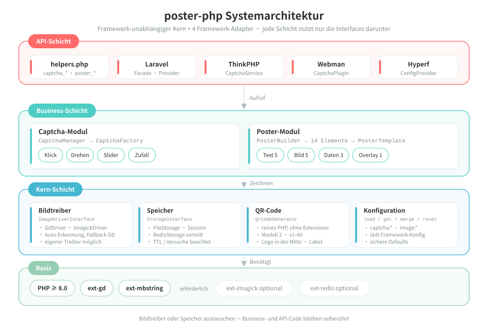
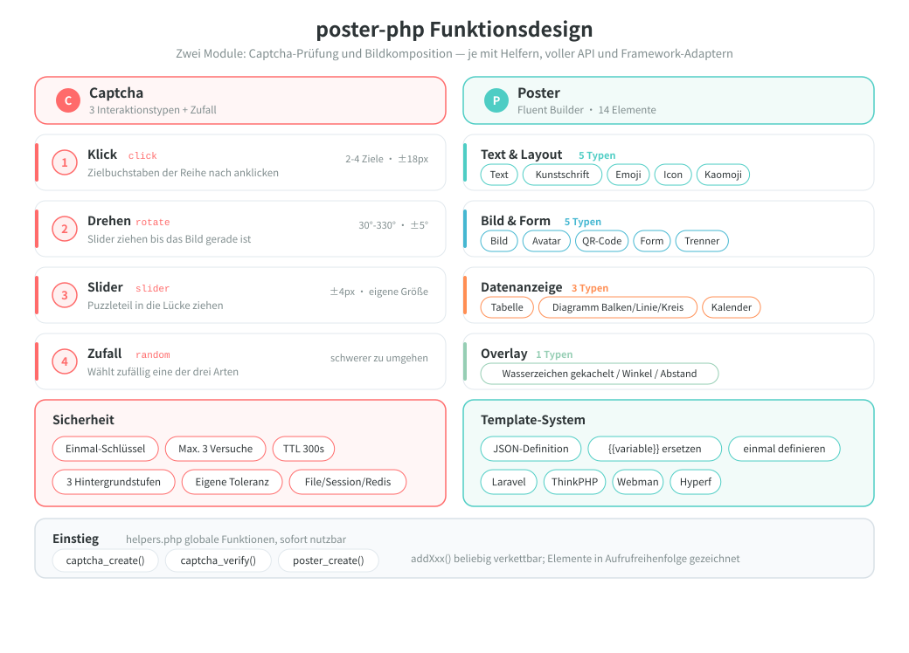
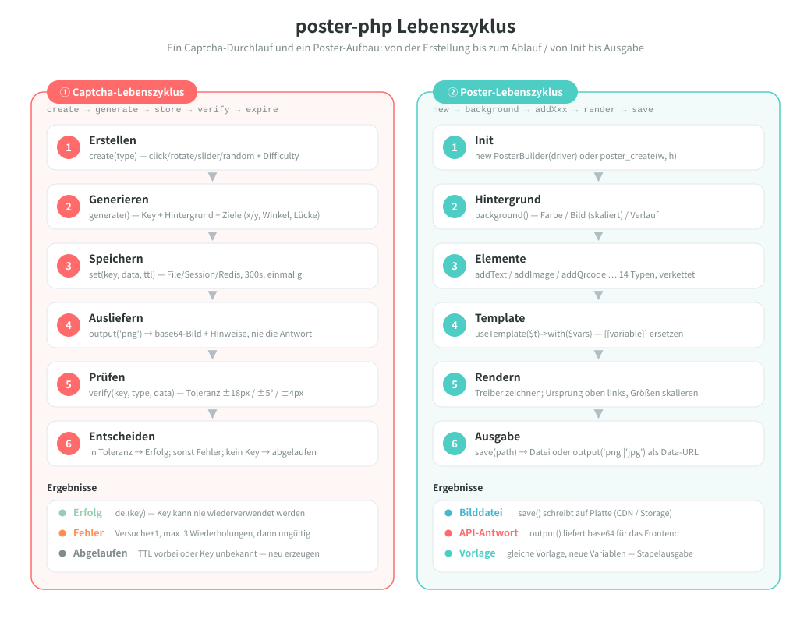

# poster-php

[中文](../../../README.md) | [English](../../../README_EN.md) | [日本語](../ja/README.md) | [한국어](../ko/README.md) | [Русский](../ru/README.md) | [Français](../fr/README.md) | [Español](../es/README.md) | [Português](../pt/README.md) | [हिन्दी](../hi/README.md) | [العربية](../ar/README.md) | [বাংলা](../bn/README.md) | [Bahasa Indonesia](../id/README.md) | Deutsch

<p align="center">
  
</p>

PHP-Toolkit für Bild-Captchas und Poster-Generierung — framework-unabhängiger Kern + Adapter für Laravel / ThinkPHP / Webman / Hyperf.

[Englische Dokumentation](../../../README_EN.md) | [Architektur-Dokumentation](../../../docs/architecture.md) | [Alle Sprachen](../README.md)

## Projektübersicht

poster-php ist ein PHP-Bild-Toolkit, das genau zwei Dinge tut — und zwar gut genug:

| Fähigkeit | Beschreibung |
|------|------|
| **Captcha** | Drei Mensch-Verifikationen (Klick / Drehen / Slider) plus Zufallsauswahl; Bilder und Antworten entstehen in reinem PHP, ohne Dienste von Drittanbietern |
| **Poster-Generierung** | Fluent-Builder-API mit 14 Elementtypen für Text, Bilder, QR-Codes, Tabellen, Diagramme, Kalender und weitere Layout-Aufgaben |
| **Framework-unabhängig** | Der Kern braucht nur PHP ≥ 8.0 + GD und lässt sich als normales Composer-Paket ohne Framework nutzen |
| **Sofort einsatzbereit** | 3 globale Hilfsfunktionen + 4 Framework-Adapter (Laravel / ThinkPHP / Webman / Hyperf) |
| **Austauschbar** | Bildtreiber (GD / ImageMagick) und Speicher-Backend (File / Session / Redis) sind Interface-Implementierungen und lassen sich nach Bedarf ersetzen |

> Das Projekt-Maskottchen **Posty** — ein Maskottchen aus Poster, QR-Karten-Element und Slider-Puzzle, das genau die beiden Kernfähigkeiten des Pakets abbildet: Bilder erzeugen und verifizieren. Es wird mitgeliefert ([`assets/pet.svg`](../../../assets/pet.svg) / `assets/pet.png`), lässt sich per `->addPet()` in ein Poster zeichnen und als Platzhalter für fehlende Bilder konfigurieren.

## Projektstruktur

```
poster-php/
├── src/                        # Kerncode: 64 PHP-Dateien / ca. 6093 Zeilen
│   ├── Captcha/                # Captcha-Modul: Interface + abstrakte Basisklasse + 3 Implementierungen + Factory + Manager
│   │                           #   + RateLimiter (Limitierung) / TrajectoryVerifier (Trajektorien-Prüfung)
│   ├── Poster/                 # Poster-Modul (Elements/ElementRegistry.php als zentrale Element-Registry)
│   │   ├── PosterBuilder.php   # Fluent Builder mit 14 addXxx()-Methoden
│   │   ├── PosterTemplate.php  # JSON-Vorlage → {{Variable}}-Ersetzung
│   │   └── Elements/           # 14 Element-Renderer + ElementInterface + abstrakte Basisklasse
│   ├── Drivers/                # Bildtreiber: ImageDriverInterface / GdDriver / ImagickDriver
│   ├── Storage/                # Speicher für Verifikationsdaten: File / Session / Redis / PSR-16-Cache
│   ├── Qrcode/                 # QR-Code-Generator in reinem PHP (Modell 2, v1-40, ohne Extensions)
│   ├── Adapters/               # Framework-Adapter: Laravel / ThinkPHP / Webman / Hyperf
│   ├── PosterConfig.php        # Konfiguration lesen (Defaults als Fallback + Merge der Framework-Konfig)
│   └── Installer.php           # kopiert die Konfigurationsdatei nach der Composer-Installation
├── config/
│   └── poster.php              # Standardkonfiguration (Captcha / Bildtreiber)
├── assets/
│   ├── backgrounds/            # 6 mitgelieferte Captcha-Hintergründe (400×250 PNG)
│   ├── pet.svg                 # Projekt-Maskottchen Posty (Vektorquelle)
│   └── pet.png                 # aus pet.svg gerastert: für addPet() und als Platzhalter
├── helpers.php                 # globale Funktionen: captcha_create / captcha_verify / poster_create
├── native.php                  # nativer PHP-Einstieg: nur require, kein Composer nötig
├── tests/                      # PHPUnit-Tests, 53 Dateien, Verzeichnisse wie in src/
├── examples/                   # direkt ausführbare Beispielskripte
├── docs/                       # Architekturdokument, Design- und Lebenszyklus-Diagramme (SVG), Spenden-QR-Codes
└── composer.json               # PSR-4: Erikwang2013\Poster\ → src/
```

## Architektur & Design

### Systemarchitektur

Geschichtete Abhängigkeiten: jede Schicht ruft nur die Interfaces darunter auf — Treiber oder Speicher lassen sich austauschen, ohne den Business-Code anzufassen.



### Funktionsdesign

Die beiden Module im Detail: vier Captcha-Interaktionen mit ihren Sicherheitsmerkmalen sowie 14 Poster-Elemente und das Template-System.



### Lebenszyklus

Der vollständige Ablauf einer Captcha-Prüfung (Erstellen → Generieren → Speichern → Ausliefern → Prüfen → Erfolg / Fehler / Abgelaufen) und eines Poster-Aufbaus (Init → Hintergrund → Elemente → Template → Rendern → Ausgabe).



## Funktionen

### Captcha (drei Verfahren + Zufallsauswahl)

| Typ | Beschreibung |
|------|------|
| Klick-Captcha `click` | Der Nutzer klickt die Zieltexte auf dem Bild der Reihe nach an |
| Dreh-Captcha `rotate` | Der Nutzer zieht den Slider, bis das Bild wieder gerade steht |
| Slider-Captcha `slider` | Der Nutzer zieht das Puzzleteil in die Lücke |
| Zufallsauswahl `random` | Wählt zufällig eines der drei Captchas |

### Poster-Generierung

Fluent-Builder-API mit 14 Elementtypen:

| Element | Methode | Beschreibung |
|------|------|------|
| Text | `addText()` | automatischer Umbruch, Ausrichtung, mehrzeilig |
| Bild | `addImage()` | Skalieren, Zuschneiden, runde Ecken, Schatten |
| Avatar | `addAvatar()` | runder Zuschnitt, Rahmen |
| QR-Code | `addQrcode()` | in reinem PHP erzeugt, Logo in der Mitte, Text darunter |
| Form | `addShape()` | Rechteck/Kreis/abgerundet, Füllung/Kontur |
| Trennlinie | `addLine()` | Farbe, Breite |
| Wasserzeichen | `addWatermark()` | gekachelter Text, Winkel, Abstand |
| Tabelle | `addTable()` | Kopfzeile, Zebrastreifen, Spaltenbreiten |
| Diagramm | `addChart()` | Balken- / Linien- / Kreisdiagramm |
| Kalender | `addCalendar()` | Monatskalender, hervorgehobene Tage, Notizen |
| Kunstschrift | `addArtisticText()` | Kontur / Schatten / Verlauf / Neon |
| Emoji | `addEmoji()` | farbige Emoji-Darstellung |
| Icon | `addIcon()` | FontAwesome-Icons |
| Kaomoji | `addEmoticon()` | japanische Kaomoji / eigene Emoticons |

## Installation

```bash
composer require erikwang2013/poster-php
```

Systemanforderungen: PHP >= 8.0, GD-Extension.

Optionale Extensions:
- `ext-imagick`: ImageMagick-Bildtreiber (bessere Performance, mehr Funktionen)
- `ext-redis`: Redis-Speicher für Captchas (verteilte Deployments)

### Ohne Composer (natives PHP)

Das gesamte Verzeichnis `poster-php/` ins Projekt legen und `native.php` direkt einbinden: Es registriert den PSR-4-Autoloader und lädt die globalen Funktionen — ganz ohne Composer und ohne Framework.

```php
require '/path/to/poster-php/native.php';   // Autoloader + globale Funktionen registrieren

$result  = captcha_create('click');
$builder = poster_create(750, 1334);
```

`native.php` kann mehrfach eingebunden werden und funktioniert neben Composer oder einem eigenen Autoloader des Projekts (bei doppelter Installation einfach `vendor/autoload.php` bevorzugen).

## Verwendung

### Captcha

#### 1. Klick-Captcha (ClickCaptcha)

Der Nutzer klickt die Zieltexte auf dem Bild der Reihe nach an (z. B. „树“, „鸟“, „花“) und weist sich so als Mensch aus.

```php
// über die Hilfsfunktion (framework-unabhängig)
$result = captcha_create('click', [
    'difficulty' => 'medium',    // 'easy'(2 Ziele) | 'medium'(3 Ziele) | 'hard'(4 Ziele)
    'background' => null,        // Pfad zu eigenem Hintergrundbild, null=programmatischer Verlauf (zufälliger Stil)
]);

// Rückgabewert
// $result = [
//     'key'   => 'abc123...',           // eindeutige ID der Prüfung, an das Frontend übergeben
//     'image' => 'data:image/png;base64,...', // Bild als base64
//     'extra' => [
//         'texts' => [
//             ['order' => 1, 'text' => '树'],
//             ['order' => 2, 'text' => '鸟'],
//             ['order' => 3, 'text' => '花'],
//         ],
//     ],
// ];

// Das Frontend zeigt die Hinweistexte in der Reihenfolge von order, der Nutzer klickt die passenden Stellen nacheinander an (Zielkoordinaten werden nicht zurückgegeben, nur serverseitig geprüft)
// Das Frontend sendet die Klick-Koordinaten des Nutzers [[x1,y1], [x2,y2], [x3,y3]]
$pass = captcha_verify($result['key'], 'click', [[120, 80], [200, 150], [310, 95]]);
// gibt true / false zurück, Toleranzradius 18px

// über den CaptchaManager (vollständige API)
use Erikwang2013\Poster\Captcha\CaptchaManager;
use Erikwang2013\Poster\Drivers\DriverFactory;
use Erikwang2013\Poster\Storage\FileStorage;

$manager = new CaptchaManager(DriverFactory::create(), new FileStorage());
$captcha = $manager->create('click')
    ->setDifficulty('hard')        // easy=2 Ziele | medium=3 Ziele | hard=4 Ziele
    ->setTargetType('text')        // 'text' Text | 'icon' Icon
    ->setWords(['猫', '狗', '鸟', '鱼']) // eigener Textpool (optional)
    ->setBackground('/path/to/bg.jpg');
$result = $captcha->generate();

$pass = $manager->verify($result['key'], [
    'type' => 'click',
    'data' => [[120, 80], [200, 150], [310, 95], [180, 60]],
]);
```

`setTargetType('icon')` ersetzt die Zieltexte durch programmatisch erzeugte Vektorformen (11 Stück, mit GD-Grundelementen gezeichnet, ohne Bildmaterial):
jeder Eintrag in `extra['texts']` enthält zusätzlich ein `thumb` (das kleine base64-Bild der Form) als Klick-Hinweis fürs Frontend; geprüft werden weiterhin die Koordinaten.

#### 2. Dreh-Captcha (RotateCaptcha)

Das System dreht das Bild zufällig um 30°~330°, der Nutzer zieht den Slider, bis das Bild wieder gerade steht.

```php
// über die Hilfsfunktion
$result = captcha_create('rotate');
// $result['extra'] enthält den Winkel nicht (er ist die Antwort), das Frontend zeigt nur das gedrehte Bild

$pass = captcha_verify($result['key'], 'rotate', 185);  // vom Nutzer gedrehter Winkel, Toleranz ±5°

// über den CaptchaManager
$captcha = $manager->create('rotate')
    ->setSize(200)                 // Kreisdurchmesser 60-400 (Standard 200)
    ->setAngleRange(45, 315)       // eigener Bereich für den Drehwinkel
    ->generate();
```

#### 3. Slider-Captcha (SliderCaptcha)

Das System schneidet ein Puzzleteil aus dem Hintergrund und verschiebt es, der Nutzer zieht das Puzzle an die Lücke.

```php
// über die Hilfsfunktion
$result = captcha_create('slider');
// $result = [
//     'image' => '...',              // Hintergrundbild mit Lücke
//     'extra' => [
//         'puzzle'   => '...',        // Bild des Puzzleteils
//         'puzzle_w' => 50,           // Breite des Puzzleteils
//         'puzzle_h' => 50,           // Höhe des Puzzleteils
//     ],
// ];

$pass = captcha_verify($result['key'], 'slider', 173);  // x-Pixel der Nutzerbewegung, Toleranz ±4px
```

#### 4. Zufallsauswahl (RandomCaptcha)

Das System wählt zufällig eines von click / rotate / slider — das erschwert das Umgehen.

```php
// über die Hilfsfunktion — eine Zeile für ein zufälliges Captcha
$result = captcha_create('random');
// $result['type'] liefert den tatsächlich gewählten Typ: 'click' | 'rotate' | 'slider'

// Das Frontend rendert anhand von type die passende Interaktion
switch ($result['type']) {
    case 'click':
        // Klick-Komponente rendern: Bild anzeigen, der Nutzer klickt die Hinweistexte aus extra.texts der Reihe nach an
        break;
    case 'rotate':
        // Dreh-Komponente rendern: Bild anzeigen, der Nutzer dreht per Drag
        break;
    case 'slider':
        // Slider-Komponente rendern: Bild mit Lücke + Puzzleteil anzeigen
        break;
}

// Beim Prüfen den tatsächlichen Typ und die Nutzerdaten übergeben
$pass = captcha_verify($result['key'], $result['type'], $userData);
// click: $userData = [[x1,y1],[x2,y2],...]
// rotate: $userData = 185 (Winkel)
// slider: $userData = 173 (Pixel)

// über den CaptchaManager
$captcha = $manager->create('random')->generate();
$pass = $manager->verify($captcha['key'], [
    'type' => $captcha['type'],
    'data' => $userData,
]);
```

#### Sicherheitsmerkmale

| Merkmal | Beschreibung |
|------|------|
| Einmalig | Nach Erfolg oder Überschreiten der maximalen Versuche wird der key gelöscht |
| Brute-Force-Schutz | Standardmäßig höchstens 3 Prüfungen (konfigurierbar) |
| Gültigkeit | Standardmäßig 300 Sekunden (konfigurierbar) |
| Zufälligkeit | Hintergrundfarben, Rauschen und Zielpositionen sind bei jeder Erzeugung zufällig; Klick-Ziele bekommen je Ziel einen zufälligen Farbton und Drehwinkel |
| Limit je Sitzung | Fenster-Limit über alle keys hinweg (standardmäßig 30 Aufrufe in 60 Sekunden); stoppt das Raten mit immer neuen keys |
| Verhaltens-Trajektorie | optional (standardmäßig aus): prüft Punktzahl, Dauer und Linearität der Ziehbewegung; ein Skript, das die Antwort direkt per POST schickt, wird abgelehnt |
| Hintergrund-Design | programmatische Verlaufs-Hintergründe in drei Stilen (minimal/lebhaft/natürlich) im Zufallswechsel; Standard-Verzeichnis für Hintergrundbilder konfigurierbar |
| Mindest-Fläche | Ist der Hintergrund zu klein, wird ein Fehler geworfen statt zu degradieren (Klick-Captcha mindestens 120×120, der Slider muss 4×2 Puzzleteile aufnehmen) |

#### Trajektorien-Prüfung (optional)

Standardmäßig aus (um Touch-Geräte und Barrierefreiheit nicht zu beeinträchtigen). Ist sie aktiv, müssen `slider` / `rotate` die Ziehbewegung vom Frontend mitschicken; der Server prüft Punktzahl, Dauer und Linearität der Bewegung:

```php
// config/poster.php
'captcha' => [
    'trajectory' => [
        'enabled'      => true,
        'min_points'   => 4,      // minimale Anzahl Messpunkte
        'min_duration' => 300,    // kürzeste Dauer (Millisekunden)
        'max_duration' => 5000,   // längste Dauer (Millisekunden)
        'max_linearity' => 0.99,  // höhere Linearität gilt als Maschine (ein Skript zieht eine Gerade)
    ],
],

// Übergabe vom Frontend: die alte Schreibweise mit einer Zahl bleibt kompatibel
captcha_verify($key, 'slider', 173);
// mit aktivierter Trajektorien-Prüfung muss die Bewegung mitgeschickt werden
captcha_verify($key, 'slider', ['x' => 173, 'trail' => [[12, 3, 0], [40, 9, 22], /* … */], 'duration' => 1200]);
```

#### Hintergrundbilder konfigurieren

Captcha-Hintergründe haben drei Stufen:

1. **Einzelnes Bild** — per `setBackground('/path/to/bg.jpg')` festgelegt
2. **Bildverzeichnis** — `captcha.background_dir` auf ein Bildverzeichnis zeigen lassen, standardmäßig `assets/backgrounds/` (6 mitgelieferte Verlaufs-Hintergründe)
3. **Programmatische Erzeugung** — aktiv, wenn `background_dir` auf `null` gesetzt ist, drei Stile im Zufallswechsel

```php
// Weg 1: ein einzelnes Bild im Code festlegen
$captcha = $manager->create('click')->setBackground('/path/to/bg.jpg');

// Weg 2: Standard-Hintergrundbilder ersetzen (config/poster.php)
'captcha' => [
    // eigene Hintergrundbilder in dieses Verzeichnis legen, sie werden automatisch zufällig gewählt
    'background_dir' => '/path/to/my-backgrounds',
    // auf null setzen, dann werden programmatische Verlaufs-Hintergründe verwendet
    // 'background_dir' => null,
],

// Weg 3: nichts tun, die eingebauten Standard-Hintergrundbilder (assets/backgrounds/) werden verwendet
```

**Standard-Hintergrundbilder**: `assets/backgrounds/` enthält 6 Verlaufs-Hintergründe als 400×250 PNG, Stile: Blau-Violett, Sonnenuntergang, Frisches Grün, Dunkel, Pastell, Ozeanblau.

Drei programmatische Stile:

| Stil | Beschreibung |
|------|------|
| `minimal` minimal | sanfter Verlauf + große Kreise mit niedriger Deckkraft + geometrische Linien + wenige feine Punkte |
| `vibrant` lebhaft | heller Verlauf + farbige Kreise in verschiedenen Größen + Rauschen mittlerer Dichte |
| `natural` natürlich | warmer Verlauf + unregelmäßige Farbflächen als Papierstruktur + feine dichte Punkte |

### Poster-Generierung

#### Grundlagen

```php
use Erikwang2013\Poster\Poster\PosterBuilder;
use Erikwang2013\Poster\Drivers\DriverFactory;

// über die Hilfsfunktion
$builder = poster_create(750, 1334);  // Breite×Höhe

// oder direkt instanziieren
$builder = new PosterBuilder(DriverFactory::create());
$builder->width(750)->height(1334);

// Hintergrund festlegen
$builder->background('#FFFFFF');                            // einfarbiger Hintergrund
$builder->background('/path/to/bg.jpg');                    // Bildhintergrund (automatisch skaliert)
$builder->backgroundGradient('#FF6B6B', '#FF8E53', 'vertical'); // Verlaufs-Hintergrund
                                                            // Richtung: vertical | horizontal

// Ausgabe
$builder->save('/output/poster.jpg', 90);  // in eine Datei speichern (Pfad, Qualität 0-100)
                                           // Format wird aus der Endung abgeleitet: jpg/jpeg/png/webp/gif
                                           // ohne Qualitätsangabe liest JPEG poster.jpeg_quality, PNG poster.png_compression
$dataUrl = $builder->output('png', 90);    // base64-Data-URL holen
```

#### Text `addText()`

```php
$builder->addText('新品首发', [
    'x'        => 80,              // X-Koordinate
    'y'        => 120,             // Y-Koordinate (Grundlinie)
    'size'     => 48,              // Schriftgröße
    'color'    => '#333333',       // Farbe
    'font'     => '/path/to/font.ttf', // Schriftdatei, null=GD-intern
    'align'    => 'center',        // left | center | right
    'maxWidth' => 600,             // maximale Breite (automatischer Umbruch)
    'lineHeight' => 72,            // Zeilenhöhe
    'angle'    => 0,               // Drehwinkel
]);
```

#### Bild `addImage()`

```php
$builder->addImage('/path/to/product.jpg', [
    'x'      => 75,
    'y'      => 280,
    'width'  => 600,              // Renderbreite (automatisch skaliert)
    'height' => 600,              // Renderhöhe
    'radius' => 12,               // Radius der runden Ecken
    'shadow' => [                 // Schatten (optional)
        'color'    => '#00000033',
        'offsetX'  => 4,
        'offsetY'  => 4,
        'blur'     => 10,
    ],
]);
```

#### Avatar `addAvatar()`

```php
$builder->addAvatar('/path/to/avatar.jpg', [
    'x'      => 80,
    'y'      => 60,
    'size'   => 120,              // Avatar-Größe (quadratisch)
    'border' => '#FF6B6B',        // Rahmenfarbe (optional)
]);
```

#### QR-Code `addQrcode()`

```php
$builder->addQrcode('https://example.com/page/123', [
    'x'     => 275,
    'y'     => 1050,
    'size'  => 200,               // QR-Code-Größe
    'level' => 'H',               // Fehlerkorrekturstufe L | M | Q | H
    'logo'  => '/path/to/logo.png', // Logo in der Mitte (optional)
    'label' => '扫码查看详情',      // Text darunter (optional)
    'label_size'  => 14,
    'label_color' => '#999999',
]);
```

Überschreitet der Inhalt die Kapazität der Version (z. B. ab etwa 1273 Bytes bei Stufe H), wird eine `InvalidArgumentException` geworfen, statt still einen nicht scanbaren Code zu erzeugen.

#### Form `addShape()`

```php
// Rechteck
$builder->addShape('rect', [
    'x' => 0, 'y' => 0, 'width' => 750, 'height' => 60,
    'color'  => '#FF6B6B',
    'filled' => true,             // true=Füllung false=Kontur
    'radius' => 8,                // Radius der runden Ecken
    'opacity' => 0.8,             // Deckkraft 0-1
]);

// Kreis
$builder->addShape('circle', [
    'x' => 100, 'y' => 100, 'width' => 80, 'height' => 80,
    'color' => '#4ECDC4',
]);
```

#### Trennlinie `addLine()`

```php
$builder->addLine([
    'x1' => 75, 'y1' => 800,
    'x2' => 675, 'y2' => 800,
    'color' => '#EEEEEE',
    'width' => 1,
]);
```

#### Wasserzeichen `addWatermark()`

```php
$builder->addWatermark('CONFIDENTIAL', [
    'size'    => 24,
    'color'   => '#00000020',     // halbtransparent
    'font'    => '/font.ttf',
    'angle'   => 30,              // Neigungswinkel
    'spacing' => 200,             // Abstand
]);
```

#### Tabelle `addTable()`

```php
$builder->addTable([
    'x'      => 50,
    'y'      => 800,
    'width'  => 650,
    'columns' => [150, 350, 150], // Spaltenbreiten
    'header'  => ['序号', '项目', '价格'],
    'rows'    => [
        ['1', '商品A', '¥99'],
        ['2', '商品B', '¥199'],
        ['3', '商品C', '¥299'],
    ],
    'headerBg'     => '#333333',
    'headerColor'  => '#FFFFFF',
    'rowBg'        => ['#FFFFFF', '#F5F5F5'], // Zebrastreifen
    'rowColor'     => '#333333',
    'fontSize'     => 24,
    'cellPadding'  => 10,
]);
```

#### Diagramm `addChart()`

```php
// Balkendiagramm
$builder->addChart('bar', [
    ['label' => '一月', 'value' => 120],
    ['label' => '二月', 'value' => 200],
    ['label' => '三月', 'value' => 150],
    ['label' => '四月', 'value' => 300],
], [
    'x' => 50, 'y' => 100, 'width' => 650, 'height' => 400,
    'colors' => ['#FF6B6B', '#4ECDC4', '#45B7D1', '#96CEB4'],
]);

// Liniendiagramm
$builder->addChart('line', [
    ['label' => '周一', 'value' => 10],
    ['label' => '周二', 'value' => 35],
    ['label' => '周三', 'value' => 25],
    ['label' => '周四', 'value' => 45],
    ['label' => '周五', 'value' => 30],
], [
    'x' => 50, 'y' => 100, 'width' => 650, 'height' => 400,
    'colors' => ['#FF6B6B'],
]);

// Kreisdiagramm
$builder->addChart('pie', [
    ['label' => '电商', 'value' => 45],
    ['label' => '社交', 'value' => 25],
    ['label' => '搜索', 'value' => 15],
    ['label' => '其他', 'value' => 15],
], [
    'x' => 75, 'y' => 100, 'width' => 600, 'height' => 600,
    'colors' => ['#FF6B6B', '#4ECDC4', '#45B7D1', '#96CEB4'],
]);
```

#### Kalender `addCalendar()`

```php
$builder->addCalendar([
    'x'     => 50,
    'y'     => 200,
    'year'  => 2026,
    'month' => 5,                   // 1-12
    'cellSize'    => 60,            // Zellgröße
    'startDay'    => 0,             // 0=Sonntag 1=Montag
    'title'       => '2026年5月',    // Titel (standardmäßig automatisch erzeugt)
    'highlights'  => [              // hervorgehobene Tage
        '2026-05-01' => ['bg' => '#FF6B6B', 'text' => '劳动节'],
        '2026-05-16' => ['bg' => '#FFEAA7', 'text' => '今天'],
    ],
    'headerBg'    => '#333333',     // Hintergrund der Titelleiste
    'headerColor' => '#FFFFFF',     // Textfarbe der Titelleiste
    'cellBg'      => '#FFFFFF',     // Zellenhintergrund
    'cellBorder'  => '#DDDDDD',     // Zellenrahmen
    'todayBg'     => '#FF6B6B',     // Hintergrundfarbe für heute
    'highlightBg' => '#FFF3CD',    // Standard-Hintergrundfarbe für Hervorhebungen
    'textColor'   => '#333333',     // Textfarbe der Datumsangaben
    'dimColor'    => '#CCCCCC',     // Farbe für andere Monate / leere Zellen
]);
```

#### Kunstschrift `addArtisticText()`

```php
// Kontur-Effekt
$builder->addArtisticText('SALE', 'stroke', [
    'x' => 80, 'y' => 120, 'size' => 72,
    'color'       => '#FF6B6B',    // Füllfarbe
    'strokeColor' => '#000000',    // Konturfarbe
    'strokeWidth' => 3,            // Konturbreite
]);

// Schatten-Effekt
$builder->addArtisticText('新品', 'shadow', [
    'x' => 80, 'y' => 120, 'size' => 48,
    'color'         => '#333333',
    'shadowColor'   => '#00000033',
    'shadowOffsetX' => 4,
    'shadowOffsetY' => 4,
]);

// Verlaufseffekt
$builder->addArtisticText('VIP', 'gradient', [
    'x' => 80, 'y' => 120, 'size' => 60,
    'color'  => '#FF6B6B',         // obere Farbe
    'color2' => '#FF8E53',         // untere Farbe
]);

// Neon-Leuchteffekt
$builder->addArtisticText('HOT', 'neon', [
    'x' => 80, 'y' => 120, 'size' => 56,
    'color'     => '#FF1493',
    'glowColor' => '#FF1493',
]);
```

#### Emoji `addEmoji()`

```php
// Emoji-Zeichen direkt verwenden
$builder->addEmoji('😀', ['x' => 100, 'y' => 100, 'size' => 64]);
$builder->addEmoji('🎉', ['x' => 180, 'y' => 100, 'size' => 64]);

// Unicode-Codepunkt verwenden
$builder->addEmoji('', [
    'x' => 100, 'y' => 100, 'size' => 64,
    'codepoint' => 'U+1F600',      // entspricht 😀
]);

// Emoji-Schrift angeben (System muss Farbschriften unterstützen)
$builder->addEmoji('😀', [
    'x' => 100, 'y' => 100, 'size' => 64,
    'font' => '/System/Library/Fonts/Apple Color Emoji.ttc',
]);
```

Das System erkennt die Pfade der Emoji-Schriften unter macOS / Linux / Windows automatisch.

> Hinweis: Ob ein Emoji gezeichnet werden kann, hängt von der Schrift selbst ab. Das unter Linux verbreitete `NotoColorEmoji.ttf` ist eine CBDT-Bitmap-Farbschrift, die GD über FreeType nicht laden kann (`imagettftext()` schlägt direkt fehl); das Emoji wird dann nicht gezeichnet. Verwende stattdessen eine Emoji-Schrift, die FreeType im System laden kann.

#### Icon-Schrift `addIcon()`

```php
// eingebaute FontAwesome-Iconnamen verwenden (Icon-Schriftdatei erforderlich)
$builder->addIcon('heart', [
    'x' => 20, 'y' => 40, 'size' => 32,
    'color' => '#E74C3C',
    'font'  => '/path/to/fa-solid-900.ttf',  // FontAwesome-TTF muss angegeben werden
]);

$builder->addIcon('star',  ['x' => 60, 'y' => 40, 'color' => '#F39C12', 'font' => '/path/to/fa-solid-900.ttf']);
$builder->addIcon('check', ['x' => 100, 'y' => 40, 'color' => '#27AE60', 'font' => '/path/to/fa-solid-900.ttf']);

// eigenen Unicode-Codepunkt verwenden
$builder->addIcon('', [
    'x' => 20, 'y' => 40, 'size' => 32,
    'codepoint' => '\\u{F3C5}',    // map-marker
    'color' => '#E74C3C',
    'font' => '/path/to/fa-solid-900.ttf',
]);

// Liste der eingebauten Iconnamen
// heart, star, user, clock, home, cog, check, times, search,
// envelope, phone, camera, play, pause, shopping-cart, tag,
// map-marker, calendar, comment, share, download, upload,
// lock, globe, link, image, music, video, bell, bookmark,
// thumbs-up, eye, trash, edit, plus, minus, arrow-*,
// location-dot, fire, gift, rocket
```

#### Kaomoji `addEmoticon()`

```php
// eingebaute Kaomoji verwenden
$builder->addEmoticon('happy', ['x' => 20, 'y' => 40, 'size' => 24]);
// gerendert: (｡•̀ᴗ-)✧

$builder->addEmoticon('love',  ['x' => 20, 'y' => 80, 'size' => 24]);
// gerendert: (♡°▽°♡)

$builder->addEmoticon('cry',   ['x' => 20, 'y' => 120, 'size' => 24]);
// gerendert: (╥﹏╥)

// eigener Emoticon-Text
$builder->addEmoticon('', [
    'x' => 20, 'y' => 40, 'size' => 24,
    'text' => '(╯°□°）╯︵ ┻━┻',    // eigener Text
    'color' => '#333333',
]);

// eingebaute Kaomoji-Ausdrücke
// happy, love, cry, angry, surprised, cool, sleepy,
// wave, think, shrug, tableflip, lenny
```

#### Projekt-Maskottchen `addPet()`

Das eingebaute Maskottchen Posty (`assets/pet.png`, aus `assets/pet.svg` gerastert) lässt sich direkt in ein Poster zeichnen — äquivalent zu `addImage(PosterBuilder::petPath(), $options)`:

```php
$builder->addPet([
    'x'      => 555,
    'y'      => 140,
    'width'  => 150,
    'height' => 130,   // auf die angegebene Breite/Höhe skalieren, Verhältnis 600:520 beibehalten
    'radius' => 0,     // unterstützt alle Optionen von addImage()
]);

// den Pfad auch separat verwenden (z. B. als Logo in der Mitte eines QR-Codes)
$logo = PosterBuilder::petPath();
```

**Platzhalter für fehlende Bilder**: `addImage()` / `addAvatar()` überspringen nicht vorhandene Dateien standardmäßig und zeichnen nichts. Zeigt `poster.placeholder` auf das Maskottchen, wird an der fehlenden Stelle Posty gezeichnet — so ist sofort zu sehen, welches Bild fehlt:

```php
// config/poster.php
'poster' => [
    'placeholder' => dirname(__DIR__) . '/assets/pet.png',
],
```

### Template-System

```php
use Erikwang2013\Poster\Poster\PosterTemplate;

// Vorlage definieren (JSON-serialisierbar)
$template = PosterTemplate::fromConfig([
    'width'  => 750,
    'height' => 1334,
    'elements' => [
        ['type' => 'shape', 'color' => '#FF6B6B', 'x' => 0, 'y' => 0, 'width' => 750, 'height' => 300],
        ['type' => 'text', 'text' => '{{title}}', 'x' => 80, 'y' => 100, 'size' => 48, 'color' => '#FFFFFF'],
        ['type' => 'text', 'text' => '{{subtitle}}', 'x' => 80, 'y' => 180, 'size' => 28, 'color' => '#FFE0E0'],
        ['type' => 'image', 'src' => '{{cover}}', 'x' => 75, 'y' => 350, 'width' => 600, 'height' => 600, 'radius' => 12],
        ['type' => 'qrcode', 'content' => '{{url}}', 'x' => 275, 'y' => 1050, 'size' => 200, 'label' => '扫码查看详情'],
    ],
]);

// Vorlage mit Variablen rendern
$builder->useTemplate($template)->with([
    'title'    => '新品首发',
    'subtitle' => '限时特惠 · 买一送一',
    'cover'    => '/path/to/product.jpg',
    'url'      => 'https://m.example.com/product/123',
])->save('/output/poster.jpg');

// von der Vorlage unterstützte Elementtypen: text, image, qrcode, avatar, shape, line, watermark, table,
//                      chart, calendar, artistic-text, emoji, icon, emoticon
```

`useTemplate()` **ersetzt** standardmäßig die bisherigen `addXxx()`-Elemente (die ursprüngliche Semantik bleibt erhalten); für „Vorlage als Basis + darüber eigene Elemente“ den zweiten Parameter nutzen:

```php
$builder->replaceElements(false)->useTemplate($template)->with($vars)->addPet(['x' => 20, 'y' => 20, 'width' => 80]);

// Rückwärts-Export: den aktuellen builder (oder ein einzelnes Element) in eine Vorlagenstruktur umwandeln, die wieder an fromConfig() übergeben werden kann
$config = $builder->toArray();          // ['width'=>…, 'height'=>…, 'elements'=>[…]]
$template2 = PosterTemplate::fromConfig($config);   // Export → erneuter Import, Struktur bleibt gleich

// Neue Elementtypen wirken in Builder und Vorlage, sobald sie einmal in der ElementRegistry registriert sind
$builder->add('text', ['text' => 'hello', 'x' => 10, 'y' => 30, 'size' => 20]);
```

> Achtung: `AbstractElement::toArray()` liefert seit dieser Version „kurzer Typname + flache Optionen“ (vorher `['type' => Klassenname, 'options' => [...]]`), damit die Struktur verlustfrei mit der Vorlage hin- und hergereicht werden kann.

## Framework-Integration

### Laravel

```php
use Erikwang2013\Poster\Adapters\Laravel\Facades\Captcha;
use Erikwang2013\Poster\Adapters\Laravel\Facades\Poster;

$result = Captcha::create('click')->generate();
Poster::width(750)->height(1334)->background('#FFF')->save('poster.jpg');
```

```php
// Ist captcha.route.enabled = true in config/poster.php gesetzt, registriert der Adapter den Bild-Endpunkt:
//   GET /captcha/{key} → liefert direkt PNG (Content-Type: image/png, Cache-Control: no-store)
// Das Frontend nutzt einfach die URL, base64 entfällt (33 % kleiner und von Browser/CDN cachebar)
$result = Captcha::create('click')->generate();
// $result['image'] ist weiterhin eine data URI; $result['url'] ist eine Adresse für 

// Formular-Validierung: der Regelname ist captcha, der Parameter ist der image key
$request->validate([
    'captcha_key'  => 'required|string',
    'captcha_code' => 'required|captcha:captcha_key',
]);
```

```bash
php artisan vendor:publish --tag=poster-config
```

### ThinkPHP

`config/web.php`:
```php
'services' => [
    Erikwang2013\Poster\Adapters\ThinkPHP\CaptchaService::class,
    Erikwang2013\Poster\Adapters\ThinkPHP\PosterService::class,
],
```

### Webman

`config/bootstrap.php`:
```php
return [
    Erikwang2013\Poster\Adapters\Webman\CaptchaPlugin::class,
    Erikwang2013\Poster\Adapters\Webman\PosterPlugin::class,
];
```

### Hyperf

Die Registrierung erfolgt automatisch über den ConfigProvider.

## Konfiguration

Nach `composer require` wird `config/poster.php` automatisch in das `config/`-Verzeichnis des Projekts kopiert (vorhandene Dateien werden übersprungen). Kompatibel mit Laravel / ThinkPHP / Webman (`config/poster.php`) und Hyperf (`config/autoload/poster.php`).

Wichtige Optionen:

| Option | Standardwert | Beschreibung |
|--------|--------|------|
| `captcha.default_type` | `random` | Standard-Captcha-Typ: `click` / `rotate` / `slider` / `random` |
| `captcha.default_difficulty` | `medium` | Standard-Schwierigkeit: `easy` / `medium` / `hard` |
| `captcha.click_words` | `[合,家,欢,...]` | Textpool für das Klick-Captcha, anpassbar |
| `captcha.background_dir` | `assets/backgrounds/` | Verzeichnis der Hintergrundbilder; bei `null` wird programmatisch erzeugt |
| `captcha.ttl` | `300` | Gültigkeit des Captchas (Sekunden) |
| `captcha.max_attempts` | `3` | maximale Anzahl der Prüfungen |
| `captcha.tolerance` | `{click:18,rotate:5,slider:4}` | Toleranzen je Typ |
| `image.driver` | `auto` | Bildtreiber: `auto` / `gd` / `imagick` |
| `poster.placeholder` | `null` | Pfad zum Platzhalterbild für fehlende Bilder, bei `null` wird nichts gezeichnet; mit dem Maskottchen-Pfad wird an fehlenden Stellen Posty gezeichnet |
| `captcha.rate_limit` | `{max:30,window:60}` | Fenster-Limitierung je Sitzung/Konto; als Identität dient standardmäßig die session_id, ohne Sitzung die Client-IP |
| `captcha.trajectory` | `{enabled:false,…}` | Trajektorien-Prüfung (standardmäßig aus) |
| `captcha.cache.pool` | `null` | PSR-16-Pool-Objekt (bei `storage=cache`), alternativ zur Laufzeit `StorageFactory::setPsr16Pool()` |
| `captcha.route` | `{enabled:false,path:'/captcha'}` | Laravel-Adapter: registriert den Bild-Endpunkt `GET {path}/{key}`, der direkt PNG liefert |

## Open Source ist nicht einfach — Unterstützung willkommen

| WeChat | Alipay |
|:---:|:---:|
|  |  |

---

## License

MIT License — Copyright (c) 2026 erik <erik@erik.xyz> — https://erik.xyz
