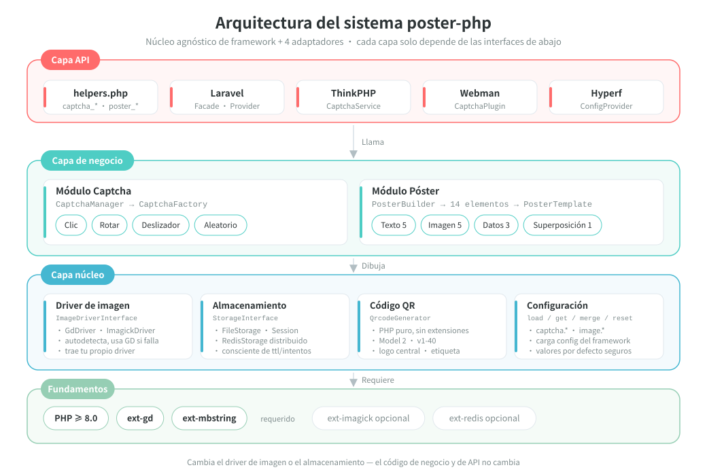
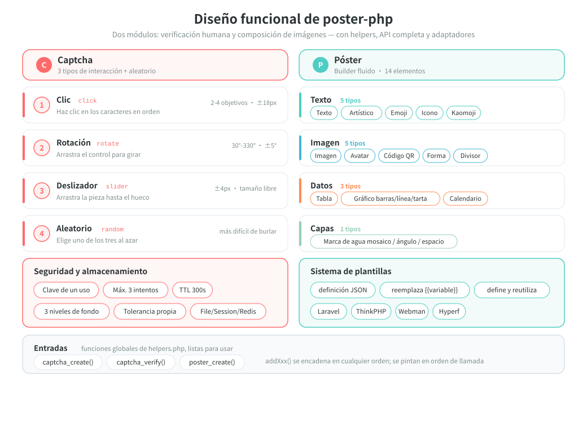
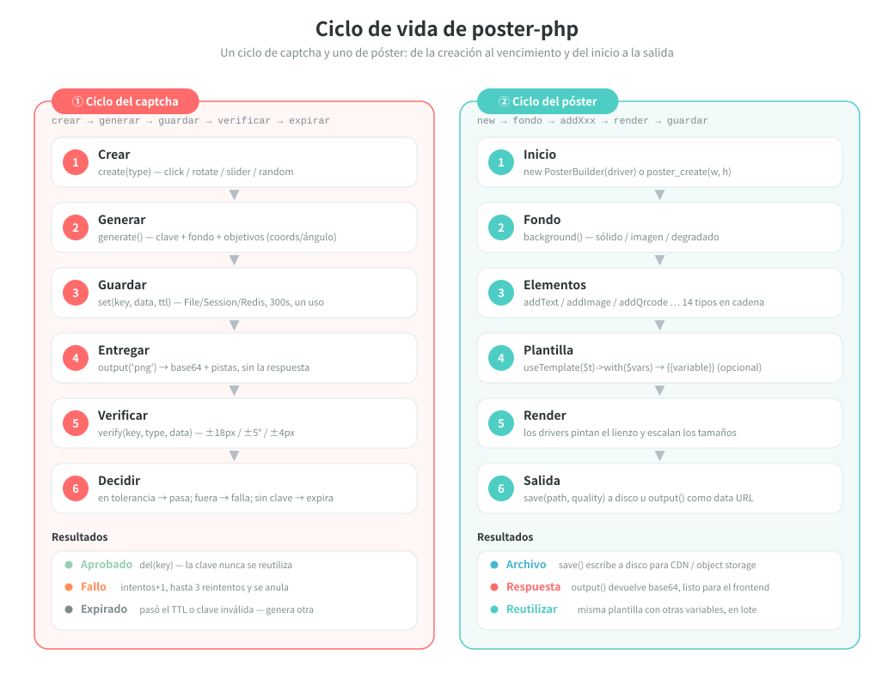

# poster-php

[中文](../../../README.md) | [English](../../../README_EN.md) | [日本語](../ja/README.md) | [한국어](../ko/README.md) | [Русский](../ru/README.md) | [Deutsch](../de/README.md) | [Français](../fr/README.md) | Español | [Português](../pt/README.md) | [हिन्दी](../hi/README.md) | [العربية](../ar/README.md) | [বাংলা](../bn/README.md) | [Bahasa Indonesia](../id/README.md)

<p align="center">
  
</p>

Kit de herramientas PHP para captchas de imagen y generación de pósteres — núcleo agnóstico de framework + adaptadores para Laravel / ThinkPHP / Webman / Hyperf.

[Documentación en inglés](../../../README_EN.md) | [Documento de arquitectura](../../../docs/architecture.md)

## Descripción general

poster-php es una librería de imágenes en PHP que hace exactamente dos cosas, y las hace bien:

| Capacidad | Descripción |
|------|------|
| **Captcha** | Tres verificaciones humanas (clic / rotación / deslizador) más selección aleatoria; genera la imagen y la respuesta en PHP puro, sin depender de servicios de terceros |
| **Generación de pósteres** | API Builder encadenada con 14 tipos de elementos que cubren texto, imágenes, códigos QR, tablas, gráficos, calendario y otras necesidades de maquetación |
| **Agnóstico de framework** | El núcleo solo necesita PHP ≥ 8.0 + GD y se puede usar como un paquete Composer normal, sin framework |
| **Listo para usar** | 3 funciones auxiliares globales + 4 adaptadores de framework (Laravel / ThinkPHP / Webman / Hyperf) |
| **Intercambiable** | El driver de imagen (GD / ImageMagick) y el backend de almacenamiento (File / Session / Redis) son implementaciones de interfaces, reemplazables según necesidad |

> La mascota del proyecto, **Posty** — un personaje formado por el propio póster, una tarjeta de código QR y una pieza de rompecabezas deslizante, que corresponde justo a las dos grandes capacidades de este paquete: generar imágenes y verificar. Se distribuye con el paquete ([`assets/pet.svg`](../../../assets/pet.svg) / `assets/pet.png`), se puede dibujar en un póster con `->addPet()` y también configurar como imagen de relleno cuando falta una imagen.

## Estructura del proyecto

```
poster-php/
├── src/                        # Código principal: 56 archivos PHP / unas 4250 líneas
│   ├── Captcha/                # Módulo captcha: interfaz + clase base abstracta + 3 implementaciones + fábrica + gestor
│   ├── Poster/                 # Módulo póster
│   │   ├── PosterBuilder.php   # Builder encadenado con 14 métodos addXxx()
│   │   ├── PosterTemplate.php  # Plantilla JSON → sustitución de {{variable}}
│   │   └── Elements/           # 14 renderizadores de elementos + ElementInterface + clase base abstracta
│   ├── Drivers/                # Drivers de imagen: ImageDriverInterface / GdDriver / ImagickDriver
│   ├── Storage/                # Almacenamiento de datos de verificación: File / Session / Redis
│   ├── Qrcode/                 # Generador de códigos QR en PHP puro (Model 2, v1-40, sin extensiones)
│   ├── Adapters/               # Adaptadores de framework: Laravel / ThinkPHP / Webman / Hyperf
│   ├── PosterConfig.php        # Lectura de configuración (valores por defecto + fusión con la config del framework)
│   └── Installer.php           # copia el archivo de configuración tras instalar con composer
├── config/
│   └── poster.php              # Configuración por defecto (captcha / driver de imagen)
├── assets/
│   ├── backgrounds/            # 6 imágenes de fondo de captcha incluidas (PNG de 400×250)
│   ├── pet.svg                 # Mascota del proyecto Posty (archivo vectorial original)
│   └── pet.png                 # rasterizado desde pet.svg: lo usan addPet() y el relleno de imágenes faltantes
├── helpers.php                 # Funciones globales: captcha_create / captcha_verify / poster_create
├── tests/                      # Pruebas PHPUnit, 41 archivos, con la misma estructura de directorios que src/
├── examples/                   # Scripts de ejemplo ejecutables directamente
├── docs/                       # Documento de arquitectura, diagramas de diseño y ciclo de vida (SVG), códigos de donación
└── composer.json               # PSR-4: Erikwang2013\Poster\ → src/
```

## Arquitectura y diseño

### Diseño de la arquitectura del sistema

Dependencias por capas: cada capa solo llama a las interfaces de la capa inferior, así que al reemplazar el driver o el almacenamiento el código de negocio no cambia nada.



### Diseño funcional

Desglose funcional de los dos módulos: las cuatro interacciones del captcha y sus características de seguridad, y los 14 elementos del póster con su sistema de plantillas.



### Ciclo de vida

La ruta completa de una verificación de captcha (crear → generar → guardar → entregar → verificar → aprobado / fallo / expirado) y de la generación de un póster (inicio → fondo → elementos → plantilla → render → salida).



## Funciones

### Captcha (tres métodos + selección aleatoria)

| Tipo | Descripción |
|------|------|
| Captcha de clic `click` | El usuario hace clic en los textos objetivo de la imagen en orden |
| Captcha de rotación `rotate` | El usuario arrastra el control deslizante hasta enderezar la imagen |
| Captcha de deslizador `slider` | El usuario arrastra la pieza del rompecabezas hasta el hueco |
| Selección aleatoria `random` | Elige al azar uno de los tres captchas anteriores |

### Generación de pósteres

API Builder encadenada, compatible con 14 tipos de elementos:

| Elemento | Método | Descripción |
|------|------|------|
| Texto | `addText()` | salto de línea automático, alineación, varias líneas |
| Imagen | `addImage()` | escalado y recorte, esquinas redondeadas, sombra |
| Avatar | `addAvatar()` | recorte circular, borde |
| Código QR | `addQrcode()` | generado en PHP puro, logo central, texto inferior |
| Forma | `addShape()` | rectángulo/círculo/redondeado, relleno/contorno |
| Línea divisoria | `addLine()` | color, grosor |
| Marca de agua | `addWatermark()` | texto en mosaico, ángulo, separación |
| Tabla | `addTable()` | cabecera, filas alternas, ancho de columnas |
| Gráfico | `addChart()` | barras / líneas / circular |
| Calendario | `addCalendar()` | calendario mensual, fechas destacadas, notas |
| Texto artístico | `addArtisticText()` | contorno / sombra / degradado / neón |
| Emoji | `addEmoji()` | renderizado de emojis a color |
| Icono tipográfico | `addIcon()` | renderizado de iconos FontAwesome |
| Kaomoji | `addEmoticon()` | kaomoji japoneses / emoticonos personalizados |

## Instalación

```bash
composer require erikwang2013/poster-php
```

Requisitos del sistema: PHP >= 8.0, extensión GD.

Extensiones opcionales:
- `ext-imagick`: driver de imagen ImageMagick (mejor rendimiento, más funciones)
- `ext-redis`: almacenamiento de captchas en Redis (despliegue distribuido)

## Guía de uso

### Captcha

#### 1. Captcha de clic (ClickCaptcha)

El usuario debe hacer clic en orden sobre los textos objetivo de la imagen (por ejemplo «树» = árbol, «鸟» = pájaro, «花» = flor) para demostrar que es humano.

```php
// mediante la función auxiliar (agnóstica de framework)
$result = captcha_create('click', [
    'difficulty' => 'medium',    // 'easy'(2 objetivos) | 'medium'(3 objetivos) | 'hard'(4 objetivos)
    'background' => null,        // ruta a una imagen de fondo propia, null=fondo degradado programático (estilo aleatorio)
]);

// resultado devuelto
// $result = [
//     'key'   => 'abc123...',           // identificador único de la verificación, se envía al frontend
//     'image' => 'data:image/png;base64,...', // imagen en base64
//     'extra' => [
//         'texts' => [
//             ['order' => 1, 'text' => '树'],
//             ['order' => 2, 'text' => '鸟'],
//             ['order' => 3, 'text' => '花'],
//         ],
//     ],
// ];

// El frontend muestra los textos de ayuda en el orden de order y el usuario hace clic en las posiciones correspondientes (las coordenadas objetivo no se devuelven, solo se validan en el servidor)
// El frontend envía las coordenadas donde el usuario hizo clic: [[x1,y1], [x2,y2], [x3,y3]]
$pass = captcha_verify($result['key'], 'click', [[120, 80], [200, 150], [310, 95]]);
// devuelve true / false, con un radio de tolerancia de 18px

// mediante CaptchaManager (API completa)
use Erikwang2013\Poster\Captcha\CaptchaManager;
use Erikwang2013\Poster\Drivers\DriverFactory;
use Erikwang2013\Poster\Storage\FileStorage;

$manager = new CaptchaManager(DriverFactory::create(), new FileStorage());
$captcha = $manager->create('click')
    ->setDifficulty('hard')        // easy=2 objetivos | medium=3 objetivos | hard=4 objetivos
    ->setTargetType('text')        // 'text' texto | 'icon' icono
    ->setWords(['猫', '狗', '鸟', '鱼']) // pool de textos propio (opcional)
    ->setBackground('/path/to/bg.jpg');
$result = $captcha->generate();

$pass = $manager->verify($result['key'], [
    'type' => 'click',
    'data' => [[120, 80], [200, 150], [310, 95], [180, 60]],
]);
```

#### 2. Captcha de rotación (RotateCaptcha)

El sistema gira la imagen al azar entre 30° y 330°, y el usuario arrastra el control hasta dejarla recta.

```php
// mediante la función auxiliar
$result = captcha_create('rotate');
// $result['extra'] no incluye el ángulo (es la respuesta), el frontend solo muestra la imagen girada

$pass = captcha_verify($result['key'], 'rotate', 185);  // ángulo girado por el usuario, tolerancia ±5°

// mediante CaptchaManager
$captcha = $manager->create('rotate')
    ->setSize(200)                 // diámetro del círculo 60-400 (por defecto 200)
    ->setAngleRange(45, 315)       // rango de giro propio
    ->generate();
```

#### 3. Captcha de deslizador (SliderCaptcha)

El sistema recorta una pieza del fondo y la desplaza; el usuario arrastra la pieza hasta el hueco.

```php
// mediante la función auxiliar
$result = captcha_create('slider');
// $result = [
//     'image' => '...',              // imagen de fondo con el hueco
//     'extra' => [
//         'puzzle'   => '...',        // imagen de la pieza
//         'puzzle_w' => 50,           // ancho de la pieza
//         'puzzle_h' => 50,           // alto de la pieza
//     ],
// ];

$pass = captcha_verify($result['key'], 'slider', 173);  // píxeles que deslizó el usuario en x, tolerancia ±4px
```

#### 4. Selección aleatoria (RandomCaptcha)

El sistema elige al azar uno de los captchas click / rotate / slider, lo que dificulta eludir la verificación.

```php
// mediante la función auxiliar — una línea para generar un captcha aleatorio
$result = captcha_create('random');
// $result['type'] devuelve el tipo realmente elegido: 'click' | 'rotate' | 'slider'

// El frontend renderiza el componente de interacción según el tipo
switch ($result['type']) {
    case 'click':
        // renderizar el componente de clic: mostrar la imagen y que el usuario haga clic en los textos de extra.texts en orden
        break;
    case 'rotate':
        // renderizar el componente de rotación: mostrar la imagen y que el usuario gire arrastrando
        break;
    case 'slider':
        // renderizar el componente de deslizador: mostrar la imagen con el hueco + la pieza
        break;
}

// Al verificar, pasar el tipo real y los datos de la acción del usuario
$pass = captcha_verify($result['key'], $result['type'], $userData);
// click: $userData = [[x1,y1],[x2,y2],...]
// rotate: $userData = 185 (ángulo)
// slider: $userData = 173 (píxeles)

// mediante CaptchaManager
$captcha = $manager->create('random')->generate();
$pass = $manager->verify($captcha['key'], [
    'type' => $captcha['type'],
    'data' => $userData,
]);
```

#### Características de seguridad de la verificación

| Característica | Descripción |
|------|------|
| Un solo uso | La key se elimina tras un acierto o al superar el número máximo de intentos |
| Antifuerza bruta | Por defecto un máximo de 3 verificaciones (configurable) |
| Vigencia | Por defecto 300 segundos (configurable) |
| Aleatoriedad | En cada generación varían el color de fondo, el ruido y las posiciones objetivo |
| Fondos cuidados | Fondos degradados programáticos con tres estilos (minimalista / vistoso / natural) elegidos al azar, y directorio de fondos por defecto configurable |

#### Configuración de las imágenes de fondo

Los fondos del captcha tienen tres niveles de prioridad:

1. **Una sola imagen** — indicada con `setBackground('/path/to/bg.jpg')`
2. **Un directorio de imágenes** — apuntar `captcha.background_dir` a un directorio de imágenes; por defecto apunta a `assets/backgrounds/` (6 fondos degradados incluidos)
3. **Generación programática** — se activa cuando `background_dir` es `null`, con tres estilos elegidos al azar

```php
// Opción 1: indicar una sola imagen desde el código
$captcha = $manager->create('click')->setBackground('/path/to/bg.jpg');

// Opción 2: reemplazar las imágenes de fondo por defecto (config/poster.php)
'captcha' => [
    // pon tus propias imágenes de fondo en este directorio y se elegirán al azar automáticamente
    'background_dir' => '/path/to/my-backgrounds',
    // si se pone a null se usan fondos degradados programáticos
    // 'background_dir' => null,
],

// Opción 3: no hacer nada y usar automáticamente los fondos incluidos (assets/backgrounds/)
```

**Fondos por defecto**: `assets/backgrounds/` incluye 6 fondos degradados en PNG de 400×250; los estilos son azul-violeta, atardecer, verde fresco, oscuro, pastel y azul océano.

Tres estilos programáticos:

| Estilo | Descripción |
|------|------|
| `minimal` minimalista | degradado suave + círculos grandes de baja opacidad + líneas geométricas + puntos finos dispersos |
| `vibrant` vistoso | degradado luminoso + círculos de colores de varios tamaños + ruido de densidad media |
| `natural` natural | degradado cálido + manchas irregulares que imitan la textura del papel + puntos finos y densos |

### Generación de pósteres

#### Uso básico

```php
use Erikwang2013\Poster\Poster\PosterBuilder;
use Erikwang2013\Poster\Drivers\DriverFactory;

// mediante la función auxiliar
$builder = poster_create(750, 1334);  // ancho×alto

// o instanciando directamente
$builder = new PosterBuilder(DriverFactory::create());
$builder->width(750)->height(1334);

// definir el fondo
$builder->background('#FFFFFF');                            // fondo de color plano
$builder->background('/path/to/bg.jpg');                    // fondo de imagen (se escala automáticamente)
$builder->backgroundGradient('#FF6B6B', '#FF8E53', 'vertical'); // fondo degradado
                                                            // dirección: vertical | horizontal

// salida
$builder->save('/output/poster.jpg', 90);  // guardar en un archivo (ruta, calidad 0-100)
$dataUrl = $builder->output('png', 90);    // obtener un data URL en base64
```

#### Texto `addText()`

```php
$builder->addText('新品首发', [
    'x'        => 80,              // coordenada horizontal
    'y'        => 120,             // coordenada vertical (posición de la línea base)
    'size'     => 48,              // tamaño de fuente
    'color'    => '#333333',       // color
    'font'     => '/path/to/font.ttf', // archivo de fuente, null=la integrada de GD
    'align'    => 'center',        // left | center | right
    'maxWidth' => 600,             // ancho máximo (salto de línea automático)
    'lineHeight' => 72,            // alto de línea
    'angle'    => 0,               // ángulo de rotación
]);
```

#### Imagen `addImage()`

```php
$builder->addImage('/path/to/product.jpg', [
    'x'      => 75,
    'y'      => 280,
    'width'  => 600,              // ancho de renderizado (se escala automáticamente)
    'height' => 600,              // alto de renderizado
    'radius' => 12,               // radio de las esquinas redondeadas
    'shadow' => [                 // sombra (opcional)
        'color'    => '#00000033',
        'offsetX'  => 4,
        'offsetY'  => 4,
        'blur'     => 10,
    ],
]);
```

#### Avatar `addAvatar()`

```php
$builder->addAvatar('/path/to/avatar.jpg', [
    'x'      => 80,
    'y'      => 60,
    'size'   => 120,              // tamaño del avatar (cuadrado)
    'border' => '#FF6B6B',        // color del borde (opcional)
]);
```

#### Código QR `addQrcode()`

```php
$builder->addQrcode('https://example.com/page/123', [
    'x'     => 275,
    'y'     => 1050,
    'size'  => 200,               // tamaño del código QR
    'level' => 'H',               // nivel de corrección de errores L | M | Q | H
    'logo'  => '/path/to/logo.png', // logo central (opcional)
    'label' => '扫码查看详情',      // texto inferior (opcional)
    'label_size'  => 14,
    'label_color' => '#999999',
]);
```

#### Forma `addShape()`

```php
// rectángulo
$builder->addShape('rect', [
    'x' => 0, 'y' => 0, 'width' => 750, 'height' => 60,
    'color'  => '#FF6B6B',
    'filled' => true,             // true=relleno false=contorno
    'radius' => 8,                // radio de las esquinas redondeadas
    'opacity' => 0.8,             // opacidad 0-1
]);

// círculo
$builder->addShape('circle', [
    'x' => 100, 'y' => 100, 'width' => 80, 'height' => 80,
    'color' => '#4ECDC4',
]);
```

#### Línea divisoria `addLine()`

```php
$builder->addLine([
    'x1' => 75, 'y1' => 800,
    'x2' => 675, 'y2' => 800,
    'color' => '#EEEEEE',
    'width' => 1,
]);
```

#### Marca de agua `addWatermark()`

```php
$builder->addWatermark('CONFIDENTIAL', [
    'size'    => 24,
    'color'   => '#00000020',     // semitransparente
    'font'    => '/font.ttf',
    'angle'   => 30,              // ángulo de inclinación
    'spacing' => 200,             // separación
]);
```

#### Tabla `addTable()`

```php
$builder->addTable([
    'x'      => 50,
    'y'      => 800,
    'width'  => 650,
    'columns' => [150, 350, 150], // ancho de columnas
    'header'  => ['序号', '项目', '价格'],
    'rows'    => [
        ['1', '商品A', '¥99'],
        ['2', '商品B', '¥199'],
        ['3', '商品C', '¥299'],
    ],
    'headerBg'     => '#333333',
    'headerColor'  => '#FFFFFF',
    'rowBg'        => ['#FFFFFF', '#F5F5F5'], // filas alternas
    'rowColor'     => '#333333',
    'fontSize'     => 24,
    'cellPadding'  => 10,
]);
```

#### Gráfico `addChart()`

```php
// gráfico de barras
$builder->addChart('bar', [
    ['label' => '一月', 'value' => 120],
    ['label' => '二月', 'value' => 200],
    ['label' => '三月', 'value' => 150],
    ['label' => '四月', 'value' => 300],
], [
    'x' => 50, 'y' => 100, 'width' => 650, 'height' => 400,
    'colors' => ['#FF6B6B', '#4ECDC4', '#45B7D1', '#96CEB4'],
]);

// gráfico de líneas
$builder->addChart('line', [
    ['label' => '周一', 'value' => 10],
    ['label' => '周二', 'value' => 35],
    ['label' => '周三', 'value' => 25],
    ['label' => '周四', 'value' => 45],
    ['label' => '周五', 'value' => 30],
], [
    'x' => 50, 'y' => 100, 'width' => 650, 'height' => 400,
    'colors' => ['#FF6B6B'],
]);

// gráfico circular
$builder->addChart('pie', [
    ['label' => '电商', 'value' => 45],
    ['label' => '社交', 'value' => 25],
    ['label' => '搜索', 'value' => 15],
    ['label' => '其他', 'value' => 15],
], [
    'x' => 75, 'y' => 100, 'width' => 600, 'height' => 600,
    'colors' => ['#FF6B6B', '#4ECDC4', '#45B7D1', '#96CEB4'],
]);
```

#### Calendario `addCalendar()`

```php
$builder->addCalendar([
    'x'     => 50,
    'y'     => 200,
    'year'  => 2026,
    'month' => 5,                   // 1-12
    'cellSize'    => 60,            // tamaño de celda
    'startDay'    => 0,             // 0=domingo 1=lunes
    'title'       => '2026年5月',    // título (por defecto se genera automáticamente)
    'highlights'  => [              // fechas destacadas
        '2026-05-01' => ['bg' => '#FF6B6B', 'text' => '劳动节'],
        '2026-05-16' => ['bg' => '#FFEAA7', 'text' => '今天'],
    ],
    'headerBg'    => '#333333',     // fondo de la barra de título
    'headerColor' => '#FFFFFF',     // color del texto de la barra de título
    'cellBg'      => '#FFFFFF',     // fondo de las celdas
    'cellBorder'  => '#DDDDDD',     // borde de las celdas
    'todayBg'     => '#FF6B6B',     // color de fondo de hoy
    'highlightBg' => '#FFF3CD',    // color de fondo por defecto de los destacados
    'textColor'   => '#333333',     // color del texto de las fechas
    'dimColor'    => '#CCCCCC',     // color de otros meses / celdas vacías
]);
```

#### Texto artístico `addArtisticText()`

```php
// efecto de contorno
$builder->addArtisticText('SALE', 'stroke', [
    'x' => 80, 'y' => 120, 'size' => 72,
    'color'       => '#FF6B6B',    // color de relleno
    'strokeColor' => '#000000',    // color del contorno
    'strokeWidth' => 3,            // grosor del contorno
]);

// efecto de sombra
$builder->addArtisticText('新品', 'shadow', [
    'x' => 80, 'y' => 120, 'size' => 48,
    'color'         => '#333333',
    'shadowColor'   => '#00000033',
    'shadowOffsetX' => 4,
    'shadowOffsetY' => 4,
]);

// efecto de degradado
$builder->addArtisticText('VIP', 'gradient', [
    'x' => 80, 'y' => 120, 'size' => 60,
    'color'  => '#FF6B6B',         // color superior
    'color2' => '#FF8E53',         // color inferior
]);

// efecto de neón
$builder->addArtisticText('HOT', 'neon', [
    'x' => 80, 'y' => 120, 'size' => 56,
    'color'     => '#FF1493',
    'glowColor' => '#FF1493',
]);
```

#### Emoji `addEmoji()`

```php
// usar directamente caracteres emoji
$builder->addEmoji('😀', ['x' => 100, 'y' => 100, 'size' => 64]);
$builder->addEmoji('🎉', ['x' => 180, 'y' => 100, 'size' => 64]);

// usar puntos de código unicode
$builder->addEmoji('', [
    'x' => 100, 'y' => 100, 'size' => 64,
    'codepoint' => 'U+1F600',      // equivale a 😀
]);

// indicar una fuente de emoji (el sistema debe admitir fuentes a color)
$builder->addEmoji('😀', [
    'x' => 100, 'y' => 100, 'size' => 64,
    'font' => '/System/Library/Fonts/Apple Color Emoji.ttc',
]);
```

El sistema detecta automáticamente las rutas de las fuentes de emoji en macOS / Linux / Windows.

> Nota: que un emoji se dibuje o no depende de la propia fuente. La habitual en Linux, `NotoColorEmoji.ttf`, es una fuente a color de mapa de bits CBDT que el canal FreeType de GD no puede cargar (`imagettftext()` falla directamente), así que el emoji no se dibujará; usa en su lugar una fuente de emoji que FreeType pueda cargar en el sistema.

#### Icono tipográfico `addIcon()`

```php
// usar los nombres de icono de FontAwesome incluidos (requiere un archivo de fuente de iconos)
$builder->addIcon('heart', [
    'x' => 20, 'y' => 40, 'size' => 32,
    'color' => '#E74C3C',
    'font'  => '/path/to/fa-solid-900.ttf',  // hay que indicar la fuente TTF de FontAwesome
]);

$builder->addIcon('star',  ['x' => 60, 'y' => 40, 'color' => '#F39C12', 'font' => '/path/to/fa-solid-900.ttf']);
$builder->addIcon('check', ['x' => 100, 'y' => 40, 'color' => '#27AE60', 'font' => '/path/to/fa-solid-900.ttf']);

// usar un punto de código unicode propio
$builder->addIcon('', [
    'x' => 20, 'y' => 40, 'size' => 32,
    'codepoint' => '\\u{F3C5}',    // map-marker
    'color' => '#E74C3C',
    'font' => '/path/to/fa-solid-900.ttf',
]);

// lista de nombres de icono incluidos
// heart, star, user, clock, home, cog, check, times, search,
// envelope, phone, camera, play, pause, shopping-cart, tag,
// map-marker, calendar, comment, share, download, upload,
// lock, globe, link, image, music, video, bell, bookmark,
// thumbs-up, eye, trash, edit, plus, minus, arrow-*,
// location-dot, fire, gift, rocket
```

#### Kaomoji `addEmoticon()`

```php
// usar los kaomoji incluidos
$builder->addEmoticon('happy', ['x' => 20, 'y' => 40, 'size' => 24]);
// se dibuja: (｡•̀ᴗ-)✧

$builder->addEmoticon('love',  ['x' => 20, 'y' => 80, 'size' => 24]);
// se dibuja: (♡°▽°♡)

$builder->addEmoticon('cry',   ['x' => 20, 'y' => 120, 'size' => 24]);
// se dibuja: (╥﹏╥)

// texto de emoticono propio
$builder->addEmoticon('', [
    'x' => 20, 'y' => 40, 'size' => 24,
    'text' => '(╯°□°）╯︵ ┻━┻',    // texto propio
    'color' => '#333333',
]);

// expresiones kaomoji incluidas
// happy, love, cry, angry, surprised, cool, sleepy,
// wave, think, shrug, tableflip, lenny
```

#### Mascota del proyecto `addPet()`

La mascota incluida, Posty (`assets/pet.png`, rasterizado desde `assets/pet.svg`), se puede dibujar directamente en un póster; equivale a `addImage(PosterBuilder::petPath(), $options)`:

```php
$builder->addPet([
    'x'      => 555,
    'y'      => 140,
    'width'  => 150,
    'height' => 130,   // se escala al ancho y alto indicados; conviene mantener la proporción 600:520
    'radius' => 0,     // admite todas las opciones de addImage()
]);

// también se puede obtener la ruta y usarla por separado (por ejemplo como logo central del código QR)
$logo = PosterBuilder::petPath();
```

**Relleno para imágenes faltantes**: `addImage()` / `addAvatar()` omiten por defecto los archivos que no existen y no dibujan nada. Si apuntas `poster.placeholder` a la mascota, en el lugar de la imagen que falta se dibujará Posty, y de un vistazo se ve qué imagen falta:

```php
// config/poster.php
'poster' => [
    'placeholder' => dirname(__DIR__) . '/assets/pet.png',
],
```

### Sistema de plantillas

```php
use Erikwang2013\Poster\Poster\PosterTemplate;

// definir la plantilla (serializable a JSON)
$template = PosterTemplate::fromConfig([
    'width'  => 750,
    'height' => 1334,
    'elements' => [
        ['type' => 'shape', 'color' => '#FF6B6B', 'x' => 0, 'y' => 0, 'width' => 750, 'height' => 300],
        ['type' => 'text', 'text' => '{{title}}', 'x' => 80, 'y' => 100, 'size' => 48, 'color' => '#FFFFFF'],
        ['type' => 'text', 'text' => '{{subtitle}}', 'x' => 80, 'y' => 180, 'size' => 28, 'color' => '#FFE0E0'],
        ['type' => 'image', 'src' => '{{cover}}', 'x' => 75, 'y' => 350, 'width' => 600, 'height' => 600, 'radius' => 12],
        ['type' => 'qrcode', 'content' => '{{url}}', 'x' => 275, 'y' => 1050, 'size' => 200, 'label' => '扫码查看详情'],
    ],
]);

// usar la plantilla con variables y renderizar
$builder->useTemplate($template)->with([
    'title'    => '新品首发',
    'subtitle' => '限时特惠 · 买一送一',
    'cover'    => '/path/to/product.jpg',
    'url'      => 'https://m.example.com/product/123',
])->save('/output/poster.jpg');

// tipos de elemento que admite la plantilla: text, image, qrcode, avatar, shape, line, watermark, table,
//                      chart, calendar, artistic-text, emoji, icon, emoticon
```

## Integración con frameworks

### Laravel

```php
use Erikwang2013\Poster\Adapters\Laravel\Facades\Captcha;
use Erikwang2013\Poster\Adapters\Laravel\Facades\Poster;

$result = Captcha::create('click')->generate();
Poster::width(750)->height(1334)->background('#FFF')->save('poster.jpg');
```

```bash
php artisan vendor:publish --tag=poster-config
```

### ThinkPHP

`config/web.php`:
```php
'services' => [
    Erikwang2013\Poster\Adapters\ThinkPHP\CaptchaService::class,
    Erikwang2013\Poster\Adapters\ThinkPHP\PosterService::class,
],
```

### Webman

`config/bootstrap.php`:
```php
return [
    Erikwang2013\Poster\Adapters\Webman\CaptchaPlugin::class,
    Erikwang2013\Poster\Adapters\Webman\PosterPlugin::class,
];
```

### Hyperf

El registro es automático a través del ConfigProvider.

## Configuración

Después de `composer require`, `config/poster.php` se copia automáticamente al directorio `config/` del proyecto (si ya existe, se omite). Compatible con Laravel / ThinkPHP / Webman (`config/poster.php`) y Hyperf (`config/autoload/poster.php`).

Opciones principales:

| Opción | Valor por defecto | Descripción |
|--------|--------|------|
| `captcha.default_type` | `random` | Tipo de captcha por defecto: `click` / `rotate` / `slider` / `random` |
| `captcha.default_difficulty` | `medium` | Dificultad por defecto: `easy` / `medium` / `hard` |
| `captcha.click_words` | `[合,家,欢,...]` | Pool de textos del captcha de clic, personalizable |
| `captcha.background_dir` | `assets/backgrounds/` | Directorio de imágenes de fondo; con `null` se generan programáticamente |
| `captcha.ttl` | `300` | Vigencia del captcha (segundos) |
| `captcha.max_attempts` | `3` | Número máximo de verificaciones |
| `captcha.tolerance` | `{click:18,rotate:5,slider:4}` | Tolerancia de cada tipo |
| `image.driver` | `auto` | Driver de imagen: `auto` / `gd` / `imagick` |
| `poster.placeholder` | `null` | Ruta de la imagen de relleno para imágenes ausentes; con `null` no se dibuja nada; si se apunta a la mascota, se dibuja Posty donde falta una imagen |

## El código abierto no es fácil, se agradece el apoyo

| WeChat | Alipay |
|:---:|:---:|
|  |  |

---

## Licencia

MIT License — Copyright (c) 2026 erik <erik@erik.xyz> — https://erik.xyz
