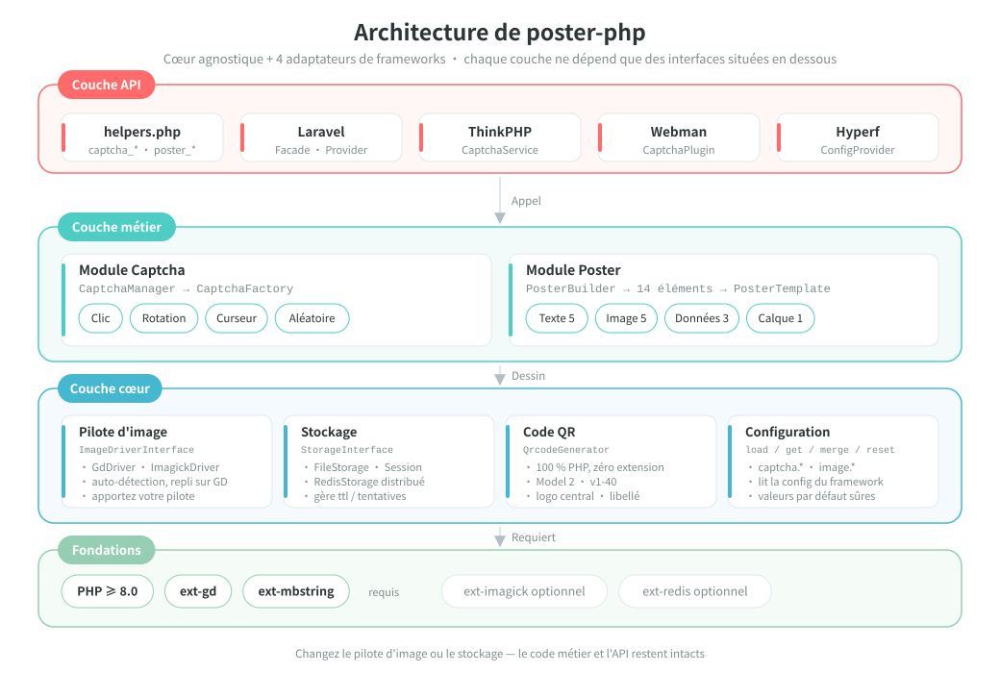
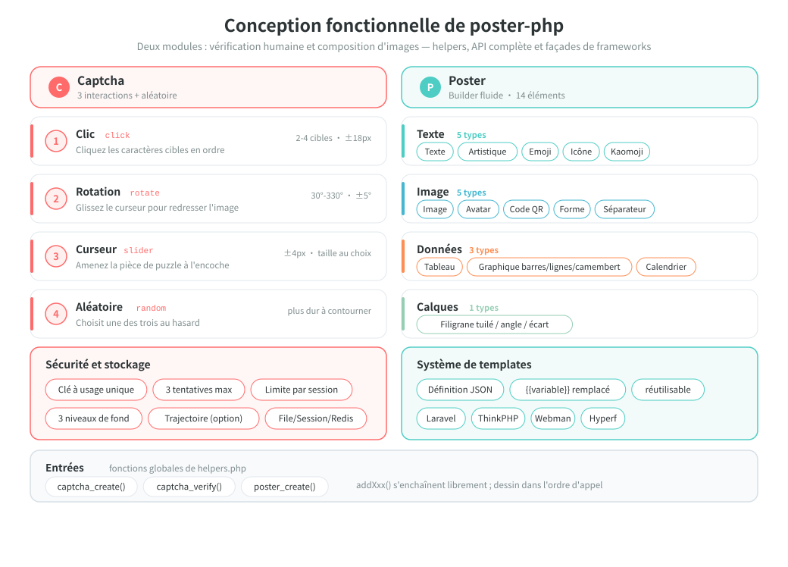
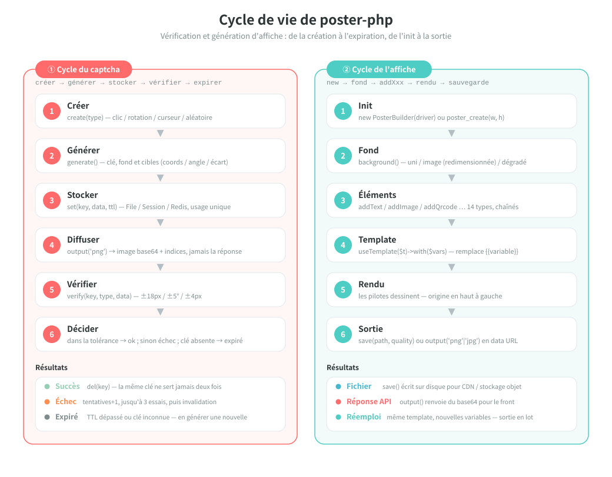

# poster-php

[中文](../../../README.md) | [English](../../../README_EN.md) | [日本語](../ja/README.md) | [한국어](../ko/README.md) | [Русский](../ru/README.md) | [Deutsch](../de/README.md) | Français | [Español](../es/README.md) | [Português](../pt/README.md) | [हिन्दी](../hi/README.md) | [العربية](../ar/README.md) | [বাংলা](../bn/README.md) | [Bahasa Indonesia](../id/README.md)

<p align="center">
  
</p>

Boîte à outils PHP de captcha image et de génération d'affiches — cœur agnostique + adaptateurs Laravel / ThinkPHP / Webman / Hyperf.

[Documentation anglaise](../../../README_EN.md) | [Documentation d'architecture](../../../docs/architecture.md) | [Toutes les langues](../README.md)

## Présentation

poster-php est une boîte à outils d'images PHP qui fait deux choses, et les fait bien :

| Capacité | Description |
|------|------|
| **Captcha** | Trois vérifications humaines (clic / rotation / curseur) + tirage aléatoire, images et réponses générées en PHP pur, sans service tiers |
| **Génération d'affiches** | API Builder fluide, 14 types d'éléments couvrant texte, images, QR code, tableaux, graphiques, calendriers et autres besoins de mise en page |
| **Agnostique** | Le cœur ne dépend que de PHP ≥ 8.0 + GD ; s'utilise comme un simple paquet Composer, sans framework |
| **Prêt à l'emploi** | 3 fonctions globales + 4 adaptateurs de frameworks (Laravel / ThinkPHP / Webman / Hyperf) |
| **Remplaçable** | Le pilote d'image (GD / ImageMagick) et le stockage (File / Session / Redis) sont des implémentations d'interface, à remplacer selon les besoins |

> Mascotte du projet **Posty** — un personnage composé du poster lui-même, d'une carte QR et d'une pièce de puzzle, qui correspond exactement aux deux capacités du paquet : produire des images et vérifier. Elle est livrée avec le paquet ([`assets/pet.svg`](../../../assets/pet.svg) / `assets/pet.png`), peut être dessinée dans une affiche avec `->addPet()` et configurée comme image de remplacement.

## Structure du projet

```
poster-php/
├── src/                        # code cœur : 64 fichiers PHP / env. 6093 lignes
│   ├── Captcha/                # module captcha : interface + classe abstraite + 3 implémentations + factory + manager
│   │                           #   + RateLimiter (limitation de débit) / TrajectoryVerifier (contrôle de trajectoire)
│   ├── Poster/                 # module affiche (Elements/ElementRegistry.php = registre unique des éléments)
│   │   ├── PosterBuilder.php   # Builder fluide, 14 méthodes addXxx()
│   │   ├── PosterTemplate.php  # modèle JSON → remplacement de {{variable}}
│   │   └── Elements/           # 14 rendus d'éléments + ElementInterface + classe abstraite
│   ├── Drivers/                # pilotes d'image : ImageDriverInterface / GdDriver / ImagickDriver
│   ├── Storage/                # stockage des données de vérification : File / Session / Redis / cache PSR-16
│   ├── Qrcode/                 # générateur de QR code en PHP pur (Model 2, v1-40, sans extension)
│   ├── Adapters/               # adaptateurs de frameworks : Laravel / ThinkPHP / Webman / Hyperf
│   ├── PosterConfig.php        # lecture de la configuration (valeurs par défaut + fusion avec le framework)
│   └── Installer.php           # copie le fichier de configuration après l'installation Composer
├── config/
│   └── poster.php              # configuration par défaut (captcha / pilote d'image)
├── assets/
│   ├── backgrounds/            # 6 fonds de captcha intégrés (PNG 400×250)
│   ├── pet.svg                 # mascotte Posty (source vectorielle)
│   └── pet.png                 # rasterisé depuis pet.svg : utilisé par addPet() et comme image de remplacement
├── helpers.php                 # fonctions globales : captcha_create / captcha_verify / poster_create
├── native.php                  # point d'entrée PHP natif — un simple require, sans Composer
├── tests/                      # tests PHPUnit, 53 fichiers, arborescence calquée sur src/
├── examples/                   # scripts d'exemple directement exécutables
├── docs/                       # documentation d'architecture, diagrammes (SVG), QR codes de don
└── composer.json               # PSR-4 : Erikwang2013\Poster\ → src/
```

## Architecture et conception

### Architecture système

Dépendances en couches : une couche n'appelle que les interfaces situées en dessous ; remplacer un pilote ou un stockage ne demande aucune modification du code métier.



### Conception fonctionnelle

Le détail des deux modules : les quatre interactions du captcha et leurs garanties de sécurité, les 14 éléments d'affiche et le système de templates.



### Cycle de vie

Le parcours complet d'une vérification de captcha (créer → générer → stocker → diffuser → vérifier → succès / échec / expiration) et d'une génération d'affiche (init → fond → éléments → template → rendu → sortie).



## Fonctionnalités

### Captcha (trois méthodes + tirage aléatoire)

| Type | Description |
|------|------|
| Captcha clic `click` | L'utilisateur clique dans l'ordre les textes cibles sur l'image |
| Captcha rotation `rotate` | L'utilisateur fait glisser le curseur pour remettre l'image d'aplomb |
| Captcha curseur `slider` | L'utilisateur fait glisser la pièce de puzzle dans l'encoche |
| Tirage aléatoire `random` | Tire au hasard l'un des trois captchas ci-dessus |

### Génération d'affiches

API Builder fluide, 14 types d'éléments :

| Élément | Méthode | Description |
|------|------|------|
| Texte | `addText()` | retour à la ligne automatique, alignement, multi-ligne |
| Image | `addImage()` | redimensionnement, recadrage, coins arrondis, ombre |
| Avatar | `addAvatar()` | découpe circulaire, bordure |
| QR code | `addQrcode()` | généré en PHP pur, logo central, texte en bas |
| Forme | `addShape()` | rectangle / cercle / arrondi, remplissage / contour |
| Séparateur | `addLine()` | couleur, épaisseur |
| Filigrane | `addWatermark()` | texte répété, angle, espacement |
| Tableau | `addTable()` | en-tête, lignes alternées, largeurs de colonnes |
| Graphique | `addChart()` | barres / lignes / camembert |
| Calendrier | `addCalendar()` | calendrier mensuel, dates mises en évidence, annotations |
| Texte artistique | `addArtisticText()` | contour / ombre / dégradé / néon |
| Emoji | `addEmoji()` | rendu d'emojis en couleur |
| Icône | `addIcon()` | rendu d'icônes FontAwesome |
| Kaomoji | `addEmoticon()` | kaomoji japonais / émoticônes personnalisées |

## Installation

```bash
composer require erikwang2013/poster-php
```

Prérequis : PHP >= 8.0, extension GD.

Extensions optionnelles :
- `ext-imagick` : pilote d'image ImageMagick (meilleures performances, fonctions plus complètes)
- `ext-redis` : stockage Redis des captchas (déploiement distribué)

### Sans Composer (PHP natif)

Placez tout le répertoire `poster-php/` dans le projet et incluez simplement `native.php` : il enregistre l'autoload PSR-4 et charge les fonctions globales, sans Composer ni aucun framework.

```php
require '/path/to/poster-php/native.php';   // enregistre l'autoload + les fonctions globales

$result  = captcha_create('click');
$builder = poster_create(750, 1334);
```

`native.php` peut être inclus plusieurs fois et cohabite avec Composer ou l'autoloader du projet (en cas d'installation multiple, privilégiez `vendor/autoload.php`).

## Utilisation

### I. Captcha

#### 1. Captcha clic (ClickCaptcha)

L'utilisateur doit cliquer dans l'ordre les textes cibles de l'image (par exemple « 树 », « 鸟 », « 花 ») pour prouver qu'il est humain.

```php
// via la fonction d'aide (agnostique du framework)
$result = captcha_create('click', [
    'difficulty' => 'medium',    // 'easy'(2 cibles) | 'medium'(3 cibles) | 'hard'(4 cibles)
    'background' => null,        // chemin d'une image de fond, null=fond dégradé programmatique (style aléatoire)
]);

// valeur de retour
// $result = [
//     'key'   => 'abc123...',           // identifiant unique de la vérification, à transmettre au frontend
//     'image' => 'data:image/png;base64,...', // image en base64
//     'extra' => [
//         'texts' => [
//             ['order' => 1, 'text' => '树'],
//             ['order' => 2, 'text' => '鸟'],
//             ['order' => 3, 'text' => '花'],
//         ],
//     ],
// ];

// Le frontend affiche les textes d'indice dans l'ordre de order, l'utilisateur clique les emplacements correspondants (les coordonnées cibles ne sont pas renvoyées, la vérification reste côté serveur)
// Le frontend envoie les coordonnées cliquées par l'utilisateur [[x1,y1], [x2,y2], [x3,y3]]
$pass = captcha_verify($result['key'], 'click', [[120, 80], [200, 150], [310, 95]]);
// renvoie true / false, rayon de tolérance 18px

// via le CaptchaManager (API complète)
use Erikwang2013\Poster\Captcha\CaptchaManager;
use Erikwang2013\Poster\Drivers\DriverFactory;
use Erikwang2013\Poster\Storage\FileStorage;

$manager = new CaptchaManager(DriverFactory::create(), new FileStorage());
$captcha = $manager->create('click')
    ->setDifficulty('hard')        // easy=2 cibles | medium=3 cibles | hard=4 cibles
    ->setTargetType('text')        // 'text' texte | 'icon' icône
    ->setWords(['猫', '狗', '鸟', '鱼']) // vivier de textes personnalisé (optionnel)
    ->setBackground('/path/to/bg.jpg');
$result = $captcha->generate();

$pass = $manager->verify($result['key'], [
    'type' => 'click',
    'data' => [[120, 80], [200, 150], [310, 95], [180, 60]],
]);
```

`setTargetType('icon')` remplace les textes cibles par des formes vectorielles générées par programme (11 formes dessinées avec les primitives GD, sans ressource image) :
chaque entrée de `extra['texts']` reçoit en plus un `thumb` (miniature base64 de la forme), à afficher comme indice de clic côté frontend ; la vérification reste une comparaison de coordonnées.

#### 2. Captcha rotation (RotateCaptcha)

Le système fait tourner l'image au hasard de 30°~330°, l'utilisateur fait glisser le curseur pour la remettre droite.

```php
// via la fonction d'aide
$result = captcha_create('rotate');
// $result['extra'] ne contient pas l'angle (c'est la réponse), le frontend n'affiche que l'image pivotée

$pass = captcha_verify($result['key'], 'rotate', 185);  // angle appliqué par l'utilisateur, tolérance ±5°

// via le CaptchaManager
$captcha = $manager->create('rotate')
    ->setSize(200)                 // diamètre du cercle 60-400 (200 par défaut)
    ->setAngleRange(45, 315)       // plage d'angles personnalisée
    ->generate();
```

#### 3. Captcha curseur (SliderCaptcha)

Le système découpe une pièce de puzzle dans le fond et la décale ; l'utilisateur la fait glisser jusqu'à l'encoche.

```php
// via la fonction d'aide
$result = captcha_create('slider');
// $result = [
//     'image' => '...',              // image de fond avec l'encoche
//     'extra' => [
//         'puzzle'   => '...',        // image de la pièce de puzzle
//         'puzzle_w' => 50,           // largeur de la pièce
//         'puzzle_h' => 50,           // hauteur de la pièce
//     ],
// ];

$pass = captcha_verify($result['key'], 'slider', 173);  // pixels parcourus en x par l'utilisateur, tolérance ±4px
```

#### 4. Tirage aléatoire (RandomCaptcha)

Le système tire au hasard l'un des captchas click / rotate / slider, ce qui complique le contournement.

```php
// via la fonction d'aide — une ligne pour un captcha aléatoire
$result = captcha_create('random');
// $result['type'] renvoie le type réellement choisi : 'click' | 'rotate' | 'slider'

// Le frontend affiche le composant correspondant selon type
switch ($result['type']) {
    case 'click':
        // composant clic : afficher l'image, l'utilisateur clique les textes d'indice de extra.texts dans l'ordre
        break;
    case 'rotate':
        // composant rotation : afficher l'image, l'utilisateur la fait tourner par glissement
        break;
    case 'slider':
        // composant curseur : afficher le fond avec l'encoche + la pièce de puzzle
        break;
}

// À la vérification, transmettre le type réel et les données de l'utilisateur
$pass = captcha_verify($result['key'], $result['type'], $userData);
// click: $userData = [[x1,y1],[x2,y2],...]
// rotate: $userData = 185 (angle)
// slider: $userData = 173 (pixels)

// via le CaptchaManager
$captcha = $manager->create('random')->generate();
$pass = $manager->verify($captcha['key'], [
    'type' => $captcha['type'],
    'data' => $userData,
]);
```

#### Sécurité de la vérification

| Propriété | Description |
|------|------|
| Usage unique | La clé est supprimée après un succès ou le nombre maximal de tentatives |
| Anti-force brute | 3 vérifications au maximum par défaut (configurable) |
| Durée de vie | 300 secondes par défaut (configurable) |
| Aléatoire | Couleurs de fond, bruit et positions des cibles sont tirés au hasard à chaque génération ; chaque cible cliquée reçoit une teinte et un angle de rotation tirés au hasard |
| Limitation par session | Limitation à fenêtre glissante, toutes clés confondues (30 en 60 secondes par défaut), pour bloquer le devinage par renouvellement de clé |
| Trajectoire | Optionnelle (désactivée par défaut) : contrôle le nombre de points, la durée et la linéarité de la trajectoire ; un script qui POSTe directement la réponse est rejeté |
| Fonds soignés | Fonds dégradés programmatiques en trois styles (minimal / vibrant / naturel) tirés au hasard, répertoire de fonds par défaut configurable |
| Taille minimale | Un fond trop petit lève une erreur au lieu de dégrader le rendu (120×120 minimum pour le clic, le curseur doit contenir une pièce de 4×2) |

#### Contrôle de trajectoire (optionnel)

Désactivé par défaut (pour ne pas pénaliser les écrans tactiles ni l'accessibilité). Une fois activé, `slider` / `rotate` demandent au frontend de transmettre la trajectoire de glissement ; le serveur contrôle le nombre de points, la durée et la linéarité :

```php
// config/poster.php
'captcha' => [
    'trajectory' => [
        'enabled'      => true,
        'min_points'   => 4,      // nombre minimal de points échantillonnés
        'min_duration' => 300,    // durée minimale (millisecondes)
        'max_duration' => 5000,   // durée maximale (millisecondes)
        'max_linearity' => 0.99,  // au-delà de cette linéarité, jugé machine (un glissement scripté est une droite)
    ],
],

// Envoi depuis le frontend : l'ancienne forme (valeur seule) reste compatible
captcha_verify($key, 'slider', 173);
// Avec le contrôle de trajectoire, la trajectoire est requise
captcha_verify($key, 'slider', ['x' => 173, 'trail' => [[12, 3, 0], [40, 9, 22], /* … */], 'duration' => 1200]);
```

#### Configuration des images de fond

Les fonds de captcha suivent trois niveaux de priorité :

1. **Image unique** — définie par `setBackground('/path/to/bg.jpg')`
2. **Répertoire d'images** — `captcha.background_dir` pointe vers un répertoire, par défaut `assets/backgrounds/` (6 fonds dégradés intégrés)
3. **Génération programmatique** — activée quand `background_dir` vaut `null`, trois styles tirés au hasard

```php
// Méthode 1 : désigner une image précise dans le code
$captcha = $manager->create('click')->setBackground('/path/to/bg.jpg');

// Méthode 2 : remplacer les fonds par défaut (config/poster.php)
'captcha' => [
    // placez vos propres fonds dans ce répertoire, ils seront choisis au hasard
    'background_dir' => '/path/to/my-backgrounds',
    // mettre null pour utiliser les fonds dégradés programmatiques
    // 'background_dir' => null,
],

// Méthode 3 : ne rien faire, les fonds par défaut intégrés (assets/backgrounds/) sont utilisés
```

**Fonds par défaut** : `assets/backgrounds/` fournit 6 fonds dégradés PNG en 400×250, aux styles bleu-violet, coucher de soleil, vert frais, sombre, pastel et bleu océan.

Trois styles programmatiques :

| Style | Description |
|------|------|
| `minimal` minimal | dégradé doux + grands cercles peu opaques + lignes géométriques + de rares points fins |
| `vibrant` vibrant | dégradé lumineux + cercles colorés de tailles variées + bruit de densité moyenne |
| `natural` naturel | dégradé chaud + aplats irréguliers imitant la texture du papier + points fins et denses |

### II. Génération d'affiches

#### Usage de base

```php
use Erikwang2013\Poster\Poster\PosterBuilder;
use Erikwang2013\Poster\Drivers\DriverFactory;

// via la fonction d'aide
$builder = poster_create(750, 1334);  // largeur×hauteur

// ou instanciation directe
$builder = new PosterBuilder(DriverFactory::create());
$builder->width(750)->height(1334);

// définir le fond
$builder->background('#FFFFFF');                            // fond uni
$builder->background('/path/to/bg.jpg');                    // fond image (redimensionné automatiquement)
$builder->backgroundGradient('#FF6B6B', '#FF8E53', 'vertical'); // fond dégradé
                                                            // sens : vertical | horizontal

// sortie
$builder->save('/output/poster.jpg', 90);  // enregistrer dans un fichier (chemin, qualité 0-100)
                                           // format déduit de l'extension : jpg/jpeg/png/webp/gif
                                           // sans qualité, JPEG lit poster.jpeg_quality et PNG lit poster.png_compression
$dataUrl = $builder->output('png', 90);    // récupérer une data URL base64
```

#### Texte `addText()`

```php
$builder->addText('新品首发', [
    'x'        => 80,              // abscisse
    'y'        => 120,             // ordonnée (position de la ligne de base)
    'size'     => 48,              // taille de police
    'color'    => '#333333',       // couleur
    'font'     => '/path/to/font.ttf', // fichier de police, null=police interne GD
    'align'    => 'center',        // left | center | right
    'maxWidth' => 600,             // largeur maximale (retour à la ligne automatique)
    'lineHeight' => 72,            // hauteur de ligne
    'angle'    => 0,               // angle de rotation
]);
```

#### Image `addImage()`

```php
$builder->addImage('/path/to/product.jpg', [
    'x'      => 75,
    'y'      => 280,
    'width'  => 600,              // largeur de rendu (mise à l'échelle automatique)
    'height' => 600,              // hauteur de rendu
    'radius' => 12,               // rayon des coins arrondis
    'shadow' => [                 // ombre (optionnelle)
        'color'    => '#00000033',
        'offsetX'  => 4,
        'offsetY'  => 4,
        'blur'     => 10,
    ],
]);
```

#### Avatar `addAvatar()`

```php
$builder->addAvatar('/path/to/avatar.jpg', [
    'x'      => 80,
    'y'      => 60,
    'size'   => 120,              // taille de l'avatar (carré)
    'border' => '#FF6B6B',        // couleur de bordure (optionnelle)
]);
```

#### QR code `addQrcode()`

```php
$builder->addQrcode('https://example.com/page/123', [
    'x'     => 275,
    'y'     => 1050,
    'size'  => 200,               // taille du QR code
    'level' => 'H',               // niveau de correction d'erreur L | M | Q | H
    'logo'  => '/path/to/logo.png', // logo central (optionnel)
    'label' => '扫码查看详情',      // texte du bas (optionnel)
    'label_size'  => 14,
    'label_color' => '#999999',
]);
```

Au-delà de la capacité maximale de la version (par exemple environ 1273 octets en niveau H), une `InvalidArgumentException` est levée, au lieu de produire silencieusement un code impossible à scanner.

#### Forme `addShape()`

```php
// rectangle
$builder->addShape('rect', [
    'x' => 0, 'y' => 0, 'width' => 750, 'height' => 60,
    'color'  => '#FF6B6B',
    'filled' => true,             // true=rempli false=contour
    'radius' => 8,                // rayon des coins arrondis
    'opacity' => 0.8,             // opacité 0-1
]);

// cercle
$builder->addShape('circle', [
    'x' => 100, 'y' => 100, 'width' => 80, 'height' => 80,
    'color' => '#4ECDC4',
]);
```

#### Séparateur `addLine()`

```php
$builder->addLine([
    'x1' => 75, 'y1' => 800,
    'x2' => 675, 'y2' => 800,
    'color' => '#EEEEEE',
    'width' => 1,
]);
```

#### Filigrane `addWatermark()`

```php
$builder->addWatermark('CONFIDENTIAL', [
    'size'    => 24,
    'color'   => '#00000020',     // semi-transparent
    'font'    => '/font.ttf',
    'angle'   => 30,              // angle d'inclinaison
    'spacing' => 200,             // espacement
]);
```

#### Tableau `addTable()`

```php
$builder->addTable([
    'x'      => 50,
    'y'      => 800,
    'width'  => 650,
    'columns' => [150, 350, 150], // largeurs de colonnes
    'header'  => ['序号', '项目', '价格'],
    'rows'    => [
        ['1', '商品A', '¥99'],
        ['2', '商品B', '¥199'],
        ['3', '商品C', '¥299'],
    ],
    'headerBg'     => '#333333',
    'headerColor'  => '#FFFFFF',
    'rowBg'        => ['#FFFFFF', '#F5F5F5'], // lignes alternées
    'rowColor'     => '#333333',
    'fontSize'     => 24,
    'cellPadding'  => 10,
]);
```

#### Graphique `addChart()`

```php
// graphique en barres
$builder->addChart('bar', [
    ['label' => '一月', 'value' => 120],
    ['label' => '二月', 'value' => 200],
    ['label' => '三月', 'value' => 150],
    ['label' => '四月', 'value' => 300],
], [
    'x' => 50, 'y' => 100, 'width' => 650, 'height' => 400,
    'colors' => ['#FF6B6B', '#4ECDC4', '#45B7D1', '#96CEB4'],
]);

// graphique en lignes
$builder->addChart('line', [
    ['label' => '周一', 'value' => 10],
    ['label' => '周二', 'value' => 35],
    ['label' => '周三', 'value' => 25],
    ['label' => '周四', 'value' => 45],
    ['label' => '周五', 'value' => 30],
], [
    'x' => 50, 'y' => 100, 'width' => 650, 'height' => 400,
    'colors' => ['#FF6B6B'],
]);

// camembert
$builder->addChart('pie', [
    ['label' => '电商', 'value' => 45],
    ['label' => '社交', 'value' => 25],
    ['label' => '搜索', 'value' => 15],
    ['label' => '其他', 'value' => 15],
], [
    'x' => 75, 'y' => 100, 'width' => 600, 'height' => 600,
    'colors' => ['#FF6B6B', '#4ECDC4', '#45B7D1', '#96CEB4'],
]);
```

#### Calendrier `addCalendar()`

```php
$builder->addCalendar([
    'x'     => 50,
    'y'     => 200,
    'year'  => 2026,
    'month' => 5,                   // 1-12
    'cellSize'    => 60,            // taille des cases
    'startDay'    => 0,             // 0=dimanche 1=lundi
    'title'       => '2026年5月',    // titre (généré automatiquement par défaut)
    'highlights'  => [              // dates mises en évidence
        '2026-05-01' => ['bg' => '#FF6B6B', 'text' => '劳动节'],
        '2026-05-16' => ['bg' => '#FFEAA7', 'text' => '今天'],
    ],
    'headerBg'    => '#333333',     // fond de la barre de titre
    'headerColor' => '#FFFFFF',     // couleur du texte de la barre de titre
    'cellBg'      => '#FFFFFF',     // fond des cases
    'cellBorder'  => '#DDDDDD',     // bordure des cases
    'todayBg'     => '#FF6B6B',     // couleur de fond d'aujourd'hui
    'highlightBg' => '#FFF3CD',    // couleur de fond par défaut des mises en évidence
    'textColor'   => '#333333',     // couleur du texte des dates
    'dimColor'    => '#CCCCCC',     // couleur des dates hors mois / cases vides
]);
```

#### Texte artistique `addArtisticText()`

```php
// effet contour
$builder->addArtisticText('SALE', 'stroke', [
    'x' => 80, 'y' => 120, 'size' => 72,
    'color'       => '#FF6B6B',    // couleur de remplissage
    'strokeColor' => '#000000',    // couleur du contour
    'strokeWidth' => 3,            // épaisseur du contour
]);

// effet ombre
$builder->addArtisticText('新品', 'shadow', [
    'x' => 80, 'y' => 120, 'size' => 48,
    'color'         => '#333333',
    'shadowColor'   => '#00000033',
    'shadowOffsetX' => 4,
    'shadowOffsetY' => 4,
]);

// effet dégradé
$builder->addArtisticText('VIP', 'gradient', [
    'x' => 80, 'y' => 120, 'size' => 60,
    'color'  => '#FF6B6B',         // couleur du haut
    'color2' => '#FF8E53',         // couleur du bas
]);

// effet néon
$builder->addArtisticText('HOT', 'neon', [
    'x' => 80, 'y' => 120, 'size' => 56,
    'color'     => '#FF1493',
    'glowColor' => '#FF1493',
]);
```

#### Emoji `addEmoji()`

```php
// utiliser directement des caractères emoji
$builder->addEmoji('😀', ['x' => 100, 'y' => 100, 'size' => 64]);
$builder->addEmoji('🎉', ['x' => 180, 'y' => 100, 'size' => 64]);

// utiliser un point de code unicode
$builder->addEmoji('', [
    'x' => 100, 'y' => 100, 'size' => 64,
    'codepoint' => 'U+1F600',      // équivalent de 😀
]);

// préciser une police emoji (le système doit fournir une police couleur)
$builder->addEmoji('😀', [
    'x' => 100, 'y' => 100, 'size' => 64,
    'font' => '/System/Library/Fonts/Apple Color Emoji.ttc',
]);
```

Le système détecte automatiquement les chemins des polices emoji sous macOS / Linux / Windows.

> Remarque : le rendu d'un emoji dépend de la police elle-même. Sous Linux, la courante `NotoColorEmoji.ttf` est une police bitmap couleur CBDT que le canal FreeType de GD ne sait pas charger (`imagettftext()` échoue directement) : l'emoji n'est alors pas dessiné. Utilisez plutôt une police emoji que FreeType charge correctement sur le système.

#### Icônes `addIcon()`

```php
// utiliser les noms d'icônes FontAwesome intégrés (fichier de police d'icônes requis)
$builder->addIcon('heart', [
    'x' => 20, 'y' => 40, 'size' => 32,
    'color' => '#E74C3C',
    'font'  => '/path/to/fa-solid-900.ttf',  // police FontAwesome TTF obligatoire
]);

$builder->addIcon('star',  ['x' => 60, 'y' => 40, 'color' => '#F39C12', 'font' => '/path/to/fa-solid-900.ttf']);
$builder->addIcon('check', ['x' => 100, 'y' => 40, 'color' => '#27AE60', 'font' => '/path/to/fa-solid-900.ttf']);

// utiliser un point de code unicode personnalisé
$builder->addIcon('', [
    'x' => 20, 'y' => 40, 'size' => 32,
    'codepoint' => '\\u{F3C5}',    // map-marker
    'color' => '#E74C3C',
    'font' => '/path/to/fa-solid-900.ttf',
]);

// liste des noms d'icônes intégrés
// heart, star, user, clock, home, cog, check, times, search,
// envelope, phone, camera, play, pause, shopping-cart, tag,
// map-marker, calendar, comment, share, download, upload,
// lock, globe, link, image, music, video, bell, bookmark,
// thumbs-up, eye, trash, edit, plus, minus, arrow-*,
// location-dot, fire, gift, rocket
```

#### Kaomoji `addEmoticon()`

```php
// utiliser les kaomoji intégrés
$builder->addEmoticon('happy', ['x' => 20, 'y' => 40, 'size' => 24]);
// rendu : (｡•̀ᴗ-)✧

$builder->addEmoticon('love',  ['x' => 20, 'y' => 80, 'size' => 24]);
// rendu : (♡°▽°♡)

$builder->addEmoticon('cry',   ['x' => 20, 'y' => 120, 'size' => 24]);
// rendu : (╥﹏╥)

// texte d'émoticône personnalisé
$builder->addEmoticon('', [
    'x' => 20, 'y' => 40, 'size' => 24,
    'text' => '(╯°□°）╯︵ ┻━┻',    // texte personnalisé
    'color' => '#333333',
]);

// expressions kaomoji intégrées
// happy, love, cry, angry, surprised, cool, sleepy,
// wave, think, shrug, tableflip, lenny
```

#### Mascotte du projet `addPet()`

La mascotte intégrée Posty (`assets/pet.png`, rasterisée depuis `assets/pet.svg`) peut être dessinée directement dans une affiche, à l'équivalent de `addImage(PosterBuilder::petPath(), $options)` :

```php
$builder->addPet([
    'x'      => 555,
    'y'      => 140,
    'width'  => 150,
    'height' => 130,   // mise à l'échelle selon la largeur/hauteur donnée, garder le ratio 600:520
    'radius' => 0,     // accepte toutes les options de addImage()
]);

// le chemin est aussi récupérable seul (par exemple comme logo central d'un QR code)
$logo = PosterBuilder::petPath();
```

**Image de remplacement** : `addImage()` / `addAvatar()` ignorent par défaut les fichiers absents et ne dessinent rien. Pointez `poster.placeholder` vers la mascotte et Posty apparaîtra aux emplacements manquants — on voit d'un coup d'œil quelle image oublie :

```php
// config/poster.php
'poster' => [
    'placeholder' => dirname(__DIR__) . '/assets/pet.png',
],
```

### III. Système de templates

```php
use Erikwang2013\Poster\Poster\PosterTemplate;

// définir un modèle (sérialisable en JSON)
$template = PosterTemplate::fromConfig([
    'width'  => 750,
    'height' => 1334,
    'elements' => [
        ['type' => 'shape', 'color' => '#FF6B6B', 'x' => 0, 'y' => 0, 'width' => 750, 'height' => 300],
        ['type' => 'text', 'text' => '{{title}}', 'x' => 80, 'y' => 100, 'size' => 48, 'color' => '#FFFFFF'],
        ['type' => 'text', 'text' => '{{subtitle}}', 'x' => 80, 'y' => 180, 'size' => 28, 'color' => '#FFE0E0'],
        ['type' => 'image', 'src' => '{{cover}}', 'x' => 75, 'y' => 350, 'width' => 600, 'height' => 600, 'radius' => 12],
        ['type' => 'qrcode', 'content' => '{{url}}', 'x' => 275, 'y' => 1050, 'size' => 200, 'label' => '扫码查看详情'],
    ],
]);

// rendre le modèle avec des variables
$builder->useTemplate($template)->with([
    'title'    => '新品首发',
    'subtitle' => '限时特惠 · 买一送一',
    'cover'    => '/path/to/product.jpg',
    'url'      => 'https://m.example.com/product/123',
])->save('/output/poster.jpg');

// types d'éléments pris en charge par les modèles : text, image, qrcode, avatar, shape, line, watermark, table,
//                      chart, calendar, artistic-text, emoji, icon, emoticon
```

`useTemplate()` **remplace** par défaut les éléments `addXxx()` précédents (sémantique d'origine) ; pour « un template en fond, puis des éléments ajoutés à la main », utilisez le second paramètre :

```php
$builder->replaceElements(false)->useTemplate($template)->with($vars)->addPet(['x' => 20, 'y' => 20, 'width' => 80]);

// Export inverse : convertir le builder courant (ou un seul élément) en structure de modèle, réinjectable dans fromConfig()
$config = $builder->toArray();          // ['width'=>…, 'height'=>…, 'elements'=>[…]]
$template2 = PosterTemplate::fromConfig($config);   // export → réimport, structure identique

// Un nouveau type d'élément ne s'enregistre qu'une fois dans ElementRegistry : Builder et templates en bénéficient
$builder->add('text', ['text' => 'hello', 'x' => 10, 'y' => 30, 'size' => 20]);
```

> Remarque : depuis cette version, `AbstractElement::toArray()` renvoie « nom de type court + options à plat » (auparavant `['type' => nom de classe, 'options' => [...]]`), afin d'être réversible avec la structure des modèles.

## Intégration aux frameworks

### Laravel

```php
use Erikwang2013\Poster\Adapters\Laravel\Facades\Captcha;
use Erikwang2013\Poster\Adapters\Laravel\Facades\Poster;

$result = Captcha::create('click')->generate();
Poster::width(750)->height(1334)->background('#FFF')->save('poster.jpg');
```

```php
// Après avoir passé captcha.route.enabled = true dans config/poster.php, l'adaptateur enregistre un endpoint image :
//   GET /captcha/{key} → renvoie directement le PNG (Content-Type: image/png, Cache-Control: no-store)
// Le frontend peut alors utiliser l'URL, sans base64 (33 % plus léger, et cachable par le navigateur/CDN)
$result = Captcha::create('click')->generate();
// $result['image'] reste une data URI ; $result['url'] est une adresse à mettre directement dans 

// Validation de formulaire : la règle s'appelle captcha, son paramètre est la clé d'image
$request->validate([
    'captcha_key'  => 'required|string',
    'captcha_code' => 'required|captcha:captcha_key',
]);
```

```bash
php artisan vendor:publish --tag=poster-config
```

### ThinkPHP

`config/web.php` :
```php
'services' => [
    Erikwang2013\Poster\Adapters\ThinkPHP\CaptchaService::class,
    Erikwang2013\Poster\Adapters\ThinkPHP\PosterService::class,
],
```

### Webman

`config/bootstrap.php` :
```php
return [
    Erikwang2013\Poster\Adapters\Webman\CaptchaPlugin::class,
    Erikwang2013\Poster\Adapters\Webman\PosterPlugin::class,
];
```

### Hyperf

Enregistrement automatique via le ConfigProvider.

## Configuration

Après `composer require`, `config/poster.php` est copié automatiquement dans le répertoire `config/` du projet (ignoré s'il existe déjà). Compatible avec Laravel / ThinkPHP / Webman (`config/poster.php`) et Hyperf (`config/autoload/poster.php`).

Principales options :

| Option | Valeur par défaut | Description |
|--------|--------|------|
| `captcha.default_type` | `random` | Type de captcha par défaut : `click` / `rotate` / `slider` / `random` |
| `captcha.default_difficulty` | `medium` | Difficulté par défaut : `easy` / `medium` / `hard` |
| `captcha.click_words` | `[合,家,欢,...]` | Vivier de textes du captcha click, personnalisable |
| `captcha.background_dir` | `assets/backgrounds/` | Répertoire des fonds ; `null` pour une génération programmatique |
| `captcha.ttl` | `300` | Durée de validité du captcha (secondes) |
| `captcha.max_attempts` | `3` | Nombre maximal de vérifications |
| `captcha.tolerance` | `{click:18,rotate:5,slider:4}` | Tolérance par type |
| `image.driver` | `auto` | Pilote d'image : `auto` / `gd` / `imagick` |
| `poster.placeholder` | `null` | Chemin de l'image de remplacement, `null` pour ne rien dessiner ; pointez vers la mascotte pour dessiner Posty aux images manquantes |
| `captcha.rate_limit` | `{max:30,window:60}` | Limitation à fenêtre par session/compte ; l'identité vient de session_id, ou de l'IP client sans session |
| `captcha.trajectory` | `{enabled:false,…}` | Contrôle de trajectoire (désactivé par défaut) |
| `captcha.cache.pool` | `null` | Objet pool PSR-16 (utilisé quand `storage=cache`), ou `StorageFactory::setPsr16Pool()` à l'exécution |
| `captcha.route` | `{enabled:false,path:'/captcha'}` | Adaptateur Laravel : enregistre l'endpoint image `GET {path}/{key}` qui renvoie directement le PNG |

## L'open source n'est pas facile, votre soutien est bienvenu

| WeChat | Alipay |
|:---:|:---:|
|  |  |

---

## License

MIT License — Copyright (c) 2026 erik <erik@erik.xyz> — https://erik.xyz
