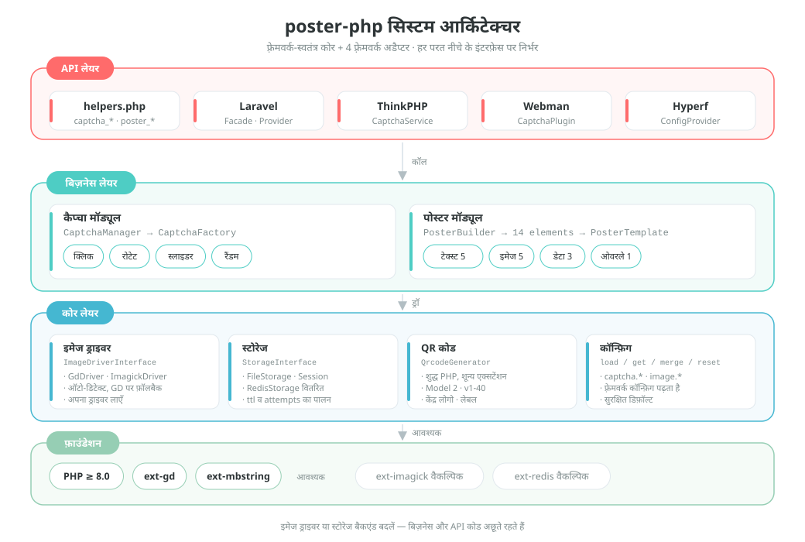
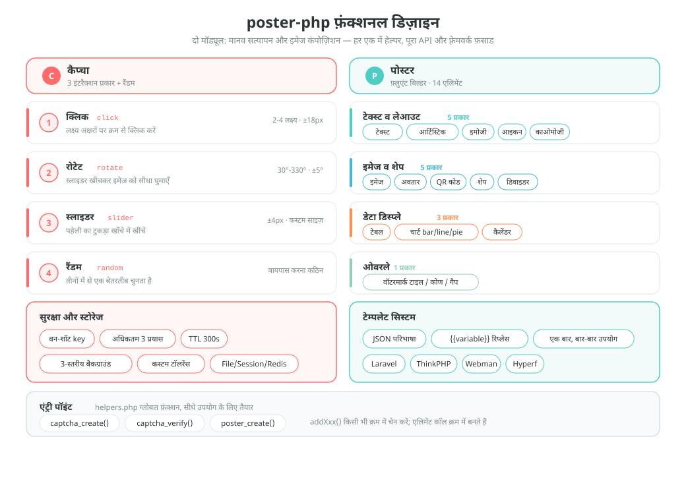
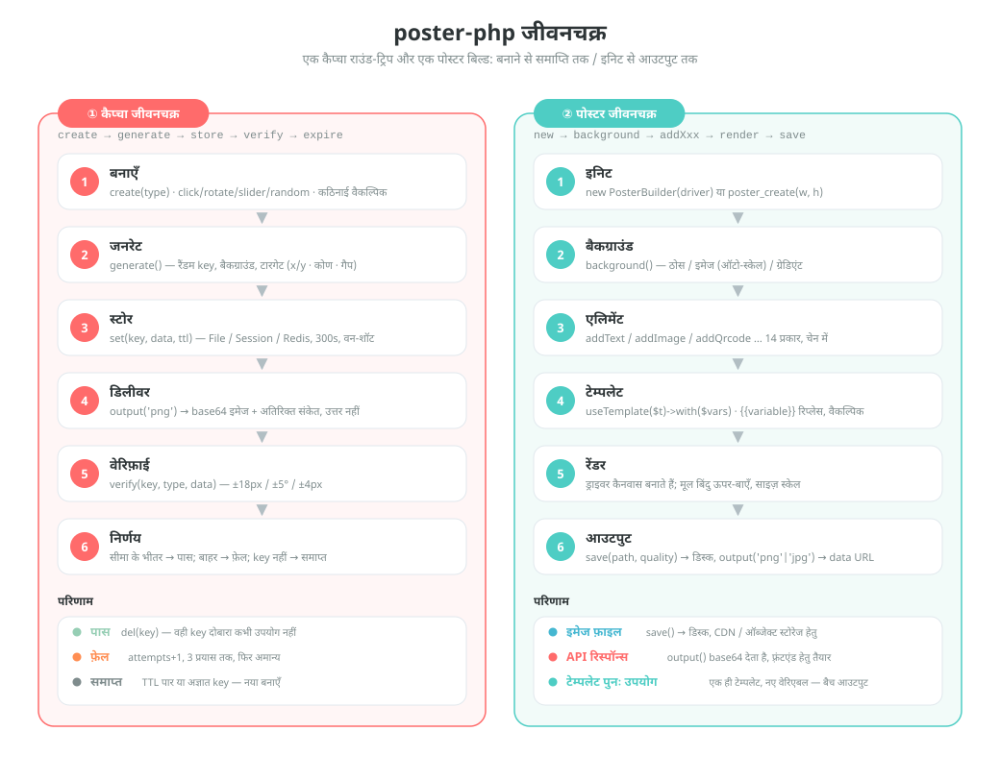

# poster-php

[中文](../../../README.md) | [English](../../../README_EN.md) | [日本語](../ja/README.md) | [한국어](../ko/README.md) | [Русский](../ru/README.md) | [Deutsch](../de/README.md) | [Français](../fr/README.md) | [Español](../es/README.md) | [Português](../pt/README.md) | हिन्दी | [العربية](../ar/README.md) | [বাংলা](../bn/README.md) | [Bahasa Indonesia](../id/README.md)

<p align="center">
  
</p>

PHP इमेज कैप्चा और पोस्टर जनरेशन टूलकिट —— फ़्रेमवर्क-स्वतंत्र कोर + Laravel / ThinkPHP / Webman / Hyperf अडैप्टर।

[English Documentation](../../../README_EN.md) | [आर्किटेक्चर डिज़ाइन दस्तावेज़](../../../docs/architecture.md) | [सभी भाषाएँ](../README.md)

## प्रोजेक्ट परिचय

poster-php एक PHP इमेज टूलकिट है, जो सिर्फ़ दो काम करता है — और उन्हें भरपूर करता है:

| क्षमता | विवरण |
|------|------|
| **कैप्चा** | क्लिक / रोटेट / स्लाइडर तीन मानव-सत्यापन + रैंडम स्विच; शुद्ध PHP में इमेज और उत्तर बनते हैं, किसी थर्ड-पार्टी सेवा पर निर्भरता नहीं |
| **पोस्टर जनरेशन** | चेन बिल्डर API, 14 एलिमेंट — टेक्स्ट, इमेज, QR कोड, टेबल, चार्ट, कैलेंडर जैसी सभी लेआउट ज़रूरतें |
| **फ़्रेमवर्क-स्वतंत्र** | कोर को केवल PHP ≥ 8.0 + GD चाहिए; सामान्य Composer पैकेज की तरह बिना फ़्रेमवर्क भी उपयोग करें |
| **तुरंत उपयोग** | 3 ग्लोबल हेल्पर फ़ंक्शन + 4 फ़्रेमवर्क अडैप्टर (Laravel / ThinkPHP / Webman / Hyperf) |
| **बदलने योग्य** | इमेज ड्राइवर (GD / ImageMagick) और स्टोरेज बैकएंड (File / Session / Redis) इंटरफ़ेस इम्प्लीमेंटेशन हैं, ज़रूरत के अनुसार बदलें |

> प्रोजेक्ट शुभंकर **Posty** —— पोस्टर, QR कार्ड और स्लाइडर पहेली से बना शुभंकर, जो इस पैकेज की दो बड़ी क्षमताओं को दर्शाता है: इमेज बनाना और सत्यापन। यह पैकेज के साथ आता है ([`assets/pet.svg`](../../../assets/pet.svg) / `assets/pet.png`), `->addPet()` से पोस्टर में बनाया जा सकता है, और गुम इमेज के प्लेसहोल्डर के रूप में भी कॉन्फ़िगर किया जा सकता है।

## प्रोजेक्ट संरचना

```
poster-php/
├── src/                        # कोर कोड: 64 PHP फ़ाइलें / लगभग 6093 लाइनें
│   ├── Captcha/                # कैप्चा मॉड्यूल: इंटरफ़ेस + एब्सट्रैक्ट बेस क्लास + 3 इम्प्लीमेंटेशन + फ़ैक्टरी + मैनेजर
│   │                           #   + RateLimiter (रेट लिमिट) / TrajectoryVerifier (ट्रैजेक्टरी जाँच)
│   ├── Poster/                 # पोस्टर मॉड्यूल (Elements/ElementRegistry.php एलिमेंट की सिंगल-पॉइंट रजिस्ट्री)
│   │   ├── PosterBuilder.php   # चेन बिल्डर, 14 addXxx() मेथड
│   │   ├── PosterTemplate.php  # JSON टेम्पलेट → {{variable}} रिप्लेस
│   │   └── Elements/           # 14 एलिमेंट रेंडरर + ElementInterface + एब्सट्रैक्ट बेस क्लास
│   ├── Drivers/                # इमेज ड्राइवर: ImageDriverInterface / GdDriver / ImagickDriver
│   ├── Storage/                # कैप्चा डेटा स्टोरेज: File / Session / Redis / PSR-16 कैश
│   ├── Qrcode/                 # शुद्ध PHP QR कोड जेनरेटर (Model 2, v1-40, शून्य एक्सटेंशन निर्भरता)
│   ├── Adapters/               # फ़्रेमवर्क अडैप्टर: Laravel / ThinkPHP / Webman / Hyperf
│   ├── PosterConfig.php        # कॉन्फ़िग पढ़ना (डिफ़ॉल्ट फ़ॉलबैक + फ़्रेमवर्क कॉन्फ़िग मर्ज)
│   └── Installer.php           # composer इंस्टॉल के बाद कॉन्फ़िग फ़ाइल कॉपी करता है
├── config/
│   └── poster.php              # डिफ़ॉल्ट कॉन्फ़िग (कैप्चा / इमेज ड्राइवर)
├── assets/
│   ├── backgrounds/            # 6 बिल्ट-इन कैप्चा बैकग्राउंड इमेज (400×250 PNG)
│   ├── pet.svg                 # प्रोजेक्ट शुभंकर Posty (वेक्टर सोर्स फ़ाइल)
│   └── pet.png                 # pet.svg से रास्टराइज़: addPet() और गुम इमेज प्लेसहोल्डर के लिए
├── helpers.php                 # ग्लोबल फ़ंक्शन: captcha_create / captcha_verify / poster_create
├── native.php                  # नेटिव PHP एंट्री — सिर्फ require, Composer की ज़रूरत नहीं
├── tests/                      # PHPUnit टेस्ट, 53 फ़ाइलें, संरचना src/ के समान
├── examples/                   # सीधे चलाई जा सकने वाली उदाहरण स्क्रिप्ट
├── docs/                       # आर्किटेक्चर दस्तावेज़, डिज़ाइन व लाइफ़साइकल चार्ट (SVG), डोनेशन QR
└── composer.json               # PSR-4: Erikwang2013\Poster\ → src/
```

## आर्किटेक्चर और डिज़ाइन

### सिस्टम आर्किटेक्चर डिज़ाइन

लेयर निर्भरता: ऊपरी परत केवल नीचे की परत के इंटरफ़ेस कॉल करती है; ड्राइवर या स्टोरेज इम्प्लीमेंटेशन बदलने पर बिज़नेस कोड में कोई बदलाव नहीं।



### फ़ंक्शनल डिज़ाइन

दो मॉड्यूल की फ़ंक्शनल संरचना: कैप्चा के चार इंटरैक्शन व सुरक्षा फ़ीचर, पोस्टर के 14 एलिमेंट और टेम्पलेट सिस्टम।



### लाइफ़साइकल

एक कैप्चा सत्यापन (बनाना → जनरेट → स्टोर → डिलीवर → वेरिफ़ाई → पास / फ़ेल / समाप्त) और एक पोस्टर जनरेशन (इनिट → बैकग्राउंड → एलिमेंट → टेम्पलेट → रेंडर → आउटपुट) की पूरी चेन।



## फ़ीचर्स

### कैप्चा (तीन तरीके + रैंडम स्विच)

| प्रकार | विवरण |
|------|------|
| क्लिक कैप्चा `click` | उपयोगकर्ता इमेज पर लिखे लक्ष्य अक्षरों पर क्रम से क्लिक करता है |
| रोटेट कैप्चा `rotate` | उपयोगकर्ता स्लाइडर खींचकर इमेज को सही कोण पर घुमाता है |
| स्लाइडर कैप्चा `slider` | उपयोगकर्ता पहेली का टुकड़ा खाँचे तक खींचता है |
| रैंडम स्विच `random` | ऊपर के तीन में से कोई एक कैप्चा बेतरतीब चुनता है |

### पोस्टर जनरेशन

चेन बिल्डर API, 14 एलिमेंट सपोर्ट:

| एलिमेंट | मेथड | विवरण |
|------|------|------|
| टेक्स्ट | `addText()` | ऑटो रैप, अलाइनमेंट, मल्टी-लाइन |
| इमेज | `addImage()` | स्केल व क्रॉप, राउंड कॉर्नर, शैडो |
| अवतार | `addAvatar()` | सर्कल क्रॉप, बॉर्डर |
| QR कोड | `addQrcode()` | शुद्ध PHP जनरेशन, केंद्र में लोगो, नीचे टेक्स्ट |
| शेप | `addShape()` | रेक्ट/सर्कल/राउंडेड, फ़िल/स्ट्रोक |
| डिवाइडर | `addLine()` | रंग, चौड़ाई |
| वॉटरमार्क | `addWatermark()` | टाइल टेक्स्ट, कोण, गैप |
| टेबल | `addTable()` | हेडर, ज़ेब्रा स्ट्राइप, कॉलम चौड़ाई |
| चार्ट | `addChart()` | बार चार्ट / लाइन चार्ट / पाई चार्ट |
| कैलेंडर | `addCalendar()` | महीना कैलेंडर, हाइलाइट तिथि, नोट |
| आर्टिस्टिक टेक्स्ट | `addArtisticText()` | स्ट्रोक / शैडो / ग्रेडिएंट / नीयन |
| Emoji | `addEmoji()` | रंगीन emoji रेंडरिंग |
| फ़ॉन्ट आइकन | `addIcon()` | FontAwesome आइकन रेंडरिंग |
| काओमोजी | `addEmoticon()` | जापानी काओमोजी / कस्टम इमोशन |

## इंस्टॉलेशन

```bash
composer require erikwang2013/poster-php
```

सिस्टम आवश्यकताएँ: PHP >= 8.0, GD एक्सटेंशन।

वैकल्पिक एक्सटेंशन:
- `ext-imagick`: ImageMagick इमेज ड्राइवर (बेहतर परफ़ॉर्मेंस, ज़्यादा फ़ीचर)
- `ext-redis`: Redis कैप्चा स्टोरेज (डिस्ट्रीब्यूटेड डिप्लॉयमेंट)

### Composer के बिना (नेटिव PHP)

पूरी `poster-php/` डिरेक्टरी प्रोजेक्ट में रखें और सीधे `native.php` इन्क्लूड करें: यह PSR-4 ऑटोलोडिंग रजिस्टर करता है और ग्लोबल फ़ंक्शन लोड करता है — न Composer चाहिए, न कोई फ़्रेमवर्क।

```php
require '/path/to/poster-php/native.php';   // ऑटोलोड + ग्लोबल फ़ंक्शन रजिस्टर करें

$result  = captcha_create('click');
$builder = poster_create(750, 1334);
```

`native.php` को बार-बार इन्क्लूड किया जा सकता है, और यह Composer या प्रोजेक्ट के अपने ऑटोलोडर के साथ भी चलता है (दोहरे इंस्टॉल की स्थिति में `vendor/autoload.php` को प्राथमिकता दें)।

## उपयोग गाइड

### 1. कैप्चा

#### 1. क्लिक कैप्चा (ClickCaptcha)

उपयोगकर्ता को इमेज पर लिखे लक्ष्य अक्षरों (जैसे "树" "鸟" "花") पर क्रम से क्लिक करना होता है, जिससे मानव होने की पुष्टि होती है।

```php
// हेल्पर फ़ंक्शन से (फ़्रेमवर्क-स्वतंत्र)
$result = captcha_create('click', [
    'difficulty' => 'medium',    // 'easy'(2 लक्ष्य) | 'medium'(3 लक्ष्य) | 'hard'(4 लक्ष्य)
    'background' => null,        // कस्टम बैकग्राउंड पथ, null=प्रोग्रामेटिक ग्रेडिएंट बैकग्राउंड (रैंडम स्टाइल)
]);

// रिटर्न परिणाम
// $result = [
//     'key'   => 'abc123...',           // सत्यापन की यूनिक आईडी, फ़्रंटएंड को भेजें
//     'image' => 'data:image/png;base64,...', // इमेज base64
//     'extra' => [
//         'texts' => [
//             ['order' => 1, 'text' => '树'],
//             ['order' => 2, 'text' => '鸟'],
//             ['order' => 3, 'text' => '花'],
//         ],
//     ],
// ];

// फ़्रंटएंड order क्रम में संकेत टेक्स्ट दिखाता है, उपयोगकर्ता उसी क्रम में क्लिक करता है (लक्ष्य निर्देशांक नहीं लौटाए जाते, सत्यापन सर्वर पर)
// फ़्रंटएंड उपयोगकर्ता के क्लिक निर्देशांक भेजता है [[x1,y1], [x2,y2], [x3,y3]]
$pass = captcha_verify($result['key'], 'click', [[120, 80], [200, 150], [310, 95]]);
// true / false लौटाता है, टॉलरेंस रेडियस 18px

// CaptchaManager से (पूरा API)
use Erikwang2013\Poster\Captcha\CaptchaManager;
use Erikwang2013\Poster\Drivers\DriverFactory;
use Erikwang2013\Poster\Storage\FileStorage;

$manager = new CaptchaManager(DriverFactory::create(), new FileStorage());
$captcha = $manager->create('click')
    ->setDifficulty('hard')        // easy=2 लक्ष्य | medium=3 लक्ष्य | hard=4 लक्ष्य
    ->setTargetType('text')        // 'text' टेक्स्ट | 'icon' आइकन
    ->setWords(['猫', '狗', '鸟', '鱼']) // कस्टम अक्षर पूल (वैकल्पिक)
    ->setBackground('/path/to/bg.jpg');
$result = $captcha->generate();

$pass = $manager->verify($result['key'], [
    'type' => 'click',
    'data' => [[120, 80], [200, 150], [310, 95], [180, 60]],
]);
```

`setTargetType('icon')` लक्ष्य टेक्स्ट की जगह प्रोग्रामेटिक रूप से बने वेक्टर शेप (11 प्रकार, GD प्रिमिटिव से बने, किसी इमेज एसेट की ज़रूरत नहीं) रखता है:
`extra['texts']` के हर आइटम में एक अतिरिक्त `thumb` (उस शेप की base64 थंबनेल) आता है, जिससे फ़्रंटएंड क्लिक संकेत दिखाता है; सत्यापन अब भी निर्देशांक मिलान से ही होता है।

#### 2. रोटेट कैप्चा (RotateCaptcha)

सिस्टम इमेज को बेतरतीब 30°~330° घुमाता है, उपयोगकर्ता स्लाइडर खींचकर इमेज को सीधा करता है।

```php
// हेल्पर फ़ंक्शन से
$result = captcha_create('rotate');
// $result['extra'] में कोण (सत्यापन उत्तर) नहीं होता, फ़्रंटएंड केवल घुमाई गई इमेज दिखाता है

$pass = captcha_verify($result['key'], 'rotate', 185);  // उपयोगकर्ता का घुमाव कोण, ±5° टॉलरेंस

// CaptchaManager से
$captcha = $manager->create('rotate')
    ->setSize(200)                 // सर्कल व्यास 60-400 (डिफ़ॉल्ट 200)
    ->setAngleRange(45, 315)       // कस्टम घुमाव कोण सीमा
    ->generate();
```

#### 3. स्लाइडर कैप्चा (SliderCaptcha)

सिस्टम बैकग्राउंड से पहेली का टुकड़ा काटकर शिफ़्ट कर देता है, उपयोगकर्ता उसे खाँचे तक खींचता है।

```php
// हेल्पर फ़ंक्शन से
$result = captcha_create('slider');
// $result = [
//     'image' => '...',              // खाँचे वाला बैकग्राउंड
//     'extra' => [
//         'puzzle'   => '...',        // पहेली के टुकड़े की इमेज
//         'puzzle_w' => 50,           // पहेली की चौड़ाई
//         'puzzle_h' => 50,           // पहेली की ऊँचाई
//     ],
// ];

$pass = captcha_verify($result['key'], 'slider', 173);  // उपयोगकर्ता के खींचे x पिक्सेल, ±4px टॉलरेंस
```

#### 4. रैंडम स्विच (RandomCaptcha)

सिस्टम click / rotate / slider में से कोई एक कैप्चा बेतरतीब चुनता है, जिससे तोड़ना कठिन हो जाता है।

```php
// हेल्पर फ़ंक्शन से — एक लाइन में रैंडम जनरेशन
$result = captcha_create('random');
// $result['type'] में चुना गया वास्तविक प्रकार: 'click' | 'rotate' | 'slider'

// फ़्रंटएंड type के अनुसार संबंधित इंटरैक्शन कंपोनेंट रेंडर करता है
switch ($result['type']) {
    case 'click':
        // क्लिक कंपोनेंट रेंडर करें: इमेज दिखाएँ, उपयोगकर्ता extra.texts के संकेत टेक्स्ट पर क्रम से क्लिक करे
        break;
    case 'rotate':
        // रोटेट कंपोनेंट रेंडर करें: इमेज दिखाएँ, उपयोगकर्ता खींचकर घुमाए
        break;
    case 'slider':
        // स्लाइडर कंपोनेंट रेंडर करें: खाँचे वाली इमेज + पहेली का टुकड़ा दिखाएँ
        break;
}

// सत्यापन के समय वास्तविक प्रकार और उपयोगकर्ता का डेटा भेजें
$pass = captcha_verify($result['key'], $result['type'], $userData);
// click: $userData = [[x1,y1],[x2,y2],...]
// rotate: $userData = 185 (कोण)
// slider: $userData = 173 (पिक्सेल)

// CaptchaManager से
$captcha = $manager->create('random')->generate();
$pass = $manager->verify($captcha['key'], [
    'type' => $captcha['type'],
    'data' => $userData,
]);
```

#### सत्यापन सुरक्षा फ़ीचर

| फ़ीचर | विवरण |
|------|------|
| वन-शॉट | सत्यापन सफल होने / अधिकतम प्रयास पार होने पर key हटा दी जाती है |
| ब्रूट-फ़ोर्स रोकथाम | डिफ़ॉल्ट रूप से अधिकतम 3 सत्यापन (कॉन्फ़िगर करने योग्य) |
| वैधता अवधि | डिफ़ॉल्ट 300 सेकंड (कॉन्फ़िगर करने योग्य) |
| रैंडमनेस | हर बार बनने वाला बैकग्राउंड रंग, नॉइज़ और लक्ष्य स्थिति बेतरतीब होती है; क्लिक लक्ष्यों का ह्यू और घुमाव कोण भी हर लक्ष्य के लिए अलग-अलग बेतरतीब होता है |
| सेशन-स्तरीय रेट लिमिट | key बदलने पर भी लागू विंडो लिमिट (डिफ़ॉल्ट 60 सेकंड में 30 बार), जिससे "हर बार नई key लेकर दोबारा अंदाज़ा लगाने" वाली ब्लाइंड गेसिंग रुक जाती है |
| व्यवहार ट्रैजेक्टरी | वैकल्पिक (डिफ़ॉल्ट बंद): ड्रैग ट्रैजेक्टरी के पॉइंट, समय और लीनियरिटी जाँचता है; स्क्रिप्ट से सीधे POST किया गया उत्तर अस्वीकार हो जाता है |
| बैकग्राउंड सौंदर्य | प्रोग्रामेटिक ग्रेडिएंट बैकग्राउंड, तीन स्टाइल (सरल/जीवंत/प्राकृतिक) रैंडम स्विच, डिफ़ॉल्ट बैकग्राउंड डिरेक्टरी कॉन्फ़िगर करने योग्य |
| कैनवास न्यूनतम | बैकग्राउंड बहुत छोटा होने पर चुपचाप काम करने के बजाय सीधे एरर (क्लिक कैप्चा न्यूनतम 120×120; स्लाइडर में 4×2 पहेली टुकड़े समाने चाहिए) |

#### व्यवहार ट्रैजेक्टरी जाँच (वैकल्पिक)

डिफ़ॉल्ट रूप से बंद (टच डिवाइस और एक्सेसिबिलिटी उपकरणों पर ग़लत असर न पड़े, इसलिए)। चालू करने पर `slider` / `rotate` में फ़्रंटएंड को ड्रैग ट्रैजेक्टरी भेजनी होती है, और सर्वर पॉइंट संख्या, समय तथा ट्रैजेक्टरी की लीनियरिटी जाँचता है:

```php
// config/poster.php
'captcha' => [
    'trajectory' => [
        'enabled'      => true,
        'min_points'   => 4,      // कम से कम सैंपल पॉइंट
        'min_duration' => 300,    // कम से कम अवधि (मिलीसेकंड)
        'max_duration' => 5000,   // अधिकतम अवधि (मिलीसेकंड)
        'max_linearity' => 0.99,  // इससे ज़्यादा लीनियरिटी मशीन मानी जाती है (स्क्रिप्ट का ड्रैग सीधी लाइन होता है)
    ],
],

// फ़्रंटएंड सबमिशन: पुराना तरीका (केवल संख्या) अब भी संगत है
captcha_verify($key, 'slider', 173);
// ट्रैजेक्टरी जाँच चालू होने पर ट्रैजेक्टरी भेजना ज़रूरी है
captcha_verify($key, 'slider', ['x' => 173, 'trail' => [[12, 3, 0], [40, 9, 22], /* … */], 'duration' => 1200]);
```

#### बैकग्राउंड इमेज कॉन्फ़िगरेशन

कैप्चा बैकग्राउंड में तीन-स्तरीय प्राथमिकता है:

1. **एक इमेज** — `setBackground('/path/to/bg.jpg')` से निर्दिष्ट करें
2. **इमेज डिरेक्टरी** — `captcha.background_dir` को इमेज डिरेक्टरी पर सेट करें, डिफ़ॉल्ट `assets/backgrounds/` (6 बिल्ट-इन सुंदर ग्रेडिएंट बैकग्राउंड)
3. **प्रोग्रामेटिक जनरेशन** — `background_dir` को `null` रखने पर सक्रिय, तीन स्टाइल रैंडम स्विच

```php
// तरीका एक: कोड में एक इमेज निर्दिष्ट करें
$captcha = $manager->create('click')->setBackground('/path/to/bg.jpg');

// तरीका दो: डिफ़ॉल्ट बैकग्राउंड बदलें (config/poster.php)
'captcha' => [
    // अपनी बैकग्राउंड इमेज इस डिरेक्टरी में रखें, इनमें से बेतरतीब चुनी जाएगी
    'background_dir' => '/path/to/my-backgrounds',
    // null रखने पर प्रोग्रामेटिक ग्रेडिएंट बैकग्राउंड उपयोग होगा
    // 'background_dir' => null,
],

// तरीका तीन: कुछ न करें, बिल्ट-इन डिफ़ॉल्ट बैकग्राउंड (assets/backgrounds/) अपने आप उपयोग होगा
```

**डिफ़ॉल्ट बैकग्राउंड**: `assets/backgrounds/` में 6 इमेज 400×250 PNG ग्रेडिएंट बैकग्राउंड मौजूद हैं, जिनकी स्टाइल हैं नीला-बैंगनी, सूर्यास्त, ताज़ा हरा, डार्क, पेस्टल, समुद्री नीला।

तीन प्रोग्रामेटिक स्टाइल:

| स्टाइल | विवरण |
|------|------|
| `minimal` सरल | कोमल ग्रेडिएंट + बड़े कम-ओपैसिटी सर्कल + ज्यामितीय रेखाएँ + हल्के महीन बिंदु |
| `vibrant` जीवंत | चमकीला ग्रेडिएंट + अलग-अलग आकार के रंगीन सर्कल + मध्यम घनत्व का नॉइज़ |
| `natural` प्राकृतिक | गर्म रंगों का ग्रेडिएंट + कागज़ जैसी बनावट के लिए अनियमित रंग-खंड + महीन सघन बिंदु |

### 2. पोस्टर जनरेशन

#### बेसिक उपयोग

```php
use Erikwang2013\Poster\Poster\PosterBuilder;
use Erikwang2013\Poster\Drivers\DriverFactory;

// हेल्पर फ़ंक्शन से
$builder = poster_create(750, 1334);  // चौड़ाई×ऊँचाई

// या सीधे इंस्टैंशिएट करें
$builder = new PosterBuilder(DriverFactory::create());
$builder->width(750)->height(1334);

// बैकग्राउंड सेट करें
$builder->background('#FFFFFF');                            // ठोस रंग बैकग्राउंड
$builder->background('/path/to/bg.jpg');                    // इमेज बैकग्राउंड (ऑटो स्केल)
$builder->backgroundGradient('#FF6B6B', '#FF8E53', 'vertical'); // ग्रेडिएंट बैकग्राउंड
                                                            // दिशा: vertical | horizontal

// आउटपुट
$builder->save('/output/poster.jpg', 90);  // फ़ाइल में सेव करें (पथ, क्वालिटी 0-100)
                                           // फ़ॉर्मैट एक्सटेंशन से तय होता है: jpg/jpeg/png/webp/gif
                                           // क्वालिटी न देने पर JPEG के लिए poster.jpeg_quality, PNG के लिए poster.png_compression पढ़ा जाता है
$dataUrl = $builder->output('png', 90);    // base64 data URL प्राप्त करें
```

#### टेक्स्ट `addText()`

```php
$builder->addText('新品首发', [
    'x'        => 80,              // X निर्देशांक
    'y'        => 120,             // Y निर्देशांक (बेसलाइन स्थिति)
    'size'     => 48,              // फ़ॉन्ट साइज़
    'color'    => '#333333',       // रंग
    'font'     => '/path/to/font.ttf', // फ़ॉन्ट फ़ाइल, null=GD बिल्ट-इन
    'align'    => 'center',        // left | center | right
    'maxWidth' => 600,             // अधिकतम चौड़ाई (ऑटो रैप)
    'lineHeight' => 72,            // लाइन हाइट
    'angle'    => 0,               // घुमाव कोण
]);
```

#### इमेज `addImage()`

```php
$builder->addImage('/path/to/product.jpg', [
    'x'      => 75,
    'y'      => 280,
    'width'  => 600,              // रेंडर चौड़ाई (ऑटो स्केल)
    'height' => 600,              // रेंडर ऊँचाई
    'radius' => 12,               // राउंड कॉर्नर रेडियस
    'shadow' => [                 // शैडो (वैकल्पिक)
        'color'    => '#00000033',
        'offsetX'  => 4,
        'offsetY'  => 4,
        'blur'     => 10,
    ],
]);
```

#### अवतार `addAvatar()`

```php
$builder->addAvatar('/path/to/avatar.jpg', [
    'x'      => 80,
    'y'      => 60,
    'size'   => 120,              // अवतार साइज़ (वर्गाकार)
    'border' => '#FF6B6B',        // बॉर्डर रंग (वैकल्पिक)
]);
```

#### QR कोड `addQrcode()`

```php
$builder->addQrcode('https://example.com/page/123', [
    'x'     => 275,
    'y'     => 1050,
    'size'  => 200,               // QR कोड साइज़
    'level' => 'H',               // एरर करेक्शन लेवल L | M | Q | H
    'logo'  => '/path/to/logo.png', // केंद्र में लोगो (वैकल्पिक)
    'label' => '扫码查看详情',      // नीचे का टेक्स्ट (वैकल्पिक)
    'label_size'  => 14,
    'label_color' => '#999999',
]);
```

किसी संस्करण की क्षमता से ज़्यादा डेटा देने पर (जैसे H लेवल पर लगभग 1273 बाइट से ऊपर) `InvalidArgumentException` थ्रो होता है — अब चुपचाप ऐसा कोड नहीं बनता जिसे स्कैन ही न किया जा सके।

#### शेप `addShape()`

```php
// रेक्टैंगल
$builder->addShape('rect', [
    'x' => 0, 'y' => 0, 'width' => 750, 'height' => 60,
    'color'  => '#FF6B6B',
    'filled' => true,             // true=फ़िल false=स्ट्रोक
    'radius' => 8,                // राउंड कॉर्नर रेडियस
    'opacity' => 0.8,             // ओपैसिटी 0-1
]);

// सर्कल
$builder->addShape('circle', [
    'x' => 100, 'y' => 100, 'width' => 80, 'height' => 80,
    'color' => '#4ECDC4',
]);
```

#### डिवाइडर लाइन `addLine()`

```php
$builder->addLine([
    'x1' => 75, 'y1' => 800,
    'x2' => 675, 'y2' => 800,
    'color' => '#EEEEEE',
    'width' => 1,
]);
```

#### वॉटरमार्क `addWatermark()`

```php
$builder->addWatermark('CONFIDENTIAL', [
    'size'    => 24,
    'color'   => '#00000020',     // अर्ध-पारदर्शी
    'font'    => '/font.ttf',
    'angle'   => 30,              // झुकाव कोण
    'spacing' => 200,             // गैप
]);
```

#### टेबल `addTable()`

```php
$builder->addTable([
    'x'      => 50,
    'y'      => 800,
    'width'  => 650,
    'columns' => [150, 350, 150], // कॉलम चौड़ाई
    'header'  => ['序号', '项目', '价格'],
    'rows'    => [
        ['1', '商品A', '¥99'],
        ['2', '商品B', '¥199'],
        ['3', '商品C', '¥299'],
    ],
    'headerBg'     => '#333333',
    'headerColor'  => '#FFFFFF',
    'rowBg'        => ['#FFFFFF', '#F5F5F5'], // ज़ेब्रा स्ट्राइप
    'rowColor'     => '#333333',
    'fontSize'     => 24,
    'cellPadding'  => 10,
]);
```

#### चार्ट `addChart()`

```php
// बार चार्ट
$builder->addChart('bar', [
    ['label' => '一月', 'value' => 120],
    ['label' => '二月', 'value' => 200],
    ['label' => '三月', 'value' => 150],
    ['label' => '四月', 'value' => 300],
], [
    'x' => 50, 'y' => 100, 'width' => 650, 'height' => 400,
    'colors' => ['#FF6B6B', '#4ECDC4', '#45B7D1', '#96CEB4'],
]);

// लाइन चार्ट
$builder->addChart('line', [
    ['label' => '周一', 'value' => 10],
    ['label' => '周二', 'value' => 35],
    ['label' => '周三', 'value' => 25],
    ['label' => '周四', 'value' => 45],
    ['label' => '周五', 'value' => 30],
], [
    'x' => 50, 'y' => 100, 'width' => 650, 'height' => 400,
    'colors' => ['#FF6B6B'],
]);

// पाई चार्ट
$builder->addChart('pie', [
    ['label' => '电商', 'value' => 45],
    ['label' => '社交', 'value' => 25],
    ['label' => '搜索', 'value' => 15],
    ['label' => '其他', 'value' => 15],
], [
    'x' => 75, 'y' => 100, 'width' => 600, 'height' => 600,
    'colors' => ['#FF6B6B', '#4ECDC4', '#45B7D1', '#96CEB4'],
]);
```

#### कैलेंडर `addCalendar()`

```php
$builder->addCalendar([
    'x'     => 50,
    'y'     => 200,
    'year'  => 2026,
    'month' => 5,                   // 1-12
    'cellSize'    => 60,            // सेल साइज़
    'startDay'    => 0,             // 0=रविवार 1=सोमवार
    'title'       => '2026年5月',    // शीर्षक (डिफ़ॉल्ट रूप से अपने आप बनता है)
    'highlights'  => [              // हाइलाइट तिथियाँ
        '2026-05-01' => ['bg' => '#FF6B6B', 'text' => '劳动节'],
        '2026-05-16' => ['bg' => '#FFEAA7', 'text' => '今天'],
    ],
    'headerBg'    => '#333333',     // हेडर बार का बैकग्राउंड
    'headerColor' => '#FFFFFF',     // हेडर बार के टेक्स्ट का रंग
    'cellBg'      => '#FFFFFF',     // सेल बैकग्राउंड
    'cellBorder'  => '#DDDDDD',     // सेल बॉर्डर
    'todayBg'     => '#FF6B6B',     // आज का बैकग्राउंड रंग
    'highlightBg' => '#FFF3CD',    // हाइलाइट का डिफ़ॉल्ट बैकग्राउंड रंग
    'textColor'   => '#333333',     // तिथि टेक्स्ट का रंग
    'dimColor'    => '#CCCCCC',     // अन्य महीने / खाली सेल का रंग
]);
```

#### आर्टिस्टिक टेक्स्ट `addArtisticText()`

```php
// स्ट्रोक इफ़ेक्ट
$builder->addArtisticText('SALE', 'stroke', [
    'x' => 80, 'y' => 120, 'size' => 72,
    'color'       => '#FF6B6B',    // फ़िल रंग
    'strokeColor' => '#000000',    // स्ट्रोक रंग
    'strokeWidth' => 3,            // स्ट्रोक चौड़ाई
]);

// शैडो इफ़ेक्ट
$builder->addArtisticText('新品', 'shadow', [
    'x' => 80, 'y' => 120, 'size' => 48,
    'color'         => '#333333',
    'shadowColor'   => '#00000033',
    'shadowOffsetX' => 4,
    'shadowOffsetY' => 4,
]);

// ग्रेडिएंट इफ़ेक्ट
$builder->addArtisticText('VIP', 'gradient', [
    'x' => 80, 'y' => 120, 'size' => 60,
    'color'  => '#FF6B6B',         // ऊपर का रंग
    'color2' => '#FF8E53',         // नीचे का रंग
]);

// नीयन ग्लो इफ़ेक्ट
$builder->addArtisticText('HOT', 'neon', [
    'x' => 80, 'y' => 120, 'size' => 56,
    'color'     => '#FF1493',
    'glowColor' => '#FF1493',
]);
```

#### Emoji `addEmoji()`

```php
// सीधे emoji अक्षर उपयोग करें
$builder->addEmoji('😀', ['x' => 100, 'y' => 100, 'size' => 64]);
$builder->addEmoji('🎉', ['x' => 180, 'y' => 100, 'size' => 64]);

// unicode कोडपॉइंट उपयोग करें
$builder->addEmoji('', [
    'x' => 100, 'y' => 100, 'size' => 64,
    'codepoint' => 'U+1F600',      // 😀 के बराबर
]);

// emoji फ़ॉन्ट निर्दिष्ट करें (सिस्टम में रंगीन फ़ॉन्ट सपोर्ट चाहिए)
$builder->addEmoji('😀', [
    'x' => 100, 'y' => 100, 'size' => 64,
    'font' => '/System/Library/Fonts/Apple Color Emoji.ttc',
]);
```

सिस्टम macOS / Linux / Windows पर emoji फ़ॉन्ट पथ अपने आप खोज लेता है।

> ध्यान दें: emoji बन पाएगा या नहीं, यह फ़ॉन्ट पर निर्भर है। Linux पर सामान्य `NotoColorEmoji.ttf` एक CBDT बिटमैप रंगीन फ़ॉन्ट है, जिसे GD का FreeType चैनल लोड नहीं कर पाता (`imagettftext()` सीधे फ़ेल हो जाता है), ऐसे में emoji नहीं बनेगा; कृपया सिस्टम में FreeType से ठीक से लोड होने वाला emoji फ़ॉन्ट उपयोग करें।

#### फ़ॉन्ट आइकन `addIcon()`

```php
// बिल्ट-इन FontAwesome आइकन नाम उपयोग करें (आइकन फ़ॉन्ट फ़ाइल देना ज़रूरी है)
$builder->addIcon('heart', [
    'x' => 20, 'y' => 40, 'size' => 32,
    'color' => '#E74C3C',
    'font'  => '/path/to/fa-solid-900.ttf',  // FontAwesome TTF फ़ॉन्ट देना अनिवार्य है
]);

$builder->addIcon('star',  ['x' => 60, 'y' => 40, 'color' => '#F39C12', 'font' => '/path/to/fa-solid-900.ttf']);
$builder->addIcon('check', ['x' => 100, 'y' => 40, 'color' => '#27AE60', 'font' => '/path/to/fa-solid-900.ttf']);

// कस्टम unicode कोडपॉइंट उपयोग करें
$builder->addIcon('', [
    'x' => 20, 'y' => 40, 'size' => 32,
    'codepoint' => '\\u{F3C5}',    // map-marker
    'color' => '#E74C3C',
    'font' => '/path/to/fa-solid-900.ttf',
]);

// बिल्ट-इन आइकन नामों की सूची
// heart, star, user, clock, home, cog, check, times, search,
// envelope, phone, camera, play, pause, shopping-cart, tag,
// map-marker, calendar, comment, share, download, upload,
// lock, globe, link, image, music, video, bell, bookmark,
// thumbs-up, eye, trash, edit, plus, minus, arrow-*,
// location-dot, fire, gift, rocket
```

#### काओमोजी `addEmoticon()`

```php
// बिल्ट-इन काओमोजी उपयोग करें
$builder->addEmoticon('happy', ['x' => 20, 'y' => 40, 'size' => 24]);
// रेंडर: (｡•̀ᴗ-)✧

$builder->addEmoticon('love',  ['x' => 20, 'y' => 80, 'size' => 24]);
// रेंडर: (♡°▽°♡)

$builder->addEmoticon('cry',   ['x' => 20, 'y' => 120, 'size' => 24]);
// रेंडर: (╥﹏╥)

// कस्टम इमोशन टेक्स्ट
$builder->addEmoticon('', [
    'x' => 20, 'y' => 40, 'size' => 24,
    'text' => '(╯°□°）╯︵ ┻━┻',    // कस्टम टेक्स्ट
    'color' => '#333333',
]);

// बिल्ट-इन काओमोजी एक्सप्रेशन
// happy, love, cry, angry, surprised, cool, sleepy,
// wave, think, shrug, tableflip, lenny
```

#### प्रोजेक्ट शुभंकर `addPet()`

बिल्ट-इन शुभंकर Posty (`assets/pet.png`, जो `assets/pet.svg` से रास्टराइज़ किया गया है) सीधे पोस्टर में बनाया जा सकता है, जो `addImage(PosterBuilder::petPath(), $options)` के बराबर है:

```php
$builder->addPet([
    'x'      => 555,
    'y'      => 140,
    'width'  => 150,
    'height' => 130,   // दी गई चौड़ाई-ऊँचाई पर स्केल होता है, 600:520 अनुपात रखने की सलाह है
    'radius' => 0,     // addImage() के सभी विकल्प सपोर्टेड
]);

// पथ लेकर स्वयं भी उपयोग कर सकते हैं (जैसे QR कोड के केंद्र लोगो के रूप में)
$logo = PosterBuilder::petPath();
```

**गुम इमेज प्लेसहोल्डर**: `addImage()` / `addAvatar()` को मौजूद न होने वाली फ़ाइल मिलने पर वे डिफ़ॉल्ट रूप से कुछ नहीं बनाते। `poster.placeholder` को शुभंकर पर सेट करें, तो गुम इमेज वाली जगह पर Posty बन जाएगा और एक नज़र में पता चल जाएगा कि कौन सी इमेज छूट गई:

```php
// config/poster.php
'poster' => [
    'placeholder' => dirname(__DIR__) . '/assets/pet.png',
],
```

### 3. टेम्पलेट सिस्टम

```php
use Erikwang2013\Poster\Poster\PosterTemplate;

// टेम्पलेट परिभाषित करें (JSON में सीरियलाइज़ करने योग्य)
$template = PosterTemplate::fromConfig([
    'width'  => 750,
    'height' => 1334,
    'elements' => [
        ['type' => 'shape', 'color' => '#FF6B6B', 'x' => 0, 'y' => 0, 'width' => 750, 'height' => 300],
        ['type' => 'text', 'text' => '{{title}}', 'x' => 80, 'y' => 100, 'size' => 48, 'color' => '#FFFFFF'],
        ['type' => 'text', 'text' => '{{subtitle}}', 'x' => 80, 'y' => 180, 'size' => 28, 'color' => '#FFE0E0'],
        ['type' => 'image', 'src' => '{{cover}}', 'x' => 75, 'y' => 350, 'width' => 600, 'height' => 600, 'radius' => 12],
        ['type' => 'qrcode', 'content' => '{{url}}', 'x' => 275, 'y' => 1050, 'size' => 200, 'label' => '扫码查看详情'],
    ],
]);

// टेम्पलेट + वेरिएबल से रेंडर करें
$builder->useTemplate($template)->with([
    'title'    => '新品首发',
    'subtitle' => '限时特惠 · 买一送一',
    'cover'    => '/path/to/product.jpg',
    'url'      => 'https://m.example.com/product/123',
])->save('/output/poster.jpg');

// टेम्पलेट में सपोर्टेड एलिमेंट प्रकार: text, image, qrcode, avatar, shape, line, watermark, table,
//                      chart, calendar, artistic-text, emoji, icon, emoticon
```

`useTemplate()` डिफ़ॉल्ट रूप से इससे पहले के `addXxx()` एलिमेंट **बदल** देता है (पुराना अर्थ वैसा ही रहता है); "टेम्पलेट आधार + ऊपर हाथ से लिखे एलिमेंट" चाहिए तो दूसरा पैरामीटर उपयोग करें:

```php
$builder->replaceElements(false)->useTemplate($template)->with($vars)->addPet(['x' => 20, 'y' => 20, 'width' => 80]);

// उलटा एक्सपोर्ट: वर्तमान builder (या एक अकेला एलिमेंट) को टेम्पलेट संरचना में बदलें, जिसे फिर fromConfig() को दिया जा सकता है
$config = $builder->toArray();          // ['width'=>…, 'height'=>…, 'elements'=>[…]]
$template2 = PosterTemplate::fromConfig($config);   // एक्सपोर्ट → फिर इम्पोर्ट, संरचना समान

// नया एलिमेंट प्रकार ElementRegistry में एक बार रजिस्टर करें, Builder और टेम्पलेट दोनों में लागू हो जाता है
$builder->add('text', ['text' => 'hello', 'x' => 10, 'y' => 30, 'size' => 20]);
```

> ध्यान दें: `AbstractElement::toArray()` अब इस संस्करण से "छोटा प्रकार नाम + फ़्लैट किए गए विकल्प" लौटाता है (पहले `['type' => क्लास नाम, 'options' => [...]]` था) — यह एक **व्यवहार परिवर्तन** है, जो टेम्पलेट संरचना के साथ राउंड-ट्रिप एकरूपता के लिए किया गया।

## फ़्रेमवर्क इंटीग्रेशन

### Laravel

```php
use Erikwang2013\Poster\Adapters\Laravel\Facades\Captcha;
use Erikwang2013\Poster\Adapters\Laravel\Facades\Poster;

$result = Captcha::create('click')->generate();
Poster::width(750)->height(1334)->background('#FFF')->save('poster.jpg');
```

```php
// config/poster.php में captcha.route.enabled = true करने पर अडैप्टर इमेज एंडपॉइंट रजिस्टर करता है:
//   GET /captcha/{key} → सीधे PNG लौटाता है (Content-Type: image/png, Cache-Control: no-store)
// फ़्रंटएंड सीधे URL उपयोग कर सकता है, base64 भेजने की ज़रूरत नहीं (आकार 33% कम, और ब्राउज़र/CDN कैश कर सकते हैं)
$result = Captcha::create('click')->generate();
// $result['image'] अब भी data URI है; $result['url'] को सीधे  में रखा जा सकता है

// फ़ॉर्म वैलिडेशन: रूल का नाम captcha है, पैरामीटर image key है
$request->validate([
    'captcha_key'  => 'required|string',
    'captcha_code' => 'required|captcha:captcha_key',
]);
```

```bash
php artisan vendor:publish --tag=poster-config
```

### ThinkPHP

`config/web.php`:
```php
'services' => [
    Erikwang2013\Poster\Adapters\ThinkPHP\CaptchaService::class,
    Erikwang2013\Poster\Adapters\ThinkPHP\PosterService::class,
],
```

### Webman

`config/bootstrap.php`:
```php
return [
    Erikwang2013\Poster\Adapters\Webman\CaptchaPlugin::class,
    Erikwang2013\Poster\Adapters\Webman\PosterPlugin::class,
];
```

### Hyperf

ConfigProvider के ज़रिए अपने आप रजिस्टर हो जाता है।

## कॉन्फ़िगरेशन

`composer require` के बाद `config/poster.php` अपने आप प्रोजेक्ट की `config/` डिरेक्टरी में कॉपी हो जाता है (पहले से मौजूद हो तो छोड़ दिया जाता है)। Laravel / ThinkPHP / Webman (`config/poster.php`) और Hyperf (`config/autoload/poster.php`) के साथ संगत।

मुख्य कॉन्फ़िग आइटम:

| कॉन्फ़िग आइटम | डिफ़ॉल्ट मान | विवरण |
|--------|--------|------|
| `captcha.default_type` | `random` | डिफ़ॉल्ट कैप्चा प्रकार: `click` / `rotate` / `slider` / `random` |
| `captcha.default_difficulty` | `medium` | डिफ़ॉल्ट कठिनाई: `easy` / `medium` / `hard` |
| `captcha.click_words` | `[合,家,欢,...]` | click कैप्चा का अक्षर पूल, कस्टमाइज़ करने योग्य |
| `captcha.background_dir` | `assets/backgrounds/` | बैकग्राउंड इमेज डिरेक्टरी, `null` होने पर प्रोग्रामेटिक जनरेशन |
| `captcha.ttl` | `300` | कैप्चा की वैधता अवधि (सेकंड) |
| `captcha.max_attempts` | `3` | अधिकतम सत्यापन संख्या |
| `captcha.tolerance` | `{click:18,rotate:5,slider:4}` | हर प्रकार की टॉलरेंस |
| `image.driver` | `auto` | इमेज ड्राइवर: `auto` / `gd` / `imagick` |
| `poster.placeholder` | `null` | गुम इमेज के लिए प्लेसहोल्डर पथ, `null` पर कुछ नहीं बनता; शुभंकर का पथ देने पर गुम इमेज वाली जगह Posty बनता है |
| `captcha.rate_limit` | `{max:30,window:60}` | सेशन/अकाउंट स्तर की विंडो लिमिट; पहचान डिफ़ॉल्ट रूप से session_id से, सेशन न होने पर क्लाइंट IP से ली जाती है |
| `captcha.trajectory` | `{enabled:false,…}` | व्यवहार ट्रैजेक्टरी जाँच (डिफ़ॉल्ट बंद) |
| `captcha.cache.pool` | `null` | PSR-16 पूल ऑब्जेक्ट (`storage=cache` पर उपयोग), या रनटाइम पर `StorageFactory::setPsr16Pool()` |
| `captcha.route` | `{enabled:false,path:'/captcha'}` | Laravel अडैप्टर: इमेज एंडपॉइंट `GET {path}/{key}` रजिस्टर करता है, जो सीधे PNG लौटाता है |

## ओपन सोर्स आसान नहीं है, आपका साथ चाहिए

| WeChat | Alipay |
|:---:|:---:|
|  |  |

---

## License

MIT License — Copyright (c) 2026 erik <erik@erik.xyz> — https://erik.xyz
