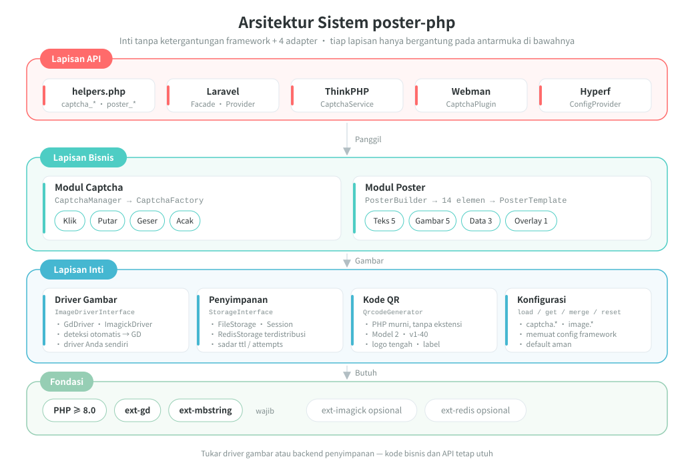
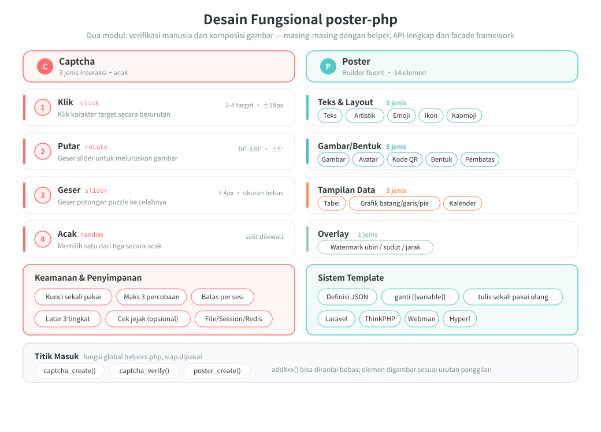
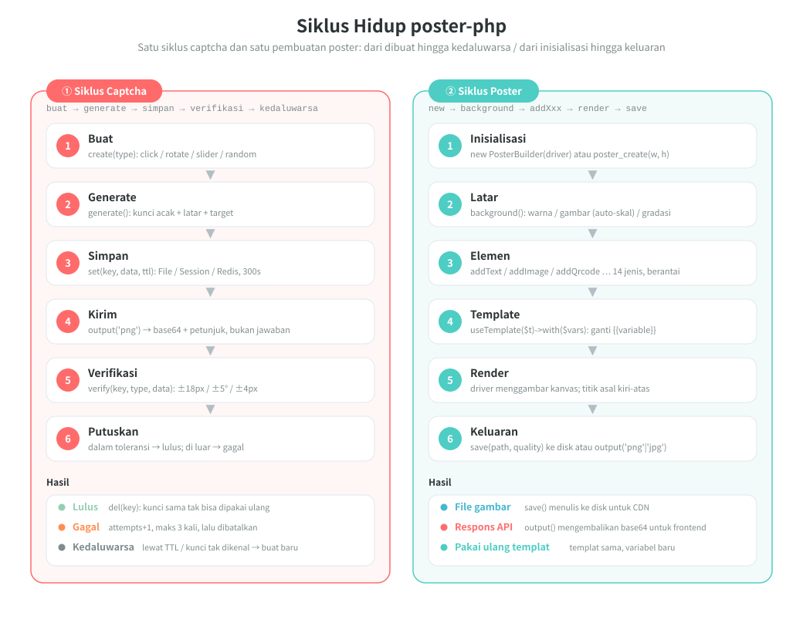

# poster-php

[中文](../../../README.md) | [English](../../../README_EN.md) | [日本語](../ja/README.md) | [한국어](../ko/README.md) | [Русский](../ru/README.md) | [Deutsch](../de/README.md) | [Français](../fr/README.md) | [Español](../es/README.md) | [Português](../pt/README.md) | [हिन्दी](../hi/README.md) | [العربية](../ar/README.md) | [বাংলা](../bn/README.md) | Bahasa Indonesia

<p align="center">
  
</p>

Toolkit PHP untuk captcha gambar dan pembuatan poster — inti tanpa ketergantungan framework + adapter Laravel / ThinkPHP / Webman / Hyperf.

[Dokumentasi Bahasa Inggris](../../../README_EN.md) | [Dokumen Arsitektur](../../../docs/architecture.md) | [Semua bahasa](../README.md)

## Ikhtisar Proyek

poster-php adalah toolkit gambar PHP yang hanya mengerjakan dua hal, dan mengerjakannya dengan cukup:

| Kemampuan | Keterangan |
|------|------|
| **Captcha** | Tiga verifikasi manusia (klik / putar / geser) plus mode acak; gambar dan jawaban dibuat murni dengan PHP, tanpa layanan pihak ketiga |
| **Pembuatan poster** | API Builder berantai dengan 14 jenis elemen untuk kebutuhan tata letak teks, gambar, kode QR, tabel, diagram, kalender, dan lainnya |
| **Tanpa ketergantungan framework** | Inti hanya butuh PHP ≥ 8.0 + GD, bisa dipakai sebagai paket Composer biasa tanpa framework |
| **Siap pakai** | 3 fungsi helper global + 4 adapter framework (Laravel / ThinkPHP / Webman / Hyperf) |
| **Bisa ditukar** | Driver gambar (GD / ImageMagick) dan backend penyimpanan (File / Session / Redis) semuanya berupa implementasi antarmuka, tukar sesuai kebutuhan |

> Maskot proyek **Posty** — maskot yang tersusun dari badan poster, kartu kode QR, dan puzzle slider, tepat mencerminkan dua kemampuan utama paket ini: menghasilkan gambar dan verifikasi. Ia ikut didistribusikan bersama paket ([`assets/pet.svg`](../../../assets/pet.svg) / `assets/pet.png`), bisa digambar ke poster dengan `->addPet()`, atau diatur sebagai placeholder untuk gambar yang hilang.

## Struktur Proyek

```
poster-php/
├── src/                        # kode inti: 64 file PHP / sekitar 6093 baris
│   ├── Captcha/                # modul captcha: antarmuka + kelas abstrak + 3 implementasi + factory + manager
│   │                           #   + RateLimiter (pembatasan) / TrajectoryVerifier (verifikasi jejak)
│   ├── Poster/                 # modul poster (Elements/ElementRegistry.php sebagai registri elemen terpusat)
│   │   ├── PosterBuilder.php   # Builder berantai, 14 metode addXxx()
│   │   ├── PosterTemplate.php  # template JSON → substitusi {{variabel}}
│   │   └── Elements/           # 14 perender elemen + ElementInterface + kelas abstrak
│   ├── Drivers/                # driver gambar: ImageDriverInterface / GdDriver / ImagickDriver
│   ├── Storage/                # penyimpanan data verifikasi: File / Session / Redis / cache PSR-16
│   ├── Qrcode/                 # generator kode QR murni PHP (Model 2, v1-40, tanpa ekstensi)
│   ├── Adapters/               # adapter framework: Laravel / ThinkPHP / Webman / Hyperf
│   ├── PosterConfig.php        # pembacaan konfigurasi (nilai default + merge config framework)
│   └── Installer.php           # menyalin file konfigurasi otomatis setelah composer install
├── config/
│   └── poster.php              # konfigurasi default (captcha / driver gambar)
├── assets/
│   ├── backgrounds/            # 6 gambar latar captcha bawaan (PNG 400×250)
│   ├── pet.svg                 # maskot proyek Posty (sumber vektor)
│   └── pet.png                 # hasil raster pet.svg: dipakai addPet() dan placeholder
├── helpers.php                 # fungsi global: captcha_create / captcha_verify / poster_create
├── native.php                  # entri PHP native — cukup require, tanpa Composer
├── tests/                      # tes PHPUnit, 53 file, struktur direktori mencerminkan src/
├── examples/                   # skrip contoh yang bisa langsung dijalankan
├── docs/                       # dokumen arsitektur, diagram desain & siklus hidup (SVG), kode donasi
└── composer.json               # PSR-4: Erikwang2013\Poster\ → src/
```

## Arsitektur & Desain

### Desain Arsitektur Sistem

Dependensi berlapis: lapisan atas hanya memanggil antarmuka lapisan bawah, sehingga mengganti driver atau implementasi penyimpanan tidak mengubah kode bisnis sama sekali.



### Desain Fungsional

Rincian fitur dua modul utama: empat interaksi captcha beserta fitur keamanannya, serta 14 elemen poster dan sistem template.



### Siklus Hidup

Alur lengkap satu verifikasi captcha (buat → generate → simpan → kirim → verifikasi → lulus / gagal / kedaluwarsa) dan satu pembuatan poster (inisialisasi → latar → elemen → template → render → keluaran).



## Fitur

### Captcha (tiga mode + acak)

| Jenis | Keterangan |
|------|------|
| Verifikasi klik `click` | Pengguna mengklik teks target pada gambar secara berurutan |
| Verifikasi putar `rotate` | Pengguna menggeser slider untuk memutar gambar kembali ke sudut yang benar |
| Verifikasi geser `slider` | Pengguna menggeser potongan puzzle ke posisi celah |
| Acak `random` | Memilih salah satu dari tiga jenis captcha di atas secara acak |

### Pembuatan Poster

API Builder berantai dengan 14 jenis elemen:

| Elemen | Metode | Keterangan |
|------|------|------|
| Teks | `addText()` | Word wrap otomatis, perataan, multibaris |
| Gambar | `addImage()` | Skala dan crop, sudut membulat, bayangan |
| Avatar | `addAvatar()` | Crop bulat, bingkai |
| Kode QR | `addQrcode()` | Dibuat murni dengan PHP, logo tengah, teks bawah |
| Bentuk | `addShape()` | Persegi/bulat/membulat, isi/garis tepi |
| Garis pemisah | `addLine()` | Warna, ketebalan |
| Watermark | `addWatermark()` | Teks berubin, sudut, jarak |
| Tabel | `addTable()` | Baris header, garis zebra, lebar kolom |
| Diagram | `addChart()` | Diagram batang / garis / pie |
| Kalender | `addCalendar()` | Kalender bulanan, tanggal disorot, anotasi |
| Teks artistik | `addArtisticText()` | Garis tepi / bayangan / gradasi / neon |
| Emoji | `addEmoji()` | Rendering emoji berwarna |
| Ikon font | `addIcon()` | Rendering ikon FontAwesome |
| Kaomoji | `addEmoticon()` | Kaomoji Jepang / emotikon kustom |

## Instalasi

```bash
composer require erikwang2013/poster-php
```

Persyaratan sistem: PHP >= 8.0, ekstensi GD.

Ekstensi opsional:
- `ext-imagick`: driver gambar ImageMagick (performa lebih baik, fitur lebih lengkap)
- `ext-redis`: penyimpanan captcha Redis (deployment terdistribusi)

### Tanpa Composer (PHP native)

Letakkan seluruh direktori `poster-php/` ke dalam proyek Anda, lalu cukup sertakan `native.php`: file ini mendaftarkan autoload PSR-4 dan memuat fungsi global, tanpa perlu Composer dan tanpa framework apa pun.

```php
require '/path/to/poster-php/native.php';   // daftarkan autoload + fungsi global

$result  = captcha_create('click');
$builder = poster_create(750, 1334);
```

`native.php` bisa disertakan berulang kali dan juga hidup berdampingan dengan Composer atau autoloader bawaan proyek (bila terpasang ganda, utamakan `vendor/autoload.php`).

## Panduan Penggunaan

### I. Captcha

#### 1. Captcha Klik (ClickCaptcha)

Pengguna harus mengklik teks target pada gambar secara berurutan (misalnya "树", "鸟", "花") untuk membuktikan bahwa dirinya manusia.

```php
// Lewat fungsi helper (tanpa framework)
$result = captcha_create('click', [
    'difficulty' => 'medium',    // 'easy'(2 target) | 'medium'(3 target) | 'hard'(4 target)
    'background' => null,        // path gambar latar kustom, null = latar gradasi terprogram (gaya acak)
]);

// Hasil yang dikembalikan
// $result = [
//     'key'   => 'abc123...',           // identitas unik verifikasi, dikirim ke frontend
//     'image' => 'data:image/png;base64,...', // gambar base64
//     'extra' => [
//         'texts' => [
//             ['order' => 1, 'text' => '树'],
//             ['order' => 2, 'text' => '鸟'],
//             ['order' => 3, 'text' => '花'],
//         ],
//     ],
// ];

// Frontend menampilkan teks petunjuk sesuai urutan order, pengguna mengklik posisi yang sesuai
// (koordinat target tidak dikembalikan, verifikasi hanya di server)
// Frontend mengirim koordinat klik pengguna [[x1,y1], [x2,y2], [x3,y3]]
$pass = captcha_verify($result['key'], 'click', [[120, 80], [200, 150], [310, 95]]);
// Mengembalikan true / false, toleransi radius 18px

// Lewat CaptchaManager (API lengkap)
use Erikwang2013\Poster\Captcha\CaptchaManager;
use Erikwang2013\Poster\Drivers\DriverFactory;
use Erikwang2013\Poster\Storage\FileStorage;

$manager = new CaptchaManager(DriverFactory::create(), new FileStorage());
$captcha = $manager->create('click')
    ->setDifficulty('hard')        // easy=2 target | medium=3 target | hard=4 target
    ->setTargetType('text')        // 'text' teks | 'icon' ikon
    ->setWords(['猫', '狗', '鸟', '鱼']) // kumpulan kata kustom (opsional)
    ->setBackground('/path/to/bg.jpg');
$result = $captcha->generate();

$pass = $manager->verify($result['key'], [
    'type' => 'click',
    'data' => [[120, 80], [200, 150], [310, 95], [180, 60]],
]);
```

`setTargetType('icon')` mengganti teks target dengan bentuk vektor yang dibuat secara terprogram (11 jenis, digambar memakai primitif GD, tanpa perlu aset gambar):
setiap item `extra['texts']` mendapat tambahan `thumb` (gambar kecil base64 dari bentuk tersebut) untuk ditampilkan frontend sebagai petunjuk klik; verifikasinya tetap membandingkan koordinat.

#### 2. Captcha Putar (RotateCaptcha)

Sistem memutar gambar secara acak 30°~330°, pengguna menggeser slider untuk memutar gambar kembali ke posisi tegak.

```php
// Lewat fungsi helper
$result = captcha_create('rotate');
// $result['extra'] tidak memuat sudut (jawaban verifikasi), frontend hanya menampilkan gambar yang sudah diputar

$pass = captcha_verify($result['key'], 'rotate', 185);  // sudut putaran pengguna, toleransi ±5°

// Lewat CaptchaManager
$captcha = $manager->create('rotate')
    ->setSize(200)                 // diameter lingkaran 60-400 (default 200)
    ->setAngleRange(45, 315)       // rentang sudut putaran kustom
    ->generate();
```

#### 3. Captcha Geser (SliderCaptcha)

Sistem memotong potongan puzzle dari latar lalu menggesernya, pengguna menggeser puzzle ke posisi celah.

```php
// Lewat fungsi helper
$result = captcha_create('slider');
// $result = [
//     'image' => '...',              // gambar latar dengan celah
//     'extra' => [
//         'puzzle'   => '...',        // gambar potongan puzzle
//         'puzzle_w' => 50,           // lebar puzzle
//         'puzzle_h' => 50,           // tinggi puzzle
//     ],
// ];

$pass = captcha_verify($result['key'], 'slider', 173);  // piksel x geseran pengguna, toleransi ±4px
```

#### 4. Mode Acak (RandomCaptcha)

Sistem memilih satu jenis captcha secara acak dari click / rotate / slider, sehingga lebih sulit ditembus.

```php
// Lewat fungsi helper — satu baris kode untuk membuat secara acak
$result = captcha_create('random');
// $result['type'] mengembalikan jenis yang benar-benar dipilih: 'click' | 'rotate' | 'slider'

// Frontend merender komponen interaksi yang sesuai berdasarkan type
switch ($result['type']) {
    case 'click':
        // render komponen klik: tampilkan gambar, pengguna mengklik teks petunjuk di extra.texts secara berurutan
        break;
    case 'rotate':
        // render komponen putar: tampilkan gambar, pengguna menggeser untuk memutar
        break;
    case 'slider':
        // render komponen geser: tampilkan gambar bercelah + potongan puzzle
        break;
}

// Saat verifikasi, kirim jenis yang sebenarnya dan data aksi pengguna
$pass = captcha_verify($result['key'], $result['type'], $userData);
// click: $userData = [[x1,y1],[x2,y2],...]
// rotate: $userData = 185 (sudut)
// slider: $userData = 173 (piksel)

// Lewat CaptchaManager
$captcha = $manager->create('random')->generate();
$pass = $manager->verify($captcha['key'], [
    'type' => $captcha['type'],
    'data' => $userData,
]);
```

#### Fitur Keamanan Verifikasi

| Fitur | Keterangan |
|------|------|
| Sekali pakai | key dihapus setelah verifikasi berhasil atau percobaan melebihi batas |
| Anti brute-force | Default maksimal 3 kali verifikasi (dapat dikonfigurasi) |
| Masa berlaku | Default 300 detik (dapat dikonfigurasi) |
| Keacakan | Warna latar, noise, dan posisi target setiap kali dibuat selalu acak; tiap target klik mendapat hue dan sudut rotasi yang acak |
| Pembatasan per sesi | Pembatasan jendela waktu yang berlaku lintas key (default 30 kali dalam 60 detik), menutup tebakan buta "ganti key baru lalu tebak sekali lagi" |
| Jejak perilaku | Opsional (default nonaktif): memeriksa jumlah titik, durasi, dan kelinieran jejak geser; skrip yang langsung POST jawaban akan ditolak |
| Latar yang menarik | Latar gradasi terprogram dengan tiga gaya (sederhana/ceria/alami) yang berganti acak, mendukung konfigurasi direktori gambar latar default |
| Ukuran minimum kanvas | Latar yang terlalu kecil langsung menghasilkan error, bukan degradasi (captcha klik minimal 120×120, slider minimal harus memuat potongan puzzle 4×2) |

#### Verifikasi Jejak Perilaku (Opsional)

Default nonaktif (agar tidak salah menolak perangkat layar sentuh dan perangkat aksesibilitas). Setelah diaktifkan, `slider` / `rotate` mengharuskan frontend mengirim jejak geser; server memeriksa jumlah titik, durasi, dan kelinieran jejak:

```php
// config/poster.php
'captcha' => [
    'trajectory' => [
        'enabled'      => true,
        'min_points'   => 4,      // jumlah titik sampel minimum
        'min_duration' => 300,    // durasi terpendek (milidetik)
        'max_duration' => 5000,   // durasi terpanjang (milidetik)
        'max_linearity' => 0.99,  // kelinieran di atas nilai ini dianggap mesin (geseran skrip berupa garis lurus)
    ],
],

// Pengiriman dari frontend: cara lama yang mengirim angka tetap kompatibel
captcha_verify($key, 'slider', 173);
// Setelah verifikasi jejak aktif, jejak wajib disertakan
captcha_verify($key, 'slider', ['x' => 173, 'trail' => [[12, 3, 0], [40, 9, 22], /* … */], 'duration' => 1200]);
```

#### Konfigurasi Gambar Latar

Latar captcha mendukung tiga tingkat prioritas:

1. **Satu gambar** — ditentukan lewat `setBackground('/path/to/bg.jpg')`
2. **Direktori gambar** — konfigurasi `captcha.background_dir` diarahkan ke direktori gambar, default ke `assets/backgrounds/` (berisi 6 gambar latar gradasi bawaan)
3. **Dibuat terprogram** — aktif saat `background_dir` diatur ke `null`, tiga gaya berganti secara acak

```php
// Cara 1: tentukan satu gambar lewat kode
$captcha = $manager->create('click')->setBackground('/path/to/bg.jpg');

// Cara 2: ganti gambar latar default (config/poster.php)
'captcha' => [
    // taruh gambar latar Anda sendiri di direktori ini, akan dipilih acak secara otomatis
    'background_dir' => '/path/to/my-backgrounds',
    // atur ke null untuk memakai latar gradasi terprogram
    // 'background_dir' => null,
],

// Cara 3: tanpa konfigurasi apa pun, otomatis memakai gambar latar default bawaan (assets/backgrounds/)
```

**Gambar latar default**: `assets/backgrounds/` menyertakan 6 latar gradasi PNG 400×250 dengan gaya biru-ungu, senja, hijau segar, gelap, pastel, dan biru laut.

Tiga gaya terprogram:

| Gaya | Keterangan |
|------|------|
| `minimal` sederhana | Gradasi lembut + lingkaran besar transparan + garis geometris + titik halus jarang |
| `vibrant` ceria | Gradasi cerah + lingkaran warna-warni berbagai ukuran + noise kepadatan sedang |
| `natural` alami | Gradasi warna hangat + bidang warna tak beraturan menyerupai tekstur kertas + titik halus rapat |

### II. Pembuatan Poster

#### Penggunaan Dasar

```php
use Erikwang2013\Poster\Poster\PosterBuilder;
use Erikwang2013\Poster\Drivers\DriverFactory;

// Lewat fungsi helper
$builder = poster_create(750, 1334);  // lebar × tinggi

// Atau instansiasi langsung
$builder = new PosterBuilder(DriverFactory::create());
$builder->width(750)->height(1334);

// Mengatur latar
$builder->background('#FFFFFF');                            // latar warna solid
$builder->background('/path/to/bg.jpg');                    // latar gambar (diskalakan otomatis)
$builder->backgroundGradient('#FF6B6B', '#FF8E53', 'vertical'); // latar gradasi
                                                            // arah: vertical | horizontal

// Keluaran
$builder->save('/output/poster.jpg', 90);  // simpan ke file (path, kualitas 0-100)
                                           // format disimpulkan dari ekstensi: jpg/jpeg/png/webp/gif
                                           // bila kualitas tidak diberikan, JPEG membaca poster.jpeg_quality, PNG membaca poster.png_compression
$dataUrl = $builder->output('png', 90);    // ambil base64 data URL
```

#### Teks `addText()`

```php
$builder->addText('新品首发', [
    'x'        => 80,              // koordinat x
    'y'        => 120,             // koordinat y (posisi baseline)
    'size'     => 48,              // ukuran font
    'color'    => '#333333',       // warna
    'font'     => '/path/to/font.ttf', // file font, null=bawaan GD
    'align'    => 'center',        // left | center | right
    'maxWidth' => 600,             // lebar maksimum (word wrap otomatis)
    'lineHeight' => 72,            // tinggi baris
    'angle'    => 0,               // sudut rotasi
]);
```

#### Gambar `addImage()`

```php
$builder->addImage('/path/to/product.jpg', [
    'x'      => 75,
    'y'      => 280,
    'width'  => 600,              // lebar render (diskalakan otomatis)
    'height' => 600,              // tinggi render
    'radius' => 12,               // radius sudut membulat
    'shadow' => [                 // bayangan (opsional)
        'color'    => '#00000033',
        'offsetX'  => 4,
        'offsetY'  => 4,
        'blur'     => 10,
    ],
]);
```

#### Avatar `addAvatar()`

```php
$builder->addAvatar('/path/to/avatar.jpg', [
    'x'      => 80,
    'y'      => 60,
    'size'   => 120,              // ukuran avatar (persegi)
    'border' => '#FF6B6B',        // warna bingkai (opsional)
]);
```

#### Kode QR `addQrcode()`

```php
$builder->addQrcode('https://example.com/page/123', [
    'x'     => 275,
    'y'     => 1050,
    'size'  => 200,               // ukuran kode QR
    'level' => 'H',               // tingkat koreksi galat L | M | Q | H
    'logo'  => '/path/to/logo.png', // logo tengah (opsional)
    'label' => '扫码查看详情',      // teks bawah (opsional)
    'label_size'  => 14,
    'label_color' => '#999999',
]);
```

Bila kapasitas melebihi batas versi tersebut (misalnya di atas sekitar 1273 byte untuk level H), akan dilempar `InvalidArgumentException`, tidak lagi diam-diam menghasilkan kode yang tidak bisa dipindai.

#### Bentuk `addShape()`

```php
// Persegi
$builder->addShape('rect', [
    'x' => 0, 'y' => 0, 'width' => 750, 'height' => 60,
    'color'  => '#FF6B6B',
    'filled' => true,             // true=isi false=garis tepi
    'radius' => 8,                // radius sudut membulat
    'opacity' => 0.8,             // opasitas 0-1
]);

// Bulat
$builder->addShape('circle', [
    'x' => 100, 'y' => 100, 'width' => 80, 'height' => 80,
    'color' => '#4ECDC4',
]);
```

#### Garis Pemisah `addLine()`

```php
$builder->addLine([
    'x1' => 75, 'y1' => 800,
    'x2' => 675, 'y2' => 800,
    'color' => '#EEEEEE',
    'width' => 1,
]);
```

#### Watermark `addWatermark()`

```php
$builder->addWatermark('CONFIDENTIAL', [
    'size'    => 24,
    'color'   => '#00000020',     // semi-transparan
    'font'    => '/font.ttf',
    'angle'   => 30,              // sudut kemiringan
    'spacing' => 200,             // jarak
]);
```

#### Tabel `addTable()`

```php
$builder->addTable([
    'x'      => 50,
    'y'      => 800,
    'width'  => 650,
    'columns' => [150, 350, 150], // lebar kolom
    'header'  => ['序号', '项目', '价格'],
    'rows'    => [
        ['1', '商品A', '¥99'],
        ['2', '商品B', '¥199'],
        ['3', '商品C', '¥299'],
    ],
    'headerBg'     => '#333333',
    'headerColor'  => '#FFFFFF',
    'rowBg'        => ['#FFFFFF', '#F5F5F5'], // garis zebra
    'rowColor'     => '#333333',
    'fontSize'     => 24,
    'cellPadding'  => 10,
]);
```

#### Diagram `addChart()`

```php
// Diagram batang
$builder->addChart('bar', [
    ['label' => '一月', 'value' => 120],
    ['label' => '二月', 'value' => 200],
    ['label' => '三月', 'value' => 150],
    ['label' => '四月', 'value' => 300],
], [
    'x' => 50, 'y' => 100, 'width' => 650, 'height' => 400,
    'colors' => ['#FF6B6B', '#4ECDC4', '#45B7D1', '#96CEB4'],
]);

// Diagram garis
$builder->addChart('line', [
    ['label' => '周一', 'value' => 10],
    ['label' => '周二', 'value' => 35],
    ['label' => '周三', 'value' => 25],
    ['label' => '周四', 'value' => 45],
    ['label' => '周五', 'value' => 30],
], [
    'x' => 50, 'y' => 100, 'width' => 650, 'height' => 400,
    'colors' => ['#FF6B6B'],
]);

// Diagram pie
$builder->addChart('pie', [
    ['label' => '电商', 'value' => 45],
    ['label' => '社交', 'value' => 25],
    ['label' => '搜索', 'value' => 15],
    ['label' => '其他', 'value' => 15],
], [
    'x' => 75, 'y' => 100, 'width' => 600, 'height' => 600,
    'colors' => ['#FF6B6B', '#4ECDC4', '#45B7D1', '#96CEB4'],
]);
```

#### Kalender `addCalendar()`

```php
$builder->addCalendar([
    'x'     => 50,
    'y'     => 200,
    'year'  => 2026,
    'month' => 5,                   // 1-12
    'cellSize'    => 60,            // ukuran sel
    'startDay'    => 0,             // 0=Minggu 1=Senin
    'title'       => '2026年5月',    // judul (dibuat otomatis secara default)
    'highlights'  => [              // tanggal yang disorot
        '2026-05-01' => ['bg' => '#FF6B6B', 'text' => '劳动节'],
        '2026-05-16' => ['bg' => '#FFEAA7', 'text' => '今天'],
    ],
    'headerBg'    => '#333333',     // latar baris judul
    'headerColor' => '#FFFFFF',     // warna teks baris judul
    'cellBg'      => '#FFFFFF',     // latar sel
    'cellBorder'  => '#DDDDDD',     // garis tepi sel
    'todayBg'     => '#FF6B6B',     // warna latar hari ini
    'highlightBg' => '#FFF3CD',    // warna latar default sorotan
    'textColor'   => '#333333',     // warna teks tanggal
    'dimColor'    => '#CCCCCC',     // warna tanggal luar bulan / kosong
]);
```

#### Teks Artistik `addArtisticText()`

```php
// Efek garis tepi
$builder->addArtisticText('SALE', 'stroke', [
    'x' => 80, 'y' => 120, 'size' => 72,
    'color'       => '#FF6B6B',    // warna isi
    'strokeColor' => '#000000',    // warna garis tepi
    'strokeWidth' => 3,            // ketebalan garis tepi
]);

// Efek bayangan
$builder->addArtisticText('新品', 'shadow', [
    'x' => 80, 'y' => 120, 'size' => 48,
    'color'         => '#333333',
    'shadowColor'   => '#00000033',
    'shadowOffsetX' => 4,
    'shadowOffsetY' => 4,
]);

// Efek gradasi
$builder->addArtisticText('VIP', 'gradient', [
    'x' => 80, 'y' => 120, 'size' => 60,
    'color'  => '#FF6B6B',         // warna atas
    'color2' => '#FF8E53',         // warna bawah
]);

// Efek neon bercahaya
$builder->addArtisticText('HOT', 'neon', [
    'x' => 80, 'y' => 120, 'size' => 56,
    'color'     => '#FF1493',
    'glowColor' => '#FF1493',
]);
```

#### Emoji `addEmoji()`

```php
// Memakai karakter emoji secara langsung
$builder->addEmoji('😀', ['x' => 100, 'y' => 100, 'size' => 64]);
$builder->addEmoji('🎉', ['x' => 180, 'y' => 100, 'size' => 64]);

// Memakai codepoint unicode
$builder->addEmoji('', [
    'x' => 100, 'y' => 100, 'size' => 64,
    'codepoint' => 'U+1F600',      // sama dengan 😀
]);

// Tentukan font emoji (sistem harus mendukung font berwarna)
$builder->addEmoji('😀', [
    'x' => 100, 'y' => 100, 'size' => 64,
    'font' => '/System/Library/Fonts/Apple Color Emoji.ttc',
]);
```

Sistem mendeteksi sendiri path font emoji di macOS / Linux / Windows.

> Catatan: apakah emoji bisa digambar bergantung pada fontnya. `NotoColorEmoji.ttf` yang umum di Linux adalah font bitmap berwarna CBDT yang tidak bisa dimuat oleh kanal FreeType milik GD (`imagettftext()` langsung gagal), sehingga emoji tidak akan digambar; gunakan font emoji lain di sistem yang bisa dimuat normal oleh FreeType.

#### Ikon Font `addIcon()`

```php
// Memakai nama ikon FontAwesome bawaan (perlu menyediakan file font ikon)
$builder->addIcon('heart', [
    'x' => 20, 'y' => 40, 'size' => 32,
    'color' => '#E74C3C',
    'font'  => '/path/to/fa-solid-900.ttf',  // wajib menyediakan font TTF FontAwesome
]);

$builder->addIcon('star',  ['x' => 60, 'y' => 40, 'color' => '#F39C12', 'font' => '/path/to/fa-solid-900.ttf']);
$builder->addIcon('check', ['x' => 100, 'y' => 40, 'color' => '#27AE60', 'font' => '/path/to/fa-solid-900.ttf']);

// Memakai codepoint unicode kustom
$builder->addIcon('', [
    'x' => 20, 'y' => 40, 'size' => 32,
    'codepoint' => '\\u{F3C5}',    // map-marker
    'color' => '#E74C3C',
    'font' => '/path/to/fa-solid-900.ttf',
]);

// Daftar nama ikon bawaan
// heart, star, user, clock, home, cog, check, times, search,
// envelope, phone, camera, play, pause, shopping-cart, tag,
// map-marker, calendar, comment, share, download, upload,
// lock, globe, link, image, music, video, bell, bookmark,
// thumbs-up, eye, trash, edit, plus, minus, arrow-*,
// location-dot, fire, gift, rocket
```

#### Kaomoji `addEmoticon()`

```php
// Memakai kaomoji bawaan
$builder->addEmoticon('happy', ['x' => 20, 'y' => 40, 'size' => 24]);
// Hasil: (｡•̀ᴗ-)✧

$builder->addEmoticon('love',  ['x' => 20, 'y' => 80, 'size' => 24]);
// Hasil: (♡°▽°♡)

$builder->addEmoticon('cry',   ['x' => 20, 'y' => 120, 'size' => 24]);
// Hasil: (╥﹏╥)

// Teks emotikon kustom
$builder->addEmoticon('', [
    'x' => 20, 'y' => 40, 'size' => 24,
    'text' => '(╯°□°）╯︵ ┻━┻',    // teks kustom
    'color' => '#333333',
]);

// Ekspresi kaomoji bawaan
// happy, love, cry, angry, surprised, cool, sleepy,
// wave, think, shrug, tableflip, lenny
```

#### Maskot Proyek `addPet()`

Maskot bawaan Posty (`assets/pet.png`, hasil raster `assets/pet.svg`) bisa langsung digambar ke poster, setara dengan `addImage(PosterBuilder::petPath(), $options)`:

```php
$builder->addPet([
    'x'      => 555,
    'y'      => 140,
    'width'  => 150,
    'height' => 130,   // diskalakan sesuai lebar dan tinggi yang diberikan, sebaiknya pertahankan rasio 600:520
    'radius' => 0,     // mendukung semua opsi addImage()
]);

// Bisa juga ambil path-nya untuk dipakai sendiri (misalnya sebagai logo tengah kode QR)
$logo = PosterBuilder::petPath();
```

**Placeholder gambar hilang**: `addImage()` / `addAvatar()` secara default melewati file yang tidak ada dan tidak menggambarnya. Arahkan `poster.placeholder` ke maskot, maka posisi gambar yang hilang akan digambar Posty sehingga langsung terlihat gambar mana yang terlupa:

```php
// config/poster.php
'poster' => [
    'placeholder' => dirname(__DIR__) . '/assets/pet.png',
],
```

### III. Sistem Template

```php
use Erikwang2013\Poster\Poster\PosterTemplate;

// Definisikan template (bisa diserialisasi ke JSON)
$template = PosterTemplate::fromConfig([
    'width'  => 750,
    'height' => 1334,
    'elements' => [
        ['type' => 'shape', 'color' => '#FF6B6B', 'x' => 0, 'y' => 0, 'width' => 750, 'height' => 300],
        ['type' => 'text', 'text' => '{{title}}', 'x' => 80, 'y' => 100, 'size' => 48, 'color' => '#FFFFFF'],
        ['type' => 'text', 'text' => '{{subtitle}}', 'x' => 80, 'y' => 180, 'size' => 28, 'color' => '#FFE0E0'],
        ['type' => 'image', 'src' => '{{cover}}', 'x' => 75, 'y' => 350, 'width' => 600, 'height' => 600, 'radius' => 12],
        ['type' => 'qrcode', 'content' => '{{url}}', 'x' => 275, 'y' => 1050, 'size' => 200, 'label' => '扫码查看详情'],
    ],
]);

// Render dengan template + variabel
$builder->useTemplate($template)->with([
    'title'    => '新品首发',
    'subtitle' => '限时特惠 · 买一送一',
    'cover'    => '/path/to/product.jpg',
    'url'      => 'https://m.example.com/product/123',
])->save('/output/poster.jpg');

// Jenis elemen yang didukung template: text, image, qrcode, avatar, shape, line, watermark, table,
//                      chart, calendar, artistic-text, emoji, icon, emoticon
```

`useTemplate()` secara default **mengganti** elemen `addXxx()` sebelumnya (mempertahankan semantik semula); untuk "template sebagai dasar + elemen tulisan tangan di atasnya", gunakan parameter kedua:

```php
$builder->replaceElements(false)->useTemplate($template)->with($vars)->addPet(['x' => 20, 'y' => 20, 'width' => 80]);

// Ekspor balik: ubah builder saat ini (atau satu elemen) menjadi struktur template, bisa dimasukkan lagi ke fromConfig()
$config = $builder->toArray();          // ['width'=>…, 'height'=>…, 'elements'=>[…]]
$template2 = PosterTemplate::fromConfig($config);   // ekspor → impor lagi, struktur tetap sama

// Jenis elemen baru cukup didaftarkan sekali di ElementRegistry, Builder dan template langsung berlaku
$builder->add('text', ['text' => 'hello', 'x' => 10, 'y' => 30, 'size' => 20]);
```

> Catatan: sejak versi ini `AbstractElement::toArray()` mengembalikan "nama jenis singkat + opsi yang diratakan" (sebelumnya `['type' => nama kelas, 'options' => [...]]`), agar konsisten saat bolak-balik dengan struktur template.

## Integrasi Framework

### Laravel

```php
use Erikwang2013\Poster\Adapters\Laravel\Facades\Captcha;
use Erikwang2013\Poster\Adapters\Laravel\Facades\Poster;

$result = Captcha::create('click')->generate();
Poster::width(750)->height(1334)->background('#FFF')->save('poster.jpg');
```

```php
// Setelah captcha.route.enabled = true di config/poster.php, adapter mendaftarkan endpoint gambar:
//   GET /captcha/{key} → langsung mengembalikan PNG (Content-Type: image/png, Cache-Control: no-store)
// Frontend cukup memakai URL, tidak perlu mengirim base64 lagi (33% lebih kecil dan bisa di-cache browser/CDN)
$result = Captcha::create('click')->generate();
// $result['image'] tetap data URI; $result['url'] adalah alamat yang bisa langsung dipasang di 

// Validasi form: nama rule adalah captcha, parameternya image key
$request->validate([
    'captcha_key'  => 'required|string',
    'captcha_code' => 'required|captcha:captcha_key',
]);
```

```bash
php artisan vendor:publish --tag=poster-config
```

### ThinkPHP

`config/web.php`:
```php
'services' => [
    Erikwang2013\Poster\Adapters\ThinkPHP\CaptchaService::class,
    Erikwang2013\Poster\Adapters\ThinkPHP\PosterService::class,
],
```

### Webman

`config/bootstrap.php`:
```php
return [
    Erikwang2013\Poster\Adapters\Webman\CaptchaPlugin::class,
    Erikwang2013\Poster\Adapters\Webman\PosterPlugin::class,
];
```

### Hyperf

Terdaftar otomatis lewat ConfigProvider.

## Konfigurasi

Setelah `composer require`, `config/poster.php` otomatis disalin ke direktori `config/` proyek (dilewati jika sudah ada). Kompatibel dengan Laravel / ThinkPHP / Webman (`config/poster.php`) dan Hyperf (`config/autoload/poster.php`).

Item konfigurasi utama:

| Item | Nilai default | Keterangan |
|--------|--------|------|
| `captcha.default_type` | `random` | Jenis captcha default: `click` / `rotate` / `slider` / `random` |
| `captcha.default_difficulty` | `medium` | Tingkat kesulitan default: `easy` / `medium` / `hard` |
| `captcha.click_words` | `[合,家,欢,...]` | Kumpulan kata untuk captcha click, bisa dikustomisasi |
| `captcha.background_dir` | `assets/backgrounds/` | Direktori gambar latar, `null` berarti dibuat terprogram |
| `captcha.ttl` | `300` | Masa berlaku captcha (detik) |
| `captcha.max_attempts` | `3` | Jumlah maksimum verifikasi |
| `captcha.tolerance` | `{click:18,rotate:5,slider:4}` | Toleransi tiap jenis |
| `image.driver` | `auto` | Driver gambar: `auto` / `gd` / `imagick` |
| `poster.placeholder` | `null` | Path placeholder untuk gambar yang hilang, `null` berarti dilewati; atur ke path maskot agar Posty digambar di posisi gambar yang hilang |
| `captcha.rate_limit` | `{max:30,window:60}` | Pembatasan jendela per sesi/akun; identitas default diambil dari session_id, bila tidak ada sesi diambil dari IP klien |
| `captcha.trajectory` | `{enabled:false,…}` | Verifikasi jejak perilaku (default nonaktif) |
| `captcha.cache.pool` | `null` | Objek pool PSR-16 (dipakai saat `storage=cache`), bisa juga diatur saat runtime lewat `StorageFactory::setPsr16Pool()` |
| `captcha.route` | `{enabled:false,path:'/captcha'}` | Adapter Laravel: mendaftarkan endpoint gambar `GET {path}/{key}` yang langsung mengembalikan PNG |

## Dukungan untuk Proyek Ini

| WeChat | Alipay |
|:---:|:---:|
|  |  |

---

## License

MIT License — Copyright (c) 2026 erik <erik@erik.xyz> — https://erik.xyz
