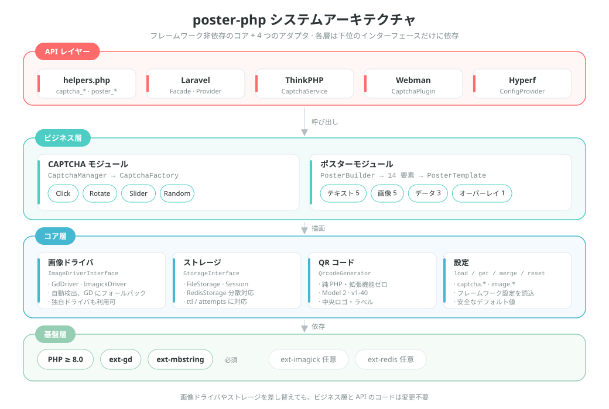
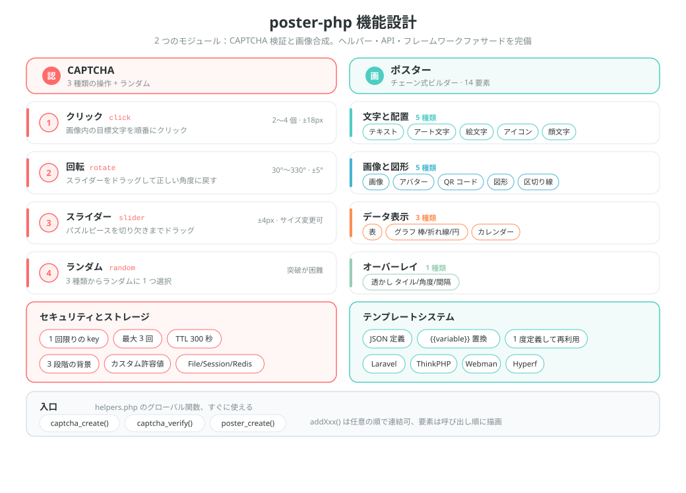
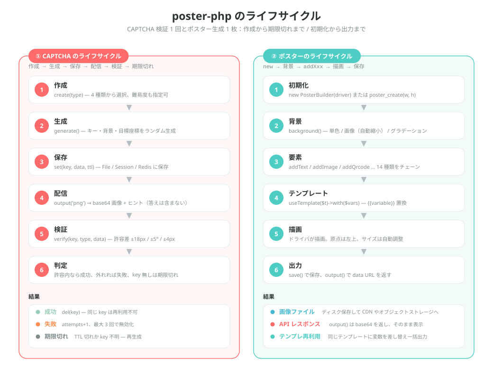

# poster-php

[中文](../../../README.md) | [English](../../../README_EN.md) | 日本語 | [한국어](../ko/README.md) | [Русский](../ru/README.md) | [Deutsch](../de/README.md) | [Français](../fr/README.md) | [Español](../es/README.md) | [Português](../pt/README.md) | [हिन्दी](../hi/README.md) | [العربية](../ar/README.md) | [বাংলা](../bn/README.md) | [Bahasa Indonesia](../id/README.md)

<p align="center">
  
</p>

PHP の画像 CAPTCHA・ポスター生成ツールキット —— フレームワーク非依存のコア + Laravel / ThinkPHP / Webman / Hyperf アダプタ。

[英語ドキュメント](../../../README_EN.md) | [アーキテクチャ設計ドキュメント](../../../docs/architecture.md)

## プロジェクト概要

poster-php は PHP の画像ツールキットです。やることは 2 つだけで、それを必要十分にこなします：

| 機能 | 説明 |
|------|------|
| **CAPTCHA** | クリック / 回転 / スライダーの 3 種類の人間検証 + ランダム切替。画像と答えを純 PHP で生成し、サードパーティサービスに依存しない |
| **ポスター生成** | メソッドチェーン式 Builder API。14 種類の要素で文字・画像・QR コード・表・グラフ・カレンダーなどのレイアウト要件をカバー |
| **フレームワーク非依存** | コアが依存するのは PHP ≥ 8.0 + GD のみ。通常の Composer パッケージとしてフレームワークなしで使える |
| **すぐに使える** | 3 つのグローバルヘルパー関数 + 4 種類のフレームワークアダプタ（Laravel / ThinkPHP / Webman / Hyperf） |
| **差し替え可能** | 画像ドライバ（GD / ImageMagick）とストレージバックエンド（File / Session / Redis）はいずれもインターフェース実装で、必要に応じて差し替えられる |

> プロジェクトのマスコット **Posty** —— ポスター本体・QR カード・スライダーパズルでできたキャラクターで、このパッケージの 2 大機能（画像生成と検証）にそのまま対応しています。パッケージに同梱され（[`assets/pet.svg`](../../../assets/pet.svg) / `assets/pet.png`）、`->addPet()` でポスターに描画でき、画像欠損時のプレースホルダーとしても設定できます。

## プロジェクト構成

```
poster-php/
├── src/                        # コアコード：64 個の PHP ファイル / 約 6093 行
│   ├── Captcha/                # CAPTCHA モジュール：インターフェース + 抽象基底クラス + 3 実装 + ファクトリ + マネージャ
│   │                           #   + RateLimiter（レート制限）/ TrajectoryVerifier（軌跡検証）
│   ├── Poster/                 # ポスターモジュール（Elements/ElementRegistry.php が要素の単一登録先）
│   │   ├── PosterBuilder.php   # チェーン式 Builder、14 個の addXxx() メソッド
│   │   ├── PosterTemplate.php  # JSON テンプレート → {{変数}} 置換
│   │   └── Elements/           # 14 種類の要素レンダラ + ElementInterface + 抽象基底クラス
│   ├── Drivers/                # 画像ドライバ：ImageDriverInterface / GdDriver / ImagickDriver
│   ├── Storage/                # 検証データのストレージ：File / Session / Redis / PSR-16 キャッシュ
│   ├── Qrcode/                 # 純 PHP の QR コード生成器（Model 2、v1-40、拡張機能への依存ゼロ）
│   ├── Adapters/               # フレームワークアダプタ：Laravel / ThinkPHP / Webman / Hyperf
│   ├── PosterConfig.php        # 設定の読み込み（デフォルト値でのフォールバック + フレームワーク設定のマージ）
│   └── Installer.php           # composer インストール後に設定ファイルを自動コピー
├── config/
│   └── poster.php              # デフォルト設定（CAPTCHA / 画像ドライバ）
├── assets/
│   ├── backgrounds/            # 内蔵 CAPTCHA 背景 6 枚（400×250 PNG）
│   ├── pet.svg                 # プロジェクトのマスコット Posty（ベクター原本）
│   └── pet.png                 # pet.svg をラスタライズ：addPet() と画像欠損プレースホルダーで使用
├── helpers.php                 # グローバル関数：captcha_create / captcha_verify / poster_create
├── native.php                  # ネイティブ PHP の入口：Composer 不要、require するだけ
├── tests/                      # PHPUnit テスト、53 ファイル、ディレクトリ構成は src/ とミラー
├── examples/                   # そのまま実行できるサンプルスクリプト
├── docs/                       # アーキテクチャ文書、設計・ライフサイクル図（SVG）、支援 QR コード
└── composer.json               # PSR-4：Erikwang2013\Poster\ → src/
```

## アーキテクチャと設計

### システムアーキテクチャ設計

階層化された依存関係：上位層は下位層のインターフェースを呼ぶだけなので、ドライバやストレージ実装を差し替えてもビジネスコードの変更はゼロです。



### 機能設計

2 大モジュールの機能分解：CAPTCHA の 4 種類の操作とセキュリティ特性、ポスターの 14 種類の要素とテンプレートシステム。



### ライフサイクル

CAPTCHA 検証 1 回（作成 → 生成 → 保存 → 配信 → 検証 → 成功 / 失敗 / 期限切れ）とポスター生成 1 枚（初期化 → 背景 → 要素 → テンプレート → 描画 → 出力）の全経路。



## 機能

### CAPTCHA（3 方式 + ランダム切替）

| 種類 | 説明 |
|------|------|
| クリック認証 `click` | ユーザーが画像上の目標文字を順番にクリックする |
| 回転認証 `rotate` | ユーザーがスライダーをドラッグして画像を正しい角度に戻す |
| スライダー認証 `slider` | ユーザーがパズルピースを欠けた位置までドラッグする |
| ランダム切替 `random` | 上記 3 種類の CAPTCHA からランダムに 1 つ選ぶ |

### ポスター生成

チェーン式 Builder API で 14 種類の要素に対応：

| 要素 | メソッド | 説明 |
|------|------|------|
| 文字 | `addText()` | 自動折り返し、配置、複数行 |
| 画像 | `addImage()` | 拡大縮小と切り抜き、角丸、影 |
| アバター | `addAvatar()` | 円形切り抜き、枠線 |
| QR コード | `addQrcode()` | 純 PHP で生成、中央ロゴ、下部テキスト |
| 図形 | `addShape()` | 矩形 / 円 / 角丸、塗りつぶし / 輪郭 |
| 区切り線 | `addLine()` | 色、幅 |
| 透かし | `addWatermark()` | タイル状の文字、角度、間隔 |
| 表 | `addTable()` | ヘッダー、ゼブラ柄、列幅 |
| グラフ | `addChart()` | 棒グラフ / 折れ線グラフ / 円グラフ |
| カレンダー | `addCalendar()` | 月間カレンダー、日付ハイライト、注記 |
| アート文字 | `addArtisticText()` | 輪郭 / 影 / グラデーション / ネオン |
| Emoji | `addEmoji()` | カラー emoji の描画 |
| フォントアイコン | `addIcon()` | FontAwesome アイコンの描画 |
| 顔文字 | `addEmoticon()` | 日本の顔文字 / カスタム表情 |

## インストール

```bash
composer require erikwang2013/poster-php
```

動作要件：PHP >= 8.0、GD 拡張。

オプション拡張：
- `ext-imagick`：ImageMagick 画像ドライバ（性能が高く、機能も豊富）
- `ext-redis`：Redis による CAPTCHA ストレージ（分散構成）

### Composer を使わない（ネイティブ PHP）

`poster-php/` ディレクトリを丸ごとプロジェクトに置き、`native.php` を読み込むだけです。PSR-4 オートロードを登録してグローバル関数を読み込むので、Composer もフレームワークも不要です。

```php
require '/path/to/poster-php/native.php';   // オートロード + グローバル関数を登録

$result  = captcha_create('click');
$builder = poster_create(750, 1334);
```

`native.php` は何度読み込んでも問題なく、Composer やプロジェクト独自のオートローダーとも共存できます（重複してインストールされている場合は `vendor/autoload.php` を優先してください）。

## 使い方

### 一、CAPTCHA

#### 1. クリック認証 (ClickCaptcha)

ユーザーは画像上の目標文字（「树」「鸟」「花」など）を順番にクリックして、人間であることを証明します。

```php
// ヘルパー関数経由（フレームワーク非依存）
$result = captcha_create('click', [
    'difficulty' => 'medium',    // 'easy'(目標 2 個) | 'medium'(目標 3 個) | 'hard'(目標 4 個)
    'background' => null,        // カスタム背景画像のパス。null = プログラム生成のグラデーション背景（スタイルはランダム）
]);

// 戻り値
// $result = [
//     'key'   => 'abc123...',           // 検証の一意キー。フロントエンドに渡す
//     'image' => 'data:image/png;base64,...', // 画像の base64
//     'extra' => [
//         'texts' => [
//             ['order' => 1, 'text' => '树'],
//             ['order' => 2, 'text' => '鸟'],
//             ['order' => 3, 'text' => '花'],
//         ],
//     ],
// ];

// フロントエンドは order 順にヒント文字を表示し、ユーザーが対応する位置を順にクリックする（目標座標は返さず、サーバー側でのみ検証）
// フロントエンドはユーザーのクリック座標 [[x1,y1], [x2,y2], [x3,y3]] を送信する
$pass = captcha_verify($result['key'], 'click', [[120, 80], [200, 150], [310, 95]]);
// true / false を返す。許容半径は 18px

// CaptchaManager 経由（完全な API）
use Erikwang2013\Poster\Captcha\CaptchaManager;
use Erikwang2013\Poster\Drivers\DriverFactory;
use Erikwang2013\Poster\Storage\FileStorage;

$manager = new CaptchaManager(DriverFactory::create(), new FileStorage());
$captcha = $manager->create('click')
    ->setDifficulty('hard')        // easy=目標 2 個 | medium=目標 3 個 | hard=目標 4 個
    ->setTargetType('text')        // 'text' 文字 | 'icon' アイコン
    ->setWords(['猫', '狗', '鸟', '鱼']) // カスタム文字プール（任意）
    ->setBackground('/path/to/bg.jpg');
$result = $captcha->generate();

$pass = $manager->verify($result['key'], [
    'type' => 'click',
    'data' => [[120, 80], [200, 150], [310, 95], [180, 60]],
]);
```

`setTargetType('icon')` を使うと、目標の文字をプログラム生成のベクター図形に差し替えられます（11 種類、GD の描画プリミティブで描くので画像素材は不要）：
`extra['texts']` の各項目に `thumb`（その図形の base64 サムネイル）が追加され、フロントエンドでクリックのヒントとして表示できます。検証は従来どおり座標の比較です。

#### 2. 回転認証 (RotateCaptcha)

システムが画像を 30°〜330° の範囲でランダムに回転させ、ユーザーがスライダーをドラッグして画像を元の角度に戻します。

```php
// ヘルパー関数経由
$result = captcha_create('rotate');
// $result['extra'] に角度（検証の答え）は含まれない。フロントエンドは回転後の画像のみを表示する

$pass = captcha_verify($result['key'], 'rotate', 185);  // ユーザーが回転させた角度。±5° の許容誤差

// CaptchaManager 経由
$captcha = $manager->create('rotate')
    ->setSize(200)                 // 円の直径 60-400（デフォルト 200）
    ->setAngleRange(45, 315)       // 回転角度の範囲をカスタム
    ->generate();
```

#### 3. スライダー認証 (SliderCaptcha)

システムが背景からパズルピースを切り出してずらし、ユーザーがパズルを欠けた位置までドラッグします。

```php
// ヘルパー関数経由
$result = captcha_create('slider');
// $result = [
//     'image' => '...',              // 欠けのある背景画像
//     'extra' => [
//         'puzzle'   => '...',        // パズルピースの画像
//         'puzzle_w' => 50,           // パズルの幅
//         'puzzle_h' => 50,           // パズルの高さ
//     ],
// ];

$pass = captcha_verify($result['key'], 'slider', 173);  // ユーザーがスライドさせた x ピクセル。±4px の許容誤差
```

#### 4. ランダム切替 (RandomCaptcha)

click / rotate / slider の中からランダムに 1 種類の CAPTCHA を選び、突破の難易度を上げます。

```php
// ヘルパー関数経由 — 1 行でランダム生成
$result = captcha_create('random');
// $result['type'] は実際に選ばれた種類を返す: 'click' | 'rotate' | 'slider'

// フロントエンドは type に応じて対応する操作コンポーネントを描画する
switch ($result['type']) {
    case 'click':
        // クリック用コンポーネントを描画：画像を表示し、ユーザーが extra.texts のヒント文字を順にクリックする
        break;
    case 'rotate':
        // 回転用コンポーネントを描画：画像を表示し、ユーザーがドラッグして回転させる
        break;
    case 'slider':
        // スライダー用コンポーネントを描画：欠け画像 + パズルピースを表示する
        break;
}

// 検証時は実際の種類とユーザー操作データを渡す
$pass = captcha_verify($result['key'], $result['type'], $userData);
// click: $userData = [[x1,y1],[x2,y2],...]
// rotate: $userData = 185 (角度)
// slider: $userData = 173 (ピクセル)

// CaptchaManager 経由
$captcha = $manager->create('random')->generate();
$pass = $manager->verify($captcha['key'], [
    'type' => $captcha['type'],
    'data' => $userData,
]);
```

#### 検証のセキュリティ特性

| 特性 | 説明 |
|------|------|
| ワンタイム | 検証に成功した時点、または最大回数を超えた時点で key を削除 |
| 総当たり対策 | デフォルトでは最大 3 回まで検証（設定可能） |
| 有効期限 | デフォルト 300 秒（設定可能） |
| ランダム性 | 生成するたびに背景色・ノイズ・目標位置がすべてランダム。クリックの目標は 1 つずつ色相と回転角度もランダム |
| セッション単位のレート制限 | key をまたいで効くウィンドウ制限（デフォルト 60 秒に 30 回）。「毎回新しい key で 1 回だけ推測する」総当たりを塞ぐ |
| 行動軌跡 | 任意（デフォルト無効）：ドラッグ軌跡の点数・所要時間・直線度を検証。スクリプトが答えを直接 POST すると拒否される |
| 背景の装飾 | プログラム生成のグラデーション背景。3 種類のスタイル（シンプル / ポップ / ナチュラル）をランダムに切替。デフォルトの背景画像ディレクトリも設定可能 |
| キャンバス下限 | 背景が小さすぎる場合は退化させずエラーを返す（クリック認証は最小 120×120、スライダーは 4×2 のパズルピースが収まる大きさが必要） |

#### 行動軌跡の検証（任意）

デフォルトは無効です（タッチ操作や支援技術を誤って弾かないため）。有効にすると `slider` / `rotate` はフロントエンドからドラッグ軌跡を送る必要があり、サーバー側で点数・所要時間・軌跡の直線度を検証します：

```php
// config/poster.php
'captcha' => [
    'trajectory' => [
        'enabled'      => true,
        'min_points'   => 4,      // 最小サンプル点数
        'min_duration' => 300,    // 最短所要時間（ミリ秒）
        'max_duration' => 5000,   // 最長所要時間（ミリ秒）
        'max_linearity' => 0.99,  // 直線度がこの値を超えたら機械と判定（スクリプトのドラッグは直線になる）
    ],
],

// フロントエンドからの送信：従来の数値だけの書き方も引き続き互換
captcha_verify($key, 'slider', 173);
// 軌跡検証を有効にした場合は軌跡が必要
captcha_verify($key, 'slider', ['x' => 173, 'trail' => [[12, 3, 0], [40, 9, 22], /* … */], 'duration' => 1200]);
```

#### 背景画像の設定

CAPTCHA の背景は 3 段階の優先順位に対応しています：

1. **単一画像** — `setBackground('/path/to/bg.jpg')` で指定
2. **画像ディレクトリ** — `captcha.background_dir` を画像ディレクトリに設定。デフォルトは `assets/backgrounds/`（グラデーション背景を 6 枚内蔵）
3. **プログラム生成** — `background_dir` を `null` にすると有効。3 種類のスタイルをランダムに切替

```php
// 方法 1：コードで単一画像を指定
$captcha = $manager->create('click')->setBackground('/path/to/bg.jpg');

// 方法 2：デフォルトの背景画像を差し替える（config/poster.php）
'captcha' => [
    // 自分の背景画像をこのディレクトリに置くと、自動でランダムに選ばれる
    'background_dir' => '/path/to/my-backgrounds',
    // null にするとプログラム生成のグラデーション背景を使う
    // 'background_dir' => null,
],

// 方法 3：何もしない。内蔵のデフォルト背景画像（assets/backgrounds/）が自動で使われる
```

**デフォルトの背景画像**：`assets/backgrounds/` に 400×250 PNG のグラデーション背景を 6 枚同梱。スタイルはブルーパープル、サンセット、フレッシュグリーン、ダーク、パステル、オーシャンブルー。

3 種類のプログラム生成スタイル：

| スタイル | 説明 |
|------|------|
| `minimal` シンプル | 柔らかなグラデーション + 大きな低不透明度の円 + 幾何学的な線 + まばらな細点 |
| `vibrant` ポップ | 明るいグラデーション + 大小さまざまなカラフルな円 + 中密度のノイズ |
| `natural` ナチュラル | 暖色のグラデーション + 紙の質感を模した不規則な色面 + 細かな密点 |

### 二、ポスター生成

#### 基本の使い方

```php
use Erikwang2013\Poster\Poster\PosterBuilder;
use Erikwang2013\Poster\Drivers\DriverFactory;

// ヘルパー関数経由
$builder = poster_create(750, 1334);  // 幅×高さ

// または直接インスタンス化
$builder = new PosterBuilder(DriverFactory::create());
$builder->width(750)->height(1334);

// 背景を設定
$builder->background('#FFFFFF');                            // 単色背景
$builder->background('/path/to/bg.jpg');                    // 画像背景（自動縮小）
$builder->backgroundGradient('#FF6B6B', '#FF8E53', 'vertical'); // グラデーション背景
                                                            // 方向: vertical | horizontal

// 出力
$builder->save('/output/poster.jpg', 90);  // ファイルに保存（パス, 品質 0-100）
                                           // 形式は拡張子から判定：jpg/jpeg/png/webp/gif
                                           // 品質を省略した場合、JPEG は poster.jpeg_quality、PNG は poster.png_compression を読む
$dataUrl = $builder->output('png', 90);    // base64 data URL を取得
```

#### 文字 `addText()`

```php
$builder->addText('新品首发', [
    'x'        => 80,              // x 座標
    'y'        => 120,             // y 座標（ベースライン位置）
    'size'     => 48,              // 文字サイズ
    'color'    => '#333333',       // 色
    'font'     => '/path/to/font.ttf', // フォントファイル。null = GD 内蔵
    'align'    => 'center',        // left | center | right
    'maxWidth' => 600,             // 最大幅（自動折り返し）
    'lineHeight' => 72,            // 行の高さ
    'angle'    => 0,               // 回転角度
]);
```

#### 画像 `addImage()`

```php
$builder->addImage('/path/to/product.jpg', [
    'x'      => 75,
    'y'      => 280,
    'width'  => 600,              // 描画幅（自動縮小）
    'height' => 600,              // 描画高さ
    'radius' => 12,               // 角丸の半径
    'shadow' => [                 // 影（任意）
        'color'    => '#00000033',
        'offsetX'  => 4,
        'offsetY'  => 4,
        'blur'     => 10,
    ],
]);
```

#### アバター `addAvatar()`

```php
$builder->addAvatar('/path/to/avatar.jpg', [
    'x'      => 80,
    'y'      => 60,
    'size'   => 120,              // アバターのサイズ（正方形）
    'border' => '#FF6B6B',        // 枠線の色（任意）
]);
```

#### QR コード `addQrcode()`

```php
$builder->addQrcode('https://example.com/page/123', [
    'x'     => 275,
    'y'     => 1050,
    'size'  => 200,               // QR コードのサイズ
    'level' => 'H',               // 誤り訂正レベル L | M | Q | H
    'logo'  => '/path/to/logo.png', // 中央ロゴ（任意）
    'label' => '扫码查看详情',      // 下部テキスト（任意）
    'label_size'  => 14,
    'label_color' => '#999999',
]);
```

容量がそのバージョンの上限を超える場合（H レベルで約 1273 バイト以上など）は `InvalidArgumentException` をスローし、読み取れない QR コードを黙って出力することはなくなりました。

#### 図形 `addShape()`

```php
// 矩形
$builder->addShape('rect', [
    'x' => 0, 'y' => 0, 'width' => 750, 'height' => 60,
    'color'  => '#FF6B6B',
    'filled' => true,             // true=塗りつぶし false=輪郭
    'radius' => 8,                // 角丸の半径
    'opacity' => 0.8,             // 不透明度 0-1
]);

// 円
$builder->addShape('circle', [
    'x' => 100, 'y' => 100, 'width' => 80, 'height' => 80,
    'color' => '#4ECDC4',
]);
```

#### 区切り線 `addLine()`

```php
$builder->addLine([
    'x1' => 75, 'y1' => 800,
    'x2' => 675, 'y2' => 800,
    'color' => '#EEEEEE',
    'width' => 1,
]);
```

#### 透かし `addWatermark()`

```php
$builder->addWatermark('CONFIDENTIAL', [
    'size'    => 24,
    'color'   => '#00000020',     // 半透明
    'font'    => '/font.ttf',
    'angle'   => 30,              // 傾き角度
    'spacing' => 200,             // 間隔
]);
```

#### 表 `addTable()`

```php
$builder->addTable([
    'x'      => 50,
    'y'      => 800,
    'width'  => 650,
    'columns' => [150, 350, 150], // 列幅
    'header'  => ['序号', '项目', '价格'],
    'rows'    => [
        ['1', '商品A', '¥99'],
        ['2', '商品B', '¥199'],
        ['3', '商品C', '¥299'],
    ],
    'headerBg'     => '#333333',
    'headerColor'  => '#FFFFFF',
    'rowBg'        => ['#FFFFFF', '#F5F5F5'], // ゼブラ柄
    'rowColor'     => '#333333',
    'fontSize'     => 24,
    'cellPadding'  => 10,
]);
```

#### グラフ `addChart()`

```php
// 棒グラフ
$builder->addChart('bar', [
    ['label' => '一月', 'value' => 120],
    ['label' => '二月', 'value' => 200],
    ['label' => '三月', 'value' => 150],
    ['label' => '四月', 'value' => 300],
], [
    'x' => 50, 'y' => 100, 'width' => 650, 'height' => 400,
    'colors' => ['#FF6B6B', '#4ECDC4', '#45B7D1', '#96CEB4'],
]);

// 折れ線グラフ
$builder->addChart('line', [
    ['label' => '周一', 'value' => 10],
    ['label' => '周二', 'value' => 35],
    ['label' => '周三', 'value' => 25],
    ['label' => '周四', 'value' => 45],
    ['label' => '周五', 'value' => 30],
], [
    'x' => 50, 'y' => 100, 'width' => 650, 'height' => 400,
    'colors' => ['#FF6B6B'],
]);

// 円グラフ
$builder->addChart('pie', [
    ['label' => '电商', 'value' => 45],
    ['label' => '社交', 'value' => 25],
    ['label' => '搜索', 'value' => 15],
    ['label' => '其他', 'value' => 15],
], [
    'x' => 75, 'y' => 100, 'width' => 600, 'height' => 600,
    'colors' => ['#FF6B6B', '#4ECDC4', '#45B7D1', '#96CEB4'],
]);
```

#### カレンダー `addCalendar()`

```php
$builder->addCalendar([
    'x'     => 50,
    'y'     => 200,
    'year'  => 2026,
    'month' => 5,                   // 1-12
    'cellSize'    => 60,            // セルの大きさ
    'startDay'    => 0,             // 0=日曜 1=月曜
    'title'       => '2026年5月',    // タイトル（デフォルトでは自動生成）
    'highlights'  => [              // ハイライトする日付
        '2026-05-01' => ['bg' => '#FF6B6B', 'text' => '劳动节'],
        '2026-05-16' => ['bg' => '#FFEAA7', 'text' => '今天'],
    ],
    'headerBg'    => '#333333',     // タイトルバーの背景
    'headerColor' => '#FFFFFF',     // タイトルバーの文字色
    'cellBg'      => '#FFFFFF',     // セルの背景
    'cellBorder'  => '#DDDDDD',     // セルの枠線
    'todayBg'     => '#FF6B6B',     // 今日の背景色
    'highlightBg' => '#FFF3CD',    // ハイライトのデフォルト背景色
    'textColor'   => '#333333',     // 日付の文字色
    'dimColor'    => '#CCCCCC',     // 当月以外 / 空白の色
]);
```

#### アート文字 `addArtisticText()`

```php
// 輪郭の効果
$builder->addArtisticText('SALE', 'stroke', [
    'x' => 80, 'y' => 120, 'size' => 72,
    'color'       => '#FF6B6B',    // 塗りつぶしの色
    'strokeColor' => '#000000',    // 輪郭の色
    'strokeWidth' => 3,            // 輪郭の太さ
]);

// 影の効果
$builder->addArtisticText('新品', 'shadow', [
    'x' => 80, 'y' => 120, 'size' => 48,
    'color'         => '#333333',
    'shadowColor'   => '#00000033',
    'shadowOffsetX' => 4,
    'shadowOffsetY' => 4,
]);

// グラデーションの効果
$builder->addArtisticText('VIP', 'gradient', [
    'x' => 80, 'y' => 120, 'size' => 60,
    'color'  => '#FF6B6B',         // 上部の色
    'color2' => '#FF8E53',         // 下部の色
]);

// ネオン発光の効果
$builder->addArtisticText('HOT', 'neon', [
    'x' => 80, 'y' => 120, 'size' => 56,
    'color'     => '#FF1493',
    'glowColor' => '#FF1493',
]);
```

#### Emoji `addEmoji()`

```php
// emoji 文字を直接使う
$builder->addEmoji('😀', ['x' => 100, 'y' => 100, 'size' => 64]);
$builder->addEmoji('🎉', ['x' => 180, 'y' => 100, 'size' => 64]);

// unicode コードポイントを使う
$builder->addEmoji('', [
    'x' => 100, 'y' => 100, 'size' => 64,
    'codepoint' => 'U+1F600',      // 😀 と同じ
]);

// emoji フォントを指定（OS がカラーフォントに対応している必要がある）
$builder->addEmoji('😀', [
    'x' => 100, 'y' => 100, 'size' => 64,
    'font' => '/System/Library/Fonts/Apple Color Emoji.ttc',
]);
```

macOS / Linux / Windows 上の emoji フォントパスは自動検出されます。

> 注意：emoji を描画できるかどうかはフォント自体に依存します。Linux でよく使われる `NotoColorEmoji.ttf` は CBDT ビットマップカラーフォントで、GD の FreeType 経路では読み込めません（`imagettftext()` が直接失敗します）。この場合 emoji は描画されないため、FreeType が正常に読み込める emoji フォントに変更してください。

#### フォントアイコン `addIcon()`

```php
// 内蔵の FontAwesome アイコン名を使う（アイコンフォントファイルが必要）
$builder->addIcon('heart', [
    'x' => 20, 'y' => 40, 'size' => 32,
    'color' => '#E74C3C',
    'font'  => '/path/to/fa-solid-900.ttf',  // FontAwesome の TTF フォントが必須
]);

$builder->addIcon('star',  ['x' => 60, 'y' => 40, 'color' => '#F39C12', 'font' => '/path/to/fa-solid-900.ttf']);
$builder->addIcon('check', ['x' => 100, 'y' => 40, 'color' => '#27AE60', 'font' => '/path/to/fa-solid-900.ttf']);

// カスタム unicode コードポイントを使う
$builder->addIcon('', [
    'x' => 20, 'y' => 40, 'size' => 32,
    'codepoint' => '\\u{F3C5}',    // map-marker
    'color' => '#E74C3C',
    'font' => '/path/to/fa-solid-900.ttf',
]);

// 内蔵アイコン名の一覧
// heart, star, user, clock, home, cog, check, times, search,
// envelope, phone, camera, play, pause, shopping-cart, tag,
// map-marker, calendar, comment, share, download, upload,
// lock, globe, link, image, music, video, bell, bookmark,
// thumbs-up, eye, trash, edit, plus, minus, arrow-*,
// location-dot, fire, gift, rocket
```

#### 顔文字 `addEmoticon()`

```php
// 内蔵の顔文字を使う
$builder->addEmoticon('happy', ['x' => 20, 'y' => 40, 'size' => 24]);
// 描画結果: (｡•̀ᴗ-)✧

$builder->addEmoticon('love',  ['x' => 20, 'y' => 80, 'size' => 24]);
// 描画結果: (♡°▽°♡)

$builder->addEmoticon('cry',   ['x' => 20, 'y' => 120, 'size' => 24]);
// 描画結果: (╥﹏╥)

// カスタムの表情文字
$builder->addEmoticon('', [
    'x' => 20, 'y' => 40, 'size' => 24,
    'text' => '(╯°□°）╯︵ ┻━┻',    // カスタム文字
    'color' => '#333333',
]);

// 内蔵の顔文字一覧
// happy, love, cry, angry, surprised, cool, sleepy,
// wave, think, shrug, tableflip, lenny
```

#### プロジェクトのマスコット `addPet()`

内蔵マスコットの Posty（`assets/pet.png`、`assets/pet.svg` をラスタライズしたもの）はそのままポスターに描画できます。`addImage(PosterBuilder::petPath(), $options)` と等価です：

```php
$builder->addPet([
    'x'      => 555,
    'y'      => 140,
    'width'  => 150,
    'height' => 130,   // 指定した幅・高さに縮小。600:520 の比率を保つのを推奨
    'radius' => 0,     // addImage() のすべてのオプションに対応
]);

// パスを取得して自分で使うこともできる（例：QR コードの中央ロゴ）
$logo = PosterBuilder::petPath();
```

**画像欠損時のプレースホルダー**：`addImage()` / `addAvatar()` は存在しないファイルを渡されると、デフォルトではスキップして描画しません。`poster.placeholder` をマスコットに向けておくと、画像が欠けている位置に Posty が描画され、どの画像が抜けているか一目で分かります：

```php
// config/poster.php
'poster' => [
    'placeholder' => dirname(__DIR__) . '/assets/pet.png',
],
```

### 三、テンプレートシステム

```php
use Erikwang2013\Poster\Poster\PosterTemplate;

// テンプレートを定義（JSON にシリアライズ可能）
$template = PosterTemplate::fromConfig([
    'width'  => 750,
    'height' => 1334,
    'elements' => [
        ['type' => 'shape', 'color' => '#FF6B6B', 'x' => 0, 'y' => 0, 'width' => 750, 'height' => 300],
        ['type' => 'text', 'text' => '{{title}}', 'x' => 80, 'y' => 100, 'size' => 48, 'color' => '#FFFFFF'],
        ['type' => 'text', 'text' => '{{subtitle}}', 'x' => 80, 'y' => 180, 'size' => 28, 'color' => '#FFE0E0'],
        ['type' => 'image', 'src' => '{{cover}}', 'x' => 75, 'y' => 350, 'width' => 600, 'height' => 600, 'radius' => 12],
        ['type' => 'qrcode', 'content' => '{{url}}', 'x' => 275, 'y' => 1050, 'size' => 200, 'label' => '扫码查看详情'],
    ],
]);

// テンプレート + 変数で描画
$builder->useTemplate($template)->with([
    'title'    => '新品首发',
    'subtitle' => '限时特惠 · 买一送一',
    'cover'    => '/path/to/product.jpg',
    'url'      => 'https://m.example.com/product/123',
])->save('/output/poster.jpg');

// テンプレートが対応する要素タイプ: text, image, qrcode, avatar, shape, line, watermark, table,
//                      chart, calendar, artistic-text, emoji, icon, emoticon
```

`useTemplate()` はデフォルトで、それ以前の `addXxx()` で追加した要素を**置換**します（従来のセマンティクスを維持）。「テンプレートを下地にして手書きの要素を重ねる」場合は 2 番目の引数を使います：

```php
$builder->replaceElements(false)->useTemplate($template)->with($vars)->addPet(['x' => 20, 'y' => 20, 'width' => 80]);

// 逆方向のエクスポート：現在の builder（または単一の要素）をテンプレート構造に変換し、再び fromConfig() に渡せる
$config = $builder->toArray();          // ['width'=>…, 'height'=>…, 'elements'=>[…]]
$template2 = PosterTemplate::fromConfig($config);   // エクスポート → 再インポート、構造は一致する

// 新しい要素タイプは ElementRegistry に一度登録するだけで、Builder とテンプレートの両方に反映される
$builder->add('text', ['text' => 'hello', 'x' => 10, 'y' => 30, 'size' => 20]);
```

> 注意：`AbstractElement::toArray()` は本バージョンから「短い型名 + フラット化したオプション」を返します（以前は `['type' => クラス名, 'options' => [...]]`）。テンプレート構造と往復できるようにするためで、これは**動作変更**にあたります。

## フレームワーク連携

### Laravel

```php
use Erikwang2013\Poster\Adapters\Laravel\Facades\Captcha;
use Erikwang2013\Poster\Adapters\Laravel\Facades\Poster;

$result = Captcha::create('click')->generate();
Poster::width(750)->height(1334)->background('#FFF')->save('poster.jpg');
```

```php
// config/poster.php の captcha.route.enabled = true にすると、アダプタが画像エンドポイントを登録する：
//   GET /captcha/{key} → PNG を直接返す（Content-Type: image/png、Cache-Control: no-store）
// フロントエンドは URL を使えばよく、base64 を渡す必要はない（サイズが 33% 小さく、ブラウザ / CDN のキャッシュも効く）
$result = Captcha::create('click')->generate();
// $result['image'] は従来どおり data URI。$result['url'] は  にそのまま入れられるアドレス

// フォームバリデーション：ルール名は captcha、引数は画像の key
$request->validate([
    'captcha_key'  => 'required|string',
    'captcha_code' => 'required|captcha:captcha_key',
]);
```

```bash
php artisan vendor:publish --tag=poster-config
```

### ThinkPHP

`config/web.php`:
```php
'services' => [
    Erikwang2013\Poster\Adapters\ThinkPHP\CaptchaService::class,
    Erikwang2013\Poster\Adapters\ThinkPHP\PosterService::class,
],
```

### Webman

`config/bootstrap.php`:
```php
return [
    Erikwang2013\Poster\Adapters\Webman\CaptchaPlugin::class,
    Erikwang2013\Poster\Adapters\Webman\PosterPlugin::class,
];
```

### Hyperf

ConfigProvider 経由で自動登録されます。

## 設定

`composer require` の実行後、`config/poster.php` がプロジェクトの `config/` ディレクトリに自動コピーされます（既に存在する場合はスキップ）。Laravel / ThinkPHP / Webman（`config/poster.php`）と Hyperf（`config/autoload/poster.php`）に対応しています。

主な設定項目：

| 設定項目 | デフォルト値 | 説明 |
|--------|--------|------|
| `captcha.default_type` | `random` | デフォルトの CAPTCHA タイプ：`click` / `rotate` / `slider` / `random` |
| `captcha.default_difficulty` | `medium` | デフォルトの難易度：`easy` / `medium` / `hard` |
| `captcha.click_words` | `[合,家,欢,...]` | click CAPTCHA の文字プール。カスタム可能 |
| `captcha.background_dir` | `assets/backgrounds/` | 背景画像ディレクトリ。`null` ならプログラム生成 |
| `captcha.ttl` | `300` | CAPTCHA の有効期限（秒） |
| `captcha.max_attempts` | `3` | 最大検証回数 |
| `captcha.tolerance` | `{click:18,rotate:5,slider:4}` | 種類ごとの許容誤差 |
| `image.driver` | `auto` | 画像ドライバ：`auto` / `gd` / `imagick` |
| `poster.placeholder` | `null` | 画像欠損時のプレースホルダー画像パス。`null` ならスキップして描画しない。マスコットのパスを設定すると欠損位置に Posty を描画 |
| `captcha.rate_limit` | `{max:30,window:60}` | セッション / アカウント単位のウィンドウ制限。識別子はデフォルトで session_id、セッションが無ければクライアント IP |
| `captcha.trajectory` | `{enabled:false,…}` | 行動軌跡の検証（デフォルト無効） |
| `captcha.cache.pool` | `null` | PSR-16 プールオブジェクト（`storage=cache` のときに使用）。実行時に `StorageFactory::setPsr16Pool()` でも設定可能 |
| `captcha.route` | `{enabled:false,path:'/captcha'}` | Laravel アダプタ：画像エンドポイント `GET {path}/{key}` を登録し PNG を直接返す |

## オープンソースの継続にはご支援をお願いします

| WeChat | Alipay |
|:---:|:---:|
|  |  |

---

## License

MIT License — Copyright (c) 2026 erik <erik@erik.xyz> — https://erik.xyz
