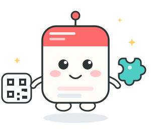
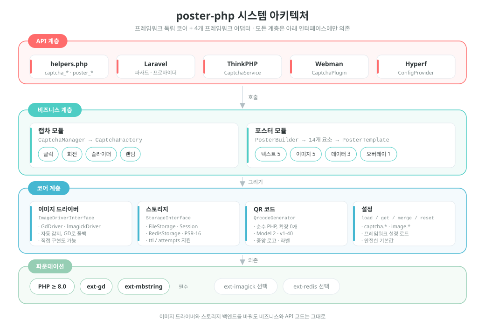
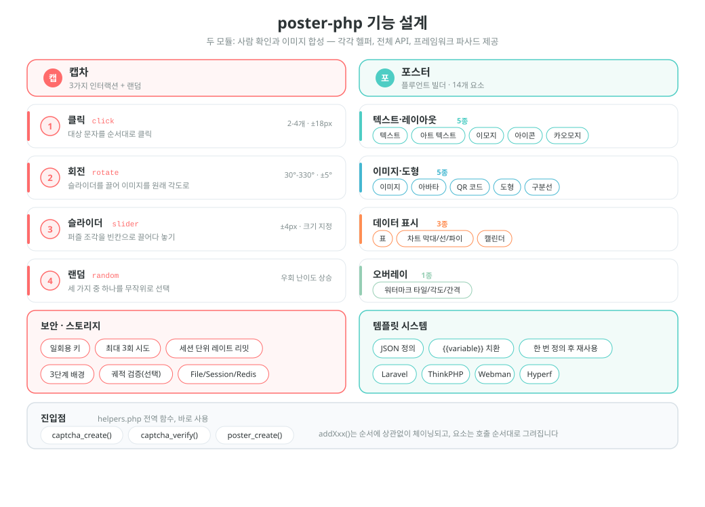
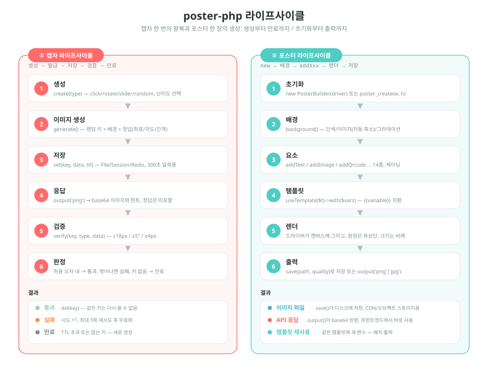

# poster-php

[中文](../../../README.md) | [English](../../../README_EN.md) | [日本語](../ja/README.md) | 한국어 | [Русский](../ru/README.md) | [Deutsch](../de/README.md) | [Français](../fr/README.md) | [Español](../es/README.md) | [Português](../pt/README.md) | [हिन्दी](../hi/README.md) | [العربية](../ar/README.md) | [বাংলা](../bn/README.md) | [Bahasa Indonesia](../id/README.md)

<p align="center">
  
</p>

PHP 이미지 캡차 · 포스터 생성 툴킷 — 프레임워크 독립 코어 + Laravel / ThinkPHP / Webman / Hyperf 어댑터.

[English Documentation](../../../README_EN.md) | [아키텍처 설계 문서](../../../docs/architecture.md) | [모든 언어](../README.md)

## 프로젝트 소개

poster-php는 PHP 이미지 툴킷으로, 두 가지만 하고 그것을 충분히 잘 해냅니다:

| 기능 | 설명 |
|------|------|
| **캡차** | 클릭 / 회전 / 슬라이더 세 가지 사람 확인 + 랜덤 전환, 순수 PHP로 이미지와 정답을 생성하며 외부 서비스에 의존하지 않음 |
| **포스터 생성** | 체이닝 Builder API, 14가지 요소로 텍스트·이미지·QR 코드·표·차트·캘린더 등 레이아웃 요구를 커버 |
| **프레임워크 독립** | 코어는 PHP ≥ 8.0 + GD만 요구, 일반 Composer 패키지로 사용 가능하며 프레임워크가 필요 없음 |
| **바로 사용** | 전역 헬퍼 함수 3개 + 프레임워크 어댑터 4종 (Laravel / ThinkPHP / Webman / Hyperf) |
| **교체 가능** | 이미지 드라이버(GD / ImageMagick)와 스토리지 백엔드(File / Session / Redis)가 모두 인터페이스 구현체라 필요에 따라 교체 |

> 프로젝트 마스코트 **Posty** — 포스터 본체와 QR 카드, 슬라이더 퍼즐로 이루어진 마스코트로, 이 패키지의 두 가지 능력인 이미지 출력과 검증에 그대로 대응합니다. 패키지에 함께 배포되며([`assets/pet.svg`](../../../assets/pet.svg) / `assets/pet.png`), `->addPet()`으로 포스터에 그릴 수 있고 누락 이미지의 플레이스홀더로도 설정할 수 있습니다.

## 프로젝트 구조

```
poster-php/
├── src/                        # 코어 코드: PHP 파일 64개 / 약 6093줄
│   ├── Captcha/                # 캡차 모듈: 인터페이스 + 추상 기반 클래스 + 구현 3종 + 팩토리 + 매니저
│   │                           #   + RateLimiter(레이트 리밋) / TrajectoryVerifier(궤적 검증)
│   ├── Poster/                 # 포스터 모듈 (Elements/ElementRegistry.php가 요소 단일 등록 지점)
│   │   ├── PosterBuilder.php   # 체이닝 Builder, addXxx() 메서드 14개
│   │   ├── PosterTemplate.php  # JSON 템플릿 → {{변수}} 치환
│   │   └── Elements/           # 요소 렌더러 14종 + ElementInterface + 추상 기반 클래스
│   ├── Drivers/                # 이미지 드라이버: ImageDriverInterface / GdDriver / ImagickDriver
│   ├── Storage/                # 검증 데이터 저장: File / Session / Redis / PSR-16 캐시
│   ├── Qrcode/                 # 순수 PHP QR 코드 생성기 (Model 2, v1-40, 확장 의존 없음)
│   ├── Adapters/               # 프레임워크 어댑터: Laravel / ThinkPHP / Webman / Hyperf
│   ├── PosterConfig.php        # 설정 읽기 (기본값 폴백 + 프레임워크 설정 병합)
│   └── Installer.php           # composer 설치 후 설정 파일 자동 복사
├── config/
│   └── poster.php              # 기본 설정 (캡차 / 이미지 드라이버)
├── assets/
│   ├── backgrounds/            # 내장 캡차 배경 이미지 6장 (400×250 PNG)
│   ├── pet.svg                 # 프로젝트 마스코트 Posty (벡터 원본)
│   └── pet.png                 # pet.svg를 래스터화: addPet()과 누락 이미지 플레이스홀더에 사용
├── helpers.php                 # 전역 함수: captcha_create / captcha_verify / poster_create
├── native.php                  # 네이티브 PHP 진입점: Composer 없이 require만 하면 사용
├── tests/                      # PHPUnit 테스트 53개 파일, 디렉터리 구조는 src/와 동일
├── examples/                   # 바로 실행 가능한 예제 스크립트
├── docs/                       # 아키텍처 문서, 설계·라이프사이클 도표(SVG), 후원 QR
└── composer.json               # PSR-4: Erikwang2013\Poster\ → src/
```

## 아키텍처와 설계

### 시스템 아키텍처 설계

계층형 의존: 상위 계층은 하위 인터페이스만 호출하므로, 드라이버나 스토리지 구현을 교체해도 비즈니스 코드는 손대지 않습니다.



### 기능 설계

두 모듈의 기능 분해: 캡차의 네 가지 인터랙션과 보안 특성, 포스터의 14가지 요소와 템플릿 시스템.



### 라이프사이클

캡차 검증 한 번(생성 → 이미지 생성 → 저장 → 발급 → 검증 → 통과 / 실패 / 만료)과 포스터 한 장 생성(초기화 → 배경 → 요소 → 템플릿 → 렌더 → 출력)의 전체 흐름.



## 기능

### 캡차 (세 가지 방식 + 랜덤 전환)

| 유형 | 설명 |
|------|------|
| 클릭 인증 `click` | 사용자가 이미지의 대상 문자를 순서대로 클릭 |
| 회전 인증 `rotate` | 사용자가 슬라이더를 끌어 이미지를 올바른 각도로 되돌림 |
| 슬라이더 인증 `slider` | 사용자가 퍼즐 조각을 빈칸 위치로 드래그 |
| 랜덤 전환 `random` | 위 세 가지 중 하나를 무작위로 선택 |

### 포스터 생성

체이닝 Builder API, 14가지 요소 지원:

| 요소 | 메서드 | 설명 |
|------|------|------|
| 텍스트 | `addText()` | 자동 줄바꿈, 정렬, 여러 줄 |
| 이미지 | `addImage()` | 크기 조정·자르기, 둥근 모서리, 그림자 |
| 아바타 | `addAvatar()` | 원형 자르기, 테두리 |
| QR 코드 | `addQrcode()` | 순수 PHP 생성, 중앙 로고, 하단 문구 |
| 도형 | `addShape()` | 사각형/원/둥근 사각형, 채우기/테두리 |
| 구분선 | `addLine()` | 색상, 두께 |
| 워터마크 | `addWatermark()` | 텍스트 타일, 각도, 간격 |
| 표 | `addTable()` | 헤더, 얼룩말 무늬, 열 너비 |
| 차트 | `addChart()` | 막대 / 꺾은선 / 원형 |
| 캘린더 | `addCalendar()` | 월간 달력, 날짜 강조, 주석 |
| 아트 텍스트 | `addArtisticText()` | 테두리 / 그림자 / 그라데이션 / 네온 |
| Emoji | `addEmoji()` | 컬러 이모지 렌더링 |
| 아이콘 폰트 | `addIcon()` | FontAwesome 아이콘 렌더링 |
| 카오모지 | `addEmoticon()` | 일본식 카오모지 / 사용자 정의 표정 |

## 설치

```bash
composer require erikwang2013/poster-php
```

시스템 요구 사항: PHP >= 8.0, GD 확장.

선택 확장:
- `ext-imagick`: ImageMagick 이미지 드라이버 (성능이 더 좋고 기능이 더 강력)
- `ext-redis`: Redis 캡차 스토리지 (분산 배포)

### Composer 없이 사용 (네이티브 PHP)

`poster-php/` 디렉터리 전체를 프로젝트에 넣고 `native.php`를 바로 require 하면 됩니다. PSR-4 오토로더를 등록하고 전역 함수를 로드하므로 Composer도, 프레임워크도 필요 없습니다.

```php
require '/path/to/poster-php/native.php';   // 오토로더 등록 + 전역 함수

$result  = captcha_create('click');
$builder = poster_create(750, 1334);
```

`native.php`는 여러 번 require 해도 되고, Composer나 프로젝트 자체 오토로더와도 함께 쓸 수 있습니다(중복 설치 시 `vendor/autoload.php`를 우선 사용하면 됩니다).

## 사용 설명

### 1. 캡차

#### 1. 클릭 캡차 (ClickCaptcha)

사용자가 이미지의 대상 문자(예: "나무" "새" "꽃")를 순서대로 클릭하여 사람임을 인증합니다.

```php
// 헬퍼 함수 사용 (프레임워크 독립)
$result = captcha_create('click', [
    'difficulty' => 'medium',    // 'easy'(목표 2개) | 'medium'(목표 3개) | 'hard'(목표 4개)
    'background' => null,        // 배경 이미지 경로 지정, null=프로그램 생성 그라데이션 배경(랜덤 스타일)
]);

// 반환 결과
// $result = [
//     'key'   => 'abc123...',           // 검증 고유 키, 프런트엔드로 전달
//     'image' => 'data:image/png;base64,...', // 이미지 base64
//     'extra' => [
//         'texts' => [
//             ['order' => 1, 'text' => '나무'],
//             ['order' => 2, 'text' => '새'],
//             ['order' => 3, 'text' => '꽃'],
//         ],
//     ],
// ];

// 프런트엔드는 order 순서대로 안내 문자를 표시하고, 사용자가 해당 위치를 차례로 클릭합니다
// (목표 좌표는 반환하지 않고 서버에서만 검증)
// 프런트엔드는 사용자가 클릭한 좌표 [[x1,y1], [x2,y2], [x3,y3]]를 전송합니다
$pass = captcha_verify($result['key'], 'click', [[120, 80], [200, 150], [310, 95]]);
// true / false 반환, 허용 반경 18px

// CaptchaManager 사용 (전체 API)
use Erikwang2013\Poster\Captcha\CaptchaManager;
use Erikwang2013\Poster\Drivers\DriverFactory;
use Erikwang2013\Poster\Storage\FileStorage;

$manager = new CaptchaManager(DriverFactory::create(), new FileStorage());
$captcha = $manager->create('click')
    ->setDifficulty('hard')        // easy=목표 2개 | medium=목표 3개 | hard=목표 4개
    ->setTargetType('text')        // 'text' 문자 | 'icon' 아이콘
    ->setWords(['猫', '狗', '鸟', '鱼']) // 사용자 문자 풀 (선택)
    ->setBackground('/path/to/bg.jpg');
$result = $captcha->generate();

$pass = $manager->verify($result['key'], [
    'type' => 'click',
    'data' => [[120, 80], [200, 150], [310, 95], [180, 60]],
]);
```

`setTargetType('icon')`을 쓰면 목표 문자를 프로그램으로 생성한 벡터 도형(11종, GD 기본 도형으로 그리며 이미지 소재 불필요)으로 바꿀 수 있습니다:
`extra['texts']`의 각 항목에 `thumb`(해당 도형의 base64 썸네일)이 추가되어 프런트엔드가 클릭 안내를 표시할 수 있고, 검증은 여전히 좌표 비교입니다.

#### 2. 회전 캡차 (RotateCaptcha)

시스템이 이미지를 30°~330° 무작위로 회전시키고, 사용자가 슬라이더를 끌어 이미지를 똑바로 되돌립니다.

```php
// 헬퍼 함수 사용
$result = captcha_create('rotate');
// $result['extra']에는 각도(정답)가 없고, 프런트엔드는 회전된 이미지만 표시합니다

$pass = captcha_verify($result['key'], 'rotate', 185);  // 사용자가 회전한 각도, ±5° 허용

// CaptchaManager 사용
$captcha = $manager->create('rotate')
    ->setSize(200)                 // 원형 지름 60-400 (기본 200)
    ->setAngleRange(45, 315)       // 회전 각도 범위 지정
    ->generate();
```

#### 3. 슬라이더 캡차 (SliderCaptcha)

시스템이 배경에서 퍼즐 조각을 잘라내고 어긋나게 배치하면, 사용자가 퍼즐을 빈칸 위치로 드래그합니다.

```php
// 헬퍼 함수 사용
$result = captcha_create('slider');
// $result = [
//     'image' => '...',              // 빈칸이 있는 배경 이미지
//     'extra' => [
//         'puzzle'   => '...',        // 퍼즐 조각 이미지
//         'puzzle_w' => 50,           // 퍼즐 너비
//         'puzzle_h' => 50,           // 퍼즐 높이
//     ],
// ];

$pass = captcha_verify($result['key'], 'slider', 173);  // 사용자가 슬라이드한 x 픽셀, ±4px 허용
```

#### 4. 랜덤 전환 (RandomCaptcha)

시스템이 click / rotate / slider 중 하나를 무작위로 선택해 크래킹 난이도를 높입니다.

```php
// 헬퍼 함수 사용 — 한 줄로 무작위 생성
$result = captcha_create('random');
// $result['type']은 실제로 선택된 유형을 반환: 'click' | 'rotate' | 'slider'

// 프런트엔드는 type에 따라 해당 인터랙션 컴포넌트를 렌더링합니다
switch ($result['type']) {
    case 'click':
        // 클릭 컴포넌트 렌더링: 이미지를 표시하고, 사용자가 extra.texts 안내 문자를 순서대로 클릭
        break;
    case 'rotate':
        // 회전 컴포넌트 렌더링: 이미지를 표시하고, 사용자가 드래그해 회전
        break;
    case 'slider':
        // 슬라이더 컴포넌트 렌더링: 빈칸 이미지 + 퍼즐 조각 표시
        break;
}

// 검증 시 실제 유형과 사용자 조작 데이터를 전달
$pass = captcha_verify($result['key'], $result['type'], $userData);
// click: $userData = [[x1,y1],[x2,y2],...]
// rotate: $userData = 185 (각도)
// slider: $userData = 173 (픽셀)

// CaptchaManager 사용
$captcha = $manager->create('random')->generate();
$pass = $manager->verify($captcha['key'], [
    'type' => $captcha['type'],
    'data' => $userData,
]);
```

#### 검증 보안 특성

| 특성 | 설명 |
|------|------|
| 일회성 | 검증 성공 또는 최대 횟수 초과 시 key 삭제 |
| 무차별 대입 방지 | 기본 최대 검증 3회 (설정 가능) |
| 유효 기간 | 기본 300초 (설정 가능) |
| 무작위성 | 생성할 때마다 배경색, 노이즈, 목표 위치가 모두 무작위이며, 클릭 목표는 목표마다 색조와 회전 각도가 무작위 |
| 세션 단위 레이트 리밋 | key와 무관하게 적용되는 윈도 한도(기본 60초에 30회)로, "매번 새 key로 다시 찍기"식 무작위 대입을 차단 |
| 행동 궤적 | 선택 사항(기본 꺼짐): 드래그 궤적의 점 개수/소요 시간/직선성을 검증, 스크립트가 답만 POST하면 거부 |
| 배경 미화 | 프로그램 생성 그라데이션 배경, 세 가지 스타일(미니멀/비비드/내추럴) 무작위 전환, 기본 배경 이미지 디렉터리 설정 지원 |
| 캔버스 하한 | 배경이 너무 작으면 어설프게 처리하지 않고 바로 오류: 클릭 캡차 최소 120×120, 슬라이더는 4×2 퍼즐 조각을 담을 수 있어야 함 |

#### 행동 궤적 검증 (선택)

기본값은 꺼짐입니다(터치스크린과 접근성 기기를 오탐하지 않기 위함). 켜면 `slider` / `rotate`는 프런트엔드가 드래그 궤적을 제출해야 하고, 서버가 점 개수·소요 시간·궤적의 직선성을 검증합니다:

```php
// config/poster.php
'captcha' => [
    'trajectory' => [
        'enabled'      => true,
        'min_points'   => 4,      // 최소 샘플 점 개수
        'min_duration' => 300,    // 최소 소요 시간(밀리초)
        'max_duration' => 5000,   // 최대 소요 시간(밀리초)
        'max_linearity' => 0.99,  // 직선성이 이 값보다 높으면 기계로 판정 (스크립트 드래그는 직선)
    ],
],

// 프런트엔드 제출: 예전 방식(숫자)도 여전히 호환
captcha_verify($key, 'slider', 173);
// 궤적 검증을 켜면 궤적을 함께 보내야 함
captcha_verify($key, 'slider', ['x' => 173, 'trail' => [[12, 3, 0], [40, 9, 22], /* … */], 'duration' => 1200]);
```

#### 배경 이미지 설정

캡차 배경은 세 단계 우선순위를 지원합니다:

1. **단일 이미지** — `setBackground('/path/to/bg.jpg')`로 지정
2. **이미지 디렉터리** — `captcha.background_dir`을 이미지 디렉터리로 지정, 기본값은 `assets/backgrounds/`(내장 그라데이션 배경 6장)
3. **프로그램 생성** — `background_dir`을 `null`로 설정하면 활성화, 세 가지 스타일 무작위 전환

```php
// 방법 1: 코드에서 단일 이미지 지정
$captcha = $manager->create('click')->setBackground('/path/to/bg.jpg');

// 방법 2: 기본 배경 이미지 교체 (config/poster.php)
'captcha' => [
    // 사용할 배경 이미지를 이 디렉터리에 넣으면 자동으로 무작위 선택
    'background_dir' => '/path/to/my-backgrounds',
    // null로 설정하면 프로그램 생성 그라데이션 배경 사용
    // 'background_dir' => null,
],

// 방법 3: 아무것도 하지 않으면 내장 기본 배경 이미지 자동 사용 (assets/backgrounds/)
```

**기본 배경 이미지**: `assets/backgrounds/`에 400×250 PNG 그라데이션 배경 6장이 포함되어 있으며, 스타일은 블루퍼플, 선셋, 프레시 그린, 다크, 파스텔, 오션 블루입니다.

세 가지 프로그램 생성 스타일:

| 스타일 | 설명 |
|------|------|
| `minimal` 미니멀 | 부드러운 그라데이션 + 큰 저투명도 원 + 기하학적 선 + 드문드문한 점 |
| `vibrant` 비비드 | 밝은 그라데이션 + 다양한 크기의 컬러 원 + 중간 밀도 노이즈 |
| `natural` 내추럴 | 따뜻한 그라데이션 + 종이 질감을 흉내 낸 불규칙 색면 + 미세한 촘촘한 점 |

### 2. 포스터 생성

#### 기본 사용법

```php
use Erikwang2013\Poster\Poster\PosterBuilder;
use Erikwang2013\Poster\Drivers\DriverFactory;

// 헬퍼 함수 사용
$builder = poster_create(750, 1334);  // 너비×높이

// 또는 직접 인스턴스화
$builder = new PosterBuilder(DriverFactory::create());
$builder->width(750)->height(1334);

// 배경 설정
$builder->background('#FFFFFF');                            // 단색 배경
$builder->background('/path/to/bg.jpg');                    // 이미지 배경 (자동 축소)
$builder->backgroundGradient('#FF6B6B', '#FF8E53', 'vertical'); // 그라데이션 배경
                                                            // 방향: vertical | horizontal

// 출력
$builder->save('/output/poster.jpg', 90);  // 파일로 저장 (경로, 품질 0-100)
                                           // 형식은 확장자로 추론: jpg/jpeg/png/webp/gif
                                           // 품질을 넘기지 않으면 JPEG는 poster.jpeg_quality, PNG는 poster.png_compression 사용
$dataUrl = $builder->output('png', 90);    // base64 data URL 가져오기
```

#### 텍스트 `addText()`

```php
$builder->addText('新品首发', [
    'x'        => 80,              // x 좌표
    'y'        => 120,             // y 좌표 (기준선 위치)
    'size'     => 48,              // 글자 크기
    'color'    => '#333333',       // 색상
    'font'     => '/path/to/font.ttf', // 폰트 파일, null=GD 내장
    'align'    => 'center',        // left | center | right
    'maxWidth' => 600,             // 최대 너비 (자동 줄바꿈)
    'lineHeight' => 72,            // 줄 높이
    'angle'    => 0,               // 회전 각도
]);
```

#### 이미지 `addImage()`

```php
$builder->addImage('/path/to/product.jpg', [
    'x'      => 75,
    'y'      => 280,
    'width'  => 600,              // 렌더링 너비 (자동 축소)
    'height' => 600,              // 렌더링 높이
    'radius' => 12,               // 둥근 모서리 반경
    'shadow' => [                 // 그림자 (선택)
        'color'    => '#00000033',
        'offsetX'  => 4,
        'offsetY'  => 4,
        'blur'     => 10,
    ],
]);
```

#### 아바타 `addAvatar()`

```php
$builder->addAvatar('/path/to/avatar.jpg', [
    'x'      => 80,
    'y'      => 60,
    'size'   => 120,              // 아바타 크기 (정사각형)
    'border' => '#FF6B6B',        // 테두리 색상 (선택)
]);
```

#### QR 코드 `addQrcode()`

```php
$builder->addQrcode('https://example.com/page/123', [
    'x'     => 275,
    'y'     => 1050,
    'size'  => 200,               // QR 코드 크기
    'level' => 'H',               // 오류 정정 레벨 L | M | Q | H
    'logo'  => '/path/to/logo.png', // 중앙 로고 (선택)
    'label' => '扫码查看详情', // 하단 문구 (선택)
    'label_size'  => 14,
    'label_color' => '#999999',
]);
```

용량이 해당 버전의 상한을 넘으면(예: H 레벨 약 1273바이트 이상) `InvalidArgumentException`을 던지며, 스캔되지 않는 코드를 조용히 만들어 내지 않습니다.

#### 도형 `addShape()`

```php
// 사각형
$builder->addShape('rect', [
    'x' => 0, 'y' => 0, 'width' => 750, 'height' => 60,
    'color'  => '#FF6B6B',
    'filled' => true,             // true=채우기 false=테두리
    'radius' => 8,                // 둥근 모서리 반경
    'opacity' => 0.8,             // 투명도 0-1
]);

// 원
$builder->addShape('circle', [
    'x' => 100, 'y' => 100, 'width' => 80, 'height' => 80,
    'color' => '#4ECDC4',
]);
```

#### 구분선 `addLine()`

```php
$builder->addLine([
    'x1' => 75, 'y1' => 800,
    'x2' => 675, 'y2' => 800,
    'color' => '#EEEEEE',
    'width' => 1,
]);
```

#### 워터마크 `addWatermark()`

```php
$builder->addWatermark('CONFIDENTIAL', [
    'size'    => 24,
    'color'   => '#00000020',     // 반투명
    'font'    => '/font.ttf',
    'angle'   => 30,              // 기울기 각도
    'spacing' => 200,             // 간격
]);
```

#### 표 `addTable()`

```php
$builder->addTable([
    'x'      => 50,
    'y'      => 800,
    'width'  => 650,
    'columns' => [150, 350, 150], // 열 너비
    'header'  => ['序号', '项目', '价格'],
    'rows'    => [
        ['1', '商品A', '¥99'],
        ['2', '商品B', '¥199'],
        ['3', '商品C', '¥299'],
    ],
    'headerBg'     => '#333333',
    'headerColor'  => '#FFFFFF',
    'rowBg'        => ['#FFFFFF', '#F5F5F5'], // 얼룩말 무늬
    'rowColor'     => '#333333',
    'fontSize'     => 24,
    'cellPadding'  => 10,
]);
```

#### 차트 `addChart()`

```php
// 막대 차트
$builder->addChart('bar', [
    ['label' => '一月', 'value' => 120],
    ['label' => '二月', 'value' => 200],
    ['label' => '三月', 'value' => 150],
    ['label' => '四月', 'value' => 300],
], [
    'x' => 50, 'y' => 100, 'width' => 650, 'height' => 400,
    'colors' => ['#FF6B6B', '#4ECDC4', '#45B7D1', '#96CEB4'],
]);

// 꺾은선 차트
$builder->addChart('line', [
    ['label' => '周一', 'value' => 10],
    ['label' => '周二', 'value' => 35],
    ['label' => '周三', 'value' => 25],
    ['label' => '周四', 'value' => 45],
    ['label' => '周五', 'value' => 30],
], [
    'x' => 50, 'y' => 100, 'width' => 650, 'height' => 400,
    'colors' => ['#FF6B6B'],
]);

// 원형 차트
$builder->addChart('pie', [
    ['label' => '电商', 'value' => 45],
    ['label' => '社交', 'value' => 25],
    ['label' => '搜索', 'value' => 15],
    ['label' => '其他', 'value' => 15],
], [
    'x' => 75, 'y' => 100, 'width' => 600, 'height' => 600,
    'colors' => ['#FF6B6B', '#4ECDC4', '#45B7D1', '#96CEB4'],
]);
```

#### 캘린더 `addCalendar()`

```php
$builder->addCalendar([
    'x'     => 50,
    'y'     => 200,
    'year'  => 2026,
    'month' => 5,                   // 1-12
    'cellSize'    => 60,            // 칸 크기
    'startDay'    => 0,             // 0=일요일 1=월요일
    'title'       => '2026年5月',    // 제목 (기본값 자동 생성)
    'highlights'  => [              // 강조할 날짜
        '2026-05-01' => ['bg' => '#FF6B6B', 'text' => '劳动节'],
        '2026-05-16' => ['bg' => '#FFEAA7', 'text' => '今天'],
    ],
    'headerBg'    => '#333333',     // 제목 표시줄 배경
    'headerColor' => '#FFFFFF',     // 제목 표시줄 글자색
    'cellBg'      => '#FFFFFF',     // 칸 배경
    'cellBorder'  => '#DDDDDD',     // 칸 테두리
    'todayBg'     => '#FF6B6B',     // 오늘 배경색
    'highlightBg' => '#FFF3CD',    // 강조 기본 배경색
    'textColor'   => '#333333',     // 날짜 글자색
    'dimColor'    => '#CCCCCC',     // 다른 달/빈 칸 색
]);
```

#### 아트 텍스트 `addArtisticText()`

```php
// 테두리 효과
$builder->addArtisticText('SALE', 'stroke', [
    'x' => 80, 'y' => 120, 'size' => 72,
    'color'       => '#FF6B6B',    // 채우기 색상
    'strokeColor' => '#000000',    // 테두리 색상
    'strokeWidth' => 3,            // 테두리 두께
]);

// 그림자 효과
$builder->addArtisticText('新品', 'shadow', [
    'x' => 80, 'y' => 120, 'size' => 48,
    'color'         => '#333333',
    'shadowColor'   => '#00000033',
    'shadowOffsetX' => 4,
    'shadowOffsetY' => 4,
]);

// 그라데이션 효과
$builder->addArtisticText('VIP', 'gradient', [
    'x' => 80, 'y' => 120, 'size' => 60,
    'color'  => '#FF6B6B',         // 상단 색상
    'color2' => '#FF8E53',         // 하단 색상
]);

// 네온 발광 효과
$builder->addArtisticText('HOT', 'neon', [
    'x' => 80, 'y' => 120, 'size' => 56,
    'color'     => '#FF1493',
    'glowColor' => '#FF1493',
]);
```

#### Emoji `addEmoji()`

```php
// emoji 문자를 직접 사용
$builder->addEmoji('😀', ['x' => 100, 'y' => 100, 'size' => 64]);
$builder->addEmoji('🎉', ['x' => 180, 'y' => 100, 'size' => 64]);

// unicode 코드포인트 사용
$builder->addEmoji('', [
    'x' => 100, 'y' => 100, 'size' => 64,
    'codepoint' => 'U+1F600',      // 😀와 동일
]);

// emoji 폰트 지정 (컬러 폰트를 지원하는 시스템 필요)
$builder->addEmoji('😀', [
    'x' => 100, 'y' => 100, 'size' => 64,
    'font' => '/System/Library/Fonts/Apple Color Emoji.ttc',
]);
```

시스템이 macOS / Linux / Windows의 emoji 폰트 경로를 자동으로 탐지합니다.

> 주의: emoji가 그려지는지는 폰트 자체에 달려 있습니다. Linux에서 흔한 `NotoColorEmoji.ttf`는 CBDT 비트맵 컬러 폰트라 GD의 FreeType 경로에서 로드할 수 없고(`imagettftext()`가 바로 실패), 이 경우 emoji는 그려지지 않습니다. FreeType이 정상적으로 로드할 수 있는 emoji 폰트로 바꿔 주세요.

#### 아이콘 폰트 `addIcon()`

```php
// 내장 FontAwesome 아이콘 이름 사용 (아이콘 폰트 파일 필요)
$builder->addIcon('heart', [
    'x' => 20, 'y' => 40, 'size' => 32,
    'color' => '#E74C3C',
    'font'  => '/path/to/fa-solid-900.ttf',  // FontAwesome TTF 폰트를 반드시 제공해야 함
]);

$builder->addIcon('star',  ['x' => 60, 'y' => 40, 'color' => '#F39C12', 'font' => '/path/to/fa-solid-900.ttf']);
$builder->addIcon('check', ['x' => 100, 'y' => 40, 'color' => '#27AE60', 'font' => '/path/to/fa-solid-900.ttf']);

// 사용자 정의 unicode 코드포인트 사용
$builder->addIcon('', [
    'x' => 20, 'y' => 40, 'size' => 32,
    'codepoint' => '\\u{F3C5}',    // map-marker
    'color' => '#E74C3C',
    'font' => '/path/to/fa-solid-900.ttf',
]);

// 내장 아이콘 이름 목록
// heart, star, user, clock, home, cog, check, times, search,
// envelope, phone, camera, play, pause, shopping-cart, tag,
// map-marker, calendar, comment, share, download, upload,
// lock, globe, link, image, music, video, bell, bookmark,
// thumbs-up, eye, trash, edit, plus, minus, arrow-*,
// location-dot, fire, gift, rocket
```

#### 카오모지 `addEmoticon()`

```php
// 내장 카오모지 사용
$builder->addEmoticon('happy', ['x' => 20, 'y' => 40, 'size' => 24]);
// 렌더링: (｡•̀ᴗ-)✧

$builder->addEmoticon('love',  ['x' => 20, 'y' => 80, 'size' => 24]);
// 렌더링: (♡°▽°♡)

$builder->addEmoticon('cry',   ['x' => 20, 'y' => 120, 'size' => 24]);
// 렌더링: (╥﹏╥)

// 사용자 정의 표정 문자
$builder->addEmoticon('', [
    'x' => 20, 'y' => 40, 'size' => 24,
    'text' => '(╯°□°）╯︵ ┻━┻',    // 사용자 정의 문자
    'color' => '#333333',
]);

// 내장 카오모지 표현
// happy, love, cry, angry, surprised, cool, sleepy,
// wave, think, shrug, tableflip, lenny
```

#### 프로젝트 마스코트 `addPet()`

내장 마스코트 Posty(`assets/pet.png`, `assets/pet.svg`를 래스터화한 파일)를 포스터에 바로 그릴 수 있습니다. `addImage(PosterBuilder::petPath(), $options)`와 동일합니다:

```php
$builder->addPet([
    'x'      => 555,
    'y'      => 140,
    'width'  => 150,
    'height' => 130,   // 지정한 너비/높이로 축소, 600:520 비율 유지를 권장
    'radius' => 0,     // addImage()의 모든 옵션 지원
]);

// 경로만 가져다 쓸 수도 있습니다 (예: QR 코드 중앙 로고)
$logo = PosterBuilder::petPath();
```

**누락 이미지 플레이스홀더**: `addImage()` / `addAvatar()`는 존재하지 않는 파일을 만나면 기본적으로 건너뛰고 그리지 않습니다. `poster.placeholder`를 마스코트로 지정하면 이미지가 빠진 자리에 Posty가 그려져서, 어느 이미지가 누락됐는지 한눈에 알 수 있습니다:

```php
// config/poster.php
'poster' => [
    'placeholder' => dirname(__DIR__) . '/assets/pet.png',
],
```

### 3. 템플릿 시스템

```php
use Erikwang2013\Poster\Poster\PosterTemplate;

// 템플릿 정의 (JSON 직렬화 가능)
$template = PosterTemplate::fromConfig([
    'width'  => 750,
    'height' => 1334,
    'elements' => [
        ['type' => 'shape', 'color' => '#FF6B6B', 'x' => 0, 'y' => 0, 'width' => 750, 'height' => 300],
        ['type' => 'text', 'text' => '{{title}}', 'x' => 80, 'y' => 100, 'size' => 48, 'color' => '#FFFFFF'],
        ['type' => 'text', 'text' => '{{subtitle}}', 'x' => 80, 'y' => 180, 'size' => 28, 'color' => '#FFE0E0'],
        ['type' => 'image', 'src' => '{{cover}}', 'x' => 75, 'y' => 350, 'width' => 600, 'height' => 600, 'radius' => 12],
        ['type' => 'qrcode', 'content' => '{{url}}', 'x' => 275, 'y' => 1050, 'size' => 200, 'label' => '扫码查看详情'],
    ],
]);

// 템플릿 + 변수로 렌더링
$builder->useTemplate($template)->with([
    'title'    => '新品首发',
    'subtitle' => '限时特惠 · 买一送一',
    'cover'    => '/path/to/product.jpg',
    'url'      => 'https://m.example.com/product/123',
])->save('/output/poster.jpg');

// 템플릿이 지원하는 요소 타입: text, image, qrcode, avatar, shape, line, watermark, table,
//                      chart, calendar, artistic-text, emoji, icon, emoticon
```

`useTemplate()`은 기본적으로 이전 `addXxx()` 요소를 **교체**합니다(기존 의미 유지). 템플릿을 바탕으로 깔고 직접 만든 요소를 그 위에 얹으려면 두 번째 인자를 사용합니다:

```php
$builder->replaceElements(false)->useTemplate($template)->with($vars)->addPet(['x' => 20, 'y' => 20, 'width' => 80]);

// 역방향 내보내기: 현재 builder(또는 개별 요소)를 템플릿 구조로 변환해 fromConfig()에 다시 넣을 수 있음
$config = $builder->toArray();          // ['width'=>…, 'height'=>…, 'elements'=>[…]]
$template2 = PosterTemplate::fromConfig($config);   // 내보내기 → 다시 가져오기, 구조 동일

// 새 요소 타입은 ElementRegistry에 한 번 등록하면 Builder와 템플릿에 동시에 적용
$builder->add('text', ['text' => 'hello', 'x' => 10, 'y' => 30, 'size' => 20]);
```

> 참고: `AbstractElement::toArray()`는 이번 버전부터 「짧은 타입명 + 평탄화된 옵션」을 반환합니다(이전에는 `['type' => 클래스명, 'options' => [...]]`). 템플릿 구조와의 왕복 일관성을 위한 **동작 변경**입니다.

## 프레임워크 통합

### Laravel

```php
use Erikwang2013\Poster\Adapters\Laravel\Facades\Captcha;
use Erikwang2013\Poster\Adapters\Laravel\Facades\Poster;

$result = Captcha::create('click')->generate();
Poster::width(750)->height(1334)->background('#FFF')->save('poster.jpg');
```

```php
// config/poster.php의 captcha.route.enabled = true로 설정하면 어댑터가 이미지 엔드포인트를 등록합니다:
//   GET /captcha/{key} → PNG를 바로 반환 (Content-Type: image/png, Cache-Control: no-store)
// 프런트엔드는 URL만 쓰면 되고 base64를 실어 보낼 필요가 없습니다 (33% 작고 브라우저/CDN 캐시 가능)
$result = Captcha::create('click')->generate();
// $result['image']는 여전히 data URI, $result['url']은 에 바로 넣을 수 있는 주소

// 폼 검증: 규칙 이름은 captcha, 인자는 image key
$request->validate([
    'captcha_key'  => 'required|string',
    'captcha_code' => 'required|captcha:captcha_key',
]);
```

```bash
php artisan vendor:publish --tag=poster-config
```

### ThinkPHP

`config/web.php`:
```php
'services' => [
    Erikwang2013\Poster\Adapters\ThinkPHP\CaptchaService::class,
    Erikwang2013\Poster\Adapters\ThinkPHP\PosterService::class,
],
```

### Webman

`config/bootstrap.php`:
```php
return [
    Erikwang2013\Poster\Adapters\Webman\CaptchaPlugin::class,
    Erikwang2013\Poster\Adapters\Webman\PosterPlugin::class,
];
```

### Hyperf

ConfigProvider를 통해 자동 등록됩니다.

## 설정

`composer require` 후 `config/poster.php`가 프로젝트 `config/` 디렉터리로 자동 복사됩니다(이미 있으면 건너뜀). Laravel / ThinkPHP / Webman(`config/poster.php`)과 Hyperf(`config/autoload/poster.php`)를 지원합니다.

주요 설정 항목:

| 설정 항목 | 기본값 | 설명 |
|--------|--------|------|
| `captcha.default_type` | `random` | 기본 캡차 유형: `click` / `rotate` / `slider` / `random` |
| `captcha.default_difficulty` | `medium` | 기본 난이도: `easy` / `medium` / `hard` |
| `captcha.click_words` | `[合,家,欢,...]` | click 캡차 문자 풀, 사용자 정의 가능 |
| `captcha.background_dir` | `assets/backgrounds/` | 배경 이미지 디렉터리, `null`이면 프로그램 생성 |
| `captcha.ttl` | `300` | 캡차 유효 기간(초) |
| `captcha.max_attempts` | `3` | 최대 검증 횟수 |
| `captcha.tolerance` | `{click:18,rotate:5,slider:4}` | 유형별 허용 오차 |
| `image.driver` | `auto` | 이미지 드라이버: `auto` / `gd` / `imagick` |
| `poster.placeholder` | `null` | 누락 이미지의 플레이스홀더 경로, `null`이면 건너뜀, 마스코트 경로를 지정하면 누락 위치에 Posty를 그림 |
| `captcha.rate_limit` | `{max:30,window:60}` | 세션/계정 단위 윈도 레이트 리밋, 신원은 기본적으로 session_id, 세션이 없으면 클라이언트 IP |
| `captcha.trajectory` | `{enabled:false,…}` | 행동 궤적 검증 (기본 꺼짐) |
| `captcha.cache.pool` | `null` | PSR-16 풀 객체(`storage=cache`일 때 사용), 런타임에 `StorageFactory::setPsr16Pool()`로도 지정 가능 |
| `captcha.route` | `{enabled:false,path:'/captcha'}` | Laravel 어댑터: 이미지 엔드포인트 `GET {path}/{key}`를 등록해 PNG를 바로 반환 |

## 오픈소스는 쉽지 않습니다, 후원을 환영합니다

| 위챗 | 알리페이 |
|:---:|:---:|
|  |  |

---

## License

MIT License — Copyright (c) 2026 erik <erik@erik.xyz> — https://erik.xyz
