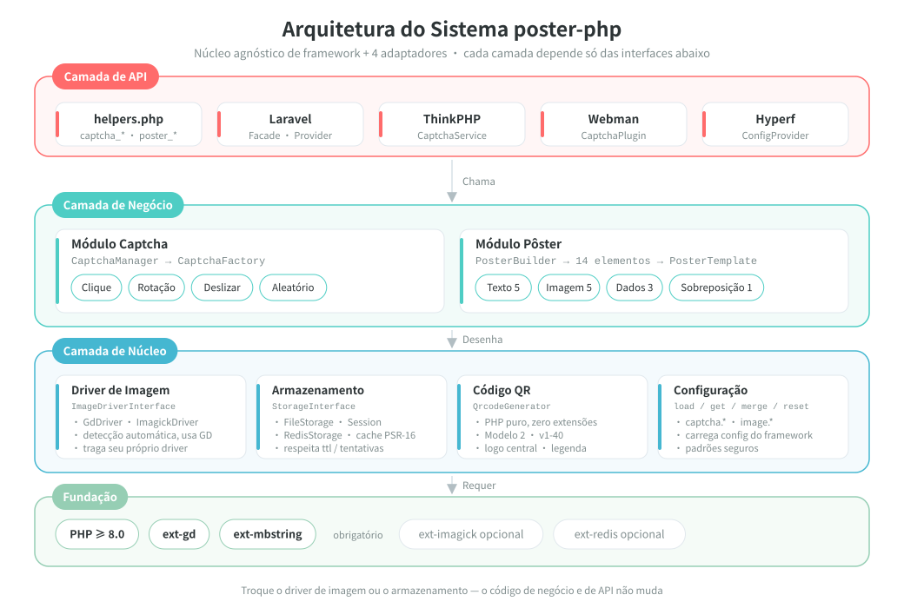
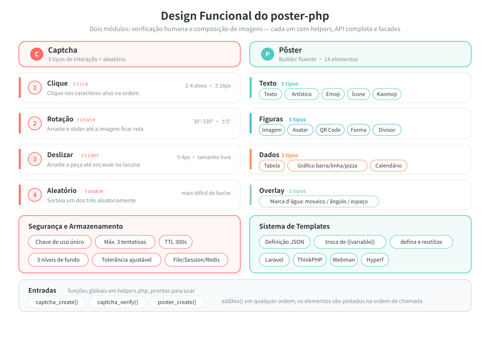
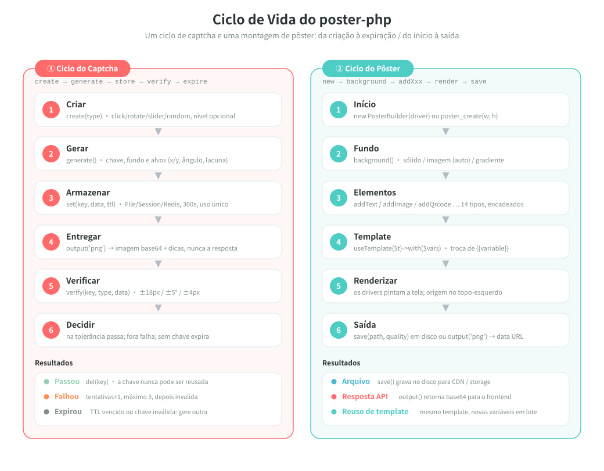

# poster-php

[中文](../../../README.md) | [English](../../../README_EN.md) | [日本語](../ja/README.md) | [한국어](../ko/README.md) | [Русский](../ru/README.md) | [Deutsch](../de/README.md) | [Français](../fr/README.md) | [Español](../es/README.md) | Português | [हिन्दी](../hi/README.md) | [العربية](../ar/README.md) | [বাংলা](../bn/README.md) | [Bahasa Indonesia](../id/README.md)

<p align="center">
  
</p>

Kit PHP de captcha de imagem e geração de pôsteres — núcleo agnóstico de framework + adaptadores Laravel / ThinkPHP / Webman / Hyperf.

[Documentação em inglês](../../../README_EN.md) | [Documentação de arquitetura](../../../docs/architecture.md)

## Visão geral do projeto

poster-php é um kit de ferramentas de imagem em PHP que faz apenas duas coisas — e as faz bem o suficiente:

| Capacidade | Descrição |
|------|------|
| **Captcha** | Três verificações humanas (clique / rotação / deslizar) mais seleção aleatória; imagens e respostas geradas em PHP puro, sem depender de serviços de terceiros |
| **Geração de pôsteres** | API Builder encadeada, com 14 elementos cobrindo texto, imagem, QR Code, tabela, gráfico, calendário e outras necessidades de layout |
| **Agnóstico de framework** | O núcleo depende apenas de PHP ≥ 8.0 + GD; pode ser usado como um pacote Composer comum, sem framework |
| **Pronto para usar** | 3 funções auxiliares globais + 4 adaptadores de framework (Laravel / ThinkPHP / Webman / Hyperf) |
| **Substituível** | Driver de imagem (GD / ImageMagick) e backend de armazenamento (File / Session / Redis) são implementações de interface, trocáveis conforme a necessidade |

> O mascote do projeto **Posty** — um mascote formado pelo próprio pôster, por um cartão de QR Code e por uma peça de quebra-cabeça deslizante, correspondendo exatamente às duas capacidades deste pacote: gerar imagens e verificar. Ele acompanha o pacote ([`assets/pet.svg`](../../../assets/pet.svg) / `assets/pet.png`), pode ser desenhado no pôster com `->addPet()` e também pode ser configurado como imagem de espaço reservado.

## Estrutura do projeto

```
poster-php/
├── src/                        # Código principal: 56 arquivos PHP / ~4250 linhas
│   ├── Captcha/                # Módulo captcha: interface + classe base abstrata + 3 implementações + factory + manager
│   ├── Poster/                 # Módulo pôster
│   │   ├── PosterBuilder.php   # Builder encadeado, 14 métodos addXxx()
│   │   ├── PosterTemplate.php  # Template JSON → substituição de {{variável}}
│   │   └── Elements/           # 14 renderizadores de elementos + ElementInterface + classe base abstrata
│   ├── Drivers/                # Drivers de imagem: ImageDriverInterface / GdDriver / ImagickDriver
│   ├── Storage/                # Armazenamento dos dados de verificação: File / Session / Redis
│   ├── Qrcode/                 # Gerador de QR Code em PHP puro (Model 2, v1-40, zero dependências de extensão)
│   ├── Adapters/               # Adaptadores de framework: Laravel / ThinkPHP / Webman / Hyperf
│   ├── PosterConfig.php        # Leitura de configuração (merge da config do framework + padrões)
│   └── Installer.php           # Copia o arquivo de config automaticamente após o composer install
├── config/
│   └── poster.php              # Configuração padrão (captcha / driver de imagem)
├── assets/
│   ├── backgrounds/            # 6 imagens de fundo de captcha embutidas (PNG 400×250)
│   ├── pet.svg                 # Mascote do projeto Posty (arquivo vetorial de origem)
│   └── pet.png                 # Rasterizado de pet.svg: usado por addPet() e como placeholder
├── helpers.php                 # Funções globais: captcha_create / captcha_verify / poster_create
├── tests/                      # Testes PHPUnit, 41 arquivos, estrutura de diretórios espelhando src/
├── examples/                   # Scripts de exemplo prontos para executar
├── docs/                       # Documentação de arquitetura, diagramas de design e ciclo de vida (SVG), códigos de doação
└── composer.json               # PSR-4: Erikwang2013\Poster\ → src/
```

## Arquitetura e design

### Design da arquitetura do sistema

Dependências em camadas: as camadas superiores chamam apenas as interfaces das camadas inferiores; trocar a implementação de driver ou de armazenamento não exige nenhuma alteração no código de negócio.



### Design funcional

Detalhamento funcional dos dois módulos: as quatro interações e os recursos de segurança do captcha; os 14 elementos e o sistema de templates do pôster.



### Ciclo de vida

O fluxo completo de uma verificação de captcha (criação → geração → armazenamento → entrega → verificação → aprovação / falha / expiração) e de uma geração de pôster (inicialização → fundo → elementos → template → renderização → saída).



## Recursos

### Captcha (três modos + seleção aleatória)

| Tipo | Descrição |
|------|------|
| Verificação por clique `click` | O usuário clica nos textos-alvo da imagem na ordem correta |
| Verificação por rotação `rotate` | O usuário arrasta o slider para girar a imagem de volta ao ângulo correto |
| Verificação por deslize `slider` | O usuário arrasta a peça do quebra-cabeça até a lacuna |
| Seleção aleatória `random` | Sorteia um dos três tipos de captcha acima |

### Geração de pôsteres

API Builder encadeada, com suporte a 14 elementos:

| Elemento | Método | Descrição |
|------|------|------|
| Texto | `addText()` | Quebra de linha automática, alinhamento, múltiplas linhas |
| Imagem | `addImage()` | Redimensionamento com corte, cantos arredondados, sombra |
| Avatar | `addAvatar()` | Recorte circular, borda |
| QR Code | `addQrcode()` | Gerado em PHP puro, logo central, legenda inferior |
| Forma | `addShape()` | Retângulo/círculo/arredondado, preenchimento/contorno |
| Divisor | `addLine()` | Cor, largura |
| Marca d'água | `addWatermark()` | Texto em mosaico, ângulo, espaçamento |
| Tabela | `addTable()` | Cabeçalho, zebrado, largura das colunas |
| Gráfico | `addChart()` | Gráfico de barras / linhas / pizza |
| Calendário | `addCalendar()` | Calendário mensal, datas destacadas, anotações |
| Texto artístico | `addArtisticText()` | Contorno / sombra / gradiente / neon |
| Emoji | `addEmoji()` | Renderização de emojis coloridos |
| Ícone de fonte | `addIcon()` | Renderização de ícones FontAwesome |
| Kaomoji | `addEmoticon()` | Kaomoji japonês / expressões personalizadas |

## Instalação

```bash
composer require erikwang2013/poster-php
```

Requisitos do sistema: PHP >= 8.0, extensão GD.

Extensões opcionais:
- `ext-imagick`: driver de imagem ImageMagick (melhor desempenho, mais recursos)
- `ext-redis`: armazenamento de captcha em Redis (implantação distribuída)

## Como usar

### I. Captcha

#### 1. Captcha de clique (ClickCaptcha)

O usuário precisa clicar nos textos-alvo da imagem na ordem correta (como "树", "鸟", "花"), comprovando que é humano.

```php
// Via funções auxiliares (agnóstico de framework)
$result = captcha_create('click', [
    'difficulty' => 'medium',    // 'easy'(2 alvos) | 'medium'(3 alvos) | 'hard'(4 alvos)
    'background' => null,        // caminho de imagem de fundo personalizada; null = fundo gradiente procedural (estilo aleatório)
]);

// Resultado
// $result = [
//     'key'   => 'abc123...',           // identificador único da verificação, enviado ao frontend
//     'image' => 'data:image/png;base64,...', // imagem em base64
//     'extra' => [
//         'texts' => [
//             ['order' => 1, 'text' => '树'],
//             ['order' => 2, 'text' => '鸟'],
//             ['order' => 3, 'text' => '花'],
//         ],
//     ],
// ];

// O frontend exibe os textos na ordem de order e o usuário clica nas posições correspondentes (as coordenadas alvo não são retornadas; a validação é só no servidor)
// O frontend envia as coordenadas clicadas [[x1,y1], [x2,y2], [x3,y3]]
$pass = captcha_verify($result['key'], 'click', [[120, 80], [200, 150], [310, 95]]);
// Retorna true / false, com raio de tolerância de 18px

// Via CaptchaManager (API completa)
use Erikwang2013\Poster\Captcha\CaptchaManager;
use Erikwang2013\Poster\Drivers\DriverFactory;
use Erikwang2013\Poster\Storage\FileStorage;

$manager = new CaptchaManager(DriverFactory::create(), new FileStorage());
$captcha = $manager->create('click')
    ->setDifficulty('hard')        // easy=2 alvos | medium=3 alvos | hard=4 alvos
    ->setTargetType('text')        // 'text' texto | 'icon' ícone
    ->setWords(['猫', '狗', '鸟', '鱼']) // pool de texto personalizado (opcional)
    ->setBackground('/path/to/bg.jpg');
$result = $captcha->generate();

$pass = $manager->verify($result['key'], [
    'type' => 'click',
    'data' => [[120, 80], [200, 150], [310, 95], [180, 60]],
]);
```

#### 2. Captcha de rotação (RotateCaptcha)

O sistema gira a imagem aleatoriamente entre 30° e 330°, e o usuário arrasta o slider para endireitá-la.

```php
// Via funções auxiliares
$result = captcha_create('rotate');
// $result['extra'] não contém o ângulo (a resposta da verificação); o frontend exibe apenas a imagem girada

$pass = captcha_verify($result['key'], 'rotate', 185);  // ângulo girado pelo usuário, tolerância de ±5°

// Via CaptchaManager
$captcha = $manager->create('rotate')
    ->setSize(200)                 // diâmetro do círculo, 60-400 (padrão 200)
    ->setAngleRange(45, 315)       // faixa de rotação personalizada
    ->generate();
```

#### 3. Captcha de deslize (SliderCaptcha)

O sistema recorta uma peça do quebra-cabeça do fundo e a desloca; o usuário arrasta a peça até a lacuna.

```php
// Via funções auxiliares
$result = captcha_create('slider');
// $result = [
//     'image' => '...',              // imagem de fundo com a lacuna
//     'extra' => [
//         'puzzle'   => '...',        // imagem da peça do quebra-cabeça
//         'puzzle_w' => 50,           // largura da peça
//         'puzzle_h' => 50,           // altura da peça
//     ],
// ];

$pass = captcha_verify($result['key'], 'slider', 173);  // x em pixels deslizado pelo usuário, tolerância de ±4px
```

#### 4. Seleção aleatória (RandomCaptcha)

O sistema sorteia um tipo de captcha entre click / rotate / slider, aumentando a dificuldade de burlar a verificação.

```php
// Via funções auxiliares — uma linha para gerar aleatoriamente
$result = captcha_create('random');
// $result['type'] retorna o tipo realmente sorteado: 'click' | 'rotate' | 'slider'

// O frontend renderiza o componente de interação correspondente ao type
switch ($result['type']) {
    case 'click':
        // renderiza o componente de clique: exibe a imagem; o usuário clica nos textos de extra.texts na ordem
        break;
    case 'rotate':
        // renderiza o componente de rotação: exibe a imagem; o usuário arrasta para girar
        break;
    case 'slider':
        // renderiza o componente de deslizar: exibe a imagem com a lacuna + a peça
        break;
}

// Na verificação, informe o tipo real e os dados da ação do usuário
$pass = captcha_verify($result['key'], $result['type'], $userData);
// click: $userData = [[x1,y1],[x2,y2],...]
// rotate: $userData = 185 (ângulo)
// slider: $userData = 173 (pixels)

// Via CaptchaManager
$captcha = $manager->create('random')->generate();
$pass = $manager->verify($captcha['key'], [
    'type' => $captcha['type'],
    'data' => $userData,
]);
```

#### Recursos de segurança da verificação

| Recurso | Descrição |
|------|------|
| Uso único | A key é removida após o sucesso da verificação ou ao exceder o número máximo de tentativas |
| Anti força bruta | Máximo de 3 tentativas de verificação por padrão (configurável) |
| Validade | 300 segundos por padrão (configurável) |
| Aleatoriedade | A cor de fundo, o ruído e a posição dos alvos são sorteados a cada geração |
| Fundo embelezado | Fundo gradiente procedural com três estilos (minimalista / vibrante / natural) alternados aleatoriamente; diretório de imagens de fundo padrão configurável |

#### Configuração das imagens de fundo

O fundo do captcha segue três níveis de prioridade:

1. **Imagem única** — definida via `setBackground('/path/to/bg.jpg')`
2. **Diretório de imagens** — configure `captcha.background_dir` apontando para um diretório; o padrão é `assets/backgrounds/` (6 imagens de fundo em gradiente embutidas)
3. **Geração procedural** — ativada quando `background_dir` é `null`, com três estilos alternados aleatoriamente

```php
// Opção 1: definir uma imagem específica no código
$captcha = $manager->create('click')->setBackground('/path/to/bg.jpg');

// Opção 2: substituir a imagem de fundo padrão (config/poster.php)
'captcha' => [
    // coloque suas próprias imagens de fundo neste diretório; elas serão sorteadas automaticamente
    'background_dir' => '/path/to/my-backgrounds',
    // defina como null para usar o fundo gradiente procedural
    // 'background_dir' => null,
],

// Opção 3: não fazer nada e usar automaticamente as imagens de fundo embutidas (assets/backgrounds/)
```

**Imagens de fundo padrão**: `assets/backgrounds/` traz 6 fundos em gradiente PNG 400×250, com estilos que incluem azul-roxo, pôr do sol, verde suave, escuro, pastel e azul-oceano.

Três estilos procedurais:

| Estilo | Descrição |
|------|------|
| `minimal` minimalista | Gradiente suave + círculos grandes de baixa opacidade + linhas geométricas + pontos finos esparsos |
| `vibrant` vibrante | Gradiente vivo + círculos coloridos de vários tamanhos + ruído de densidade média |
| `natural` natural | Gradiente em tons quentes + manchas irregulares simulando textura de papel + pontos finos e densos |

### II. Geração de pôsteres

#### Uso básico

```php
use Erikwang2013\Poster\Poster\PosterBuilder;
use Erikwang2013\Poster\Drivers\DriverFactory;

// Via função auxiliar
$builder = poster_create(750, 1334);  // largura × altura

// Ou instanciando diretamente
$builder = new PosterBuilder(DriverFactory::create());
$builder->width(750)->height(1334);

// Definir o fundo
$builder->background('#FFFFFF');                            // fundo de cor sólida
$builder->background('/path/to/bg.jpg');                    // fundo de imagem (escalado automaticamente)
$builder->backgroundGradient('#FF6B6B', '#FF8E53', 'vertical'); // fundo em gradiente
                                                            // direção: vertical | horizontal

// Saída
$builder->save('/output/poster.jpg', 90);  // salva em arquivo (caminho, qualidade 0-100)
$dataUrl = $builder->output('png', 90);    // obtém o data URL em base64
```

#### Texto `addText()`

```php
$builder->addText('新品首发', [
    'x'        => 80,              // coordenada horizontal
    'y'        => 120,             // coordenada vertical (posição da linha de base)
    'size'     => 48,              // tamanho da fonte
    'color'    => '#333333',       // cor
    'font'     => '/path/to/font.ttf', // arquivo de fonte; null = fonte interna do GD
    'align'    => 'center',        // left | center | right
    'maxWidth' => 600,             // largura máxima (quebra de linha automática)
    'lineHeight' => 72,            // altura da linha
    'angle'    => 0,               // ângulo de rotação
]);
```

#### Imagem `addImage()`

```php
$builder->addImage('/path/to/product.jpg', [
    'x'      => 75,
    'y'      => 280,
    'width'  => 600,              // largura renderizada (escala automática)
    'height' => 600,              // altura renderizada
    'radius' => 12,               // raio dos cantos arredondados
    'shadow' => [                 // sombra (opcional)
        'color'    => '#00000033',
        'offsetX'  => 4,
        'offsetY'  => 4,
        'blur'     => 10,
    ],
]);
```

#### Avatar `addAvatar()`

```php
$builder->addAvatar('/path/to/avatar.jpg', [
    'x'      => 80,
    'y'      => 60,
    'size'   => 120,              // tamanho do avatar (quadrado)
    'border' => '#FF6B6B',        // cor da borda (opcional)
]);
```

#### QR Code `addQrcode()`

```php
$builder->addQrcode('https://example.com/page/123', [
    'x'     => 275,
    'y'     => 1050,
    'size'  => 200,               // tamanho do QR Code
    'level' => 'H',               // nível de correção de erro L | M | Q | H
    'logo'  => '/path/to/logo.png', // logo central (opcional)
    'label' => '扫码查看详情',      // legenda inferior (opcional)
    'label_size'  => 14,
    'label_color' => '#999999',
]);
```

#### Forma `addShape()`

```php
// Retângulo
$builder->addShape('rect', [
    'x' => 0, 'y' => 0, 'width' => 750, 'height' => 60,
    'color'  => '#FF6B6B',
    'filled' => true,             // true=preenchido false=contorno
    'radius' => 8,                // raio dos cantos arredondados
    'opacity' => 0.8,             // opacidade 0-1
]);

// Círculo
$builder->addShape('circle', [
    'x' => 100, 'y' => 100, 'width' => 80, 'height' => 80,
    'color' => '#4ECDC4',
]);
```

#### Divisor `addLine()`

```php
$builder->addLine([
    'x1' => 75, 'y1' => 800,
    'x2' => 675, 'y2' => 800,
    'color' => '#EEEEEE',
    'width' => 1,
]);
```

#### Marca d'água `addWatermark()`

```php
$builder->addWatermark('CONFIDENTIAL', [
    'size'    => 24,
    'color'   => '#00000020',     // semitransparente
    'font'    => '/font.ttf',
    'angle'   => 30,              // ângulo de inclinação
    'spacing' => 200,             // espaçamento
]);
```

#### Tabela `addTable()`

```php
$builder->addTable([
    'x'      => 50,
    'y'      => 800,
    'width'  => 650,
    'columns' => [150, 350, 150], // largura das colunas
    'header'  => ['序号', '项目', '价格'],
    'rows'    => [
        ['1', '商品A', '¥99'],
        ['2', '商品B', '¥199'],
        ['3', '商品C', '¥299'],
    ],
    'headerBg'     => '#333333',
    'headerColor'  => '#FFFFFF',
    'rowBg'        => ['#FFFFFF', '#F5F5F5'], // zebrado
    'rowColor'     => '#333333',
    'fontSize'     => 24,
    'cellPadding'  => 10,
]);
```

#### Gráfico `addChart()`

```php
// Gráfico de barras
$builder->addChart('bar', [
    ['label' => '一月', 'value' => 120],
    ['label' => '二月', 'value' => 200],
    ['label' => '三月', 'value' => 150],
    ['label' => '四月', 'value' => 300],
], [
    'x' => 50, 'y' => 100, 'width' => 650, 'height' => 400,
    'colors' => ['#FF6B6B', '#4ECDC4', '#45B7D1', '#96CEB4'],
]);

// Gráfico de linhas
$builder->addChart('line', [
    ['label' => '周一', 'value' => 10],
    ['label' => '周二', 'value' => 35],
    ['label' => '周三', 'value' => 25],
    ['label' => '周四', 'value' => 45],
    ['label' => '周五', 'value' => 30],
], [
    'x' => 50, 'y' => 100, 'width' => 650, 'height' => 400,
    'colors' => ['#FF6B6B'],
]);

// Gráfico de pizza
$builder->addChart('pie', [
    ['label' => '电商', 'value' => 45],
    ['label' => '社交', 'value' => 25],
    ['label' => '搜索', 'value' => 15],
    ['label' => '其他', 'value' => 15],
], [
    'x' => 75, 'y' => 100, 'width' => 600, 'height' => 600,
    'colors' => ['#FF6B6B', '#4ECDC4', '#45B7D1', '#96CEB4'],
]);
```

#### Calendário `addCalendar()`

```php
$builder->addCalendar([
    'x'     => 50,
    'y'     => 200,
    'year'  => 2026,
    'month' => 5,                   // 1-12
    'cellSize'    => 60,            // tamanho da célula
    'startDay'    => 0,             // 0=domingo 1=segunda
    'title'       => '2026年5月',    // título (gerado automaticamente por padrão)
    'highlights'  => [              // datas destacadas
        '2026-05-01' => ['bg' => '#FF6B6B', 'text' => '劳动节'],
        '2026-05-16' => ['bg' => '#FFEAA7', 'text' => '今天'],
    ],
    'headerBg'    => '#333333',     // fundo da barra de título
    'headerColor' => '#FFFFFF',     // cor do texto da barra de título
    'cellBg'      => '#FFFFFF',     // fundo da célula
    'cellBorder'  => '#DDDDDD',     // borda da célula
    'todayBg'     => '#FF6B6B',     // cor de fundo de hoje
    'highlightBg' => '#FFF3CD',    // cor de fundo padrão dos destaques
    'textColor'   => '#333333',     // cor do texto das datas
    'dimColor'    => '#CCCCCC',     // cor de dias fora do mês / vazios
]);
```

#### Texto artístico `addArtisticText()`

```php
// Efeito de contorno
$builder->addArtisticText('SALE', 'stroke', [
    'x' => 80, 'y' => 120, 'size' => 72,
    'color'       => '#FF6B6B',    // cor de preenchimento
    'strokeColor' => '#000000',    // cor do contorno
    'strokeWidth' => 3,            // largura do contorno
]);

// Efeito de sombra
$builder->addArtisticText('新品', 'shadow', [
    'x' => 80, 'y' => 120, 'size' => 48,
    'color'         => '#333333',
    'shadowColor'   => '#00000033',
    'shadowOffsetX' => 4,
    'shadowOffsetY' => 4,
]);

// Efeito de gradiente
$builder->addArtisticText('VIP', 'gradient', [
    'x' => 80, 'y' => 120, 'size' => 60,
    'color'  => '#FF6B6B',         // cor do topo
    'color2' => '#FF8E53',         // cor de baixo
]);

// Efeito de brilho neon
$builder->addArtisticText('HOT', 'neon', [
    'x' => 80, 'y' => 120, 'size' => 56,
    'color'     => '#FF1493',
    'glowColor' => '#FF1493',
]);
```

#### Emoji `addEmoji()`

```php
// Usando o caractere emoji diretamente
$builder->addEmoji('😀', ['x' => 100, 'y' => 100, 'size' => 64]);
$builder->addEmoji('🎉', ['x' => 180, 'y' => 100, 'size' => 64]);

// Usando o code point unicode
$builder->addEmoji('', [
    'x' => 100, 'y' => 100, 'size' => 64,
    'codepoint' => 'U+1F600',      // equivalente a 😀
]);

// Especificando a fonte de emoji (requer suporte do sistema a fontes coloridas)
$builder->addEmoji('😀', [
    'x' => 100, 'y' => 100, 'size' => 64,
    'font' => '/System/Library/Fonts/Apple Color Emoji.ttc',
]);
```

O sistema detecta automaticamente o caminho das fontes de emoji no macOS / Linux / Windows.

> Observação: a capacidade de desenhar emojis depende da própria fonte. O `NotoColorEmoji.ttf`, comum no Linux, é uma fonte de bitmap colorido CBDT que o canal FreeType do GD não consegue carregar (`imagettftext()` falha diretamente); nesse caso o emoji não é desenhado. Use uma fonte de emoji do sistema que o FreeType consiga carregar normalmente.

#### Ícone de fonte `addIcon()`

```php
// Usando nomes de ícones FontAwesome embutidos (requer um arquivo de fonte de ícones)
$builder->addIcon('heart', [
    'x' => 20, 'y' => 40, 'size' => 32,
    'color' => '#E74C3C',
    'font'  => '/path/to/fa-solid-900.ttf',  // é obrigatório fornecer a fonte TTF do FontAwesome
]);

$builder->addIcon('star',  ['x' => 60, 'y' => 40, 'color' => '#F39C12', 'font' => '/path/to/fa-solid-900.ttf']);
$builder->addIcon('check', ['x' => 100, 'y' => 40, 'color' => '#27AE60', 'font' => '/path/to/fa-solid-900.ttf']);

// Usando um code point unicode personalizado
$builder->addIcon('', [
    'x' => 20, 'y' => 40, 'size' => 32,
    'codepoint' => '\\u{F3C5}',    // map-marker
    'color' => '#E74C3C',
    'font' => '/path/to/fa-solid-900.ttf',
]);

// Lista de nomes de ícones embutidos
// heart, star, user, clock, home, cog, check, times, search,
// envelope, phone, camera, play, pause, shopping-cart, tag,
// map-marker, calendar, comment, share, download, upload,
// lock, globe, link, image, music, video, bell, bookmark,
// thumbs-up, eye, trash, edit, plus, minus, arrow-*,
// location-dot, fire, gift, rocket
```

#### Kaomoji `addEmoticon()`

```php
// Usando kaomoji embutidos
$builder->addEmoticon('happy', ['x' => 20, 'y' => 40, 'size' => 24]);
// Renderiza: (｡•̀ᴗ-)✧

$builder->addEmoticon('love',  ['x' => 20, 'y' => 80, 'size' => 24]);
// Renderiza: (♡°▽°♡)

$builder->addEmoticon('cry',   ['x' => 20, 'y' => 120, 'size' => 24]);
// Renderiza: (╥﹏╥)

// Texto de expressão personalizado
$builder->addEmoticon('', [
    'x' => 20, 'y' => 40, 'size' => 24,
    'text' => '(╯°□°）╯︵ ┻━┻',    // texto personalizado
    'color' => '#333333',
]);

// Expressões de kaomoji embutidas
// happy, love, cry, angry, surprised, cool, sleepy,
// wave, think, shrug, tableflip, lenny
```

#### Mascote do projeto `addPet()`

O mascote embutido Posty (`assets/pet.png`, rasterizado a partir de `assets/pet.svg`) pode ser desenhado diretamente no pôster, equivalente a `addImage(PosterBuilder::petPath(), $options)`:

```php
$builder->addPet([
    'x'      => 555,
    'y'      => 140,
    'width'  => 150,
    'height' => 130,   // dimensionado pela largura/altura informada; recomenda-se manter a proporção 600:520
    'radius' => 0,     // aceita todas as opções de addImage()
]);

// Também é possível obter o caminho para uso próprio (por exemplo, como logo central do QR Code)
$logo = PosterBuilder::petPath();
```

**Imagem de espaço reservado**: por padrão, `addImage()` / `addAvatar()` ignoram arquivos inexistentes e não desenham nada. Aponte `poster.placeholder` para o mascote e o Posty será desenhado nos locais sem imagem, mostrando de imediato qual imagem faltou:

```php
// config/poster.php
'poster' => [
    'placeholder' => dirname(__DIR__) . '/assets/pet.png',
],
```

### III. Sistema de templates

```php
use Erikwang2013\Poster\Poster\PosterTemplate;

// Definir o template (serializável em JSON)
$template = PosterTemplate::fromConfig([
    'width'  => 750,
    'height' => 1334,
    'elements' => [
        ['type' => 'shape', 'color' => '#FF6B6B', 'x' => 0, 'y' => 0, 'width' => 750, 'height' => 300],
        ['type' => 'text', 'text' => '{{title}}', 'x' => 80, 'y' => 100, 'size' => 48, 'color' => '#FFFFFF'],
        ['type' => 'text', 'text' => '{{subtitle}}', 'x' => 80, 'y' => 180, 'size' => 28, 'color' => '#FFE0E0'],
        ['type' => 'image', 'src' => '{{cover}}', 'x' => 75, 'y' => 350, 'width' => 600, 'height' => 600, 'radius' => 12],
        ['type' => 'qrcode', 'content' => '{{url}}', 'x' => 275, 'y' => 1050, 'size' => 200, 'label' => '扫码查看详情'],
    ],
]);

// Renderizar com o template + variáveis
$builder->useTemplate($template)->with([
    'title'    => '新品首发',
    'subtitle' => '限时特惠 · 买一送一',
    'cover'    => '/path/to/product.jpg',
    'url'      => 'https://m.example.com/product/123',
])->save('/output/poster.jpg');

// Tipos de elemento suportados pelo template: text, image, qrcode, avatar, shape, line, watermark, table,
//                      chart, calendar, artistic-text, emoji, icon, emoticon
```

## Integração com frameworks

### Laravel

```php
use Erikwang2013\Poster\Adapters\Laravel\Facades\Captcha;
use Erikwang2013\Poster\Adapters\Laravel\Facades\Poster;

$result = Captcha::create('click')->generate();
Poster::width(750)->height(1334)->background('#FFF')->save('poster.jpg');
```

```bash
php artisan vendor:publish --tag=poster-config
```

### ThinkPHP

`config/web.php`:
```php
'services' => [
    Erikwang2013\Poster\Adapters\ThinkPHP\CaptchaService::class,
    Erikwang2013\Poster\Adapters\ThinkPHP\PosterService::class,
],
```

### Webman

`config/bootstrap.php`:
```php
return [
    Erikwang2013\Poster\Adapters\Webman\CaptchaPlugin::class,
    Erikwang2013\Poster\Adapters\Webman\PosterPlugin::class,
];
```

### Hyperf

Registrado automaticamente via ConfigProvider.

## Configuração

Após o `composer require`, o arquivo `config/poster.php` é copiado automaticamente para o diretório `config/` do projeto (se já existir, é ignorado). Compatível com Laravel / ThinkPHP / Webman (`config/poster.php`) e Hyperf (`config/autoload/poster.php`).

Principais opções de configuração:

| Opção | Valor padrão | Descrição |
|--------|--------|------|
| `captcha.default_type` | `random` | Tipo de captcha padrão: `click` / `rotate` / `slider` / `random` |
| `captcha.default_difficulty` | `medium` | Dificuldade padrão: `easy` / `medium` / `hard` |
| `captcha.click_words` | `[合,家,欢,...]` | Pool de texto do captcha de clique, personalizável |
| `captcha.background_dir` | `assets/backgrounds/` | Diretório das imagens de fundo; `null` usa geração procedural |
| `captcha.ttl` | `300` | Validade do captcha (segundos) |
| `captcha.max_attempts` | `3` | Número máximo de tentativas de verificação |
| `captcha.tolerance` | `{click:18,rotate:5,slider:4}` | Tolerância de cada tipo |
| `image.driver` | `auto` | Driver de imagem: `auto` / `gd` / `imagick` |
| `poster.placeholder` | `null` | Caminho da imagem de espaço reservado para imagens ausentes; `null` pula o desenho; apontando para o mascote, o Posty é desenhado nos locais sem imagem |

## Manter código aberto não é fácil — seu apoio é bem-vindo

| WeChat | Alipay |
|:---:|:---:|
|  |  |

---

## Licença

MIT License — Copyright (c) 2026 erik <erik@erik.xyz> — https://erik.xyz
