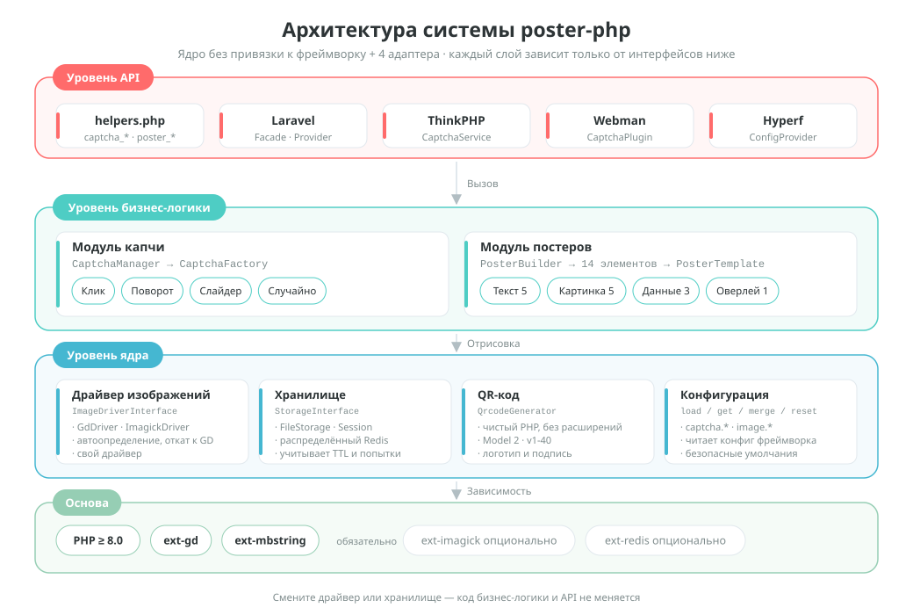
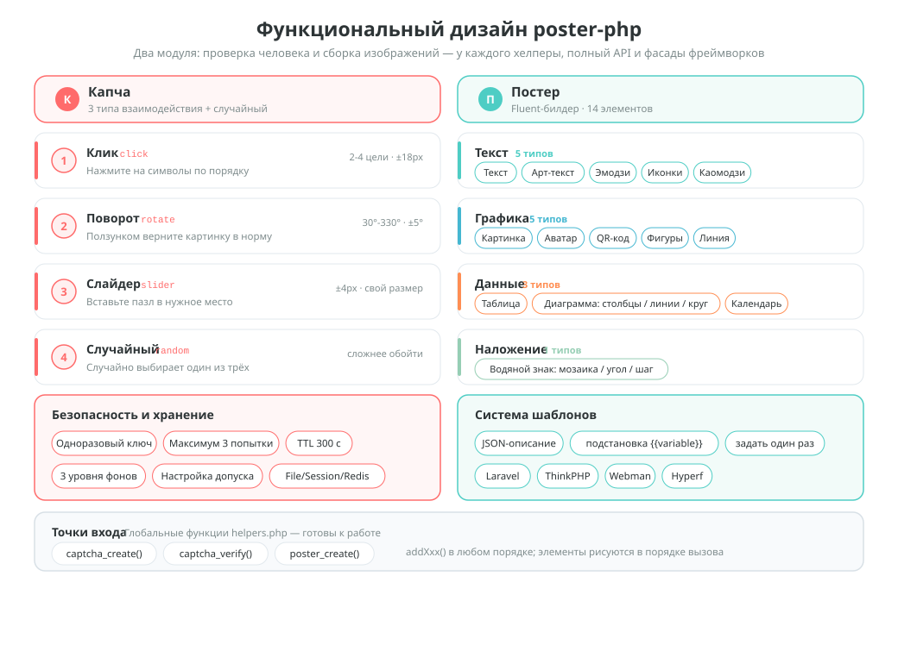
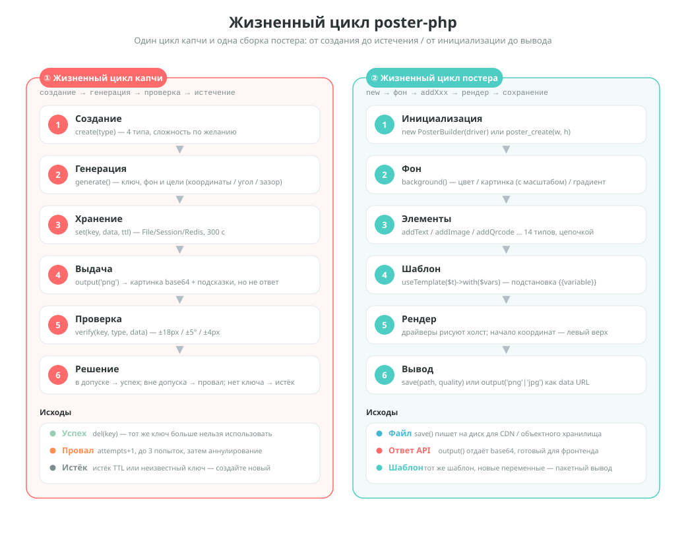

# poster-php

[中文](../../../README.md) | [English](../../../README_EN.md) | [日本語](../ja/README.md) | [한국어](../ko/README.md) | Русский | [Deutsch](../de/README.md) | [Français](../fr/README.md) | [Español](../es/README.md) | [Português](../pt/README.md) | [हिन्दी](../hi/README.md) | [العربية](../ar/README.md) | [বাংলা](../bn/README.md) | [Bahasa Indonesia](../id/README.md)

<p align="center">
  
</p>

Набор инструментов для генерации капчи и постеров на PHP — ядро без привязки к фреймворку + адаптеры Laravel / ThinkPHP / Webman / Hyperf.

[English Documentation](../../../README_EN.md) | [Архитектурная документация](../../../docs/architecture.md) | [Все языки](../../../docs/i18n/README.md)

## О проекте

poster-php — это набор инструментов для работы с изображениями на PHP, который делает две вещи и делает их достаточно хорошо:

| Возможность | Описание |
|------|------|
| **Капча** | Три способа проверки на человека — клик / поворот / слайдер — плюс случайный выбор; изображение и ответ генерируются на чистом PHP, без сторонних сервисов |
| **Генерация постеров** | Цепочный Builder API: 14 типов элементов закрывают вёрстку текста, изображений, QR-кодов, таблиц, диаграмм, календаря и многого другого |
| **Без привязки к фреймворку** | Ядру нужны только PHP ≥ 8.0 + GD; пакет используется как обычный Composer-пакет, фреймворк не требуется |
| **Готово к работе** | 3 глобальные функции-хелпера + 4 адаптера фреймворков (Laravel / ThinkPHP / Webman / Hyperf) |
| **Заменяемость** | Драйвер изображений (GD / ImageMagick) и хранилище (File / Session / Redis) — это реализации интерфейсов, заменяются по необходимости |

> Маскот проекта **Posty** — талисман, собранный из самого постера, карточки с QR-кодом и пазла слайдера; он как раз соответствует двум главным возможностям пакета: генерации изображений и проверке. Он поставляется вместе с пакетом ([`assets/pet.svg`](../../../assets/pet.svg) / `assets/pet.png`), его можно нарисовать в постере через `->addPet()` или настроить как заглушку для отсутствующих изображений.

## Структура проекта

```
poster-php/
├── src/                        # Ядро: 64 PHP-файла / около 6093 строк
│   ├── Captcha/                # Модуль капчи: интерфейс + абстрактный базовый класс + 3 реализации + фабрика + менеджер
│   │                           #   + RateLimiter (лимиты) / TrajectoryVerifier (проверка траектории)
│   ├── Poster/                 # Модуль постеров (Elements/ElementRegistry.php — единый реестр элементов)
│   │   ├── PosterBuilder.php   # Цепочный Builder, 14 методов addXxx()
│   │   ├── PosterTemplate.php  # JSON-шаблон → подстановка {{переменных}}
│   │   └── Elements/           # 14 рендереров элементов + ElementInterface + абстрактный базовый класс
│   ├── Drivers/                # Драйверы изображений: ImageDriverInterface / GdDriver / ImagickDriver
│   ├── Storage/                # Хранилище данных проверки: File / Session / Redis / кэш PSR-16
│   ├── Qrcode/                 # Генератор QR-кодов на чистом PHP (Model 2, v1-40, без расширений)
│   ├── Adapters/               # Адаптеры фреймворков: Laravel / ThinkPHP / Webman / Hyperf
│   ├── PosterConfig.php        # Чтение конфигурации (значения по умолчанию + слияние с конфигом фреймворка)
│   └── Installer.php           # Автокопирование конфигурации после установки через composer
├── config/
│   └── poster.php              # Конфигурация по умолчанию (капча / драйвер изображений)
├── assets/
│   ├── backgrounds/            # 6 встроенных фонов для капчи (400×250 PNG)
│   ├── pet.svg                 # Маскот проекта Posty (векторный исходник)
│   └── pet.png                 # Растр из pet.svg: используется в addPet() и как заглушка
├── helpers.php                 # Глобальные функции: captcha_create / captcha_verify / poster_create
├── native.php                  # Нативная точка входа PHP: Composer не нужен, достаточно require
├── tests/                      # Тесты PHPUnit, 53 файла, структура повторяет src/
├── examples/                   # Примеры, готовые к запуску
├── docs/                       # Документация по архитектуре, схемы дизайна и жизненного цикла (SVG), QR-коды для донатов
└── composer.json               # PSR-4: Erikwang2013\Poster\ → src/
```

## Архитектура и дизайн

### Архитектура системы

Послойные зависимости: верхний уровень вызывает только интерфейсы нижнего, поэтому при замене драйвера или хранилища код бизнес-логики не меняется.



### Функциональный дизайн

Разбор возможностей двух модулей: четыре режима взаимодействия и защитные свойства капчи, 14 элементов постера и система шаблонов.



### Жизненный цикл

Полный путь одной проверки капчи (создание → генерация → хранение → выдача → проверка → успех / провал / истечение) и одной генерации постера (инициализация → фон → элементы → шаблон → рендер → вывод).



## Возможности

### Капча (три способа + случайный выбор)

| Тип | Описание |
|------|------|
| Капча-клик `click` | Пользователь по порядку нажимает на целевые символы на изображении |
| Капча-поворот `rotate` | Пользователь перетаскивает ползунок и возвращает изображение в правильный угол |
| Капча-слайдер `slider` | Пользователь перетаскивает элемент пазла в выемку |
| Случайный выбор `random` | Случайно выбирается одна из трёх капч выше |

### Генерация постеров

Цепочный Builder API, поддерживается 14 типов элементов:

| Элемент | Метод | Описание |
|------|------|------|
| Текст | `addText()` | Автоперенос, выравнивание, несколько строк |
| Изображение | `addImage()` | Масштабирование и обрезка, скругление, тень |
| Аватар | `addAvatar()` | Круглая обрезка, рамка |
| QR-код | `addQrcode()` | Генерация на чистом PHP, логотип в центре, подпись снизу |
| Фигура | `addShape()` | Прямоугольник/круг/скругление, заливка/обводка |
| Разделитель | `addLine()` | Цвет, толщина |
| Водяной знак | `addWatermark()` | Текст мозаикой, угол, интервал |
| Таблица | `addTable()` | Шапка, «зебра», ширина колонок |
| Диаграмма | `addChart()` | Столбцы / линии / круговая |
| Календарь | `addCalendar()` | Календарь на месяц, выделение дат, пометки |
| Художественный текст | `addArtisticText()` | Обводка / тень / градиент / неон |
| Emoji | `addEmoji()` | Отрисовка цветных emoji |
| Иконка шрифта | `addIcon()` | Отрисовка иконок FontAwesome |
| Каомодзи | `addEmoticon()` | Японские каомодзи / свои эмотиконы |

## Установка

```bash
composer require erikwang2013/poster-php
```

Требования к системе: PHP >= 8.0, расширение GD.

Необязательные расширения:
- `ext-imagick`: драйвер изображений ImageMagick (быстрее и функциональнее)
- `ext-redis`: хранение капчи в Redis (для распределённого развёртывания)

### Без Composer (чистый PHP)

Поместите каталог `poster-php/` целиком в проект и просто подключите `native.php`: он зарегистрирует автозагрузку PSR-4 и загрузит глобальные функции — ни Composer, ни фреймворк не нужны.

```php
require '/path/to/poster-php/native.php';   // регистрирует автозагрузку + глобальные функции

$result  = captcha_create('click');
$builder = poster_create(750, 1334);
```

`native.php` можно подключать повторно, он также уживается с Composer и собственным автозагрузчиком проекта (при повторной установке достаточно отдать приоритет `vendor/autoload.php`).

## Использование

### Капча

#### 1. Капча-клик (ClickCaptcha)

Пользователь должен по порядку нажать на целевые символы на изображении (например, «树», «鸟», «花»), подтверждая, что он человек.

```php
// через хелпер-функцию (без привязки к фреймворку)
$result = captcha_create('click', [
    'difficulty' => 'medium',    // 'easy'(2 цели) | 'medium'(3 цели) | 'hard'(4 цели)
    'background' => null,        // путь к своему фону, null=программный градиентный фон (случайный стиль)
]);

// результат
// $result = [
//     'key'   => 'abc123...',           // уникальный идентификатор проверки, передаётся на фронтенд
//     'image' => 'data:image/png;base64,...', // картинка в base64
//     'extra' => [
//         'texts' => [
//             ['order' => 1, 'text' => '树'],
//             ['order' => 2, 'text' => '鸟'],
//             ['order' => 3, 'text' => '花'],
//         ],
//     ],
// ];

// фронтенд показывает подсказки в порядке order, пользователь нажимает на соответствующие места
// (целевые координаты не возвращаются, проверка идёт только на сервере)
// фронтенд отправляет координаты нажатий [[x1,y1], [x2,y2], [x3,y3]]
$pass = captcha_verify($result['key'], 'click', [[120, 80], [200, 150], [310, 95]]);
// возвращает true / false, радиус допуска 18px

// через CaptchaManager (полный API)
use Erikwang2013\Poster\Captcha\CaptchaManager;
use Erikwang2013\Poster\Drivers\DriverFactory;
use Erikwang2013\Poster\Storage\FileStorage;

$manager = new CaptchaManager(DriverFactory::create(), new FileStorage());
$captcha = $manager->create('click')
    ->setDifficulty('hard')        // easy=2 цели | medium=3 цели | hard=4 цели
    ->setTargetType('text')        // 'text' текст | 'icon' иконка
    ->setWords(['猫', '狗', '鸟', '鱼']) // свой набор символов (необязательно)
    ->setBackground('/path/to/bg.jpg');
$result = $captcha->generate();

$pass = $manager->verify($result['key'], [
    'type' => 'click',
    'data' => [[120, 80], [200, 150], [310, 95], [180, 60]],
]);
```

`setTargetType('icon')` позволяет заменить целевые символы программно сгенерированными векторными фигурами (11 видов, рисуются примитивами GD, без изображений-ассетов): в каждом элементе `extra['texts']` появляется дополнительное поле `thumb` (base64-картинка фигуры) для подсказки на фронтенде, а проверка по-прежнему сравнивает координаты.

#### 2. Капча-поворот (RotateCaptcha)

Система случайно поворачивает изображение на 30°~330°, а пользователь перетаскивает ползунок, возвращая изображение в ровное положение.

```php
// через хелпер-функцию
$result = captcha_create('rotate');
// $result['extra'] не содержит угол (это ответ), фронтенд показывает только повёрнутое изображение

$pass = captcha_verify($result['key'], 'rotate', 185);  // угол поворота пользователя, допуск ±5°

// через CaptchaManager
$captcha = $manager->create('rotate')
    ->setSize(200)                 // диаметр круга 60-400 (по умолчанию 200)
    ->setAngleRange(45, 315)       // свой диапазон углов поворота
    ->generate();
```

#### 3. Капча-слайдер (SliderCaptcha)

Система вырезает из фона элемент пазла и смещает его, а пользователь перетаскивает пазл в выемку.

```php
// через хелпер-функцию
$result = captcha_create('slider');
// $result = [
//     'image' => '...',              // фон с выемкой
//     'extra' => [
//         'puzzle'   => '...',        // изображение элемента пазла
//         'puzzle_w' => 50,           // ширина пазла
//         'puzzle_h' => 50,           // высота пазла
//     ],
// ];

$pass = captcha_verify($result['key'], 'slider', 173);  // смещение по x, введённое пользователем, допуск ±4px
```

#### 4. Случайный выбор (RandomCaptcha)

Система случайно выбирает одну из капч click / rotate / slider, что усложняет обход.

```php
// через хелпер-функцию — одна строка для случайной генерации
$result = captcha_create('random');
// $result['type'] возвращает фактически выбранный тип: 'click' | 'rotate' | 'slider'

// фронтенд рендерит нужный компонент взаимодействия по type
switch ($result['type']) {
    case 'click':
        // рендер компонента клика: показать картинку, пользователь по порядку нажимает на подсказки extra.texts
        break;
    case 'rotate':
        // рендер компонента поворота: показать картинку, пользователь вращает её перетаскиванием
        break;
    case 'slider':
        // рендер компонента слайдера: показать картинку с выемкой + элемент пазла
        break;
}

// при проверке передаются фактический тип и данные действий пользователя
$pass = captcha_verify($result['key'], $result['type'], $userData);
// click: $userData = [[x1,y1],[x2,y2],...]
// rotate: $userData = 185 (угол)
// slider: $userData = 173 (пиксели)

// через CaptchaManager
$captcha = $manager->create('random')->generate();
$pass = $manager->verify($captcha['key'], [
    'type' => $captcha['type'],
    'data' => $userData,
]);
```

#### Защитные свойства проверки

| Свойство | Описание |
|------|------|
| Одноразовость | После успешной проверки или превышения лимита попыток ключ удаляется |
| Защита от перебора | По умолчанию не более 3 проверок (настраивается) |
| Срок действия | По умолчанию 300 секунд (настраивается) |
| Случайность | Цвет фона, шум и положение целей при каждой генерации случайны; для целей клика цветовой тон и угол поворота случайны для каждой цели |
| Лимит сессии | Оконный лимит, действующий поверх ключей (по умолчанию 30 раз за 60 секунд): закрывает слепой перебор «взять новый key и угадать ещё раз» |
| Траектория | Необязательно (по умолчанию выключено): проверяются число точек, длительность и линейность траектории перетаскивания — прямой POST с ответом будет отклонён |
| Красивый фон | Программные градиентные фоны в трёх стилях (минимальный/яркий/природный) со случайным переключением, каталог фонов по умолчанию настраивается |
| Минимум холста | При слишком маленьком фоне возвращается ошибка, а не деградация (для клика минимум 120×120, для слайдера — вместить пазл 4×2) |

#### Проверка траектории (необязательно)

По умолчанию выключена (чтобы не отсекать сенсорные и доступные устройства). После включения `slider` / `rotate` требуют от фронтенда траекторию перетаскивания, а сервер проверяет число точек, длительность и линейность:

```php
// config/poster.php
'captcha' => [
    'trajectory' => [
        'enabled'      => true,
        'min_points'   => 4,      // минимум точек
        'min_duration' => 300,    // минимальная длительность (мс)
        'max_duration' => 5000,   // максимальная длительность (мс)
        'max_linearity' => 0.99,  // линейность выше этого значения — это бот (скрипт двигает по прямой)
    ],
],

// фронтенд: старый способ с числом по-прежнему совместим
captcha_verify($key, 'slider', 173);
// при включённой проверке траектории нужна и сама траектория
captcha_verify($key, 'slider', ['x' => 173, 'trail' => [[12, 3, 0], [40, 9, 22], /* … */], 'duration' => 1200]);
```

#### Настройка фоновых изображений

Фон капчи поддерживает три уровня приоритета:

1. **Одно изображение** — задаётся через `setBackground('/path/to/bg.jpg')`
2. **Каталог изображений** — `captcha.background_dir` указывает на каталог с картинками, по умолчанию `assets/backgrounds/` (6 встроенных градиентных фонов)
3. **Программная генерация** — включается, если `background_dir` равен `null`, три стиля переключаются случайно

```php
// способ 1: задать одно изображение в коде
$captcha = $manager->create('click')->setBackground('/path/to/bg.jpg');

// способ 2: заменить фоны по умолчанию (config/poster.php)
'captcha' => [
    // положите свои фоны в этот каталог, они будут выбираться случайно
    'background_dir' => '/path/to/my-backgrounds',
    // если задать null, используется программный градиентный фон
    // 'background_dir' => null,
],

// способ 3: ничего не делать, автоматически используются встроенные фоны (assets/backgrounds/)
```

**Фоны по умолчанию**: в `assets/backgrounds/` есть 6 градиентных фонов 400×250 PNG в стилях: сине-фиолетовый, закат, свежая зелень, тёмный, пастель, морская синева.

Три программных стиля:

| Стиль | Описание |
|------|------|
| `minimal` минимальный | Мягкий градиент + крупные круги с низкой прозрачностью + геометрические линии + редкие мелкие точки |
| `vibrant` яркий | Светлый градиент + цветные круги разных размеров + шум средней плотности |
| `natural` природный | Тёплый градиент + неровные цветовые пятна, имитирующие текстуру бумаги + мелкие частые точки |

### Генерация постеров

#### Базовое использование

```php
use Erikwang2013\Poster\Poster\PosterBuilder;
use Erikwang2013\Poster\Drivers\DriverFactory;

// через хелпер-функцию
$builder = poster_create(750, 1334);  // ширина×высота

// или создать напрямую
$builder = new PosterBuilder(DriverFactory::create());
$builder->width(750)->height(1334);

// задать фон
$builder->background('#FFFFFF');                            // сплошной цвет
$builder->background('/path/to/bg.jpg');                    // изображение (автомасштаб)
$builder->backgroundGradient('#FF6B6B', '#FF8E53', 'vertical'); // градиент
                                                            // направление: vertical | horizontal

// вывод
$builder->save('/output/poster.jpg', 90);  // сохранить в файл (путь, качество 0-100)
                                           // формат определяется по расширению: jpg/jpeg/png/webp/gif
                                           // без аргумента качества JPEG читает poster.jpeg_quality, PNG — poster.png_compression
$dataUrl = $builder->output('png', 90);    // получить base64 data URL
```

#### Текст `addText()`

```php
$builder->addText('新品首发', [
    'x'        => 80,              // координата x
    'y'        => 120,             // координата y (позиция базовой линии)
    'size'     => 48,              // размер шрифта
    'color'    => '#333333',       // цвет
    'font'     => '/path/to/font.ttf', // файл шрифта, null=встроенный в GD
    'align'    => 'center',        // left | center | right
    'maxWidth' => 600,             // максимальная ширина (автоперенос)
    'lineHeight' => 72,            // высота строки
    'angle'    => 0,               // угол поворота
]);
```

#### Изображение `addImage()`

```php
$builder->addImage('/path/to/product.jpg', [
    'x'      => 75,
    'y'      => 280,
    'width'  => 600,              // ширина отрисовки (автомасштаб)
    'height' => 600,              // высота отрисовки
    'radius' => 12,               // радиус скругления
    'shadow' => [                 // тень (необязательно)
        'color'    => '#00000033',
        'offsetX'  => 4,
        'offsetY'  => 4,
        'blur'     => 10,
    ],
]);
```

#### Аватар `addAvatar()`

```php
$builder->addAvatar('/path/to/avatar.jpg', [
    'x'      => 80,
    'y'      => 60,
    'size'   => 120,              // размер аватара (квадрат)
    'border' => '#FF6B6B',        // цвет рамки (необязательно)
]);
```

#### QR-код `addQrcode()`

```php
$builder->addQrcode('https://example.com/page/123', [
    'x'     => 275,
    'y'     => 1050,
    'size'  => 200,               // размер QR-кода
    'level' => 'H',               // уровень коррекции ошибок L | M | Q | H
    'logo'  => '/path/to/logo.png', // логотип в центре (необязательно)
    'label' => '扫码查看详情',      // подпись снизу (необязательно)
    'label_size'  => 14,
    'label_color' => '#999999',
]);
```

Если объём превышает предел выбранной версии (например, для уровня H — примерно 1273 байта и больше), выбрасывается `InvalidArgumentException`: нечитаемый QR-код больше не создаётся молча.

#### Фигура `addShape()`

```php
// прямоугольник
$builder->addShape('rect', [
    'x' => 0, 'y' => 0, 'width' => 750, 'height' => 60,
    'color'  => '#FF6B6B',
    'filled' => true,             // true=заливка false=обводка
    'radius' => 8,                // радиус скругления
    'opacity' => 0.8,             // прозрачность 0-1
]);

// круг
$builder->addShape('circle', [
    'x' => 100, 'y' => 100, 'width' => 80, 'height' => 80,
    'color' => '#4ECDC4',
]);
```

#### Разделитель `addLine()`

```php
$builder->addLine([
    'x1' => 75, 'y1' => 800,
    'x2' => 675, 'y2' => 800,
    'color' => '#EEEEEE',
    'width' => 1,
]);
```

#### Водяной знак `addWatermark()`

```php
$builder->addWatermark('CONFIDENTIAL', [
    'size'    => 24,
    'color'   => '#00000020',     // полупрозрачный
    'font'    => '/font.ttf',
    'angle'   => 30,              // угол наклона
    'spacing' => 200,             // интервал
]);
```

#### Таблица `addTable()`

```php
$builder->addTable([
    'x'      => 50,
    'y'      => 800,
    'width'  => 650,
    'columns' => [150, 350, 150], // ширина колонок
    'header'  => ['序号', '项目', '价格'],
    'rows'    => [
        ['1', '商品A', '¥99'],
        ['2', '商品B', '¥199'],
        ['3', '商品C', '¥299'],
    ],
    'headerBg'     => '#333333',
    'headerColor'  => '#FFFFFF',
    'rowBg'        => ['#FFFFFF', '#F5F5F5'], // «зебра»
    'rowColor'     => '#333333',
    'fontSize'     => 24,
    'cellPadding'  => 10,
]);
```

#### Диаграмма `addChart()`

```php
// столбцы
$builder->addChart('bar', [
    ['label' => '一月', 'value' => 120],
    ['label' => '二月', 'value' => 200],
    ['label' => '三月', 'value' => 150],
    ['label' => '四月', 'value' => 300],
], [
    'x' => 50, 'y' => 100, 'width' => 650, 'height' => 400,
    'colors' => ['#FF6B6B', '#4ECDC4', '#45B7D1', '#96CEB4'],
]);

// линии
$builder->addChart('line', [
    ['label' => '周一', 'value' => 10],
    ['label' => '周二', 'value' => 35],
    ['label' => '周三', 'value' => 25],
    ['label' => '周四', 'value' => 45],
    ['label' => '周五', 'value' => 30],
], [
    'x' => 50, 'y' => 100, 'width' => 650, 'height' => 400,
    'colors' => ['#FF6B6B'],
]);

// круговая
$builder->addChart('pie', [
    ['label' => '电商', 'value' => 45],
    ['label' => '社交', 'value' => 25],
    ['label' => '搜索', 'value' => 15],
    ['label' => '其他', 'value' => 15],
], [
    'x' => 75, 'y' => 100, 'width' => 600, 'height' => 600,
    'colors' => ['#FF6B6B', '#4ECDC4', '#45B7D1', '#96CEB4'],
]);
```

#### Календарь `addCalendar()`

```php
$builder->addCalendar([
    'x'     => 50,
    'y'     => 200,
    'year'  => 2026,
    'month' => 5,                   // 1-12
    'cellSize'    => 60,            // размер ячейки
    'startDay'    => 0,             // 0=воскресенье 1=понедельник
    'title'       => '2026年5月',    // заголовок (по умолчанию генерируется автоматически)
    'highlights'  => [              // выделенные даты
        '2026-05-01' => ['bg' => '#FF6B6B', 'text' => '劳动节'],
        '2026-05-16' => ['bg' => '#FFEAA7', 'text' => '今天'],
    ],
    'headerBg'    => '#333333',     // фон строки заголовка
    'headerColor' => '#FFFFFF',     // цвет текста заголовка
    'cellBg'      => '#FFFFFF',     // фон ячейки
    'cellBorder'  => '#DDDDDD',     // рамка ячейки
    'todayBg'     => '#FF6B6B',     // фон сегодняшнего дня
    'highlightBg' => '#FFF3CD',    // фон выделения по умолчанию
    'textColor'   => '#333333',     // цвет текста дат
    'dimColor'    => '#CCCCCC',     // цвет дат другого месяца и пустых ячеек
]);
```

#### Художественный текст `addArtisticText()`

```php
// эффект обводки
$builder->addArtisticText('SALE', 'stroke', [
    'x' => 80, 'y' => 120, 'size' => 72,
    'color'       => '#FF6B6B',    // цвет заливки
    'strokeColor' => '#000000',    // цвет обводки
    'strokeWidth' => 3,            // толщина обводки
]);

// эффект тени
$builder->addArtisticText('新品', 'shadow', [
    'x' => 80, 'y' => 120, 'size' => 48,
    'color'         => '#333333',
    'shadowColor'   => '#00000033',
    'shadowOffsetX' => 4,
    'shadowOffsetY' => 4,
]);

// эффект градиента
$builder->addArtisticText('VIP', 'gradient', [
    'x' => 80, 'y' => 120, 'size' => 60,
    'color'  => '#FF6B6B',         // цвет сверху
    'color2' => '#FF8E53',         // цвет снизу
]);

// эффект неонового свечения
$builder->addArtisticText('HOT', 'neon', [
    'x' => 80, 'y' => 120, 'size' => 56,
    'color'     => '#FF1493',
    'glowColor' => '#FF1493',
]);
```

#### Emoji `addEmoji()`

```php
// использовать emoji-символ напрямую
$builder->addEmoji('😀', ['x' => 100, 'y' => 100, 'size' => 64]);
$builder->addEmoji('🎉', ['x' => 180, 'y' => 100, 'size' => 64]);

// использовать код поинт unicode
$builder->addEmoji('', [
    'x' => 100, 'y' => 100, 'size' => 64,
    'codepoint' => 'U+1F600',      // то же самое, что 😀
]);

// указать emoji-шрифт (система должна поддерживать цветные шрифты)
$builder->addEmoji('😀', [
    'x' => 100, 'y' => 100, 'size' => 64,
    'font' => '/System/Library/Fonts/Apple Color Emoji.ttc',
]);
```

Система сама определяет пути к emoji-шрифтам в macOS / Linux / Windows.

> Внимание: то, получится ли нарисовать emoji, зависит от самого шрифта. Распространённый в Linux `NotoColorEmoji.ttf` — это растровый цветной шрифт CBDT, который канал FreeType в GD загрузить не может (`imagettftext()` сразу завершается ошибкой), поэтому emoji не будут нарисованы; используйте emoji-шрифт, который FreeType в вашей системе загружает нормально.

#### Иконка шрифта `addIcon()`

```php
// использовать встроенные имена иконок FontAwesome (нужен файл шрифта иконок)
$builder->addIcon('heart', [
    'x' => 20, 'y' => 40, 'size' => 32,
    'color' => '#E74C3C',
    'font'  => '/path/to/fa-solid-900.ttf',  // обязательно указать TTF-шрифт FontAwesome
]);

$builder->addIcon('star',  ['x' => 60, 'y' => 40, 'color' => '#F39C12', 'font' => '/path/to/fa-solid-900.ttf']);
$builder->addIcon('check', ['x' => 100, 'y' => 40, 'color' => '#27AE60', 'font' => '/path/to/fa-solid-900.ttf']);

// использовать свой код поинт unicode
$builder->addIcon('', [
    'x' => 20, 'y' => 40, 'size' => 32,
    'codepoint' => '\\u{F3C5}',    // map-marker
    'color' => '#E74C3C',
    'font' => '/path/to/fa-solid-900.ttf',
]);

// список встроенных имён иконок
// heart, star, user, clock, home, cog, check, times, search,
// envelope, phone, camera, play, pause, shopping-cart, tag,
// map-marker, calendar, comment, share, download, upload,
// lock, globe, link, image, music, video, bell, bookmark,
// thumbs-up, eye, trash, edit, plus, minus, arrow-*,
// location-dot, fire, gift, rocket
```

#### Каомодзи `addEmoticon()`

```php
// использовать встроенные каомодзи
$builder->addEmoticon('happy', ['x' => 20, 'y' => 40, 'size' => 24]);
// рендер: (｡•̀ᴗ-)✧

$builder->addEmoticon('love',  ['x' => 20, 'y' => 80, 'size' => 24]);
// рендер: (♡°▽°♡)

$builder->addEmoticon('cry',   ['x' => 20, 'y' => 120, 'size' => 24]);
// рендер: (╥﹏╥)

// свой текст эмотикона
$builder->addEmoticon('', [
    'x' => 20, 'y' => 40, 'size' => 24,
    'text' => '(╯°□°）╯︵ ┻━┻',    // свой текст
    'color' => '#333333',
]);

// встроенные выражения каомодзи
// happy, love, cry, angry, surprised, cool, sleepy,
// wave, think, shrug, tableflip, lenny
```

#### Маскот проекта `addPet()`

Встроенный талисман Posty (`assets/pet.png`, растр из `assets/pet.svg`) можно нарисовать прямо в постере — это эквивалент `addImage(PosterBuilder::petPath(), $options)`:

```php
$builder->addPet([
    'x'      => 555,
    'y'      => 140,
    'width'  => 150,
    'height' => 130,   // масштабируется до заданных ширины и высоты, пропорцию 600:520 лучше сохранять
    'radius' => 0,     // поддерживаются все опции addImage()
]);

// путь можно получить и отдельно (например, для логотипа в центре QR-кода)
$logo = PosterBuilder::petPath();
```

**Заглушка для отсутствующих изображений**: если файла нет, `addImage()` / `addAvatar()` по умолчанию пропускают отрисовку. Укажите в `poster.placeholder` путь к маскоту — и на месте отсутствующей картинки будет нарисован Posty, так сразу видно, какое изображение потерялось:

```php
// config/poster.php
'poster' => [
    'placeholder' => dirname(__DIR__) . '/assets/pet.png',
],
```

### Система шаблонов

```php
use Erikwang2013\Poster\Poster\PosterTemplate;

// определение шаблона (сериализуется в JSON)
$template = PosterTemplate::fromConfig([
    'width'  => 750,
    'height' => 1334,
    'elements' => [
        ['type' => 'shape', 'color' => '#FF6B6B', 'x' => 0, 'y' => 0, 'width' => 750, 'height' => 300],
        ['type' => 'text', 'text' => '{{title}}', 'x' => 80, 'y' => 100, 'size' => 48, 'color' => '#FFFFFF'],
        ['type' => 'text', 'text' => '{{subtitle}}', 'x' => 80, 'y' => 180, 'size' => 28, 'color' => '#FFE0E0'],
        ['type' => 'image', 'src' => '{{cover}}', 'x' => 75, 'y' => 350, 'width' => 600, 'height' => 600, 'radius' => 12],
        ['type' => 'qrcode', 'content' => '{{url}}', 'x' => 275, 'y' => 1050, 'size' => 200, 'label' => '扫码查看详情'],
    ],
]);

// рендер по шаблону с переменными
$builder->useTemplate($template)->with([
    'title'    => '新品首发',
    'subtitle' => '限时特惠 · 买一送一',
    'cover'    => '/path/to/product.jpg',
    'url'      => 'https://m.example.com/product/123',
])->save('/output/poster.jpg');

// поддерживаемые шаблоном типы элементов: text, image, qrcode, avatar, shape, line, watermark, table,
//                      chart, calendar, artistic-text, emoji, icon, emoticon
```

`useTemplate()` по умолчанию **заменяет** добавленные ранее элементы `addXxx()` (прежняя семантика сохраняется); чтобы «шаблон как основа + свои элементы поверх», используйте второй параметр:

```php
$builder->replaceElements(false)->useTemplate($template)->with($vars)->addPet(['x' => 20, 'y' => 20, 'width' => 80]);

// обратный экспорт: текущий builder (или отдельный элемент) превращается в структуру шаблона, которую снова принимает fromConfig()
$config = $builder->toArray();          // ['width'=>…, 'height'=>…, 'elements'=>[…]]
$template2 = PosterTemplate::fromConfig($config);   // экспорт → импорт, структура совпадает

// новый тип элемента достаточно один раз зарегистрировать в ElementRegistry — Builder и шаблон заработают сразу
$builder->add('text', ['text' => 'hello', 'x' => 10, 'y' => 30, 'size' => 20]);
```

> Внимание: начиная с этой версии `AbstractElement::toArray()` возвращает «короткое имя типа + плоские опции» (раньше было `['type' => имя класса, 'options' => [...]]`), чтобы структура совпадала с шаблоном при экспорте и импорте.

## Интеграция с фреймворками

### Laravel

```php
use Erikwang2013\Poster\Adapters\Laravel\Facades\Captcha;
use Erikwang2013\Poster\Adapters\Laravel\Facades\Poster;

$result = Captcha::create('click')->generate();
Poster::width(750)->height(1334)->background('#FFF')->save('poster.jpg');
```

```php
// после captcha.route.enabled = true в config/poster.php адаптер регистрирует endpoint картинки:
//   GET /captcha/{key} → сразу возвращает PNG (Content-Type: image/png, Cache-Control: no-store)
// на фронтенде достаточно URL, base64 передавать не нужно (на 33% меньше и кэшируется браузером/CDN)
$result = Captcha::create('click')->generate();
// $result['image'] по-прежнему data URI; $result['url'] можно сразу подставить в 

// валидация формы: имя правила captcha, аргумент — image key
$request->validate([
    'captcha_key'  => 'required|string',
    'captcha_code' => 'required|captcha:captcha_key',
]);
```

```bash
php artisan vendor:publish --tag=poster-config
```

### ThinkPHP

`config/web.php`:
```php
'services' => [
    Erikwang2013\Poster\Adapters\ThinkPHP\CaptchaService::class,
    Erikwang2013\Poster\Adapters\ThinkPHP\PosterService::class,
],
```

### Webman

`config/bootstrap.php`:
```php
return [
    Erikwang2013\Poster\Adapters\Webman\CaptchaPlugin::class,
    Erikwang2013\Poster\Adapters\Webman\PosterPlugin::class,
];
```

### Hyperf

Регистрация происходит автоматически через ConfigProvider.

## Конфигурация

После `composer require` файл `config/poster.php` автоматически копируется в каталог `config/` проекта (если он уже есть, копирование пропускается). Поддерживаются Laravel / ThinkPHP / Webman (`config/poster.php`) и Hyperf (`config/autoload/poster.php`).

Основные параметры конфигурации:

| Параметр | Значение по умолчанию | Описание |
|--------|--------|------|
| `captcha.default_type` | `random` | Тип капчи по умолчанию: `click` / `rotate` / `slider` / `random` |
| `captcha.default_difficulty` | `medium` | Сложность по умолчанию: `easy` / `medium` / `hard` |
| `captcha.click_words` | `[合,家,欢,...]` | Набор символов для капчи-клика, можно задать свой |
| `captcha.background_dir` | `assets/backgrounds/` | Каталог фоновых изображений; при `null` фон генерируется программно |
| `captcha.ttl` | `300` | Срок действия капчи (в секундах) |
| `captcha.max_attempts` | `3` | Максимальное число проверок |
| `captcha.tolerance` | `{click:18,rotate:5,slider:4}` | Допуск для каждого типа |
| `image.driver` | `auto` | Драйвер изображений: `auto` / `gd` / `imagick` |
| `poster.placeholder` | `null` | Путь к заглушке для отсутствующих изображений; при `null` изображение пропускается, а если указать путь к маскоту, на месте потерянной картинки будет нарисован Posty |
| `captcha.rate_limit` | `{max:30,window:60}` | Оконный лимит на сессию/аккаунт; идентификатор по умолчанию — session_id, без сессии — IP клиента |
| `captcha.trajectory` | `{enabled:false,…}` | Проверка траектории перетаскивания (по умолчанию выключена) |
| `captcha.cache.pool` | `null` | Объект пула PSR-16 (используется при `storage=cache`); можно задать в рантайме через `StorageFactory::setPsr16Pool()` |
| `captcha.route` | `{enabled:false,path:'/captcha'}` | Адаптер Laravel: регистрирует endpoint картинки `GET {path}/{key}`, сразу возвращающий PNG |

## Открытый исходный код даётся непросто — поддержите проект

| WeChat | Alipay |
|:---:|:---:|
|  |  |

---

## License

MIT License — Copyright (c) 2026 erik <erik@erik.xyz> — https://erik.xyz
